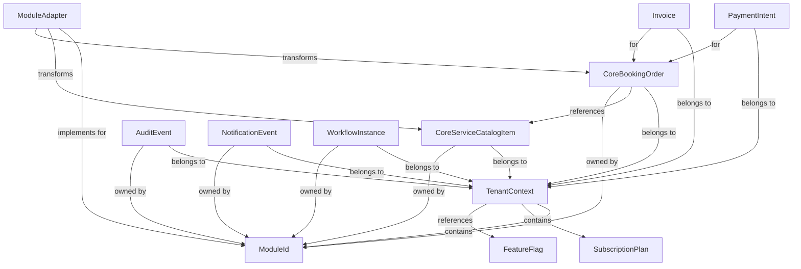

# Design Document: Core Service Contracts

## Overview

This design document specifies the implementation of Phase 2 of the Core Platform Extraction Roadmap: creating TypeScript interface definitions for 10 core service contracts that establish clear boundaries between the core platform and industry-specific modules.

**Design Goals:**
- Define compile-time-only TypeScript interfaces (zero runtime overhead)
- Establish industry-neutral primitives that work across spa, cleaning, home-service, and babycare modules
- Enable module-specific extensions through `metadata` fields without modifying core contracts
- Maintain 100% backward compatibility with existing Bella Spa functionality
- Provide a clear migration path for Phase 3 (physical file extraction)

**Non-Goals (Deferred to Phase 3):**
- Migrating existing code to use these contracts
- Implementing module adapter registration system
- Refactoring database queries to use contract types
- Creating runtime validation or transformation logic

## Architecture

### Directory Structure

All core service contracts will be organized under a new `src/core/types/` directory:

```
src/
├── core/                         # NEW: Core platform code
│   └── types/                    # NEW: Core service contracts
│       ├── README.md             # Usage guidance and examples
│       ├── index.ts              # Barrel export for convenience
│       ├── tenant.ts             # TenantContext interface
│       ├── module.ts             # ModuleId type and module types
│       ├── feature-flag.ts       # FeatureFlag interface
│       ├── service-catalog.ts    # CoreServiceCatalogItem interface
│       ├── booking-order.ts      # CoreBookingOrder interface
│       ├── payment.ts            # PaymentIntent and Invoice interfaces
│       ├── audit.ts              # AuditEvent interface
│       ├── notification.ts       # NotificationEvent interface
│       ├── workflow.ts           # WorkflowInstance interface
│       └── module-adapter.ts     # ModuleAdapter interface
├── types/                        # Existing types (unchanged)
│   ├── database.types.ts         # Supabase auto-generated
│   ├── domain.ts                 # Existing domain types
│   └── rpc.ts                    # RPC type helpers
└── ...
```


### Design Principles

1. **Type-Only Definitions**: All contracts are `interface` or `type` declarations with zero runtime footprint
2. **Immutability**: Core data structures use `readonly` modifiers where appropriate to prevent accidental mutations
3. **Extensibility**: All resource types include a `metadata: Record<string, any>` field for module-specific data
4. **Tenant Isolation**: All resource interfaces include `tenantId` for multi-tenant data separation
5. **Database Alignment**: Interfaces map to existing database tables without requiring schema changes
6. **Supabase Compatibility**: Types align with auto-generated `database.types.ts` structure

### Integration Strategy

**Phase 2 (Current):**
- Define contracts as pure TypeScript interfaces
- Add TSDoc comments for self-documentation
- Create type guards for runtime validation (optional, minimal)
- Export all contracts from `src/core/types/index.ts` barrel file
- No migration of existing code required

**Phase 3 (Future):**
- Migrate service functions to accept contract types as parameters
- Implement module adapter pattern with registration system
- Refactor database queries to use contract types
- Move core platform code to `src/core/` directory structure
- Extract spa-specific code to `src/modules/spa/` directory

## Components and Interfaces

### 1. TenantContext Interface

**Purpose**: Encapsulate tenant-specific configuration passed to core platform services

**File**: `src/core/types/tenant.ts`


**Interface Definition**:

```typescript
/**
 * Subscription plan tiers that determine feature access and quotas.
 * 
 * @remarks
 * - `free`: Limited features, single user, demo data
 * - `basic`: Core features, up to 5 users
 * - `professional`: Advanced features, up to 20 users, API access
 * - `enterprise`: All features, unlimited users, dedicated support
 */
export type SubscriptionPlan = 'free' | 'basic' | 'professional' | 'enterprise';

/**
 * Tenant context object containing configuration and entitlements.
 * 
 * @remarks
 * This context should be constructed once per request (in middleware or server action)
 * and passed to core platform services. It encapsulates tenant-specific settings
 * without requiring database queries in every service function.
 * 
 * **Immutability**: Services must NOT mutate this context. Treat as readonly.
 * 
 * **Serialization**: Safe to pass between server actions and RSC boundaries.
 * Avoid storing functions or class instances in settings/featureFlags.
 * 
 * @example
 * ```typescript
 * const context: TenantContext = {
 *   tenantId: 'uuid-here',
 *   tenantName: 'Bella Spa Hanoi',
 *   enabledModules: ['spa', 'babycare'],
 *   subscriptionPlan: 'professional',
 *   featureFlags: {
 *     'ai_salary_reconciliation': true,
 *     'inventory_transfer': true,
 *     'meta_ads_integration': false,
 *   },
 *   settings: {
 *     currency: 'VND',
 *     timezone: 'Asia/Ho_Chi_Minh',
 *     locale: 'vi-VN',
 *   },
 * };
 * ```
 */
export interface TenantContext {
  /** Unique tenant identifier (UUID from tenants table) */
  readonly tenantId: string;
  
  /** Human-readable tenant name for display purposes */
  readonly tenantName: string;
  
  /** List of enabled industry modules for this tenant */
  readonly enabledModules: readonly ModuleId[];
  
  /** Current subscription plan tier */
  readonly subscriptionPlan: SubscriptionPlan;
  
  /** Feature flags controlling optional functionality */
  readonly featureFlags: Readonly<Record<string, boolean>>;
  
  /** Tenant-specific configuration settings */
  readonly settings: Readonly<Record<string, any>>;
}
```


**Type Guard (Optional)**:

```typescript
/**
 * Type guard to validate TenantContext structure at runtime.
 * 
 * @param value - Value to check
 * @returns True if value is a valid TenantContext
 * 
 * @example
 * ```typescript
 * if (isTenantContext(req.context)) {
 *   // TypeScript now knows req.context is TenantContext
 *   console.log(req.context.tenantId);
 * }
 * ```
 */
export function isTenantContext(value: unknown): value is TenantContext {
  if (typeof value !== 'object' || value === null) return false;
  const ctx = value as Record<string, unknown>;
  return (
    typeof ctx.tenantId === 'string' &&
    typeof ctx.tenantName === 'string' &&
    Array.isArray(ctx.enabledModules) &&
    typeof ctx.subscriptionPlan === 'string' &&
    typeof ctx.featureFlags === 'object' &&
    typeof ctx.settings === 'object'
  );
}
```

**Database Mapping**:
- Maps to `tenants` table structure
- `enabledModules` can be derived from `tenant_modules` junction table
- `featureFlags` can be derived from `subscription_quotas` or feature flags table
- `settings` can pull from tenant-specific configuration tables

### 2. ModuleId Type

**Purpose**: Strongly-typed module identifier for compile-time safety

**File**: `src/core/types/module.ts`

**Type Definition**:

```typescript
/**
 * Valid industry module identifiers.
 * 
 * @remarks
 * Each module represents a distinct industry vertical with its own
 * data models, business rules, and UI components.
 * 
 * **Current Modules**:
 * - `spa`: Beauty spa and wellness services (Bella Spa)
 * - `babycare`: Baby and mother care services
 * - `cleaning`: Home and office cleaning services
 * - `home-service`: General home maintenance and repair
 * 
 * **Adding New Modules**: Update this union type and register the module
 * in the core platform's module registry (Phase 3).
 */
export type ModuleId = 'spa' | 'babycare' | 'cleaning' | 'home-service';
```


**Type Guard**:

```typescript
/**
 * Type guard to validate ModuleId at runtime.
 * 
 * @param value - Value to check
 * @returns True if value is a valid ModuleId
 */
export function isModuleId(value: unknown): value is ModuleId {
  return (
    typeof value === 'string' &&
    (['spa', 'babycare', 'cleaning', 'home-service'] as const).includes(value as ModuleId)
  );
}
```

**Constants (Helper)**:

```typescript
/**
 * All valid module identifiers as a readonly array.
 * Useful for iteration and validation.
 */
export const ALL_MODULE_IDS: readonly ModuleId[] = ['spa', 'babycare', 'cleaning', 'home-service'] as const;

/**
 * Human-readable display names for each module.
 */
export const MODULE_DISPLAY_NAMES: Readonly<Record<ModuleId, string>> = {
  spa: 'Beauty Spa & Wellness',
  babycare: 'Baby & Mother Care',
  cleaning: 'Cleaning Services',
  'home-service': 'Home Services',
} as const;
```

### 3. FeatureFlag Interface

**Purpose**: Standardized feature flag structure for subscription-based feature gating

**File**: `src/core/types/feature-flag.ts`

**Interface Definition**:

```typescript
/**
 * Feature flag configuration controlling optional system functionality.
 * 
 * @remarks
 * Feature flags enable/disable features based on:
 * - Subscription plan tier
 * - Enabled modules
 * - Custom tenant configuration
 * 
 * @example
 * ```typescript
 * const flag: FeatureFlag = {
 *   key: 'ai_salary_reconciliation',
 *   enabled: true,
 *   requiredPlan: ['professional', 'enterprise'],
 *   requiredModules: ['spa'],
 *   metadata: {
 *     betaFeature: true,
 *     documentationUrl: 'https://docs.example.com/ai-salary',
 *   },
 * };
 * ```
 */
export interface FeatureFlag {
  /** Unique identifier for this feature (kebab-case recommended) */
  key: string;
  
  /** Whether this feature is currently enabled for the tenant */
  enabled: boolean;
  
  /** Subscription plans that unlock this feature (if undefined, available to all plans) */
  requiredPlan?: readonly SubscriptionPlan[];
  
  /** Modules required for this feature (if undefined, no module dependency) */
  requiredModules?: readonly ModuleId[];
  
  /** Additional feature configuration or metadata */
  metadata?: Readonly<Record<string, any>>;
}
```


**Helper Function**:

```typescript
/**
 * Check if a feature is accessible given tenant context.
 * 
 * @param flag - Feature flag to evaluate
 * @param context - Tenant context
 * @returns True if feature is enabled and tenant meets requirements
 * 
 * @example
 * ```typescript
 * const canUseAI = isFeatureEnabled(aiSalaryFlag, tenantContext);
 * if (canUseAI) {
 *   // Show AI salary reconciliation UI
 * }
 * ```
 */
export function isFeatureEnabled(flag: FeatureFlag, context: TenantContext): boolean {
  if (!flag.enabled) return false;
  
  // Check plan requirement
  if (flag.requiredPlan && !flag.requiredPlan.includes(context.subscriptionPlan)) {
    return false;
  }
  
  // Check module requirement
  if (flag.requiredModules) {
    const hasAllModules = flag.requiredModules.every(mod => 
      context.enabledModules.includes(mod)
    );
    if (!hasAllModules) return false;
  }
  
  return true;
}
```

**Database Mapping**:
- Can be stored in a `feature_flags` table or derived from `subscription_quotas`
- Tenant-specific overrides can be in `tenant_feature_flags` junction table

### 4. CoreServiceCatalogItem Interface

**Purpose**: Industry-neutral service/product catalog item

**File**: `src/core/types/service-catalog.ts`

**Interface Definition**:

```typescript
/**
 * Service or product catalog item status.
 */
export type ServiceCatalogStatus = 'active' | 'inactive' | 'archived';

/**
 * Core service catalog item representing a purchasable service or product.
 * 
 * @remarks
 * This is an industry-neutral primitive. Module-specific fields (e.g., spa package
 * session counts, cleaning service duration) should be stored in the `metadata` field.
 * 
 * **Spa Module Extensions** (stored in metadata):
 * - `total_sessions`: number of sessions in package
 * - `session_multiplier`: coefficient for session counting (1.0, 1.5, 2.0)
 * - `category`: 'basic' | 'premium' | 'vip'
 * - `duration_minutes`: typical service duration
 * 
 * @example
 * ```typescript
 * const spaPackage: CoreServiceCatalogItem = {
 *   id: 'uuid-here',
 *   tenantId: 'tenant-uuid',
 *   moduleId: 'spa',
 *   name: 'Combo Mẹ & Bé VIP Toàn Diện',
 *   description: 'Package with 20 sessions and premium services',
 *   basePrice: 15000000,
 *   currency: 'VND',
 *   status: 'active',
 *   metadata: {
 *     total_sessions: 20,
 *     session_multiplier: 2.0,
 *     category: 'vip',
 *     duration_minutes: 90,
 *   },
 * };
 * ```
 */
export interface CoreServiceCatalogItem {
  /** Unique identifier (UUID) */
  id: string;
  
  /** Tenant this service belongs to */
  tenantId: string;
  
  /** Module that owns this service */
  moduleId: ModuleId;
  
  /** Service name (user-visible) */
  name: string;
  
  /** Detailed description (optional) */
  description?: string;
  
  /** Base price before discounts/promotions */
  basePrice: number;
  
  /** ISO 4217 currency code (e.g., 'VND', 'USD') */
  currency: string;
  
  /** Current status */
  status: ServiceCatalogStatus;
  
  /** Module-specific fields and extensions */
  metadata: Record<string, any>;
}
```


**Type Guard**:

```typescript
/**
 * Type guard for CoreServiceCatalogItem.
 */
export function isCoreServiceCatalogItem(value: unknown): value is CoreServiceCatalogItem {
  if (typeof value !== 'object' || value === null) return false;
  const item = value as Record<string, unknown>;
  return (
    typeof item.id === 'string' &&
    typeof item.tenantId === 'string' &&
    typeof item.moduleId === 'string' &&
    typeof item.name === 'string' &&
    typeof item.basePrice === 'number' &&
    typeof item.currency === 'string' &&
    typeof item.status === 'string' &&
    typeof item.metadata === 'object'
  );
}
```

**Database Mapping**:
- Maps to `packages` table (Bella Spa existing table)
- Can also map to a future `services` table for other modules
- Metadata stores module-specific fields like `total_sessions`, `session_multiplier`, `category`

### 5. CoreBookingOrder Interface

**Purpose**: Generic booking/order primitive for customer purchases

**File**: `src/core/types/booking-order.ts`

**Interface Definition**:

```typescript
/**
 * Booking or order status lifecycle.
 */
export type BookingOrderStatus = 'draft' | 'confirmed' | 'in_progress' | 'completed' | 'cancelled';

/**
 * Core booking order representing a customer's purchase or appointment.
 * 
 * @remarks
 * This is an industry-neutral primitive representing:
 * - Spa: A customer booking a package with scheduled sessions
 * - Cleaning: A customer booking a cleaning appointment
 * - Home-service: A customer booking a repair or maintenance service
 * 
 * **Module-Specific Data** (stored in metadata):
 * - Spa: `sessions_completed`, `sessions_remaining`, `assigned_ktv_id`, `package_details`
 * - Cleaning: `cleaning_type`, `square_meters`, `assigned_cleaner_id`
 * - Home-service: `service_type`, `technician_id`, `parts_needed`
 * 
 * @example
 * ```typescript
 * const spaBooking: CoreBookingOrder = {
 *   id: 'booking-uuid',
 *   tenantId: 'tenant-uuid',
 *   moduleId: 'spa',
 *   customerId: 'customer-uuid',
 *   serviceItemId: 'package-uuid',
 *   status: 'in_progress',
 *   scheduledStartTime: '2025-06-01T09:00:00Z',
 *   scheduledEndTime: '2025-12-01T09:00:00Z',
 *   totalAmount: 15000000,
 *   paidAmount: 5000000,
 *   metadata: {
 *     sessions_completed: 5,
 *     sessions_total: 20,
 *     assigned_ktv_id: 'ktv-uuid',
 *     package_category: 'vip',
 *   },
 * };
 * ```
 */
export interface CoreBookingOrder {
  /** Unique identifier (UUID) */
  id: string;
  
  /** Tenant this booking belongs to */
  tenantId: string;
  
  /** Module that owns this booking */
  moduleId: ModuleId;
  
  /** Customer who made this booking */
  customerId: string;
  
  /** Service catalog item being purchased */
  serviceItemId: string;
  
  /** Current booking status */
  status: BookingOrderStatus;
  
  /** When the service/appointment starts (ISO 8601) */
  scheduledStartTime: string;
  
  /** When the service/appointment ends (ISO 8601, optional) */
  scheduledEndTime?: string;
  
  /** Total amount for this booking */
  totalAmount: number;
  
  /** Amount already paid by customer */
  paidAmount: number;
  
  /** Module-specific booking data */
  metadata: Record<string, any>;
}
```


**Helper Functions**:

```typescript
/**
 * Calculate remaining balance on a booking.
 */
export function getRemainingBalance(booking: CoreBookingOrder): number {
  return Math.max(0, booking.totalAmount - booking.paidAmount);
}

/**
 * Check if booking is fully paid.
 */
export function isFullyPaid(booking: CoreBookingOrder): boolean {
  return booking.paidAmount >= booking.totalAmount;
}

/**
 * Check if booking is active (confirmed or in progress).
 */
export function isActiveBooking(booking: CoreBookingOrder): boolean {
  return booking.status === 'confirmed' || booking.status === 'in_progress';
}
```

**Database Mapping**:
- Maps to existing `bookings` table
- `metadata` stores module-specific progress tracking (session counts, completion status)
- Compatible with existing booking workflow and payment tracking

### 6. PaymentIntent and Invoice Interfaces

**Purpose**: Core payment and accounting primitives

**File**: `src/core/types/payment.ts`

**PaymentIntent Interface**:

```typescript
/**
 * Payment method types.
 */
export type PaymentMethod = 'cash' | 'bank_transfer' | 'credit_card' | 'e_wallet' | 'other';

/**
 * Payment intent status.
 */
export type PaymentStatus = 'pending' | 'processing' | 'succeeded' | 'failed' | 'cancelled';

/**
 * Payment intent representing an intent to collect payment from a customer.
 * 
 * @remarks
 * Used for tracking payment attempts, partial payments, and payment processing.
 * 
 * @example
 * ```typescript
 * const payment: PaymentIntent = {
 *   id: 'payment-uuid',
 *   tenantId: 'tenant-uuid',
 *   customerId: 'customer-uuid',
 *   bookingOrderId: 'booking-uuid',
 *   amount: 5000000,
 *   currency: 'VND',
 *   method: 'bank_transfer',
 *   status: 'succeeded',
 *   metadata: {
 *     transactionId: 'bank-tx-12345',
 *     bankName: 'Vietcombank',
 *     transferNote: 'Thanh toán gói dịch vụ',
 *   },
 * };
 * ```
 */
export interface PaymentIntent {
  /** Unique identifier (UUID) */
  id: string;
  
  /** Tenant this payment belongs to */
  tenantId: string;
  
  /** Customer making the payment */
  customerId: string;
  
  /** Booking order this payment is for */
  bookingOrderId: string;
  
  /** Payment amount */
  amount: number;
  
  /** ISO 4217 currency code */
  currency: string;
  
  /** Payment method used */
  method: PaymentMethod;
  
  /** Current payment status */
  status: PaymentStatus;
  
  /** Additional payment details (transaction IDs, receipt URLs, etc.) */
  metadata: Record<string, any>;
}
```


**Invoice Interface**:

```typescript
/**
 * Invoice status.
 */
export type InvoiceStatus = 'draft' | 'issued' | 'paid' | 'overdue' | 'cancelled';

/**
 * Invoice line item.
 */
export interface InvoiceLineItem {
  /** Line item description */
  description: string;
  
  /** Quantity */
  quantity: number;
  
  /** Price per unit */
  unitPrice: number;
  
  /** Total amount (quantity * unitPrice) */
  amount: number;
  
  /** Optional metadata (service ID, package details, etc.) */
  metadata?: Record<string, any>;
}

/**
 * Invoice document representing a financial record of goods/services rendered.
 * 
 * @remarks
 * Used for customer billing, revenue recognition, and accounting compliance.
 * 
 * @example
 * ```typescript
 * const invoice: Invoice = {
 *   id: 'invoice-uuid',
 *   tenantId: 'tenant-uuid',
 *   customerId: 'customer-uuid',
 *   bookingOrderId: 'booking-uuid',
 *   invoiceNumber: 'INV-2025-001',
 *   issueDate: '2025-06-01',
 *   dueDate: '2025-06-15',
 *   totalAmount: 15000000,
 *   paidAmount: 5000000,
 *   status: 'issued',
 *   lineItems: [
 *     {
 *       description: 'Combo Mẹ & Bé VIP - 20 sessions',
 *       quantity: 1,
 *       unitPrice: 15000000,
 *       amount: 15000000,
 *     },
 *   ],
 * };
 * ```
 */
export interface Invoice {
  /** Unique identifier (UUID) */
  id: string;
  
  /** Tenant this invoice belongs to */
  tenantId: string;
  
  /** Customer being invoiced */
  customerId: string;
  
  /** Booking order this invoice is for */
  bookingOrderId: string;
  
  /** Human-readable invoice number (e.g., 'INV-2025-001') */
  invoiceNumber: string;
  
  /** Date invoice was issued (ISO 8601 date) */
  issueDate: string;
  
  /** Date payment is due (ISO 8601 date) */
  dueDate: string;
  
  /** Total invoice amount */
  totalAmount: number;
  
  /** Amount already paid */
  paidAmount: number;
  
  /** Current invoice status */
  status: InvoiceStatus;
  
  /** Line items detailing services/products */
  lineItems: InvoiceLineItem[];
}
```

**Helper Functions**:

```typescript
/**
 * Calculate invoice balance due.
 */
export function getInvoiceBalance(invoice: Invoice): number {
  return Math.max(0, invoice.totalAmount - invoice.paidAmount);
}

/**
 * Check if invoice is overdue.
 */
export function isInvoiceOverdue(invoice: Invoice): boolean {
  if (invoice.status === 'paid' || invoice.status === 'cancelled') return false;
  return new Date(invoice.dueDate) < new Date();
}
```


**Database Mapping**:
- PaymentIntent: Maps to payment/revenue tracking tables (existing `revenue` table or similar)
- Invoice: Maps to invoice generation logic (may need new `invoices` table in future, or generate from bookings)

### 7. AuditEvent Interface

**Purpose**: Standardized audit logging for compliance and troubleshooting

**File**: `src/core/types/audit.ts`

**Interface Definition**:

```typescript
/**
 * Type of actor performing an action.
 */
export type ActorType = 'user' | 'system' | 'api';

/**
 * Field-level change tracking.
 */
export interface FieldChange {
  /** Value before the change */
  before: any;
  
  /** Value after the change */
  after: any;
}

/**
 * Audit event recording a system action for compliance and troubleshooting.
 * 
 * @remarks
 * All critical business actions should generate audit events:
 * - Booking creation/modification/cancellation
 * - Payment processing
 * - Salary approval
 * - Expense approval
 * - Inventory transfers
 * 
 * **Security**: Always filter audit events by `tenantId` to ensure tenant isolation.
 * 
 * @example
 * ```typescript
 * const event: AuditEvent = {
 *   id: 'audit-uuid',
 *   tenantId: 'tenant-uuid',
 *   moduleId: 'spa',
 *   actorId: 'user-uuid',
 *   actorType: 'user',
 *   action: 'approve',
 *   resourceType: 'salary_record',
 *   resourceId: 'salary-uuid',
 *   timestamp: '2025-06-01T10:30:00Z',
 *   changes: {
 *     status: { before: 'pending_approval', after: 'approved' },
 *   },
 *   metadata: {
 *     approverRole: 'admin',
 *     ipAddress: '192.168.1.1',
 *   },
 * };
 * ```
 */
export interface AuditEvent {
  /** Unique identifier (UUID) */
  id: string;
  
  /** Tenant this event belongs to */
  tenantId: string;
  
  /** Module that generated this event (optional for core events) */
  moduleId?: ModuleId;
  
  /** User or system that performed the action */
  actorId: string;
  
  /** Type of actor */
  actorType: ActorType;
  
  /** Action performed (e.g., 'create', 'update', 'delete', 'approve', 'complete') */
  action: string;
  
  /** Type of resource affected (e.g., 'booking', 'session', 'salary_record', 'expense') */
  resourceType: string;
  
  /** ID of the affected resource */
  resourceId: string;
  
  /** When the action occurred (ISO 8601 timestamp) */
  timestamp: string;
  
  /** Field-level change tracking (optional) */
  changes?: Record<string, FieldChange>;
  
  /** Additional context (IP address, user agent, reason, etc.) */
  metadata: Record<string, any>;
}
```


**Helper Function**:

```typescript
/**
 * Create a standardized audit event.
 * 
 * @param params - Event parameters
 * @returns AuditEvent ready to be logged
 */
export function createAuditEvent(params: {
  tenantId: string;
  moduleId?: ModuleId;
  actorId: string;
  actorType: ActorType;
  action: string;
  resourceType: string;
  resourceId: string;
  changes?: Record<string, FieldChange>;
  metadata?: Record<string, any>;
}): AuditEvent {
  return {
    id: crypto.randomUUID(), // Generate in actual implementation
    timestamp: new Date().toISOString(),
    ...params,
    metadata: params.metadata ?? {},
  };
}
```

**Database Mapping**:
- Maps to existing `audit_log` table or similar audit tracking table
- Should be immutable (insert-only, no updates or deletes)

### 8. NotificationEvent Interface

**Purpose**: Standardized notification structure for multi-channel communication

**File**: `src/core/types/notification.ts`

**Interface Definition**:

```typescript
/**
 * Notification recipient types.
 */
export type RecipientType = 'user' | 'customer' | 'admin';

/**
 * Notification delivery channels.
 */
export type NotificationChannel = 'in_app' | 'email' | 'sms' | 'webhook' | 'push';

/**
 * Notification priority levels.
 */
export type NotificationPriority = 'low' | 'medium' | 'high' | 'urgent';

/**
 * Notification event for multi-channel system notifications.
 * 
 * @remarks
 * Used to send notifications through various channels:
 * - `in_app`: Show in application notification center
 * - `email`: Send email to recipient
 * - `sms`: Send SMS to recipient's phone
 * - `webhook`: Send to external webhook URL
 * - `push`: Send push notification to mobile device
 * 
 * @example
 * ```typescript
 * const notification: NotificationEvent = {
 *   id: 'notif-uuid',
 *   tenantId: 'tenant-uuid',
 *   moduleId: 'spa',
 *   type: 'booking_confirmed',
 *   recipientId: 'customer-uuid',
 *   recipientType: 'customer',
 *   channels: ['in_app', 'sms'],
 *   priority: 'high',
 *   title: 'Booking Confirmed',
 *   message: 'Your spa appointment has been confirmed for June 1, 2025 at 9:00 AM',
 *   metadata: {
 *     bookingId: 'booking-uuid',
 *     actionUrl: '/bookings/booking-uuid',
 *   },
 *   createdAt: '2025-06-01T08:00:00Z',
 * };
 * ```
 */
export interface NotificationEvent {
  /** Unique identifier (UUID) */
  id: string;
  
  /** Tenant this notification belongs to */
  tenantId: string;
  
  /** Module that generated this notification (optional) */
  moduleId?: ModuleId;
  
  /** Notification type/category (e.g., 'booking_confirmed', 'payment_received') */
  type: string;
  
  /** Recipient user/customer ID */
  recipientId: string;
  
  /** Type of recipient */
  recipientType: RecipientType;
  
  /** Channels to deliver notification through */
  channels: NotificationChannel[];
  
  /** Notification priority */
  priority: NotificationPriority;
  
  /** Notification title */
  title: string;
  
  /** Notification message body */
  message: string;
  
  /** Additional data (action URL, button config, images, etc.) */
  metadata: Record<string, any>;
  
  /** When notification was created (ISO 8601 timestamp) */
  createdAt: string;
}
```


**Database Mapping**:
- Maps to existing `app_notifications` table for in-app notifications
- Other channels (email, SMS) may route through external services

### 9. WorkflowInstance Interface

**Purpose**: Workflow orchestration for multi-step business processes

**File**: `src/core/types/workflow.ts`

**Interface Definition**:

```typescript
/**
 * Workflow instance status.
 */
export type WorkflowStatus = 'pending' | 'running' | 'paused' | 'completed' | 'failed' | 'cancelled';

/**
 * Workflow instance representing a running business process.
 * 
 * @remarks
 * Workflows orchestrate multi-step processes like:
 * - Booking confirmation → Payment → Service execution → Completion
 * - Salary calculation → Approval → Payment processing
 * - Inventory order → Approval → Receiving → Stock update
 * 
 * @example
 * ```typescript
 * const workflow: WorkflowInstance = {
 *   id: 'workflow-uuid',
 *   tenantId: 'tenant-uuid',
 *   moduleId: 'spa',
 *   workflowDefinitionId: 'booking_lifecycle',
 *   status: 'running',
 *   currentState: 'awaiting_payment',
 *   context: {
 *     bookingId: 'booking-uuid',
 *     customerId: 'customer-uuid',
 *     totalAmount: 15000000,
 *     paidAmount: 5000000,
 *   },
 *   startedAt: '2025-06-01T09:00:00Z',
 *   metadata: {
 *     retryCount: 0,
 *     lastStateChange: '2025-06-01T09:15:00Z',
 *   },
 * };
 * ```
 */
export interface WorkflowInstance {
  /** Unique identifier (UUID) */
  id: string;
  
  /** Tenant this workflow belongs to */
  tenantId: string;
  
  /** Module that owns this workflow */
  moduleId: ModuleId;
  
  /** Workflow definition/template identifier */
  workflowDefinitionId: string;
  
  /** Current workflow status */
  status: WorkflowStatus;
  
  /** Current step/state in the workflow */
  currentState: string;
  
  /** Workflow execution context (data passed between steps) */
  context: Record<string, any>;
  
  /** When workflow started (ISO 8601 timestamp) */
  startedAt: string;
  
  /** When workflow completed (ISO 8601 timestamp, optional) */
  completedAt?: string;
  
  /** Error message if workflow failed (optional) */
  error?: string;
  
  /** Additional workflow metadata (retry count, transition history, etc.) */
  metadata: Record<string, any>;
}
```

**Helper Functions**:

```typescript
/**
 * Check if workflow is in a terminal state.
 */
export function isWorkflowTerminal(workflow: WorkflowInstance): boolean {
  return ['completed', 'failed', 'cancelled'].includes(workflow.status);
}

/**
 * Check if workflow is active.
 */
export function isWorkflowActive(workflow: WorkflowInstance): boolean {
  return ['pending', 'running', 'paused'].includes(workflow.status);
}
```

**Database Mapping**:
- May need new `workflow_instances` table in future
- For Phase 2, this is a contract definition only (no implementation)


### 10. ModuleAdapter Interface

**Purpose**: Extension point for module-specific behavior

**File**: `src/core/types/module-adapter.ts`

**Interface Definition**:

```typescript
/**
 * Module adapter interface for integrating modules with core platform.
 * 
 * @remarks
 * Modules implement this interface to provide module-specific behavior
 * without the core platform having direct dependencies on module code.
 * 
 * **Adapter Pattern Benefits**:
 * - Core platform remains module-agnostic
 * - Modules can extend core primitives with custom logic
 * - New modules can be added without modifying core
 * 
 * **Phase 3 Implementation**: In Phase 3, modules will implement adapters
 * and register them with the core platform's module registry.
 * 
 * @example
 * ```typescript
 * class SpaModuleAdapter implements ModuleAdapter {
 *   moduleId = 'spa' as const;
 *   moduleName = 'Bella Spa & Babycare';
 *   
 *   transformServiceItem(item: CoreServiceCatalogItem): SpaPackage {
 *     return {
 *       ...item,
 *       totalSessions: item.metadata.total_sessions,
 *       sessionMultiplier: item.metadata.session_multiplier,
 *       category: item.metadata.category,
 *     };
 *   }
 *   
 *   async validateBookingRules(booking: CoreBookingOrder, context: TenantContext): Promise<ValidationResult> {
 *     // Check KTV availability, package session limits, etc.
 *     return { valid: true };
 *   }
 *   
 *   async onBookingCompleted(booking: CoreBookingOrder, context: TenantContext): Promise<void> {
 *     // Update KTV salary, deduct inventory, generate commission
 *   }
 * }
 * ```
 */
export interface ModuleAdapter<TServiceItem = any, TBookingOrder = any> {
  /** Module identifier */
  readonly moduleId: ModuleId;
  
  /** Human-readable module name */
  readonly moduleName: string;
  
  /**
   * Transform core service item to module-specific type.
   * 
   * @param item - Core service catalog item
   * @returns Module-specific service item
   * 
   * @remarks
   * Optional method. If not implemented, core item is used as-is.
   */
  transformServiceItem?(item: CoreServiceCatalogItem): TServiceItem;
  
  /**
   * Transform core booking order to module-specific type.
   * 
   * @param booking - Core booking order
   * @returns Module-specific booking order
   * 
   * @remarks
   * Optional method. If not implemented, core booking is used as-is.
   */
  transformBookingOrder?(booking: CoreBookingOrder): TBookingOrder;
  
  /**
   * Validate module-specific booking rules.
   * 
   * @param booking - Booking to validate
   * @param context - Tenant context
   * @returns Validation result with errors if invalid
   * 
   * @remarks
   * Called before confirming a booking. Can check:
   * - Resource availability (KTV, room, equipment)
   * - Business rules (session limits, schedule conflicts)
   * - Package constraints
   */
  validateBookingRules?(
    booking: CoreBookingOrder,
    context: TenantContext
  ): Promise<ValidationResult>;
  
  /**
   * Calculate module-specific pricing.
   * 
   * @param item - Service catalog item
   * @param quantity - Quantity being purchased
   * @param context - Tenant context
   * @returns Calculated price with discounts/promotions applied
   * 
   * @remarks
   * Called during checkout. Can apply:
   * - Volume discounts
   * - Promotional pricing
   * - Member discounts
   */
  calculatePricing?(
    item: CoreServiceCatalogItem,
    quantity: number,
    context: TenantContext
  ): Promise<PricingResult>;
  
  /**
   * Execute module-specific side effects when booking is completed.
   * 
   * @param booking - Completed booking
   * @param context - Tenant context
   * 
   * @remarks
   * Called after booking status changes to 'completed'. Can:
   * - Update employee commissions/salaries
   * - Deduct inventory
   * - Generate analytics events
   * - Trigger follow-up workflows
   */
  onBookingCompleted?(
    booking: CoreBookingOrder,
    context: TenantContext
  ): Promise<void>;
  
  /**
   * Get dashboard widgets for this module.
   * 
   * @param context - Tenant context
   * @returns Array of widget configurations
   * 
   * @remarks
   * Called when rendering tenant dashboard. Returns module-specific
   * widgets (charts, KPIs, recent activity, etc.).
   */
  getModuleWidgets?(context: TenantContext): Promise<DashboardWidget[]>;
}
```


**Supporting Types**:

```typescript
/**
 * Validation result from module adapter.
 */
export interface ValidationResult {
  /** Whether validation passed */
  valid: boolean;
  
  /** Validation errors (if any) */
  errors?: Array<{
    field: string;
    message: string;
  }>;
}

/**
 * Pricing calculation result.
 */
export interface PricingResult {
  /** Original price before discounts */
  basePrice: number;
  
  /** Discounts applied */
  discounts: Array<{
    name: string;
    amount: number;
  }>;
  
  /** Final price after discounts */
  finalPrice: number;
  
  /** Currency code */
  currency: string;
}

/**
 * Dashboard widget configuration.
 */
export interface DashboardWidget {
  /** Widget unique identifier */
  id: string;
  
  /** Widget type (chart, kpi, list, etc.) */
  type: string;
  
  /** Widget title */
  title: string;
  
  /** Widget data or data source */
  data: any;
  
  /** Widget configuration */
  config?: Record<string, any>;
}
```

**Database Mapping**:
- Module adapters are registered in-memory (no database table needed)
- Adapter implementations live in `src/modules/{module-name}/adapter.ts` (Phase 3)

## Data Models

### Type Relationships




### Database Table Mapping

| Contract Interface | Existing Table(s) | Notes |
|-------------------|-------------------|-------|
| TenantContext | `tenants`, `tenant_modules`, `subscription_quotas` | Derived from multiple sources |
| ModuleId | N/A (type only) | Enum validated against module registry |
| FeatureFlag | `feature_flags`, `tenant_feature_flags` | May need to create these tables |
| CoreServiceCatalogItem | `packages` | Existing spa packages table |
| CoreBookingOrder | `bookings` | Existing bookings table |
| PaymentIntent | `revenue`, payment tables | Existing payment tracking |
| Invoice | N/A (future) | May generate from bookings or create `invoices` table |
| AuditEvent | `audit_log` | Existing audit table |
| NotificationEvent | `app_notifications` | Existing notifications table |
| WorkflowInstance | N/A (future) | Deferred to Phase 3+ |
| ModuleAdapter | N/A (in-memory) | Registered programmatically |

## Error Handling

### Type Safety Violations

All interfaces use TypeScript's strict type checking to catch errors at compile time:

```typescript
// ❌ Compile error: invalid module ID
const booking: CoreBookingOrder = {
  moduleId: 'invalid',  // Error: Type '"invalid"' is not assignable to type 'ModuleId'
  // ...
};

// ✅ Correct: valid module ID
const booking: CoreBookingOrder = {
  moduleId: 'spa',  // OK
  // ...
};
```

### Runtime Validation

Type guards can be used for runtime validation when data comes from external sources:

```typescript
function processBooking(data: unknown) {
  if (!isCoreBookingOrder(data)) {
    throw new Error('Invalid booking data structure');
  }
  
  // TypeScript knows data is CoreBookingOrder here
  console.log(data.customerId);
}
```

### Null Safety

Optional fields use TypeScript's `?` syntax. Required fields are always present:

```typescript
// scheduledEndTime is optional
if (booking.scheduledEndTime) {
  const endDate = new Date(booking.scheduledEndTime);
}

// tenantId is always required
console.log(booking.tenantId);  // No null check needed
```


## Testing Strategy

### Unit Tests

**Type Compilation Tests**:
```typescript
// Test: All contract files compile successfully
describe('Core Contract Type Compilation', () => {
  it('should compile without errors', () => {
    // This test passes if the file compiles
    expect(true).toBe(true);
  });
});
```

**Type Guard Tests**:
```typescript
describe('Type Guards', () => {
  it('should validate TenantContext structure', () => {
    const valid: TenantContext = {
      tenantId: 'uuid',
      tenantName: 'Test Tenant',
      enabledModules: ['spa'],
      subscriptionPlan: 'professional',
      featureFlags: {},
      settings: {},
    };
    expect(isTenantContext(valid)).toBe(true);
    expect(isTenantContext(null)).toBe(false);
    expect(isTenantContext({})).toBe(false);
  });
  
  it('should validate ModuleId', () => {
    expect(isModuleId('spa')).toBe(true);
    expect(isModuleId('invalid')).toBe(false);
  });
});
```

**Helper Function Tests**:
```typescript
describe('Booking Helpers', () => {
  it('should calculate remaining balance', () => {
    const booking: CoreBookingOrder = {
      // ... booking data
      totalAmount: 15000000,
      paidAmount: 5000000,
    };
    expect(getRemainingBalance(booking)).toBe(10000000);
  });
  
  it('should detect fully paid booking', () => {
    const booking: CoreBookingOrder = {
      // ... booking data
      totalAmount: 15000000,
      paidAmount: 15000000,
    };
    expect(isFullyPaid(booking)).toBe(true);
  });
});
```

### Integration Tests

**Import and Usage Tests**:
```typescript
describe('Contract Imports', () => {
  it('should import all contracts from barrel file', () => {
    const contracts = require('@/core/types');
    expect(contracts.TenantContext).toBeDefined();
    expect(contracts.ModuleId).toBeDefined();
    expect(contracts.CoreBookingOrder).toBeDefined();
    // ... test all exports
  });
});
```

**Compatibility with Existing Code**:
```typescript
describe('Supabase Type Compatibility', () => {
  it('should be compatible with database types', () => {
    // Ensure CoreBookingOrder can be constructed from database row
    const dbRow: Database['public']['Tables']['bookings']['Row'] = {
      // ... database row
    };
    
    const booking: CoreBookingOrder = {
      id: dbRow.id,
      tenantId: dbRow.tenant_id,
      // ... map fields
    };
    
    expect(booking.id).toBe(dbRow.id);
  });
});
```

### Regression Tests

**Ensure No Breaking Changes**:
```bash
# Run TypeScript compilation
npx tsc --noEmit --pretty false

# Run existing test suite
npm run test

# Run ESLint
npm run lint
```

All existing tests must pass without modification. Phase 2 adds new type files but does not change any existing code behavior.


## Usage Examples

### Example 1: Constructing TenantContext

```typescript
// In server middleware or server action
import { createClient } from '@/lib/supabase-server';
import type { TenantContext, ModuleId } from '@/core/types';

async function getTenantContext(userId: string): Promise<TenantContext> {
  const supabase = createClient();
  
  // Fetch tenant data
  const { data: user } = await supabase
    .from('users')
    .select('tenant_id')
    .eq('id', userId)
    .single();
    
  const { data: tenant } = await supabase
    .from('tenants')
    .select('id, name, subscription_plan, settings')
    .eq('id', user.tenant_id)
    .single();
    
  // Fetch enabled modules
  const { data: modules } = await supabase
    .from('tenant_modules')
    .select('module_id')
    .eq('tenant_id', tenant.id)
    .eq('enabled', true);
    
  const enabledModules = modules.map(m => m.module_id as ModuleId);
  
  // Fetch feature flags
  const { data: flags } = await supabase
    .from('tenant_feature_flags')
    .select('flag_key, enabled')
    .eq('tenant_id', tenant.id);
    
  const featureFlags = flags.reduce((acc, f) => ({
    ...acc,
    [f.flag_key]: f.enabled,
  }), {});
  
  return {
    tenantId: tenant.id,
    tenantName: tenant.name,
    enabledModules,
    subscriptionPlan: tenant.subscription_plan,
    featureFlags,
    settings: tenant.settings ?? {},
  };
}
```

### Example 2: Using CoreBookingOrder in Service Function

```typescript
// In a booking service function
import type { CoreBookingOrder, TenantContext } from '@/core/types';
import { getRemainingBalance, isFullyPaid } from '@/core/types/booking-order';

async function processBookingCompletion(
  booking: CoreBookingOrder,
  context: TenantContext
): Promise<void> {
  // Check if booking is fully paid
  if (!isFullyPaid(booking)) {
    const remainingBalance = getRemainingBalance(booking);
    throw new Error(
      `Booking ${booking.id} has outstanding balance: ${remainingBalance} ${booking.metadata.currency}`
    );
  }
  
  // Update booking status
  await updateBookingStatus(booking.id, 'completed', context);
  
  // Trigger module-specific completion logic (Phase 3)
  // await moduleAdapter.onBookingCompleted(booking, context);
  
  // Create audit event
  const auditEvent = createAuditEvent({
    tenantId: context.tenantId,
    moduleId: booking.moduleId,
    actorId: 'system',
    actorType: 'system',
    action: 'complete',
    resourceType: 'booking',
    resourceId: booking.id,
    changes: {
      status: { before: 'in_progress', after: 'completed' },
    },
  });
  await logAuditEvent(auditEvent);
  
  // Send notification
  const notification: NotificationEvent = {
    id: crypto.randomUUID(),
    tenantId: context.tenantId,
    moduleId: booking.moduleId,
    type: 'booking_completed',
    recipientId: booking.customerId,
    recipientType: 'customer',
    channels: ['in_app', 'email'],
    priority: 'medium',
    title: 'Service Completed',
    message: 'Your service has been completed successfully',
    metadata: {
      bookingId: booking.id,
      actionUrl: `/bookings/${booking.id}`,
    },
    createdAt: new Date().toISOString(),
  };
  await sendNotification(notification);
}
```


### Example 3: Feature Flag Evaluation

```typescript
import type { FeatureFlag, TenantContext } from '@/core/types';
import { isFeatureEnabled } from '@/core/types/feature-flag';

// Define feature flags
const AI_SALARY_FLAG: FeatureFlag = {
  key: 'ai_salary_reconciliation',
  enabled: true,
  requiredPlan: ['professional', 'enterprise'],
  requiredModules: ['spa'],
  metadata: {
    betaFeature: true,
  },
};

const INVENTORY_TRANSFER_FLAG: FeatureFlag = {
  key: 'inventory_transfer',
  enabled: true,
  requiredPlan: ['basic', 'professional', 'enterprise'],
  metadata: {
    stableFeature: true,
  },
};

// In a component or server action
function SalaryReconciliationPage({ context }: { context: TenantContext }) {
  const canUseAI = isFeatureEnabled(AI_SALARY_FLAG, context);
  
  return (
    <div>
      {canUseAI ? (
        <AIReconciliationPanel />
      ) : (
        <ManualReconciliationPanel />
      )}
    </div>
  );
}
```

### Example 4: Mapping Existing Spa Package to CoreServiceCatalogItem

```typescript
import type { CoreServiceCatalogItem } from '@/core/types';
import type { Database } from '@/types/database.types';

type SpaPackageRow = Database['public']['Tables']['packages']['Row'];

function mapSpaPackageToCoreItem(
  pkg: SpaPackageRow
): CoreServiceCatalogItem {
  return {
    id: pkg.id,
    tenantId: pkg.tenant_id,
    moduleId: 'spa',
    name: pkg.name,
    description: pkg.description ?? undefined,
    basePrice: pkg.price,
    currency: 'VND',
    status: pkg.is_active ? 'active' : 'inactive',
    metadata: {
      // Spa-specific fields
      total_sessions: pkg.total_sessions,
      session_multiplier: pkg.session_multiplier,
      category: pkg.category,
      service_ids: pkg.service_ids,
      duration_minutes: pkg.duration_minutes,
    },
  };
}

// Usage in service function
async function getCatalogItems(
  tenantId: string,
  moduleId: ModuleId
): Promise<CoreServiceCatalogItem[]> {
  const supabase = createClient();
  
  const { data: packages } = await supabase
    .from('packages')
    .select('*')
    .eq('tenant_id', tenantId)
    .eq('is_active', true);
    
  return packages.map(mapSpaPackageToCoreItem);
}
```

### Example 5: Module Adapter Implementation (Phase 3 Preview)

```typescript
// Future implementation in src/modules/spa/adapter.ts
import type { 
  ModuleAdapter, 
  CoreServiceCatalogItem, 
  CoreBookingOrder,
  TenantContext,
  ValidationResult,
} from '@/core/types';

interface SpaPackage extends CoreServiceCatalogItem {
  totalSessions: number;
  sessionMultiplier: number;
  category: 'basic' | 'premium' | 'vip';
}

interface SpaBooking extends CoreBookingOrder {
  sessionsCompleted: number;
  sessionsRemaining: number;
  assignedKtvId?: string;
}

export class SpaModuleAdapter implements ModuleAdapter<SpaPackage, SpaBooking> {
  readonly moduleId = 'spa' as const;
  readonly moduleName = 'Bella Spa & Babycare';
  
  transformServiceItem(item: CoreServiceCatalogItem): SpaPackage {
    return {
      ...item,
      totalSessions: item.metadata.total_sessions,
      sessionMultiplier: item.metadata.session_multiplier,
      category: item.metadata.category,
    };
  }
  
  transformBookingOrder(booking: CoreBookingOrder): SpaBooking {
    return {
      ...booking,
      sessionsCompleted: booking.metadata.sessions_completed ?? 0,
      sessionsRemaining: booking.metadata.sessions_remaining ?? 0,
      assignedKtvId: booking.metadata.assigned_ktv_id,
    };
  }
  
  async validateBookingRules(
    booking: CoreBookingOrder,
    context: TenantContext
  ): Promise<ValidationResult> {
    // Check package session limits
    const sessionsCompleted = booking.metadata.sessions_completed ?? 0;
    const sessionLimit = booking.metadata.package_session_limit ?? Infinity;
    
    if (sessionsCompleted >= sessionLimit) {
      return {
        valid: false,
        errors: [{
          field: 'sessions',
          message: 'Package session limit reached',
        }],
      };
    }
    
    // Check KTV availability (simplified)
    const ktvId = booking.metadata.assigned_ktv_id;
    if (ktvId) {
      const isAvailable = await checkKtvAvailability(
        ktvId,
        booking.scheduledStartTime,
        context
      );
      
      if (!isAvailable) {
        return {
          valid: false,
          errors: [{
            field: 'ktv',
            message: 'Assigned KTV is not available at scheduled time',
          }],
        };
      }
    }
    
    return { valid: true };
  }
  
  async onBookingCompleted(
    booking: CoreBookingOrder,
    context: TenantContext
  ): Promise<void> {
    // Update KTV salary record
    if (booking.metadata.assigned_ktv_id) {
      await updateKtvSessionCount(
        booking.metadata.assigned_ktv_id,
        booking.metadata.session_multiplier ?? 1.0,
        context
      );
    }
    
    // Deduct inventory if auto-consume enabled
    if (context.settings.auto_consume_inventory) {
      await deductServiceInventory(booking.serviceItemId, context);
    }
  }
}
```


## Integration Guidance for Phase 3 Migration

### Migration Strategy

**Phase 2 (Current - Contract Definition)**:
1. ✅ Define all core contract interfaces
2. ✅ Add TSDoc comments and type guards
3. ✅ Create barrel export in `src/core/types/index.ts`
4. ✅ Write basic unit tests for type guards and helpers
5. ❌ Do NOT migrate existing code yet
6. ❌ Do NOT move any files

**Phase 3 (Future - Physical Extraction)**:
1. Create `src/core/` and `src/modules/spa/` directories
2. Move core platform services to `src/core/services/`
3. Move spa-specific code to `src/modules/spa/`
4. Update service functions to accept contract types:
   ```typescript
   // Before (Phase 1-2)
   async function createBooking(bookingData: any) { ... }
   
   // After (Phase 3)
   async function createBooking(
     booking: CoreBookingOrder,
     context: TenantContext
   ): Promise<CoreBookingOrder> { ... }
   ```
5. Implement module adapter registration system
6. Refactor database queries to use contract types
7. Update import paths throughout codebase

### Code Example: Before and After Migration

**Before Phase 3 (Current)**:
```typescript
// src/services/booking-actions.ts
import { createClient } from '@/lib/supabase-server';

export async function createBooking(data: {
  customerId: string;
  packageId: string;
  scheduledDate: string;
  // ... more fields
}) {
  const supabase = createClient();
  const { data: booking, error } = await supabase
    .from('bookings')
    .insert({
      customer_id: data.customerId,
      package_id: data.packageId,
      scheduled_date: data.scheduledDate,
      // ... more fields
    })
    .select()
    .single();
    
  return booking;
}
```

**After Phase 3 (Future)**:
```typescript
// src/core/services/booking-service.ts
import type { CoreBookingOrder, TenantContext } from '@/core/types';
import { getModuleAdapter } from '@/core/module-registry';

export async function createBooking(
  booking: CoreBookingOrder,
  context: TenantContext
): Promise<CoreBookingOrder> {
  // Validate using module adapter
  const adapter = getModuleAdapter(booking.moduleId);
  if (adapter.validateBookingRules) {
    const validation = await adapter.validateBookingRules(booking, context);
    if (!validation.valid) {
      throw new ValidationError(validation.errors);
    }
  }
  
  // Insert to database
  const supabase = createClient();
  const { data: result, error } = await supabase
    .from('bookings')
    .insert({
      id: booking.id,
      tenant_id: booking.tenantId,
      module_id: booking.moduleId,
      customer_id: booking.customerId,
      service_item_id: booking.serviceItemId,
      status: booking.status,
      scheduled_start_time: booking.scheduledStartTime,
      scheduled_end_time: booking.scheduledEndTime,
      total_amount: booking.totalAmount,
      paid_amount: booking.paidAmount,
      metadata: booking.metadata,
    })
    .select()
    .single();
    
  if (error) throw error;
  
  // Map database row back to CoreBookingOrder
  return {
    id: result.id,
    tenantId: result.tenant_id,
    moduleId: result.module_id as ModuleId,
    customerId: result.customer_id,
    serviceItemId: result.service_item_id,
    status: result.status,
    scheduledStartTime: result.scheduled_start_time,
    scheduledEndTime: result.scheduled_end_time,
    totalAmount: result.total_amount,
    paidAmount: result.paid_amount,
    metadata: result.metadata ?? {},
  };
}
```


### Compatibility with Existing Supabase Types

The core contracts are designed to be compatible with Supabase auto-generated types:

```typescript
// src/core/types/helpers.ts (Phase 3)
import type { Database } from '@/types/database.types';
import type { CoreBookingOrder, ModuleId } from '@/core/types';

type BookingRow = Database['public']['Tables']['bookings']['Row'];
type BookingInsert = Database['public']['Tables']['bookings']['Insert'];

/**
 * Convert database row to CoreBookingOrder.
 */
export function dbRowToBooking(row: BookingRow): CoreBookingOrder {
  return {
    id: row.id,
    tenantId: row.tenant_id,
    moduleId: row.module_id as ModuleId,
    customerId: row.customer_id,
    serviceItemId: row.service_item_id ?? row.package_id, // Handle legacy column names
    status: row.status as any,
    scheduledStartTime: row.scheduled_start_time ?? row.scheduled_date,
    scheduledEndTime: row.scheduled_end_time,
    totalAmount: row.total_amount,
    paidAmount: row.paid_amount,
    metadata: (row.metadata as any) ?? {},
  };
}

/**
 * Convert CoreBookingOrder to database insert payload.
 */
export function bookingToDbInsert(booking: CoreBookingOrder): BookingInsert {
  return {
    id: booking.id,
    tenant_id: booking.tenantId,
    module_id: booking.moduleId,
    customer_id: booking.customerId,
    service_item_id: booking.serviceItemId,
    status: booking.status,
    scheduled_start_time: booking.scheduledStartTime,
    scheduled_end_time: booking.scheduledEndTime,
    total_amount: booking.totalAmount,
    paid_amount: booking.paidAmount,
    metadata: booking.metadata as any,
  };
}
```

### Import Path Strategy

**Phase 2 (Current)**:
```typescript
// Contracts are imported from src/core/types
import type { CoreBookingOrder, TenantContext } from '@/core/types';
```

**Phase 3 (After extraction)**:
```typescript
// Core services import from core types
import type { CoreBookingOrder, TenantContext } from '@/core/types';

// Module code imports module-specific types
import type { SpaBooking, SpaPackage } from '@/modules/spa/types';

// Modules can also import core types
import type { CoreBookingOrder } from '@/core/types';
```

### Breaking Change Prevention

**Phase 2 Constraints** (enforced to prevent regressions):
- NO changes to existing service function signatures
- NO changes to existing database queries
- NO changes to existing component props
- NO changes to existing API routes
- Only ADD new type files, do NOT modify existing files (except for adding optional imports)

**Phase 3 Migration** (planned breaking changes):
- Service function signatures will accept contract types
- Database query functions will use contract types internally
- Component props may use contract types for better type safety
- API routes may require contract types in request/response


## Implementation Plan Summary

### File Creation Order

1. **Create directory structure**:
   ```bash
   mkdir -p src/core/types
   ```

2. **Create core type files** (in this order for dependency resolution):
   - `src/core/types/module.ts` (no dependencies)
   - `src/core/types/tenant.ts` (depends on module.ts)
   - `src/core/types/feature-flag.ts` (depends on module.ts, tenant.ts)
   - `src/core/types/service-catalog.ts` (depends on module.ts)
   - `src/core/types/booking-order.ts` (depends on module.ts)
   - `src/core/types/payment.ts` (no core dependencies)
   - `src/core/types/audit.ts` (depends on module.ts)
   - `src/core/types/notification.ts` (depends on module.ts)
   - `src/core/types/workflow.ts` (depends on module.ts)
   - `src/core/types/module-adapter.ts` (depends on all above)

3. **Create barrel export**:
   - `src/core/types/index.ts` (exports all types from above files)

4. **Create documentation**:
   - `src/core/types/README.md` (usage guidance and examples)

5. **Create tests** (optional for Phase 2):
   - `src/__tests__/core-contracts-compilation.test.ts`
   - `src/__tests__/core-contracts-type-guards.test.ts`
   - `src/__tests__/core-contracts-helpers.test.ts`

### Validation Checklist

After implementation, verify:

- [ ] TypeScript compilation passes: `npx tsc --noEmit --pretty false`
- [ ] All existing Jest tests pass: `npm run test`
- [ ] ESLint passes: `npm run lint`
- [ ] No increase in JavaScript bundle size (interfaces are compile-time only)
- [ ] All interfaces have TSDoc comments
- [ ] All type guards work correctly
- [ ] README.md provides clear usage examples
- [ ] Barrel export works: `import { CoreBookingOrder } from '@/core/types'`
- [ ] No runtime errors when importing contract types
- [ ] Compatible with existing Supabase database types

### Phase 2 Success Criteria

Phase 2 is complete when:
1. ✅ All 10 contract interfaces are defined in `src/core/types/`
2. ✅ All interfaces have comprehensive TSDoc comments
3. ✅ Type guards and helper functions are implemented
4. ✅ Barrel export allows convenient imports
5. ✅ README.md documents usage and migration path
6. ✅ TypeScript compilation passes
7. ✅ All existing tests pass (zero functional changes)
8. ✅ No increase in bundle size
9. ✅ Interfaces map cleanly to existing database schema

### Phase 3 Preparation

Phase 2 deliverables prepare for Phase 3 by:
- Establishing contract interfaces that core and modules will implement
- Defining clear boundaries between core and module concerns
- Providing type safety for future refactoring
- Documenting the migration path with examples
- Creating a foundation for module adapter pattern

Phase 3 will then:
- Move files into `src/core/` and `src/modules/` structure
- Migrate service functions to use contract types
- Implement module adapter registration system
- Refactor imports throughout codebase
- Add integration tests for core-module boundaries

