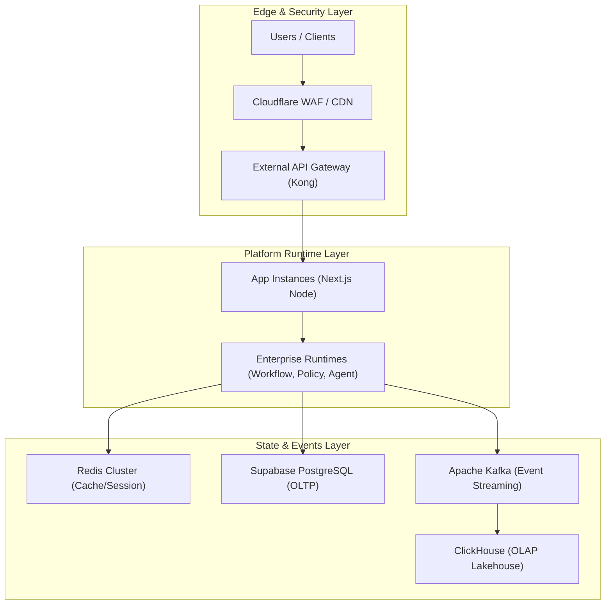
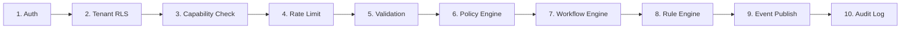

# Volume 5: Technical Architecture & Infrastructure Blueprint

This document defines the **Technical Architecture** (Volume 5) of the Bella Enterprise Integration Platform (EIP). It establishes the infrastructure configurations, runtime pipelines, deployment patterns, and operational standards required to run Bella ERP applications in a secure, high-performing, and compliant environment.

---

## 🏛️ 1. Technology Reference Model (TRM)

The Technology Reference Model defines the authorized technology stack standards for the Bella EIP. No other tools or frameworks may be introduced without ARB approval.

```
┌─────────────────────────────────────────────────────────────┐
│  Presentation Layer: Next.js 14+ (App Router), React 18     │
├─────────────────────────────────────────────────────────────┤
│  Logic & Runtime: TypeScript (Strict typing, no any)       │
├─────────────────────────────────────────────────────────────┤
│  Data Layer: PostgreSQL 16 (Supabase OLTP), ClickHouse (OLAP)│
├─────────────────────────────────────────────────────────────┤
│  Event Bus: Apache Kafka (Enterprise), Outbox Pattern       │
├─────────────────────────────────────────────────────────────┤
│  Caching & Queue: Redis 7.2 (Sentinel cluster / Cluster)    │
└─────────────────────────────────────────────────────────────┘
```

---

## 🌐 2. Deployment Topology & 6 Deployment Patterns

Bella EIP supports multiple deployment configurations depending on tenant requirements (compliance, latency, data sovereignty).

### 2.1 Reference Deployment Diagram



### 2.2 The 6 Deployment Patterns

1. **Multi-Tenant SaaS Shared (Standard)**: All tenants share the same application instance and database. Isolation is enforced via row-level security (RLS) policies.
2. **Dedicated Schema (Premium)**: Shared application server, but each tenant has a dedicated PostgreSQL database schema.
3. **Dedicated Database Instance**: Shared application server, but each tenant has a dedicated PostgreSQL database instance.
4. **Dedicated VPC / Single Tenant SaaS**: Single tenant has dedicated app servers, databases, and caches in a isolated AWS/GCP VPC.
5. **Hybrid Cloud**: Core platform runs on public cloud, but medical clinical data (LIS/RIS) remains on-premises at the hospital.
6. **On-Premise (Private Cloud)**: Full system installed on hospital private datacenter due to strict national healthcare laws.

---

## ⚙️ 3. 10-Stage Runtime Execution Pipeline

Every business transaction passing through the Bella EIP must progress sequentially through the **10-Stage Runtime Execution Pipeline** to guarantee safety, validation, and auditability.



1. **Authentication**: Verify identity via JWT (Supabase Auth).
2. **Tenant RLS**: Extract tenant context and activate row-level security policies.
3. **Capability Authorization**: Check if the tenant has purchased the capability (e.g. `hospital_inpatient`).
4. **Rate Limiting**: Apply API rate limit policies based on subscription tiers.
5. **Payload Validation**: Strict Zod schema verification (compile-time & runtime).
6. **Policy Evaluation**: Execute business policies (e.g. Admission Eligibility).
7. **Workflow Orchestration**: Direct transaction to the correct workflow path.
8. **Rule Calculation**: Evaluate rules (e.g. Session multiplier, TT133 account mapping).
9. **Event Outbox Recording**: Write transaction result event to `accounting_outbox`.
10. **Audit Logging**: Write audit record to `hc_security_break_glass_logs` or audit trail.

---

## ⚡ 4. The 8 Dedicated Enterprise Runtimes

Bella EIP abstracts complex features into **8 dedicated runtimes** to ensure high decoupling.

| Runtime | Purpose | Main Tech |
|---|---|---|
| **Workflow Runtime** | Manages clinical & administrative processes | In-house TypeScript state machine |
| **Policy Runtime** | Evaluates compliance, eligibility, and access rules | OPA / Rego policy engine wrapper |
| **Rule Runtime** | Calculates compensation, multipliers, and finance mapping | Central Rule Engine |
| **Agent Runtime** | Manages autonomous task and cron autopilot | AI Copilot Router |
| **Plugin Runtime** | Handles third-party module extensions | Industry Adapter registry |
| **Automation Runtime** | Triggers automated alerts (Telegram, webhooks) | AI Autopilot Cron |
| **Event Runtime** | Manages pub/sub domain messaging | Apache Kafka / Outbox consumer |
| **Integration Runtime** | Translates LIS/RIS PACS DICOM & BHYT XML 130 | BHYTXml130Service & DICOM simulator |

---

## 🔌 5. Enterprise Extension Model

To maintain a **FROZEN core** while allowing custom industry features, Bella EIP uses three extension mechanisms:
1. **Dynamic Metadata (JSONB)**: Every entity contains a `metadata` column, enabling custom fields without table altering.
2. **Workflow Interceptors**: Custom middleware hooks run `before` and `after` standard actions.
3. **Industry Providers**: Interface contracts (e.g. `ICompensationProvider`) implemented by specific modules.

---

## 🔄 6. Enterprise Integration Patterns (EIP) Catalog

The system coordinates state across boundaries using standardized patterns:
- **Transactional Outbox**: Writes database states and outbox events in a single transaction (preventing partial failures).
- **Idempotency Key**: Uses an `Idempotency-Key` header with Redis lock to prevent duplicate payment submissions.
- **Saga Orchestrator**: Handles multi-step hospital discharge reversals (releasing beds, recalculating invoices).

---

## 🔒 7. 12 Enterprise Security Domains

Bella EIP enforces security across 12 distinct domains:
1. **Zero-Trust Network**: Every service request must prove authentication; no network zone is trusted.
2. **Break-Glass Auditing**: Emergency medical records override logged to `hc_security_break_glass_logs`.
3. **Data-at-Rest Encryption**: Database volumes encrypted with KMS keys.
4. **Data-in-Transit Encryption**: Mandatory TLS 1.3 for all APIs.
5. **PII Masking**: Masking phone numbers, insurance numbers, and patient IDs in application logs.
6. **RLS Hardening**: Database-enforced tenant boundaries.
7. **WAF Protection**: Rate limit and SQL injection blocking via Cloudflare.
8. **Secrets Management**: Secrets loaded at runtime from `.env.local`, never committed.
9. **Role-Based Access Control (RBAC)**: Defined role permissions in `user_permissions`.
10. **Attribute-Based Access Control (ABAC)**: Access matching properties (e.g. branch match).
11. **Static Analysis Gates**: Strict TypeScript no-any block rules.
12. **Container Security**: Vulnerability scanning via Trivy.

---

## 📈 8. Enterprise FinOps Cost Model

Operational costs are calculated and audited systematically:

$$\text{Total Cost} = \text{Compute (Next.js)} + \text{Storage} + \text{Kafka Messaging} + \text{ClickHouse OLAP} + \text{AI Tokens}$$

Every AI prompt cost is recorded to `platform_ai_prompt_ledger` to support tenant-level billing.

---

## 📋 9. Operational Runbooks & Incident Playbooks

- **Disaster Recovery**: Database replica promotion with RPO < 5 seconds, RTO < 30 seconds.
- **Canary Release Playbook**: Deploy changes to 5% of traffic first.
- **Hotfix Rollback**: Instant git tag reverting and migration rollback path.
- **Audit Verification**: Daily consistency check between ledger totals and cash transactions.
