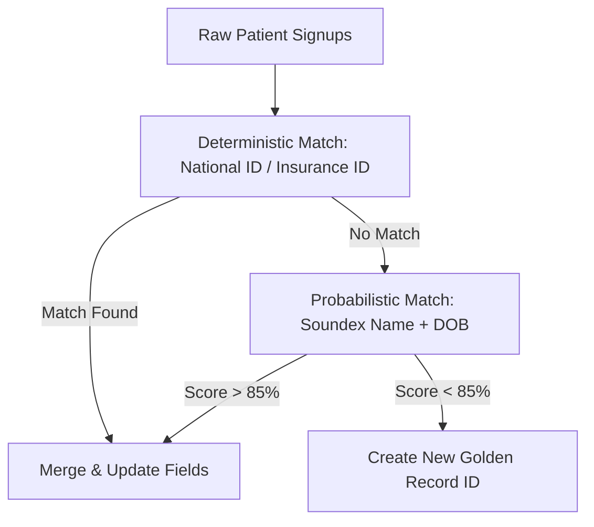
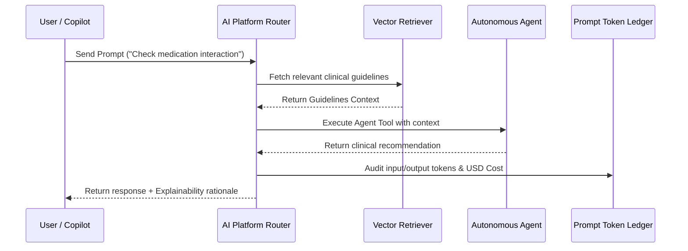

# Volume 6: Enterprise Information, Data & AI Architecture

This document defines the **Enterprise Information, Data & AI Architecture** (Volume 6) of the Bella EIP platform. It establishes the semantic layer models, data governance classification rules, master data management stewardship, clinical knowledge graphs, and the execution runtime pipeline for autonomous AI agents.

---

## 🏷️ 1. Enterprise Semantic Layer

The semantic layer bridges the gap between raw database schemas and natural language queries used by executives, business analysts, and AI agents.

```
┌─────────────────────────────────────────────────────────────┐
│  Business Term: "Doanh thu dịch vụ y tế thực tế"           │
├─────────────────────────────────────────────────────────────┤
│  Canonical Entity: Invoice / Revenue Aggregate Root        │
├─────────────────────────────────────────────────────────────┤
│  API: /api/v1/healthcare/billing/reconciled-revenue        │
├─────────────────────────────────────────────────────────────┤
│  Database Table: public.hc_encounters, public.journal_entries│
└─────────────────────────────────────────────────────────────┘
```

By maintaining this mapping, AI agents (like `ai-salary-reconciler`) query high-level entity concepts instead of writing complex raw SQL joins, preventing data structure exposure and ensuring schema independence.

---

## 🔒 2. Data Governance & 8-Level Data Classification Matrix

To protect sensitive patient information (PII) and corporate finances, data is classified into 8 distinct levels of security and access:

| Level | Classification | Example Data | Access Rule | Security Control |
|---|---|---|---|---|
| **L0** | Public Data | Marketing pricing, standard clinic packages | Public read | CDN caching |
| **L1** | Internal Open | Internal developer documentation, guides | Authenticated staff | TLS 1.3 |
| **L2** | Tenant Operational | Employee directory, working schedules | Branch staff | RLS tenant match |
| **L3** | Financial General | Standard salary logs, branch operating costs | Branch manager | RLS + ABAC check |
| **L4** | PII Sensitive | Patient full name, phone number, DOB | Medical staff only | Field masking / logging |
| **L5** | Clinical Protected | EMR notes, ICD-10 diagnoses, MAR logs | Doctor / Nurse in charge | ABAC context lock |
| **L6** | Critical Financial | Unified ledger accounts, accounting period logs | CFO / Super admin | Encryption at Rest |
| **L7** | Break-Glass Protected | Emergency medical history override records | Special authorization | Audited log audit trail |

---

## 👥 3. Master Data Platform (Identity Resolution)

Bella EIP operates a **Master Data Management (MDM)** pipeline to resolve duplicate records and guarantee a single source of truth for core business entities.

### 3.1 Patient Golden Record Pipeline



- **Stewardship Console**: Flagged duplicates are reviewed in `/dashboard/data-platform` where administrators can manual merge or split golden records.

---

## 🧠 4. Enterprise Knowledge Graph & Ontology

The clinical decision engine is supported by the **Bella Clinical Knowledge Graph**, mapping relationships between diagnoses, treatments, medications, and contraindications.

```
(ICD-10: E11 Type 2 Diabetes) ──[CONTRAINDICATED_WITH]──> (Drug: Dexamethasone)
(Patient: A) ──[HAS_DIAGNOSIS]──> (ICD-10: E11)
(Clinical Copilot) ──[TRIGGERS_ALERT]──> (Active prescription of Dexamethasone for Patient A)
```

- **Vector Database (Supabase pgvector)**: Stores embeddings of clinical papers, local treatment protocols, and BHYT circular documents, enabling quick retrieval for AI agents.

---

## 🤖 5. Enterprise AI Platform Pipeline

Every AI interaction in the EIP follows a strict, audited pipeline to guarantee compliance, safety, and explainability.



- **Explainability requirement**: Every suggestion must list its source documents and confidence score. No hallucination is permitted in medical or financial actions.
