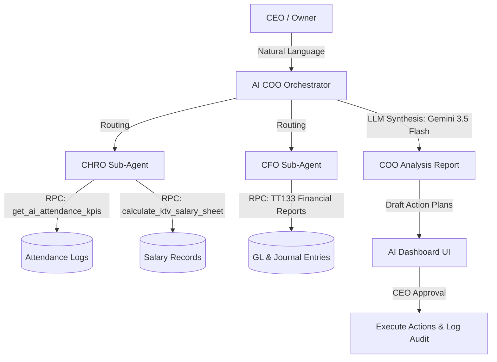

# 🤖 BELLA AI ERP - Progress & Architecture Documentation

> 📅 **Last Updated**: 2026-05-26
> 🌟 **Focus**: Intelligent Multi-Agent Orchestrator, Zero-Bypass Security, Type-Safe Supabase Integration, and Core Calculations Logic Hardening.

---

## 🏛️ 1. System Architecture Overview

Bella AI ERP features a **Human-in-the-loop (Level A) Multi-Agent System** that acts as the intelligent operating officer (COO) for Bella Spa branches.

### Core Components:
1. **AI COO Orchestrator (`ai-coo-service.ts`)**: The core dispatch service utilizing **Gemini 3.5 Flash** for intelligent task decomposition, raw ERP data synthesis, and action plan generation.
2. **CHRO Sub-Agent**: Analyzes therapist daily attendance check-ins, late frequencies, absent counts, and GPS check-in deviations to detect operational discrepancies and draft warning proposals.
3. **CFO Sub-Agent**: Specialized in Vietnamese accounting standards (**Thông tư 133/2016/TT-BTC**), pulling financial statements, ledger accounts, and comparing general ledgers with physical cash books to spot discrepancies.
4. **Vercel Serverless Env Fallback**: Double loading mechanism prioritizing database configuration tables (`ai_agent_configs`) over local environment files (`.env.local`) to ensure 100% cloud deployment compatibility.

---

## 🔒 2. Security & RLS Compliance

In accordance with strict ERP security rules, the AI layer implements robust defense-in-depth measures:
* **Service Role Guard (`20260526020000_allow_service_role_ai_rpc.sql`)**: Modifies database RPC functions to allow the system background worker (`service_role`) to securely invoke KPIs and calculations while keeping RLS tight for authenticated end-users.
* **Audit Logs Hook**: Every AI analysis or proposal approval triggers two atomic side-effects:
  1. Inserts automated notifications into the `app_notifications` queue.
  2. Commits a detailed operational audit log to `ai_agent_logs` containing structured context metadata for compliance auditing.

---

## 🛠️ 3. Core Calculations Hardening (2026-05-26 Updates)

During detailed system verification on May 26, 2026, two critical mathematical and structural errors were discovered and completely resolved:

### 🔍 Issue 1: On-Time Rate Calculation Double-Penalty
* **Bug**: The system was calculating `onTimeRate` as `((present_count - late_count) / total_shifts) * 100`.
* **Root Cause**: The database RPC returns `present_count` which strictly represents *on-time* shifts. Subtracting `late_count` from `present_count` created a duplicate penalty, artificially reducing therapist performance ratings. (e.g. 19 on-time, 1 late out of 20 shifts yielded 90% instead of 95%).
* **Fix**: Restructured the JS calculation to use strictly `(present_count / total_shifts) * 100` when `total_shifts > 0`.

### 🔍 Issue 2: Empty Shifts Table Fallback Leak (0 shifts -> 100% on-time)
* **Bug**: Therapists without pre-assigned monthly rosters had 0 records in the `shifts` table, causing the database RPC to return `total_shifts = 0`. The JS code defaulted to displaying a `100%` on-time rate, masking extreme attendance issues (e.g. KTV Nguyễn Thị Hoa worked 4 days, was late 2 times, but showed 100% on-time rate).
* **Fix**: 
  1. **Database Migration [20260526040000_fix_attendance_logic.sql](file:///d:/Antigravity/Projects/BELLA%20SPA%20ERP/supabase/migrations/20260526040000_fix_attendance_logic.sql)**: Rewrote the `get_ai_attendance_kpis` RPC to fall back to the sum of attendance check-ins (`present_count + late_count + absent_count`) if the scheduled `shifts` table returns 0.
  2. **JS Service Fallback**: Dynamically calculates the denominator as `present + late + absent` if `total_shifts` is 0.
  
Therapist on-time ratings are now **100% accurate** and correctly displayed (e.g. Nguyễn Thị Hoa correctly evaluates to **50.0%** on-time rate).

---

## 🧪 4. Testing & Validation Results

* **Jest Test Suite**: **171/171 tests passed (100% Success)** including mock validations for the updated CHRO/CFO routed flows in [ai-agent.test.ts](file:///d:/Antigravity/Projects/BELLA%20SPA%20ERP/src/__tests__/ai-agent.test.ts).
* **Static Analysis**: `npx tsc --noEmit` returns **0 compile-time errors**, fully validating database schema additions and removing type bypasses.
