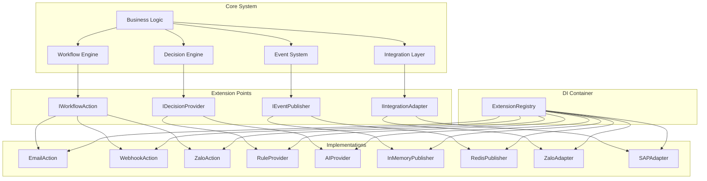
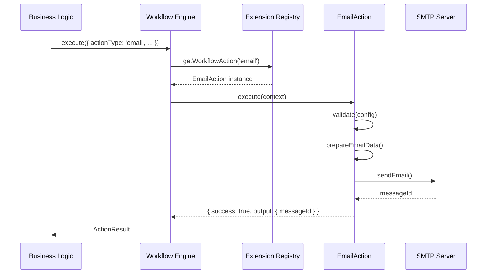
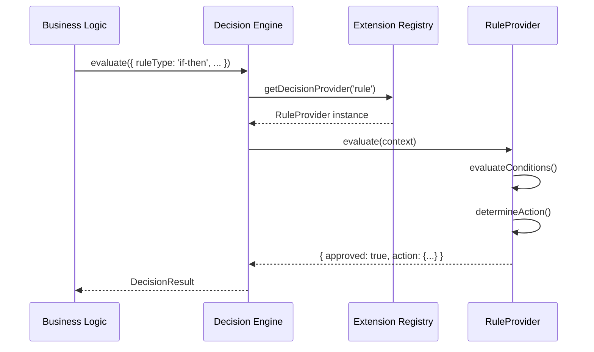
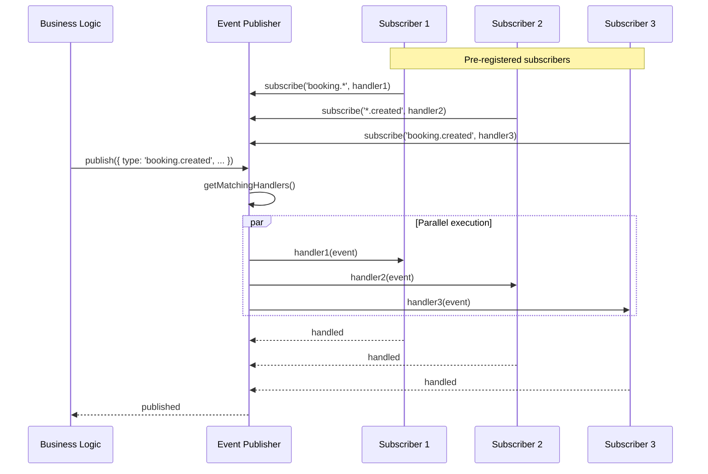

# Bella ERP - Extension Architecture

**Version**: 1.0.0  
**Last Updated**: 2026-06-22  
**Status**: ✅ Phase 0 Complete

---

## Table of Contents

1. [Overview](#overview)
2. [Design Principles](#design-principles)
3. [Extension Points](#extension-points)
4. [Architecture Diagrams](#architecture-diagrams)
5. [Usage Guide](#usage-guide)
6. [Migration Guide](#migration-guide)
7. [Reference Implementations](#reference-implementations)
8. [FAQ](#faq)

---

## Overview

Bella ERP Extension Architecture cho phép mở rộng hệ thống mà **không cần sửa đổi Core code**. Thay vì hardcode các implementations cụ thể, Core code phụ thuộc vào **abstractions (interfaces)**, và developers có thể thêm implementations mới thông qua **Dependency Injection**.

### Key Benefits

- ✅ **Open/Closed Principle**: Open for extension, closed for modification
- ✅ **Dependency Inversion**: Core depends on abstractions, not concrete implementations
- ✅ **Type Safety**: Full TypeScript support with generics
- ✅ **Testability**: Easy to mock implementations for testing
- ✅ **Maintainability**: Clear separation of concerns

### What This Is NOT

- ❌ **NOT a plugin marketplace** - No plugin discovery UI
- ❌ **NOT dynamic plugin loading** - No runtime .dll/.so loading
- ❌ **NOT a plugin versioning system** - No semver dependency management
- ❌ **NOT hot-reload plugins** - Requires app restart for new extensions

### Philosophy

> **"Design for extension, implement for current needs."**

We design interfaces that are **open for extension** (new implementations), but **closed for modification** (existing code doesn't change). This follows the Open/Closed Principle from SOLID.

---

## Design Principles

### 1. Dependency Inversion Principle

```typescript
// ❌ BAD: Core depends on concrete implementation
class WorkflowEngine {
  async sendEmail(to: string, subject: string, body: string) {
    const smtp = new SMTPClient(); // Hardcoded dependency
    await smtp.send(to, subject, body);
  }
}

// ✅ GOOD: Core depends on abstraction
class WorkflowEngine {
  constructor(private actions: Map<string, IWorkflowAction>) {}
  
  async execute(step: WorkflowStep) {
    const action = this.actions.get(step.actionType);
    if (!action) throw new Error(`Unknown action: ${step.actionType}`);
    return action.execute(step.context);
  }
}
```

### 2. Interface Segregation Principle

Keep interfaces **small and focused**. Each interface should have a single responsibility.

```typescript
// ✅ GOOD: Focused interface
interface IDecisionProvider {
  readonly name: string;
  evaluate(context: DecisionContext): Promise<DecisionResult>;
  validate(rule: Rule): ValidationResult;
  supports(ruleType: string): boolean;
}

// ❌ BAD: God interface
interface IDecisionProvider {
  // Too many responsibilities
  evaluate(context: DecisionContext): Promise<DecisionResult>;
  train(data: TrainingData): Promise<void>;
  deploy(model: Model): Promise<void>;
  monitor(metrics: Metrics): void;
  backup(path: string): Promise<void>;
}
```

### 3. Keep It Simple

No over-engineering. Only design what you need **today**, not what you might need tomorrow.

```typescript
// ✅ GOOD: Simple factory registration
extensionRegistry.registerWorkflowAction(new EmailAction(config));

// ❌ BAD: Over-engineered plugin system
pluginLoader.scanDirectory('./plugins');
pluginLoader.loadDependencies();
pluginLoader.validateVersions();
pluginLoader.sandboxExecution();
pluginLoader.hotReload();
```

---

## Extension Points

Bella ERP có **4 Extension Points** chính:

### 1. Decision Provider Extension

**Purpose**: Extend decision-making strategies (rules, BI, AI)

**Interface**: [`IDecisionProvider`](../src/lib/decision-engine/abstractions/IDecisionProvider.ts)

**Core Methods**:
- `evaluate(context)` - Execute decision logic
- `validate(rule)` - Validate rule structure
- `supports(ruleType)` - Check if provider handles rule type

**Current Implementations**:
- ✅ `RuleProvider` - If-then rules and decision tables

**Future Implementations**:
- 🔜 `BIProvider` - Query-based decisions from BI dashboards
- 🔜 `AIProvider` - ML model predictions
- 🔜 `CustomProvider` - User-defined JavaScript logic

**Example**:
```typescript
import { extensionRegistry } from '@/lib/di';
import { RuleProvider } from '@/lib/decision-engine/providers/RuleProvider';

// Register provider
extensionRegistry.registerDecisionProvider(new RuleProvider());

// Use provider
const provider = extensionRegistry.getDecisionProvider('rule');
const result = await provider.evaluate({
  ruleType: 'if-then',
  rule: {
    id: 'discount-rule',
    conditions: [
      { field: 'customer.vipLevel', operator: 'equals', value: 'gold' }
    ],
    action: { type: 'discount', data: { percentage: 15 } }
  },
  data: { customer: { vipLevel: 'gold' } }
});

console.log(result.approved); // true
console.log(result.action?.data); // { percentage: 15 }
```

---

### 2. Workflow Action Extension

**Purpose**: Extend workflow actions (email, webhook, notifications)

**Interface**: [`IWorkflowAction`](../src/lib/workflow-engine/abstractions/IWorkflowAction.ts)

**Core Methods**:
- `execute(context)` - Execute action
- `validate(config)` - Validate action configuration
- `rollback(context)` - Rollback action (if possible)

**Current Implementations**:
- ✅ `EmailAction` - Send email with templates

**Future Implementations**:
- 🔜 `WebhookAction` - HTTP webhook calls
- 🔜 `NotificationAction` - In-app notifications
- 🔜 `ZaloAction` - Zalo OA messages
- 🔜 `SlackAction` - Slack messages
- 🔜 `AIAction` - AI-powered actions

**Example**:
```typescript
import { extensionRegistry } from '@/lib/di';
import { EmailAction } from '@/lib/workflow-engine/actions/EmailAction';

// Register action
const emailAction = new EmailAction({
  smtpHost: 'smtp.gmail.com',
  smtpPort: 587,
  from: 'noreply@bella.vn'
});
extensionRegistry.registerWorkflowAction(emailAction);

// Use action
const action = extensionRegistry.getWorkflowAction('email');
const result = await action.execute({
  executionId: 'exec-123',
  workflowId: 'wf-456',
  stepId: 'step-1',
  config: {
    actionType: 'email',
    to: 'customer@example.com',
    subject: 'Welcome {{name}}!',
    body: 'Hello {{name}}, welcome to Bella ERP!',
    templateVars: { name: 'John Doe' }
  },
  input: {},
  tenantId: 'tenant-1'
});

console.log(result.success); // true
console.log(result.output?.messageId); // 'msg-123'
```

---

### 3. Event Publisher Extension

**Purpose**: Extend event transport layer (in-memory, Redis, Kafka)

**Interface**: [`IEventPublisher`](../src/lib/events/abstractions/IEventPublisher.ts)

**Core Methods**:
- `publish(event)` - Publish event
- `subscribe(pattern, handler)` - Subscribe to events
- `close()` - Cleanup resources

**Current Implementations**:
- ✅ `InMemoryEventPublisher` - Synchronous in-process events

**Future Implementations**:
- 🔜 `RedisEventPublisher` - Redis Pub/Sub
- 🔜 `RabbitMQEventPublisher` - Message queue
- 🔜 `KafkaEventPublisher` - Event streaming

**Example**:
```typescript
import { extensionRegistry } from '@/lib/di';
import { InMemoryEventPublisher } from '@/lib/events/publishers/InMemoryEventPublisher';

// Register publisher
const publisher = new InMemoryEventPublisher({
  bufferSize: 1000,
  enableMetrics: true
});
extensionRegistry.registerEventPublisher(publisher, true); // Set as default

// Publish event
const eventPublisher = extensionRegistry.getDefaultEventPublisher();
await eventPublisher.publish({
  id: 'evt-123',
  type: 'booking.created',
  data: { bookingId: '456', customerId: '789' },
  timestamp: new Date(),
  tenantId: 'tenant-1'
});

// Subscribe to events
const unsubscribe = eventPublisher.subscribe('booking.*', async (event) => {
  console.log('Booking event:', event.type, event.data);
});
```

---

### 4. Integration Adapter Extension

**Purpose**: Extend external integrations (Zalo, Meta, SAP, Banking)

**Interface**: [`IIntegrationAdapter`](../src/lib/integrations/abstractions/IIntegrationAdapter.ts)

**Core Methods**:
- `send(payload)` - Send data to external system
- `receive(webhook)` - Receive webhook from external system
- `validate(config)` - Validate configuration
- `healthCheck()` - Check adapter health

**Current Implementations**:
- (None yet - interface designed only)

**Future Implementations**:
- 🔜 `ZaloAdapter` - Zalo OA integration
- 🔜 `MetaAdapter` - Facebook/Instagram integration
- 🔜 `SAPAdapter` - SAP ERP integration
- 🔜 `GoogleAdapter` - Google Workspace
- 🔜 `BankAdapter` - Banking APIs

**Example**:
```typescript
import { extensionRegistry } from '@/lib/di';
// import { ZaloAdapter } from '@/lib/integrations/adapters/ZaloAdapter';

// Register adapter (future)
// const zaloAdapter = new ZaloAdapter({
//   oaId: process.env.ZALO_OA_ID,
//   accessToken: process.env.ZALO_ACCESS_TOKEN
// });
// extensionRegistry.registerIntegrationAdapter(zaloAdapter);

// Use adapter
// const adapter = extensionRegistry.getIntegrationAdapter('zalo');
// const result = await adapter.send({
//   type: 'zns',
//   data: {
//     phone: '0901234567',
//     templateId: 'welcome',
//     params: { name: 'John' }
//   },
//   idempotencyKey: 'msg-123',
//   tenantId: 'tenant-1'
// });
```

---

## Architecture Diagrams

### High-Level Architecture



### Workflow Action Flow



### Decision Provider Flow



### Event Publisher Flow



---

## Usage Guide

### Step 1: Bootstrap Extensions

Create app initialization file (e.g., `src/lib/di/bootstrap.ts`):

```typescript
import { extensionRegistry } from '@/lib/di';
import { RuleProvider } from '@/lib/decision-engine/providers/RuleProvider';
import { EmailAction } from '@/lib/workflow-engine/actions/EmailAction';
import { InMemoryEventPublisher } from '@/lib/events/publishers/InMemoryEventPublisher';

export function bootstrapExtensions() {
  // Register Decision Providers
  extensionRegistry.registerDecisionProvider(new RuleProvider());
  
  // Register Workflow Actions
  const emailAction = new EmailAction({
    smtpHost: process.env.SMTP_HOST || 'smtp.gmail.com',
    smtpPort: parseInt(process.env.SMTP_PORT || '587'),
    from: process.env.EMAIL_FROM || 'noreply@bella.vn'
  });
  extensionRegistry.registerWorkflowAction(emailAction);
  
  // Register Event Publishers
  const publisher = new InMemoryEventPublisher({
    bufferSize: 1000,
    enableMetrics: true,
    debug: process.env.NODE_ENV === 'development'
  });
  extensionRegistry.registerEventPublisher(publisher, true);
  
  console.log('[Bootstrap] Extensions initialized:', extensionRegistry.getStats());
}

export async function cleanupExtensions() {
  await extensionRegistry.dispose();
}
```

### Step 2: Call Bootstrap on App Start

In Next.js middleware or app initialization:

```typescript
// src/middleware.ts or src/app/layout.tsx
import { bootstrapExtensions, cleanupExtensions } from '@/lib/di/bootstrap';

// On app start
bootstrapExtensions();

// On app shutdown (Node.js process)
if (typeof process !== 'undefined') {
  process.on('SIGTERM', async () => {
    await cleanupExtensions();
    process.exit(0);
  });
}
```

### Step 3: Use Extensions in Business Logic

```typescript
import { extensionRegistry } from '@/lib/di';

export async function processBookingApproval(bookingId: string) {
  // 1. Use Decision Provider
  const decisionProvider = extensionRegistry.getDecisionProvider('rule');
  const decisionResult = await decisionProvider.evaluate({
    ruleType: 'if-then',
    rule: {
      id: 'booking-approval',
      conditions: [
        { field: 'totalAmount', operator: 'lessThan', value: 5000000 }
      ],
      action: { type: 'auto-approve', data: {} }
    },
    data: { totalAmount: 3000000 }
  });
  
  if (decisionResult.approved) {
    // 2. Use Workflow Action
    const emailAction = extensionRegistry.getWorkflowAction('email');
    await emailAction.execute({
      executionId: `exec-${bookingId}`,
      workflowId: 'booking-approval',
      stepId: 'notify-customer',
      config: {
        actionType: 'email',
        to: 'customer@example.com',
        subject: 'Booking Approved',
        body: 'Your booking has been approved!'
      },
      input: {},
      tenantId: 'tenant-1'
    });
    
    // 3. Use Event Publisher
    const eventPublisher = extensionRegistry.getDefaultEventPublisher();
    await eventPublisher.publish({
      id: crypto.randomUUID(),
      type: 'booking.approved',
      data: { bookingId, approvalType: 'auto' },
      timestamp: new Date(),
      tenantId: 'tenant-1'
    });
  }
}
```

---

## Migration Guide

### From Hardcoded Dependencies to Extension Architecture

#### Before (Hardcoded)

```typescript
// ❌ Old approach: Hardcoded dependencies
export async function sendBookingConfirmation(booking: Booking) {
  // Direct SMTP dependency
  const transporter = nodemailer.createTransport({
    host: 'smtp.gmail.com',
    port: 587,
    auth: {
      user: process.env.SMTP_USER,
      pass: process.env.SMTP_PASSWORD
    }
  });
  
  await transporter.sendMail({
    from: 'noreply@bella.vn',
    to: booking.customerEmail,
    subject: 'Booking Confirmation',
    html: `<p>Your booking is confirmed!</p>`
  });
}
```

#### After (Extension Architecture)

```typescript
// ✅ New approach: Dependency injection via extension registry
export async function sendBookingConfirmation(booking: Booking) {
  const emailAction = extensionRegistry.getWorkflowAction('email');
  
  await emailAction.execute({
    executionId: `exec-${booking.id}`,
    workflowId: 'booking-confirmation',
    stepId: 'send-email',
    config: {
      actionType: 'email',
      to: booking.customerEmail,
      subject: 'Booking Confirmation',
      body: 'Your booking is confirmed!',
      isHtml: true
    },
    input: { booking },
    tenantId: booking.tenantId
  });
}
```

#### Benefits of Migration

1. **Testability**: Easy to mock `emailAction` in tests
2. **Flexibility**: Can swap email provider without changing business logic
3. **Consistency**: All email sending goes through same interface
4. **Observability**: Centralized logging and metrics in action
5. **Rollback**: Built-in rollback support in interface

---

## Reference Implementations

### RuleProvider

**Location**: `src/lib/decision-engine/providers/RuleProvider.ts`

**Features**:
- If-then rules with AND/OR logic
- Decision tables
- Condition operators: equals, greaterThan, lessThan, contains, in
- Nested field path support (e.g., `customer.vipLevel`)
- Rule validation

**When to use**: Simple business rules that don't require ML/AI

**Example**:
```typescript
const provider = new RuleProvider();
const result = await provider.evaluate({
  ruleType: 'if-then',
  rule: {
    id: 'vip-discount',
    conditions: [
      { field: 'customer.vipLevel', operator: 'equals', value: 'gold' },
      { field: 'totalAmount', operator: 'greaterThan', value: 1000000 }
    ],
    logic: 'AND',
    action: { type: 'discount', data: { percentage: 15 } }
  },
  data: {
    customer: { vipLevel: 'gold' },
    totalAmount: 2000000
  }
});
```

---

### EmailAction

**Location**: `src/lib/workflow-engine/actions/EmailAction.ts`

**Features**:
- Email validation (to, cc, bcc)
- Template interpolation (`{{variable}}` syntax)
- HTML and plain text support
- Attachments support
- Retryable error detection
- Mock implementation (logs to console)

**When to use**: Sending transactional emails

**Production notes**:
- Currently mock implementation
- Should integrate SendGrid/AWS SES/Nodemailer in production
- Should add email queue for batch sending
- Should track delivery status

**Example**:
```typescript
const action = new EmailAction({
  smtpHost: 'smtp.gmail.com',
  smtpPort: 587,
  from: 'noreply@bella.vn'
});

const result = await action.execute({
  executionId: 'exec-123',
  workflowId: 'welcome',
  stepId: 'send-welcome-email',
  config: {
    actionType: 'email',
    to: 'customer@example.com',
    subject: 'Welcome {{name}}!',
    body: 'Hello {{name}}, your VIP level is {{vipLevel}}.',
    templateVars: { name: 'John', vipLevel: 'Gold' },
    isHtml: false
  },
  input: {},
  tenantId: 'tenant-1'
});
```

---

### InMemoryEventPublisher

**Location**: `src/lib/events/publishers/InMemoryEventPublisher.ts`

**Features**:
- Synchronous in-process event delivery
- Pattern matching (`booking.*`, `*.created`)
- Event buffering and replay
- Metrics collection (latency, counts)
- Debug logging

**When to use**:
- Development and testing
- Single-instance applications
- Low-latency event processing

**Limitations**:
- No persistence (events lost on restart)
- No cross-instance communication
- No distributed tracing

**Production notes**:
- Use RedisEventPublisher for multi-instance deployments
- Use RabbitMQEventPublisher for reliable queuing
- Use KafkaEventPublisher for event streaming

**Example**:
```typescript
const publisher = new InMemoryEventPublisher({
  bufferSize: 1000,
  enableMetrics: true,
  debug: true
});

// Publish
await publisher.publish({
  id: 'evt-123',
  type: 'booking.created',
  data: { bookingId: '456' },
  timestamp: new Date(),
  tenantId: 'tenant-1'
});

// Subscribe
publisher.subscribe('booking.*', async (event) => {
  console.log('Booking event:', event.type);
});

// Replay historical events
await publisher.replayEvents('booking.*', async (event) => {
  console.log('Replaying:', event.type);
});
```

---

## FAQ

### Q1: Do I need to use all 4 extension points?

**A**: No. Use only what you need. If you don't need custom decision logic, don't register a `IDecisionProvider`. The extension registry is optional.

---

### Q2: Can I register multiple implementations for the same extension point?

**A**: Yes!

- **Decision Providers**: Can register multiple (e.g., `RuleProvider`, `AIProvider`) and select at runtime
- **Workflow Actions**: Each action type is unique (e.g., `email`, `webhook`)
- **Event Publishers**: Can register multiple, but only one is "default"
- **Integration Adapters**: Each provider is unique (e.g., `zalo`, `meta`)

---

### Q3: How do I test code that uses extensions?

**A**: Create a test container with mock implementations:

```typescript
import { createServiceContainer, ExtensionRegistry } from '@/lib/di';

describe('BookingService', () => {
  it('should send email on approval', async () => {
    // Create test registry
    const testRegistry = new ExtensionRegistry();
    
    // Register mock email action
    const mockEmailAction = {
      actionType: 'email',
      async execute() {
        return { success: true, output: { messageId: 'mock-123' } };
      },
      validate() {
        return { valid: true };
      },
      async rollback() {}
    };
    testRegistry.registerWorkflowAction(mockEmailAction);
    
    // Test your service with mock registry
    const service = new BookingService(testRegistry);
    await service.approveBooking('booking-123');
    
    // Assert email was sent
    // ...
  });
});
```

---

### Q4: Can I create custom implementations?

**A**: Absolutely! That's the whole point. Just implement the interface:

```typescript
import { IWorkflowAction, type WorkflowContext, type ActionResult } from '@/lib/workflow-engine/abstractions/IWorkflowAction';

export class SlackAction implements IWorkflowAction {
  readonly actionType = 'slack';
  readonly version = '1.0.0';
  
  async execute(context: WorkflowContext): Promise<ActionResult> {
    // Your Slack integration logic
    return { success: true, output: {} };
  }
  
  validate(config) {
    // Validation logic
    return { valid: true };
  }
  
  async rollback(context: WorkflowContext): Promise<void> {
    // Rollback logic (if applicable)
  }
}

// Register it
extensionRegistry.registerWorkflowAction(new SlackAction());
```

---

### Q5: What happens if I try to resolve a non-existent extension?

**A**: It throws an error. Always check with `has()` first or use try-catch:

```typescript
// Option 1: Check first
if (extensionRegistry.hasWorkflowAction('sms')) {
  const action = extensionRegistry.getWorkflowAction('sms');
}

// Option 2: Try-catch
try {
  const action = extensionRegistry.getWorkflowAction('sms');
} catch (error) {
  console.error('SMS action not registered');
}
```

---

### Q6: How do I add a new extension point?

**A**: Follow these steps:

1. **Design the interface** in `src/lib/[domain]/abstractions/I[Name].ts`
2. **Create reference implementation** in `src/lib/[domain]/providers/` or `src/lib/[domain]/actions/`
3. **Add to ExtensionRegistry** in `src/lib/di/ExtensionRegistry.ts`
4. **Update bootstrap.example.ts** with registration example
5. **Document in this file** with usage examples

---

### Q7: Can extensions access each other?

**A**: Yes, through the extension registry:

```typescript
export class ZaloAction implements IWorkflowAction {
  async execute(context: WorkflowContext): Promise<ActionResult> {
    // Get Zalo adapter from registry
    const adapter = extensionRegistry.getIntegrationAdapter('zalo');
    
    // Use adapter
    const result = await adapter.send({
      type: 'zns',
      data: { ... },
      tenantId: context.tenantId
    });
    
    return { success: result.success, output: result };
  }
}
```

---

### Q8: What's the performance impact?

**A**: Minimal. The extension registry uses `Map` for O(1) lookups. No reflection or dynamic loading involved.

---

### Q9: Can I hot-reload extensions without restarting the app?

**A**: No. This is intentionally not supported to keep the architecture simple. Restart the app to register new extensions.

---

### Q10: Where do I configure SMTP/API keys for extensions?

**A**: Use environment variables in `bootstrap.ts`:

```typescript
const emailAction = new EmailAction({
  smtpHost: process.env.SMTP_HOST || 'smtp.gmail.com',
  smtpPort: parseInt(process.env.SMTP_PORT || '587'),
  smtpUser: process.env.SMTP_USER,
  smtpPassword: process.env.SMTP_PASSWORD,
  from: process.env.EMAIL_FROM || 'noreply@bella.vn'
});
```

---

## Next Steps

1. **Implement Production Actions** - Replace mock EmailAction with real SMTP integration
2. **Add Redis Event Publisher** - For multi-instance deployments
3. **Add Webhook Action** - For external system integrations
4. **Add Zalo Adapter** - For Zalo OA messaging
5. **Add BI Provider** - For BI dashboard-driven decisions
6. **Write Integration Tests** - Test extension interactions

---

## Related Documents

- [Phase 0 PRD](./implementation-artifacts/extension-architecture-phase0-prd.md) - Original requirements
- [INDUSTRY_MODULE_DEVELOPMENT_PLAYBOOK.md](./INDUSTRY_MODULE_DEVELOPMENT_PLAYBOOK.md) - Industry module guidelines

---

**Maintainers**: Bella ERP Team  
**Questions?**: Open an issue or contact the architecture team
