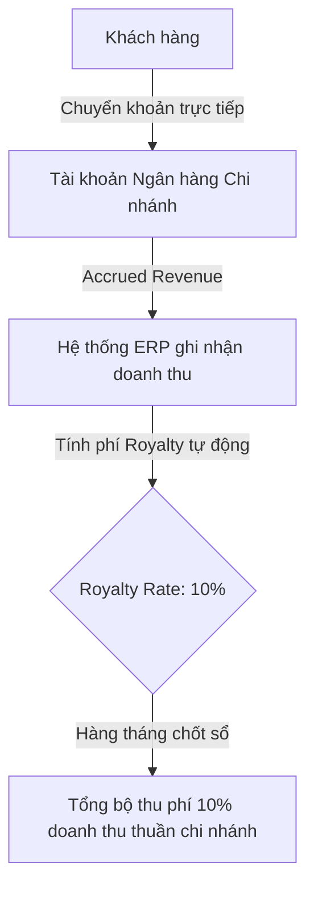
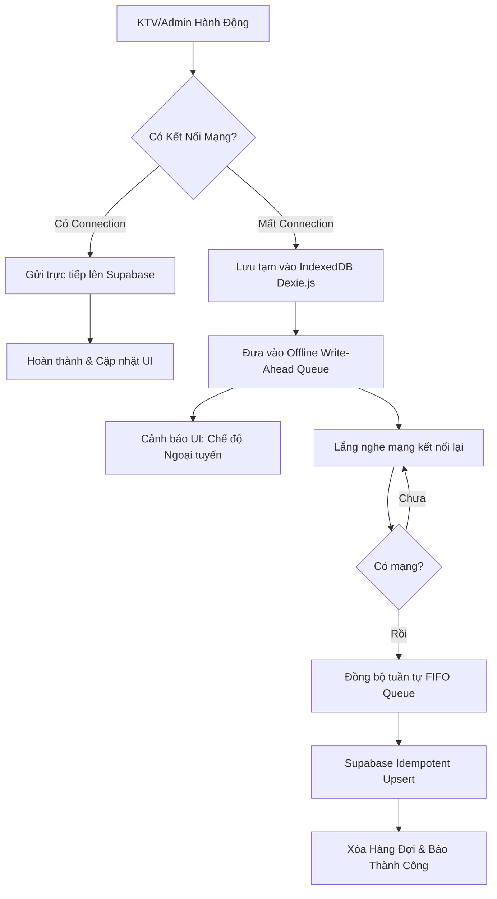

# 🏢 ĐẶC TẢ TỔNG HỢP: NHƯỢNG QUYỀN ĐA CHI NHÁNH & CHIẾN LƯỢC ĐỒNG BỘ NGOẠI TUYẾN
**Hệ thống**: Bella Spa ERP  
**Mã tài liệu**: BELLA-SPA-FRANCHISE-OFFLINE-SPEC  
**Phiên bản**: v2.0 (Bản tổng hợp tối ưu hóa)  
**Ngày lập**: 29/05/2026  
**Trạng thái**: 🟢 ĐÃ DUYỆT & VẬN HÀNH THỰC TẾ  

---

## 📋 MỤC LỤC
1. [1. Kiến trúc Đa chi nhánh nhượng quyền (Franchise Multi-Branch)](#1-kiến-trúc-đa-chi-nhánh-nhượng-quyền-franchise-multi-branch)
2. [2. Quản lý dòng tiền & Phí nhượng quyền Royalty](#2-quản-lý-dòng-tiền--phí-nhượng-quyền-royalty)
3. [3. Chiến lược Ngoại tuyến (Offline-First Strategy)](#3-chiến-lược-ngoại-tuyến-offline-first-strategy)
4. [4. Cơ chế chống trùng lặp & Xử lý xung đột (Idempotency)](#4-cơ-chế-chống-trùng-lặp--xử-lý-xung-đột-idempotency)

---

## 1. Kiến trúc Đa chi nhánh nhượng quyền (Franchise Multi-Branch)

Để đáp ứng mục tiêu phát triển chuỗi thương hiệu, Bella Spa ERP được thiết kế theo kiến trúc **Multi-tenant** (Đa chi nhánh/Đa chủ thể). Hệ thống cho phép:

* **Cô lập dữ liệu tuyệt đối:** Mỗi chi nhánh nhượng quyền (Franchise Branch) sở hữu một mã `tenant_id` riêng biệt. Tất cả các truy vấn từ nhân viên, KTV, khách hàng của chi nhánh đều bị giới hạn bởi thuộc tính `tenant_id` này thông qua chính sách Row Level Security (RLS) của cơ sở dữ liệu Supabase, đảm bảo chi nhánh này hoàn toàn không thể tiếp cận hay can thiệp vào dữ liệu của chi nhánh khác.
* **Quản trị tập trung tại Tổng bộ (HQ):** Tài khoản Admin tối cao của tổng bộ có quyền truy vấn báo cáo hợp nhất, đối soát dữ liệu và phân bổ tài nguyên dùng chung (ví dụ: Danh mục gói dịch vụ chuẩn hóa `packages`).

---

## 2. Quản lý dòng tiền & Phí nhượng quyền Royalty

Kiến trúc tài chính nhượng quyền quy định cách thu dòng tiền và phân chia lợi ích tự động giữa Tổng bộ (HQ) và các chi nhánh:

### Chi tiết cách tính phí Royalty:
* **Tỷ lệ phí nhượng quyền (Royalty Rate):** Được cấu hình động trên mỗi chi nhánh tại bảng `tenants.royalty_rate` (mặc định là 10.00% doanh thu).
* **Công thức tự động:** Hàng tháng, khi hệ thống chạy tác vụ khóa sổ kỳ kế toán (`lockMonth`), CSDL tự động quét tổng doanh thu thực thu (`confirmed revenue`) của chi nhánh đó, nhân với tỷ lệ `royalty_rate` để sinh ra bản ghi chi phí nợ thương hiệu cần trích nộp về tài khoản Tổng bộ HQ.
* **Đối soát & Báo cáo:** Chủ chuỗi thương hiệu có màn hình Consolidated P&L để theo dõi chi phí nhượng quyền lũy kế từ tất cả các chi nhánh theo thời gian thực.

---

## 3. Chiến lược Ngoại tuyến (Offline-First Strategy)

Trong môi trường Homecare thực tế, KTV thường làm việc tại nhà khách hàng, nơi kết nối 4G/Wifi kém ổn định. Để tránh mất mát dữ liệu chấm công, check-in ca làm và đảm bảo trải nghiệm mượt mà, hệ thống áp dụng kiến trúc **Offline-First** kết hợp **IndexedDB (Dexie.js)**.

### A. IndexedDB (Dexie.js) làm bộ nhớ đệm ngoại tuyến:
Khi mất mạng, mọi thao tác chấm công, check-in, check-out, ghi chú trị liệu được mã hóa và lưu trữ cục bộ vào cơ sở dữ liệu IndexedDB của trình duyệt thiết bị bằng thư viện `Dexie.js`, giúp bảo toàn dữ liệu kể cả khi trình duyệt bị tắt đột ngột.

### B. Sinh ID ngẫu nhiên phía Client (Client-Side UUID):
Tất cả các bản ghi sinh ra ở chế độ offline đều được tạo sẵn mã `UUID v4` ngay tại trình duyệt bằng API `crypto.randomUUID()`. UUID này sẽ đi kèm bản ghi khi đồng bộ lên Supabase, đóng vai trò làm Khóa chính (Primary Key) tĩnh.

---

## 4. Cơ chế chống trùng lặp & Xử lý xung đột (Idempotency)

Khi thiết bị có mạng trở lại, hàng loạt hành động tích lũy trong hàng đợi sẽ được đẩy lên máy chủ. Để chống trùng lặp và xung đột dữ liệu:

* **Tính toán Idempotent (Chống trùng lặp):**
  Tất cả các API đồng bộ đều sử dụng phương thức `.upsert()` hoặc câu lệnh SQL `ON CONFLICT DO UPDATE` dựa trên khóa chính UUID sinh từ client.
  Nếu mạng chập chờn khiến client gửi lặp một bản ghi 2 lần, Supabase chỉ ghi đè lại dữ liệu (Update) thay vì tạo ra 2 bản ghi trùng nhau (Insert).
* **Quy tắc tuần tự FIFO (First In, First Out):**
  Hàng đợi đồng bộ bắt buộc xử lý tuần tự theo thời gian tạo bản ghi cục bộ. Không gửi song song để tránh đảo lộn thứ tự logic nghiệp vụ (ví dụ: gửi Checkout trước khi Check-in được lưu thành công).
* **Last-Write-Wins (LWW) dựa trên GMT+7:**
  Thời gian hoàn thành ca được lấy theo thuộc tính `localTimestamp` lúc KTV nhấn nút khi offline (GMT+7) thay vì lấy thời gian thực tế máy chủ nhận được dữ liệu, đảm bảo phản ánh 100% thời gian thực tế trị liệu.
* **Cảnh báo xung đột:**
  Các hành động không thể tự giải quyết xung đột (ví dụ: KTV chốt ca offline nhưng trước đó Admin đã hủy ca này trên Web) sẽ được đẩy vào bảng tạm `sync_conflicts` và bắn thông báo tới Admin để xử lý thủ công, tránh gây tắc nghẽn toàn bộ hàng đợi đồng bộ.
