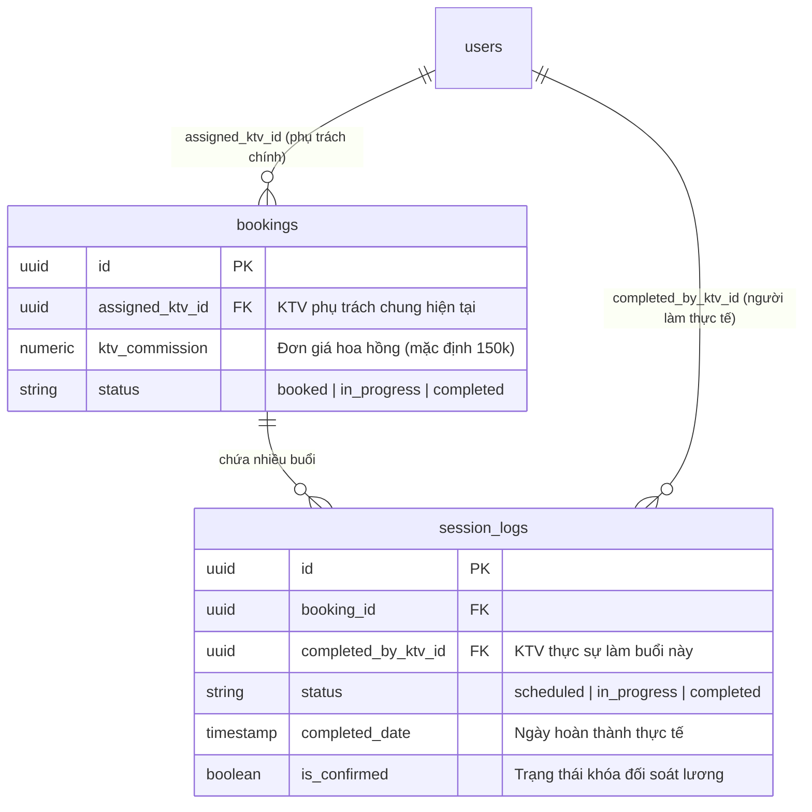

# 👥 ĐẶC TẢ TỔNG HỢP: QUẢN LÝ NHÂN SỰ, CHẤM CÔNG, ĐỔI CA & TÍNH LƯƠNG HOA HỒNG KTV
**Hệ thống**: Bella Spa ERP  
**Mã tài liệu**: BELLA-SPA-HR-KTV-SPEC  
**Phiên bản**: v2.0 (Bản tổng hợp tối ưu hóa)  
**Ngày lập**: 29/05/2026  
**Trạng thái**: 🟢 ĐÃ DUYỆT & VẬN HÀNH THỰC TẾ  

---

## 📋 MỤC LỤC
1. [1. Quy trình Đổi KTV & Tính lương Hoa hồng thực tế](#1-quy-trình-đổi-ktv--tính-lương-hoa-hồng-thực-tế)
2. [2. Quy trình Xin nghỉ phép & Điều chuyển ca tự động](#2-quy-trình-xin-nghỉ-phép--điều-chuyển-ca-tự-động)
3. [3. Hệ thống Đánh giá KPI & Thưởng sao KTV](#3-hệ-thống-đánh-giá-kpi--thưởng-sao-ktv)
4. [4. Chấm công GPS & Ràng buộc RLS an toàn](#4-chấm-công-gps--ràng-buộc-rls-an-toàn)

---

## 1. Quy trình Đổi KTV & Tính lương Hoa hồng thực tế

Trong quá trình vận hành thực tế tại các chi nhánh Bella Spa, phát sinh nghiệp vụ **thay đổi Kỹ thuật viên (KTV) giữa chừng** khi khách hàng đang thực hiện một gói liệu trình nhiều buổi (ví dụ: gói 10 buổi). 

Để giải quyết triệt để bài toán phân bổ hoa hồng, hệ thống đã phân tách độc lập giữa **Hợp đồng (Booking)** và **Lịch sử buổi trị liệu thực tế (Session Logs)**.



### Quy trình các bước thực tế:
* **Bước 1: Phân công ban đầu**: Hợp đồng được tạo với KTV phụ trách chính ban đầu `bookings.assigned_ktv_id` (ví dụ: KTV A).
* **Bước 2: KTV A thực hiện ca**: KTV A check-in trên Mobile. Hệ thống tự động ghi nhận `session_logs.completed_by_ktv_id = KTV A`.
* **Bước 3: Đổi KTV phụ trách (KTV B)**: Admin thay đổidropdown KTV phụ trách trên màn hình chi tiết khách hàng. Hệ thống lưu `bookings.assigned_ktv_id = KTV B`.
  > [!IMPORTANT]
  > Quyết định này chỉ thay đổi các buổi chưa diễn ra. Các buổi đã hoàn thành trước đó (Buổi 1, 2) trong bảng `session_logs` **hoàn toàn giữ nguyên**, đảm bảo KTV cũ vẫn nhận đủ hoa hồng cho phần công sức của mình.
* **Bước 4: KTV B thực hiện các ca sau**: Các ca sau tự động ghi nhận `completed_by_ktv_id = KTV B`.

### Quy đổi số ca làm việc theo gói dịch vụ (Session Multipliers):
Để phản ánh chính xác công sức của KTV khi thực hiện các gói dịch vụ có thời gian lâu hơn và yêu cầu chuẩn bị đồ đạc phức tạp hơn, hệ thống áp dụng hệ số quy đổi ca tự động từ cột `session_multiplier` của bảng `packages`:
* **Gói Combo Tiết Kiệm (hoặc gói cơ bản)**: Hệ số **1.0** (1 buổi hoàn thành = 1.0 ca làm việc).
* **Gói Combo Hạnh Phúc**: Hệ số **1.5** (1 buổi hoàn thành = 1.5 ca làm việc).
* **Gói Combo VIP Toàn Diện**: Hệ số **2.0** (1 buổi hoàn thành = 2.0 ca làm việc).

Số ca chốt lương (`total_sessions`) của KTV được lưu trữ dưới dạng số thập phân `NUMERIC(5,2)` thay vì số nguyên để bảo toàn độ chính xác tuyệt đối (ví dụ: KTV làm 5 ca VIP và 3 ca Hạnh Phúc sẽ được tính tổng cộng $5 \times 2.0 + 3 \times 1.5 = 14.5$ ca).

### Công thức tính hoa hồng chốt lương cuối tháng:
$$\text{Hoa hồng tháng} = \sum_{j=1}^{N} \left( \text{Đơn giá hoa hồng ca làm}_j \times \text{Hệ số quy đổi gói}_j \right)$$
*(Trong đó $N$ là tổng số buổi làm thực tế, đơn giá hoa hồng ca làm lấy từ `bookings.ktv_commission`, và hệ số quy đổi gói dịch vụ được tra cứu trực tiếp từ bảng `packages` thông qua tên gói).*

---

## 2. Quy trình Xin nghỉ phép & Điều chuyển ca tự động

Để đáp ứng linh hoạt thực tế vận hành khi KTV nghỉ phép đột xuất hoặc nghỉ phép năm, hệ thống tích hợp phân hệ Quản lý nghỉ phép và Tự động rà soát điều chuyển ca.

### Kiến trúc database bảng `staff_leaves`:
```sql
CREATE TABLE staff_leaves (
    id UUID PRIMARY KEY DEFAULT gen_random_uuid(),
    user_id UUID REFERENCES users(id) ON DELETE CASCADE,
    leave_date DATE NOT NULL,
    leave_type VARCHAR(20) NOT NULL, -- 'full_day' | 'morning' | 'afternoon'
    reason TEXT,
    status VARCHAR(20) NOT NULL DEFAULT 'pending', -- 'pending' | 'approved' | 'rejected'
    approved_by UUID REFERENCES users(id),
    created_at TIMESTAMP WITH TIME ZONE DEFAULT timezone('utc'::text, now()) NOT NULL,
    updated_at TIMESTAMP WITH TIME ZONE DEFAULT timezone('utc'::text, now()) NOT NULL
);
```

### Quy trình nghiệp vụ:
1. **KTV đăng ký nghỉ**: Chọn ngày nghỉ, buổi nghỉ (Cả ngày, Ca sáng, Ca chiều), điền lý do và gửi duyệt qua KTV Portal.
2. **Conflict Resolution (Giải quyết trùng ca)**:
   * Nếu ngày xin nghỉ của KTV có ca làm đã được xếp trước đó, hệ thống sẽ cảnh báo xung đột lịch.
   * Admin bấm **"Xử lý trùng lịch"**, hệ thống gợi ý các KTV rảnh cùng chi nhánh và có thể làm thay thế.
   * Admin chọn KTV thay thế và duyệt đơn. Hệ thống tự động chuyển ca làm sang cột của KTV làm thay trên Timeline.
3. **Phân bổ tài chính**:
   * KTV làm thay nhận **100% Hoa hồng thực hiện ca** (Service commission) của buổi đó.
   * KTV chính nghỉ nhận **0đ** hoa hồng ca đó.

---

## 3. Hệ thống Đánh giá KPI & Thưởng sao KTV

Bella Spa áp dụng quy trình đánh giá chất lượng dịch vụ cực kỳ khắt khe từ phía khách hàng để khuyến khích KTV nâng cao tay nghề:

* **Trigger đánh giá tự động**: Ngay khi KTV hoàn thành ca làm và check-out, khách hàng sẽ nhận được liên kết bảo mật 1-click dẫn tới Cổng thông tin (Portal) của mình để gửi đánh giá chất lượng.
* **Mã hóa bảo mật ý kiến phản hồi**:
  - Bình luận chi tiết của khách hàng (`note` trong bảng `session_reviews`) được mã hóa AES-256 trên server.
  - KTV chỉ có thể xem số điểm trung bình (Sao) của mình nhưng **hoàn toàn bị chặn không được xem comment ý kiến đóng góp nhạy cảm** của khách hàng (lọc bỏ qua RLS). Điều này bảo vệ sự riêng tư tuyệt đối cho khách hàng và tránh xung đột tâm lý giữa KTV & Khách hàng.
* **Công thức thưởng KPI**:
  - Điểm hài lòng trung bình (CSAT) của KTV đạt $\ge 4.8$ sao $\rightarrow$ Thưởng sao KPI cuối tháng.
  - Điểm CSAT $< 4.0$ sao hoặc có vi phạm trễ ca $\rightarrow$ Trừ điểm KPI hoặc hạ bậc thưởng.

---

## 4. Chấm công GPS & Ràng buộc RLS an toàn

Để chống hiện tượng chấm công khống hoặc làm sai địa chỉ, Bella Spa ERP bắt buộc định vị GPS hai đầu:

* **GPS Check-in/out:** 
  - KTV khi bắt đầu ca và kết thúc ca làm bắt buộc phải cho phép Mobile browser gọi GPS định vị tọa độ thực tế (`checkin_lat`/`checkin_lon`).
  - Hệ thống so khớp tọa độ này với tọa độ nhà khách hàng đăng ký trên hợp đồng. Nếu sai lệch $> 500m$, hệ thống tự động gắn cờ cảnh báo *"Sai lệch địa điểm"* để Admin rà soát kiểm tra.
* **An toàn dữ liệu & Quyền RLS**:
  - Bảng `shifts` và `attendance` được bật Row Level Security (RLS). KTV chỉ được phép truy vấn và chỉnh sửa (Check-in/out) các ca làm việc được chỉ định cho chính mình.
  - Admin có toàn quyền giám sát trạng thái trực tuyến (Real-time WebSockets) của tất cả KTV trên timeline bản đồ.
