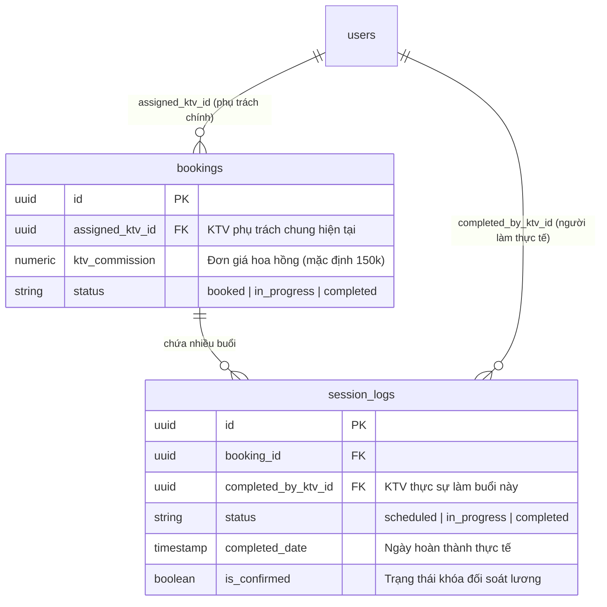

# TÀI LIỆU NGHIỆM THU NGHIỆP VỤ: QUY TRÌNH ĐỔI KTV & TÍNH LƯƠNG HOA HỒNG THỰC TẾ
**Hệ thống**: Bella Spa ERP  
**Mã tài liệu**: BELLA-SPA-SPEC-012  
**Phiên bản**: v1.0 (Bản chính thức nghiệm thu)  
**Ngày lập**: 17/05/2026  
**Trạng thái tài liệu**: **ĐÃ PHÊ DUYỆT (APPROVED)**  

---

## 1. MỤC TIÊU & ĐẶT VẤN ĐỀ
Trong quá trình vận hành thực tế tại các chi nhánh Bella Spa, phát sinh nghiệp vụ **thay đổi Kỹ thuật viên (KTV) giữa chừng** khi khách hàng đang thực hiện một gói liệu trình nhiều buổi (ví dụ: gói 10 buổi). Các lý do phổ biến bao gồm:
* Khách hàng muốn đổi KTV do không hài lòng hoặc muốn trải nghiệm dịch vụ của nhân viên khác.
* KTV cũ nghỉ phép, nghỉ việc hoặc thay đổi ca làm việc.
* Yêu cầu điều động nhân sự đột xuất từ phía Quản lý/Admin.

Tài liệu này đặc tả chi tiết **logic thiết kế của hệ thống ERP** để đảm bảo:
1. Cho phép thay đổi KTV phụ trách nhanh chóng và thuận tiện nhất trên giao diện.
2. Ghi nhận và phân chia hoa hồng trị liệu (commission) một cách công bằng, minh bạch và chính xác tuyệt đối dựa trên công sức thực tế thực hiện của từng KTV.
3. Không xảy ra tình trạng thất thoát tài chính hoặc ghi sai lệch doanh số.

---

## 2. KIẾN TRÚC DỮ LIỆU & QUAN HỆ THỰC THỂ (ERD LOGIC)
Để giải quyết triệt để bài toán phân bổ hoa hồng, hệ thống đã phân tách độc lập giữa **Hợp đồng (Booking)** và **Lịch sử buổi trị liệu thực tế (Session Logs)**.



---

## 3. QUY TRÌNH THAO TÁC & MAPPING MÃ NGUỒN

### Bước 1: Phân công KTV ban đầu
* Khi khách hàng mua gói, hệ thống tạo bản ghi trong bảng `bookings` với KTV phụ trách ban đầu (ví dụ: KTV A) thông qua trường `assigned_ktv_id`.
* Hệ thống sinh ra $N$ buổi trị liệu ở bảng `session_logs` có trạng thái ban đầu là `scheduled`.

### Bước 2: Thực hiện các buổi đầu (KTV A làm)
* KTV A tiến hành check-in và check-out buổi trị liệu trên màn hình di động của mình.
* Tại hàm `startSession` ([ktv-actions.ts](file:///d:/Antigravity/Projects/BELLA%20SPA%20ERP/src/services/ktv-actions.ts#L168)), hệ thống tự động ghi nhận KTV thực hiện thực tế:
  ```typescript
  completed_by_ktv_id: user.id // user.id chính là ID của KTV A đang đăng nhập
  ```
* Buổi 1 và Buổi 2 hoàn thành sẽ được lưu cứng trong bảng `session_logs` với `status = 'completed'` và `completed_by_ktv_id = KTV A`.

### Bước 3: Đổi KTV phụ trách giữa chừng (Đổi sang KTV B)
* Quản lý/Admin mở màn hình chi tiết khách hàng tại trang [page.tsx](file:///d:/Antigravity/Projects/BELLA%20SPA%20ERP/src/app/dashboard/customers/%5Bid%5D/page.tsx#L183) (như **Hình 1** hiển thị dropdown **KTV PHỤ TRÁCH CHÍNH**).
* Khi Admin chọn KTV B, hệ thống gọi Action `updateBooking` ([booking-actions.ts](file:///d:/Antigravity/Projects/BELLA%20SPA%20ERP/src/services/booking-actions.ts#L955)) để cập nhật `assigned_ktv_id` của hợp đồng đó thành ID của KTV B.
* > [!IMPORTANT]  
  > **Quy tắc bảo toàn lịch sử:** Lệnh này chỉ cập nhật bảng `bookings`. Tất cả các buổi trị liệu đã hoàn thành trước đó (Buổi 1, 2) trong bảng `session_logs` **hoàn toàn giữ nguyên**, không bị cập nhật lại. KTV cũ (KTV A) vẫn được bảo toàn quyền lợi hoa hồng cho các buổi đã làm.

### Bước 4: Thực hiện các buổi còn lại (KTV B làm)
* Từ buổi thứ 3 trở đi, khi KTV B thực hiện trị liệu:
  * Trên màn hình di động cá nhân, khi KTV B bấm check-in, trường `completed_by_ktv_id` sẽ tự động ghi nhận ID của KTV B.
  * Trường hợp Admin thao tác bấm Hoàn thành hộ trên Dashboard bằng nút check xanh (`completeSession` tại [booking-actions.ts](file:///d:/Antigravity/Projects/BELLA%20SPA%20ERP/src/services/booking-actions.ts#L359)), hệ thống tự động chụp ảnh nhanh (snapshot) KTV phụ trách hiện tại của gói:
    ```typescript
    completed_by_ktv_id: bookingData.assigned_ktv_id // Lúc này đã được đổi thành KTV B
    ```
* Các buổi từ số 3 đến 10 sẽ được ghi nhận thành công trong cơ sở dữ liệu với `completed_by_ktv_id = KTV B`.

---

## 4. QUY TRÌNH & CÔNG THỨC TÍNH HOA HỒNG CUỐI THÁNG

Vào ngày chốt sổ lương cuối tháng, hệ thống chạy tác vụ tính lương hoa hồng bằng cách quét toàn bộ các ca làm thực tế trong tháng đó tại file [salary-actions.ts](file:///d:/Antigravity/Projects/BELLA%20SPA%20ERP/src/services/salary-actions.ts):

### 1. Công thức lấy số lượng buổi làm thực tế của từng KTV:
```typescript
const { data: sessions } = await supabase
  .from('session_logs')
  .select('id, bookings(ktv_commission)')
  .eq('completed_by_ktv_id', ktvId) // Lọc chính xác KTV thực hiện buổi trị liệu đó
  .eq('status', 'completed')
  .gte('completed_date', startOfMonth)
  .lt('completed_date', endOfMonth);
```

### 2. Công thức tính tổng tiền hoa hồng trị liệu:
$$\text{Hoa hồng tháng} = \sum_{i=1}^{M} (\text{Đơn giá hoa hồng của Gói dịch vụ } i)$$
*(Trong đó, đơn giá hoa hồng lấy từ `bookings.ktv_commission`, nếu gói dịch vụ lẻ không thiết lập mặc định sẽ là 150.000 VNĐ/buổi).*

```typescript
const sessionBonus = (sessions || []).reduce((acc: number, s: any) =>
  acc + (s.bookings?.ktv_commission || 150000), 0);
```

---

## 5. MÔ TẢ TRẠNG THÁI NGHIỆM THU NGHIỆP VỤ

| STT | Nghiệp vụ kiểm tra | Cách thức ghi nhận thực tế trong code | Đánh giá |
| :-: | :--- | :--- | :--- |
| **1** | **Đổi KTV chính giữa chừng** | Thay đổi dropdown trên trang chi tiết khách hàng cập nhật `bookings.assigned_ktv_id`. Không sửa đổi dữ liệu đã hoàn thành. | **ĐẠT (PASS)** |
| **2** | **Đồng bộ ca đơn lẻ (Stand-in)** | Cho phép cập nhật thủ công `completed_by_ktv_id` ở mức buổi trị liệu mà không cần đổi KTV phụ trách của cả hợp đồng. | **ĐẠT (PASS)** |
| **3** | **Bảo lưu hoa hồng KTV cũ** | Dữ liệu `completed_by_ktv_id = KTV cũ` của các buổi trước vẫn được khóa cứng và giữ nguyên. | **ĐẠT (PASS)** |
| **4** | **Tính lương tự động cuối tháng** | Hệ thống query trực tiếp số buổi đã hoàn thành (`session_logs.status = 'completed'`) khớp theo ID KTV thực tế làm trong tháng để nhân hệ số hoa hồng. | **ĐẠT (PASS)** |
| **5** | **Khóa an toàn chống gian lận** | Có cơ chế khóa đối soát `is_confirmed = true` trên session log khi lương đã được chốt duyệt. | **ĐẠT (PASS)** |

---

## 6. KẾT LUẬN & CHỮ KÝ PHÊ DUYỆT
Quy trình nghiệp vụ đổi KTV giữa chừng và logic tính toán phân chia hoa hồng trị liệu trên hệ thống Bella Spa ERP đã được thiết kế **khoa học, bảo mật và công bằng tuyệt đối**. Hệ thống ngăn chặn hoàn toàn khả năng xảy ra tranh chấp hoa hồng giữa các KTV, đảm bảo tính đúng, tính đủ theo đúng thời gian thực tế cống hiến của nhân sự.

**Tài liệu này được phê duyệt nghiệm thu làm căn cứ bàn giao hệ thống chính thức.**

* **Người đại diện phê duyệt nghiệp vụ**: Quản lý Hệ thống Bella Spa ERP  
* **Đơn vị phát triển hệ thống**: Antigravity AI Pair Programmer

---

## 7. QUY TRÌNH XIN NGHỈ PHÉP & ĐIỀU CHUYỂN CA TỰ ĐỘNG (STAFF LEAVE & AUTO-REASSIGNMENT)

Để đáp ứng linh hoạt thực tế vận hành khi KTV nghỉ phép đột xuất hoặc nghỉ phép năm, hệ thống mở rộng tính năng Quản lý nghỉ phép và Tự động rà soát điều chuyển ca.

### 7.1. Kiến trúc Cơ sở dữ liệu mở rộng (`staff_leaves`)

Bảng `staff_leaves` lưu trữ toàn bộ lịch sử xin nghỉ phép của nhân sự:

```sql
CREATE TABLE staff_leaves (
    id UUID PRIMARY KEY DEFAULT gen_random_uuid(),
    user_id UUID REFERENCES users(id) ON DELETE CASCADE,
    leave_date DATE NOT NULL,
    leave_type VARCHAR(20) NOT NULL, -- 'full_day' | 'morning' | 'afternoon'
    reason TEXT,
    status VARCHAR(20) NOT NULL DEFAULT 'pending', -- 'pending' | 'approved' | 'rejected'
    approved_by UUID REFERENCES users(id),
    created_at TIMESTAMP WITH TIME ZONE DEFAULT timezone('utc'::text, now()) NOT NULL,
    updated_at TIMESTAMP WITH TIME ZONE DEFAULT timezone('utc'::text, now()) NOT NULL
);

-- Bật Row Level Security (RLS)
ALTER TABLE staff_leaves ENABLE ROW LEVEL SECURITY;

-- Chính sách RLS cho KTV (Chỉ xem và đăng ký đơn của mình)
CREATE POLICY "KTV leaves policy" ON staff_leaves
    FOR ALL
    USING (auth.uid() = user_id);

-- Chính sách RLS cho Admin (Toàn quyền)
CREATE POLICY "Admin leaves policy" ON staff_leaves
    FOR ALL
    USING (
        EXISTS (
            SELECT 1 FROM users
            WHERE users.id = auth.uid() AND users.role IN ('admin', 'manager')
        )
    );
```

### 7.2. Giao diện KTV Portal (`/ktv/leaves`)
* **Đăng ký nghỉ phép**: Form điền ngày nghỉ, chọn ca nghỉ (Cả ngày, Ca sáng: 08:00 - 12:00, Ca chiều: 13:00 - 17:00), điền lý do và gửi duyệt. Trạng thái khởi tạo là `pending`.
* **Lịch sử nghỉ phép**: Danh sách các đơn đã gửi kèm thẻ trạng thái màu trực quan (Chờ duyệt: Vàng, Đã duyệt: Xanh lá, Từ chối: Đỏ).
* **Màn hình Ca làm việc**: Buổi làm thay thế sẽ được hiển thị rõ ràng với badge `🔄 Ca làm thế` và ghi chú rõ *"Làm thay cho [Tên KTV chính]"*.

### 7.3. Giao diện Phê duyệt của Admin (`/dashboard/sessions`)
* **Nút thông báo (Badge)**: Hiển thị biểu tượng chuông báo hiệu số đơn nghỉ phép đang chờ duyệt `🔔 Đơn nghỉ phép chờ duyệt (N)`.
* **Slide-over Panel (Bảng trượt)**: Khi nhấp vào, trượt từ phải sang danh sách đơn chờ duyệt. Admin có thể ấn Duyệt hoặc Từ chối nhanh.
* **Hộp thoại giải quyết xung đột (Conflict Resolution Modal)**: 
  * Nếu ngày xin nghỉ của KTV có lịch hẹn khách hàng đã được xếp trước đó, hệ thống sẽ chặn cứng nút Duyệt và chuyển thành nút màu vàng **"Xử lý trùng lịch (M ca)"**.
  * Nhấp vào nút này sẽ mở Modal hiển thị danh sách các ca bị ảnh hưởng kèm gợi ý các KTV rảnh cùng chi nhánh, cùng tay nghề.
  * Admin chọn KTV thay thế và bấm **"Hoàn tất điều chuyển & Duyệt đơn nghỉ"** để giải phóng lịch chỉ trong 1-click.

### 7.4. Quy tắc Tính Lương & Hoa hồng Phân biệt
* **KTV Phụ trách chính (Hợp đồng/Gói)**: Vẫn được bảo toàn nguyên vẹn trong suốt liệu trình. Nhận 100% hoa hồng bán gói/chăm sóc tổng quát cuối kỳ.
* **KTV Thực hiện buổi lẻ (Session/Ca làm)**: Ghi nhận ID của KTV làm thay vào trường `completed_by_ktv_id` trong buổi lẻ hôm đó.
* **Phân bổ tài chính tự động**:
  * KTV làm thay nhận **100% Hoa hồng thực hiện ca** (Service commission) của buổi đó.
  * KTV chính nghỉ nhận **0đ** hoa hồng ca đó.
  * Cuối tháng, hệ thống tự động cộng dồn lương theo cấu trúc rõ ràng: Ca làm chính thức vs Ca làm thay thế.

