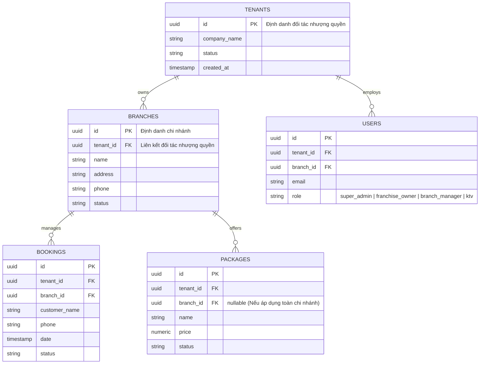

# ĐẶC TẢ KIẾN TRÚC & THIẾT KẾ: HỆ THỐNG CHI NHÁNH & NHƯỢNG QUYỀN
## Dự án: Bella Spa ERP

Tài liệu này lưu trữ toàn bộ phân tích nghiệp vụ, kiến trúc dữ liệu và thiết kế giao diện để phục vụ cho việc triển khai hai mô hình: **Chuỗi chi nhánh trực thuộc (Multi-Branch)** và **Nhượng quyền thương hiệu (Franchise)** trên nền tảng Bella Spa ERP.

---

## 1. SO SÁNH VẬN HÀNH & KỸ THUẬT UNDER THE HOOD

| Tiêu chí | Mô hình Chi nhánh trực thuộc (Chain) | Mô hình Nhượng quyền (Franchise - SaaS) |
| :--- | :--- | :--- |
| **Quyền sở hữu** | Một pháp nhân công ty sở hữu 100% tất cả chi nhánh. | Nhiều pháp nhân công ty độc lập (Chủ đầu tư nhượng quyền). |
| **Dòng tiền thanh toán** | Toàn bộ doanh thu đổ về 1 tài khoản ngân hàng / cổng thanh toán tổng của bạn. | Doanh thu đổ thẳng về tài khoản ngân hàng / cổng thanh toán riêng của từng chủ nhượng quyền. |
| **Giá cả dịch vụ** | Đồng nhất toàn hệ thống. Cấu hình tập trung tại văn phòng tổng. | Có quyền điều chỉnh linh hoạt theo khu vực (Ví dụ: giá ở Hà Nội khác giá ở Đà Nẵng). |
| **Bảo mật dữ liệu** | Dùng chung dữ liệu khách hàng, KTV, kho vận để dễ dàng luân chuyển và điều phối nhân sự. | Cách ly dữ liệu khách hàng và tài chính tuyệt đối (Data Isolation) để bảo đảm quyền sở hữu tài sản của chủ đầu tư. |
| **Quản lý nhân sự** | Một công thức tính lương và chi trả tập trung. | Mỗi chủ nhượng quyền tự thiết lập công thức tính lương, hoa hồng KTV và tự chi trả. |

---

## 2. THIẾT KẾ GIAO DIỆN (UI/UX SPECIFICATION)

### A. Giao diện Người dùng (Landing Page & Booking)
* **Bộ chọn chi nhánh (Branch Selector)**: Tích hợp Dropdown/Modal tại thanh điều hướng và biểu mẫu đặt lịch để khách hàng chọn cơ sở thuận tiện nhất.
* **Định tuyến thanh toán**: Khi thanh toán trả trước trực tuyến:
  * *Chi nhánh thường*: Cổng thanh toán kết nối Merchant Account của tổng công ty.
  * *Chi nhánh nhượng quyền*: Định tuyến qua API key cổng thanh toán của chủ nhượng quyền đó.

### B. Bảng điều khiển Quản trị (Admin ERP Dashboard)
* **Bento Grid Dashboard**: Tích hợp thống kê trực quan lượng lấp đầy giường/phòng theo thời gian thực và biểu đồ cột so sánh hiệu suất doanh thu giữa các chi nhánh.
* **Bộ chuyển đổi chi nhánh (Global Switcher)**: Dropdown ở vị trí cao nhất trên Navbar cho phép Admin chuyển đổi bộ lọc dữ liệu nhanh.

> **Tham khảo bản vẽ Mockup giao diện thực tế của Bella Spa:**
> 

---

## 3. KIẾN TRÚC DỮ LIỆU & PHÂN QUYỀN (SUPABASE DATABASE & RLS)

Để vận hành đồng thời hoặc chuyển đổi linh hoạt giữa 2 mô hình trên cùng **một bộ mã nguồn duy nhất (Single Codebase)**, cơ sở dữ liệu Supabase được thiết kế phân tầng:



### Chính sách bảo mật hàng (Row Level Security - RLS) của Supabase

```sql
-- 1. Kích hoạt RLS cho bảng lịch hẹn (bookings)
ALTER TABLE bookings ENABLE ROW LEVEL SECURITY;

-- 2. Chính sách dành cho Chủ nhượng quyền / Quản lý chi nhánh
-- Chỉ cho phép đọc/ghi dữ liệu lịch hẹn thuộc về tenant_id của họ
CREATE POLICY "Franchise Data Isolation Policy" ON bookings
    FOR ALL
    TO authenticated
    USING (
        tenant_id = (SELECT tenant_id FROM users WHERE id = auth.uid())
    )
    WITH CHECK (
        tenant_id = (SELECT tenant_id FROM users WHERE id = auth.uid())
    );

-- 3. Chính sách dành cho Super Admin (Bella Spa Head Office)
-- Có quyền truy cập không giới hạn để kiểm tra tiêu chuẩn và thu phí nhượng quyền
CREATE POLICY "Super Admin Global Access Policy" ON bookings
    FOR ALL
    TO authenticated
    USING (
        (SELECT role FROM users WHERE id = auth.uid()) = 'super_admin'
    );
```

---

## 4. KẾ HOẠCH TRIỂN KHAI TỪNG BƯỚC (STEP-BY-STEP IMPLEMENTATION PLAN)

### Bước 1: Mở rộng Cơ sở dữ liệu (Database Migration)
1. Tạo bảng `tenants` và `branches`.
2. Bổ sung các trường `tenant_id` và `branch_id` vào các bảng hiện có: `users`, `packages`, `bookings`, `inventory`, `transactions`.
3. Tạo quan hệ khóa ngoại (Foreign Keys).

### Bước 2: Thiết lập Tường lửa Bảo mật (Supabase RLS & Auth)
1. Thêm metadata `tenant_id` và `branch_id` vào JSON Web Token (JWT) của Supabase Auth để tối ưu hiệu năng kiểm tra chính sách.
2. Viết các câu lệnh SQL khởi tạo chính sách RLS ngăn chặn rò rỉ dữ liệu chéo giữa các bên nhượng quyền.

### Bước 3: Cấu hình Định tuyến Thanh toán (Payment Routing)
1. Tạo bảng `payment_configurations` lưu trữ cổng kết nối MoMo/VNPAY/Bank Transfer cho từng `tenant_id` hoặc `branch_id`.
2. Viết Helper Function tại Backend để lấy thông tin thanh toán tương ứng với chi nhánh khách hàng chọn trước khi gọi cổng API thanh toán.

### Bước 4: Tích hợp Giao diện người dùng (UI Integration)
1. **Landing Page**: Thêm bộ chọn chi nhánh toàn cục và lưu lựa chọn vào `localStorage` hoặc `cookie` để duy trì trải nghiệm.
2. **Dashboard ERP**:
   * Thêm component `BranchSwitcher` tại Navbar cho phép Admin lọc nhanh dữ liệu.
   * Cập nhật các câu lệnh truy vấn dữ liệu từ client-side thêm điều kiện `.eq('branch_id', activeBranch)` hoặc `.eq('tenant_id', activeTenant)`.
