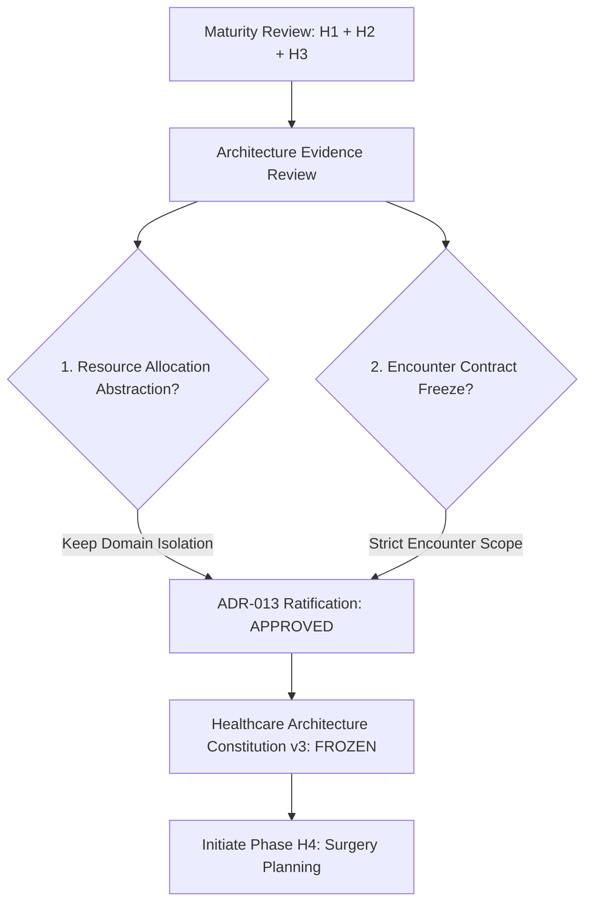

# Architecture Evidence Review: Resource Allocation & Encounter Contract

This review establishes the empirical architectural evidence required to finalize **Baseline v3** and transition the platform from vertical implementation to rigorous platform governance.

---

## 1. Resource Allocation Abstraction Audit

We audited the three resource allocation implementations developed across H1, H2, and H3:
1. **Bed** (`bed-engine`)
2. **EmergencyBay** (`emergency-engine`)
3. **ICU Bed** (represented as `bedId` reference within the `IcuStay` aggregate root in `icu-engine`)

### Evaluation across 4 structural dimensions:

| Dimension | Bed (`bed-engine`) | EmergencyBay (`emergency-engine`) | ICU Bed (`icu-engine` / `IcuStay`) |
| :--- | :--- | :--- | :--- |
| **Business Invariant** | At most 1 active occupancy. Cannot allocate occupied, reserved, or maintenance beds. | Simple availability check. Can only allocate if status is `AVAILABLE`. | Single-allocation constraint governed at the `IcuStay` aggregate level. |
| **Lifecycle States** | `available`, `occupied`, `reserved`, `cleaning`, `maintenance` | `AVAILABLE`, `OCCUPIED`, `MAINTENANCE` | Stateless (availability derived from active stays in `hc_icu_beds`) |
| **Domain Ownership** | Owned fully by `bed-engine`. | Owned fully by `emergency-engine`. | Derived reference within the `icu-stay` aggregate. |
| **Transactional Bounds** | Allocations happen during admissions. Releases move status to `cleaning`, requiring an explicit command `markCleaned` to transition back to `available`. | Allocations happen during triage. Releases return slot immediately to `AVAILABLE` (no cleaning stage in domain logic). | Linked to patient ICU stay admission and discharge lifecycles (`DISCHARGED` or `STEPPED_DOWN`). |

### Review Outcome: **DENIED (Keep Bounded Domain Isolation)**
- **Semantic & Lifecycle Discrepancy**: Ward Beds and Emergency Bays have differing lifecycle semantics. Ward beds transition to `cleaning` on release; Emergency Bays transition immediately back to `AVAILABLE`. ICU Beds are managed stateless, mapped directly to clinical stay durations.
- **Ownership Conflict**: Unifying them into a single `PlatformResourceAllocationPrimitive` would force cross-engine coupling and violate **Domain Isolation (ADR-012)**. 
- **Decision**: We will **NOT** create a shared `PlatformResourceAllocationPrimitive` in the Shared Kernel or Common Core. They share a *technical locking mechanism* (optimistic concurrency / conditional DB updates), which is supported by the database layer, but their business rules, lifecycles, and domain ownerships remain strictly isolated within their respective bounded contexts. This prevents premature abstraction and keeps the platform kernel clean.

---

## 2. Encounter Contract Sizing & God Object Audit

We analyzed the shared `Encounter` contract defined in `shared-kernel/types.ts`.

### Risk Assessment:
- If new verticals (like **H4 Surgery/Perioperative**, **H5 Laboratory**, etc.) append fields directly to the shared `Encounter` interface, `Encounter` will rapidly evolve into a bloated **God Object** containing surgical times, lab indicators, pre-op checklists, and anesthesia parameters.
- This would result in structural instability, tight coupling between all vertical engines, and massive regression risk during updates.

### Constitutional Rules Locked for Encounter:
1. **Lifecycle Scope Only**: The shared `Encounter` model in `shared-kernel/types.ts` is strictly frozen. It is only permitted to hold the core clinical session metadata (IDs, general status, period, general location, and diagnosis).
2. **No Vertical-Specific Extensions**: No vertical-specific fields (e.g., anesthesia types, surgical checklists, laboratory collection methods) may be appended directly to the shared `Encounter` interface.
3. **Decoupled Linkage via `encounterId`**: Vertical engines must store their specialized clinical data in their own distinct domain aggregates (e.g., `SurgicalCase` in `surgery-engine`, `IcuStay` in `icu-engine`, `EmergencyAssessment` in `emergency-engine`) referencing `encounterId` as a foreign key. 
4. **Metadata Overload**: If general cross-engine metadata is required, it must be stored in a generic key-value metadata map on the Encounter, not as explicit properties.

---

## 3. Decision Matrix & Gate Approval Status

By completing this Architecture Evidence Review, the board establishes the final gates for **Baseline v3 Ratification**:

### Verification
- **Total Existing Tests:** **`428/428 PASS`**
- **Architecture Boundary Imports:** Checked and certified (`Common Core = 0 external deps`, `Domain Engine direct cross-coupling = 0`).
- **Verdict:** **Baseline v3 officially certified for Ratification.**
