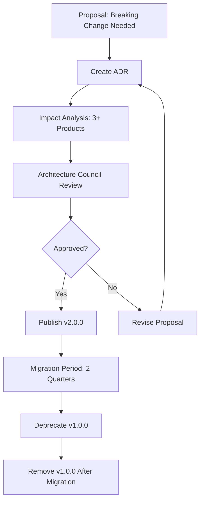

# ADR-003: Beauty Services Platform Formalization Strategy

**Status:** ✅ **APPROVED**  
**Date:** 2026-09-15  
**Approved:** 2026-09-15 (H1 Final Gate Review)  
**Decision Makers:** Architecture Council, Platform Team  
**Context:** H1 Architecture Gate - Beauty-domain capability base exists in Bella Spa, formalization strategy needed

---

## Context

### Background

**H0 Discovery:** Bella Spa contains a **Beauty-domain capability base** with 93.3% coverage for Haircut requirements:
- 14 of 15 Haircut capabilities already implemented
- Database schema: bookings, session_logs, packages, waitlist_entries, booking_resources, beds, rooms, equipment
- Service layer: waitlist-service.ts, booking-decision.service.ts
- Decision engine: auto-assignment-provider.ts, capacity-management-provider.ts, waitlist-management-provider.ts

**Strategic Question:** Should these capabilities be formalized as a **Beauty Services Platform** (sibling to Healthcare OS, Education OS) or remain product-level with shared contracts?

**Planned Beauty Products:**
1. ✅ Bella Spa (launched, production)
2. 🟡 Bella Haircut (Q4 2026)
3. 🟡 Bella Nail (Q1 2027)
4. 🟢 Bella Massage (Q2 2027)

**Note:** Spa, Haircut, Nail, Massage are **products within Beauty Services domain**, NOT separate verticals. Healthcare, Education, Beauty Services are **verticals**.

---

## Decision

**We adopt a THREE-PHASE FORMALIZATION STRATEGY (Rule of Three Validation):**

### Phase 1: Beauty Capability Contracts (NOW - H1)

**Approach:** Extract contracts to **intermediate shared layer** (not platform yet).

**Structure:**
```
src/contracts/beauty/
├── IAppointmentEngine.ts
├── IWaitlistEngine.ts
├── IStaffAssignment.ts
├── IResourceAllocation.ts
├── IServiceCatalog.ts
├── ISessionTracking.ts
├── IDomainEvents.ts
├── IServiceHistory.ts
└── types/
```

**Implementation Location:** Engines remain in **Bella Spa product layer**.

```
src/products/bella-spa/
├── engines/
│   ├── appointment-engine/      (implements IAppointmentEngine)
│   ├── waitlist-engine/         (implements IWaitlistEngine)
│   ├── staff-assignment-engine/ (implements IStaffAssignment)
│   └── ...
└── services/
```

**Ownership:** Architecture Council (interim governance)  
**Status:** Lightweight contracts, no platform overhead

---

### Phase 2: Contract Validation with 3 Products (Haircut + Nail)

**Timeline:**
- **Haircut (Week 4, 2026-Q4):** Validates contracts (2nd product/use case)
- **Nail (Q1 2027):** Validates contracts (3rd product/use case)
- **Rule of Three:** 3 products using contracts = proven reusability within Beauty Services domain

**Validation Criteria:**
- ✅ Contracts stable (no breaking changes for 2+ quarters)
- ✅ 80%+ contract reuse across 3 products (not just Spa + Haircut)
- ✅ Minimal product-specific extensions (contracts are truly generic within beauty domain)
- ✅ Governance proven (breaking change process works)

**Decision Point (After Nail Shop Launch - Q1 2027):** Proceed to Phase 3 if criteria met.

---

### Phase 3: Platform Formalization (Q2 2027 - If Validated)

**Approach:** Promote to **Beauty Services Platform** (formal platform layer).

**Structure:**
```
platform/beauty-services/
├── engines/
│   ├── appointment-engine/
│   ├── waitlist-engine/
│   ├── staff-assignment-engine/
│   ├── resource-allocation-engine/
│   ├── service-catalog-engine/
│   ├── session-tracking-engine/
│   └── lifecycle-events-engine/
├── contracts/
│   └── (move from src/contracts/beauty/)
├── shared-kernel/
│   └── types.ts
├── README.md
└── GOVERNANCE.md
```

**Ownership:** Beauty Services Platform Team (dedicated team)  
**Governance:** Platform-level (ADR required for breaking changes, 3+ product approval within Beauty Services)  
**Status:** Full platform layer (sibling to Healthcare OS, Education OS)

**Promotion Criteria:**
- ✅ Rule of Three validated (3+ products within Beauty Services domain)
- ✅ Contracts stable (2+ quarters, zero breaking changes)
- ✅ Team capacity (dedicated Beauty Platform team formed)
- ✅ Organizational need (platform governance required)
- ✅ Architecture Council approval

---

## Rationale

### Why NOT Formalize as Platform NOW?

**Evidence Supporting "Wait":**

1. **Only 1 Product Proven (Bella Spa)**
   - Haircut hasn't launched yet (not validated)
   - Nail Shop not started (not validated)
   - Massage not planned yet (not validated)
   - **Risk:** Premature abstraction (contracts may not fit all beauty products)

2. **Rule of Three Not Met**
   - Industry best practice: Wait for 3 use cases before extracting platform
   - Healthcare OS had 3 products (Hospital, Clinic, Dental) before formalization
   - Education OS had 3 products (English Center, K-12, University) before formalization
   - **Risk:** Beauty Services Platform may be over-engineered

3. **Organizational Overhead**
   - Platform requires dedicated team (not available yet)
   - Platform requires formal governance (breaking change process, ADRs, versioning)
   - Platform requires Architecture Council oversight (capacity constraint)
   - **Cost:** 2-3 FTE for platform team + governance overhead

4. **Contract Instability Risk**
   - Haircut may reveal contract gaps (Spa-specific assumptions)
   - Nail Shop may need different abstractions (nails ≠ spa ≠ haircut)
   - Massage may diverge further (massage workflows different)
   - **Risk:** Breaking changes after platform formalization (expensive to migrate 3 products)

---

### Why Intermediate Layer (Beauty Capability Contracts)?

**Benefits of Shared Contracts WITHOUT Platform:**

1. **Enables Reuse NOW**
   - Haircut can consume contracts immediately (no waiting for platform)
   - Nail Shop can consume contracts (reuse proven)
   - Zero platform overhead (no team, no governance complexity)

2. **Flexible Iteration**
   - Contracts can evolve quickly (not frozen by platform governance)
   - Breaking changes easier (fewer consumers, less coordination)
   - Learning phase (discover what abstractions work)

3. **Easy Promotion Path**
   - Contracts already defined (move to platform/beauty-services/contracts/)
   - Engines already extracted (move to platform/beauty-services/engines/)
   - Migration is directory move (not rewrite)

4. **Lower Risk**
   - If contracts don't work → iterate quickly (no platform commitment)
   - If verticals diverge → keep product-level (no platform investment wasted)
   - If Rule of Three fails → avoid platform overhead

---

### Why Rule of Three?

**Industry Best Practice:**

> "Don't extract abstraction until you have 3 concrete use cases. Two use cases give you a sense of similarity; three use cases give you a sense of generality."
> — Martin Fowler

**Bella Architecture Precedent:**

1. **Healthcare OS (H1-H12):** Formalized after Hospital, Clinic, Dental **(3 products within Healthcare vertical)**
2. **Education OS:** Formalized after English Center, K-12, University **(3 products within Education vertical)**
3. **Logistics Kernel (E7):** Formalized after Warehouse, English Center logistics, Healthcare supplies **(3 use cases across verticals)**

**Rule of Three Validation for Beauty:**

- **Product 1 (Spa):** Defines capability base (initial implementation)
- **Product 2 (Haircut):** Validates generality (can another product reuse?)
- **Product 3 (Nail):** Confirms platform need (is abstraction truly generic?)

**Decision Point:** After Nail Shop, if contracts stable → formalize platform.

**Terminology Clarity:**
- **Vertical = Domain:** Healthcare, Education, Beauty Services, Logistics (cross-cutting industry domains)
- **Product = Application:** Spa, Haircut, Nail (specific applications within Beauty Services vertical)

---

## Three-Phase Strategy Details

### Phase 1: Beauty Capability Contracts (NOW - H1)

#### Timeline: Week 1-6 (Parallel with Haircut Development)

**Week 1-2: Extract 4 Critical Contracts** (ADR-002 Phase 1)
- IWaitlistEngine, IStaffAssignment, IAppointmentEngine, IResourceAllocation
- Location: `src/contracts/beauty/`
- Ownership: Architecture Council (interim)
- Governance: Lightweight (Contract Registry, semantic versioning)

**Week 3-4: Haircut MVP Consumes Contracts** (ADR-002 Phase 2)
- Haircut validates 4 critical contracts (real use case)
- Feedback loop: Contract issues identified, iterated

**Week 5-6: Extract Remaining 4 Contracts** (ADR-002 Phase 3)
- IServiceCatalog, ISessionTracking, IDomainEvents, IServiceHistory
- Haircut migrates from Spa tables to contracts
- Total: 8 contracts extracted, 2 products consuming (Spa + Haircut)

**Phase 1 Deliverables:**
- ✅ 8 Beauty Capability Contracts defined
- ✅ Contract Registry: Versions, owners, consumers documented
- ✅ 2 products consuming contracts (Spa + Haircut)
- ✅ Contract documentation: Usage examples, migration guides
- ✅ Governance: Breaking change process, versioning rules

**Phase 1 Status at End:** 🟡 **INTERMEDIATE LAYER** (not platform yet)

---

### Phase 2: Contract Validation with Nail Shop (Q1 2027)

#### Timeline: 8-10 weeks (Nail Shop Development)

**Nail Shop Development Plan:**

**Week 1-2: Nail Shop Planning**
- Review Beauty Capability Contracts (8 contracts)
- Identify contract gaps (nail-specific features)
- Assess contract reuse % (target: 80%+)

**Week 3-6: Nail Shop Implementation**
- Consume 8 Beauty Capability Contracts
- Build nail-specific features (nail service types, nail station resources, nail techniques)
- Extend contracts if needed (backward-compatible v1.1.0 additions)

**Week 7-8: Nail Shop Testing + Launch**
- Integration testing: Nail Shop + 8 contracts
- Contract stability assessment: Breaking changes needed?
- Reuse metrics: Actual contract reuse % measured

**Phase 2 Validation Criteria:**

1. **Contract Stability:**
   - ✅ Zero breaking changes for 2+ quarters (Haircut Q4 2026 → Nail Q1 2027)
   - ✅ Minor versions only (v1.1.0, v1.2.0 - backward compatible)
   - ❌ Major version required (v2.0.0) = contracts need redesign

2. **Contract Reuse:**
   - ✅ 80%+ contract reuse across Spa, Haircut, Nail
   - ✅ Minimal product-specific extensions (< 20% custom code per product)
   - ❌ < 60% reuse = contracts too Spa-specific, not generic

3. **Contract Completeness:**
   - ✅ Nail Shop uses 8 contracts (no major gaps)
   - ✅ New contracts = 0-2 (nail-specific only, e.g., INailTechniques)
   - ❌ New contracts = 5+ (contracts incomplete, missing core capabilities)

4. **Governance Proven:**
   - ✅ Breaking change process works (Architecture Council approval functional)
   - ✅ 3 products can coordinate contract changes
   - ❌ Coordination fails = governance too heavyweight

**Phase 2 Deliverables:**
- ✅ Nail Shop launched (3rd product consuming contracts)
- ✅ Contract stability report (breaking changes, versions, reuse %)
- ✅ Validation decision: Proceed to Phase 3 (platform) OR keep intermediate layer

**Decision Point (End of Q1 2027):**
- IF all 4 criteria met → **PROCEED TO PHASE 3** (formalize platform)
- IF 3/4 criteria met → **DEFER 1 QUARTER** (validate with Massage)
- IF < 3 criteria met → **KEEP INTERMEDIATE LAYER** (contracts not ready for platform)

---

### Phase 3: Beauty Services Platform Formalization (Q2 2027 - Conditional)

#### Promotion Criteria (Must Meet ALL)

**1. Rule of Three Validated:**
- ✅ 3+ products consuming contracts (Spa, Haircut, Nail minimum)
- ✅ 80%+ contract reuse across all 3 products
- ✅ Contracts stable (2+ quarters, zero breaking changes)

**2. Organizational Readiness:**
- ✅ Dedicated Beauty Services Platform Team formed (2-3 FTE)
- ✅ Platform governance capacity (Architecture Council bandwidth)
- ✅ Business case approved (platform investment justified)

**3. Technical Maturity:**
- ✅ 8 contracts production-grade (comprehensive tests, documentation)
- ✅ Contract Registry robust (versioning, deprecation, migration tools)
- ✅ Engines extracted from Spa (ready to move to platform/)

**4. Architecture Council Approval:**
- ✅ ADR approved: "Formalize Beauty Services Platform"
- ✅ Promotion roadmap approved (migration plan, timeline, risks)
- ✅ Governance model approved (breaking change process, ownership, versioning)

**IF All Criteria Met → Proceed to Platform Formalization**

---

#### Platform Formalization Plan (8 weeks)

**Week 1-2: Platform Structure Creation**

**Create Platform Directory:**
```
platform/beauty-services/
├── engines/              (move from products/bella-spa/engines/)
├── contracts/            (move from src/contracts/beauty/)
├── shared-kernel/
│   ├── types/
│   ├── errors/
│   └── validators/
├── tests/
│   ├── unit/
│   └── integration/
├── docs/
│   ├── architecture/
│   ├── contracts/
│   └── migration-guides/
├── README.md
├── GOVERNANCE.md
├── CHANGELOG.md
└── package.json
```

**Move Engines:**
- `bella-spa/engines/appointment-engine/` → `platform/beauty-services/engines/appointment-engine/`
- `bella-spa/engines/waitlist-engine/` → `platform/beauty-services/engines/waitlist-engine/`
- (Repeat for 8 engines)

**Move Contracts:**
- `src/contracts/beauty/` → `platform/beauty-services/contracts/`

**Update Imports:**
- Spa: `import { IWaitlistEngine } from '@platform/beauty-services/contracts'`
- Haircut: `import { IWaitlistEngine } from '@platform/beauty-services/contracts'`
- Nail: `import { IWaitlistEngine } from '@platform/beauty-services/contracts'`

---

**Week 3-4: Vertical Migration**

**Migrate Bella Spa:**
- Update imports: `src/contracts/beauty/` → `@platform/beauty-services/contracts/`
- Remove old engines (now in platform)
- Test: 547 Spa regression tests pass

**Migrate Bella Haircut:**
- Update imports: `src/contracts/beauty/` → `@platform/beauty-services/contracts/`
- Test: Haircut integration tests pass

**Migrate Bella Nail:**
- Update imports: `src/contracts/beauty/` → `@platform/beauty-services/contracts/`
- Test: Nail integration tests pass

**Validation:**
- All 3 products consume `@platform/beauty-services` package
- Zero direct engine imports (only contracts)
- CI pipeline green (all tests pass)

---

**Week 5-6: Governance Establishment**

**Create Beauty Services Platform Team:**
- Team Lead: Platform Architect
- Engineers: 2-3 FTE (maintain engines, evolve contracts)
- Ownership: Engine implementations, contract evolution, documentation

**Establish Governance:**
- **Breaking Change Process:**
  - Proposal: Create ADR
  - Impact Analysis: Identify all consumers (3+ products)
  - Approval: Architecture Council + 3+ product teams
  - Migration: Provide v2.0.0 + migration guide
  - Deprecation: 2-quarter timeline for v1.0.0 removal

- **Contract Versioning:**
  - Semantic versioning: MAJOR.MINOR.PATCH
  - MAJOR: Breaking changes (require ADR)
  - MINOR: New methods (backward compatible)
  - PATCH: Bug fixes (no API change)

- **Release Cadence:**
  - Quarterly releases (Q2, Q3, Q4, Q1)
  - Hotfixes: As needed (security, critical bugs)
  - LTS versions: Support 4 quarters

**Document Governance:**
- `GOVERNANCE.md`: Breaking change process, versioning, release cadence
- `CONTRIBUTING.md`: How to propose contract changes, ADR template
- `CHANGELOG.md`: Version history, breaking changes, migration guides

---

**Week 7-8: Documentation + Launch**

**Platform Documentation:**
- Architecture overview: Platform-of-Platforms pattern, Beauty Services Platform role
- Contract reference: 8 contracts, methods, types, examples
- Engine documentation: Implementation details, internal architecture
- Migration guides: How to migrate from intermediate layer to platform
- Best practices: How to consume contracts, extend engines, propose changes

**Platform Launch:**
- Announce Beauty Services Platform (internal communication)
- Training: Product teams on platform consumption, governance
- Monitoring: Contract usage metrics, performance baselines
- Support: Platform team office hours, Slack channel

**Phase 3 Deliverables:**
- ✅ Beauty Services Platform operational (`platform/beauty-services/`)
- ✅ 3 products migrated (Spa, Haircut, Nail)
- ✅ Platform team formed (2-3 FTE)
- ✅ Governance established (breaking change process, versioning)
- ✅ Documentation complete (architecture, contracts, migration guides)

**Phase 3 Status at End:** ✅ **FORMAL PLATFORM** (sibling to Healthcare OS, Education OS)

---

## Governance Model

### Intermediate Layer Governance (Phase 1-2)

**Ownership:** Architecture Council (interim)

**Contract Changes:**
- **Minor changes (v1.x.0):** Architecture Council approval (2 days)
- **Breaking changes (v2.0.0):** Architecture Council + affected products approval (1 week)
- **Process:** Lightweight ADR (1-2 pages, not full ADR-001 format)

**Decision Authority:**
- Architecture Council: Contract design, breaking changes
- Product teams: Feature requests, bug reports
- No dedicated platform team (shared ownership)

**Review Cadence:** Monthly contract review (Architecture Council + product representatives)

---

### Platform Layer Governance (Phase 3)

**Ownership:** Beauty Services Platform Team (dedicated)

**Contract Changes:**
- **Minor changes (v1.x.0):** Platform team approval (autonomous)
- **Breaking changes (v2.0.0):** Architecture Council + 3+ product approval + ADR
- **Process:** Full ADR (ADR-001 format, formal approval)

**Decision Authority:**
- Platform team: Engine implementation, minor contract additions, bug fixes
- Architecture Council: Breaking changes, major architectural decisions
- Product teams: Feature requests, contract extension proposals

**Review Cadence:**
- Quarterly platform review (Architecture Council)
- Monthly product sync (platform team + product representatives)
- Weekly platform team standup (internal)

**Breaking Change Process:**



---

## Risk Assessment

### Risk 1: Premature Platform Formalization

**Severity:** 🔴 Critical  
**Probability:** High (if Phase 3 rushed)  
**Impact:** Rigid contracts, expensive to change, product coupling

**Mitigation:**
1. **Rule of Three:** Wait for 3 products before platform (Phase 2 validation)
2. **Validation Criteria:** 4 objective criteria must be met (not subjective decision)
3. **Intermediate Layer:** Prove contracts work before platform investment
4. **Defer Option:** If validation fails, keep intermediate layer (no platform)

**Contingency:**
- IF Nail Shop reveals contract gaps → Iterate contracts (v1.1.0, v1.2.0)
- IF breaking changes needed → Stay in Phase 2 longer (validate with Massage)
- IF Rule of Three fails → Keep intermediate layer indefinitely (no platform)

---

### Risk 2: Nail Shop Diverges from Contracts

**Severity:** 🟡 High  
**Probability:** Medium  
**Impact:** Contracts not generic, 60% reuse (below 80% target)

**Mitigation:**
1. **Early Contract Review:** Nail Shop team reviews contracts Week 1 (identify gaps)
2. **Backward-Compatible Extensions:** Add v1.1.0 features (not breaking changes)
3. **Nail-Specific Contracts:** Create INailTechniques (product-specific, not shared)
4. **80% Reuse Target:** Measure reuse (if < 80%, don't proceed to Phase 3)

**Contingency:**
- IF < 80% reuse → Keep intermediate layer (contracts not ready for platform)
- IF major redesign needed → Publish v2.0.0 contracts (migrate Spa + Haircut)
- IF divergence severe → Abandon shared contracts (product-specific implementations)

---

### Risk 3: Organizational Resistance to Platform Team

**Severity:** 🟡 High  
**Probability:** Medium  
**Impact:** No dedicated team, platform governance fails

**Mitigation:**
1. **Business Case:** Demonstrate ROI (Nail Shop 50% faster with contracts)
2. **Lightweight Start:** 2-3 FTE (not 10+ FTE), grow as needed
3. **Shared Ownership Initially:** Architecture Council governs until team formed
4. **Validation First:** Prove platform value with 3 products before team investment

**Contingency:**
- IF no team formed → Keep intermediate layer (Architecture Council continues governance)
- IF team delayed → Defer Phase 3 to Q3 2027 (wait for capacity)
- IF team never formed → Intermediate layer becomes permanent (no platform)

---

### Risk 4: Contract Breaking Changes After Platform Formalization

**Severity:** 🔴 Critical  
**Probability:** Low (if Phase 2 validation thorough)  
**Impact:** Expensive migration (3+ products), platform instability

**Mitigation:**
1. **Phase 2 Validation:** 2+ quarters contract stability before platform
2. **Rule of Three:** 3 products stress-test contracts (reveal issues early)
3. **Versioning:** Support v1.x.x + v2.x.x simultaneously (migration period)
4. **Governance:** Breaking changes require Architecture Council + 3+ product approval (high bar)

**Contingency:**
- IF breaking change needed → Publish v2.0.0, 2-quarter migration period
- IF migration fails → Support v1.x.x longer (extend deprecation)
- IF severe issues → Rollback platform (revert to intermediate layer)

---

## Success Metrics

### Phase 1 Success (Week 6, 2026-Q4)

- ✅ 8 Beauty Capability Contracts extracted
- ✅ 2 products consuming contracts (Spa, Haircut)
- ✅ Contract documentation complete
- ✅ Governance lightweight (Contract Registry, versioning)

**Measure:** Contract reuse % (Spa + Haircut) - Target: 70%+

---

### Phase 2 Success (Q1 2027 - After Nail Shop)

- ✅ 3 products consuming contracts (Spa, Haircut, Nail)
- ✅ Contract stability (2+ quarters, zero breaking changes)
- ✅ Contract reuse 80%+ across 3 products
- ✅ Governance proven (breaking change process works)

**Measure:** Validation criteria (4/4 met = proceed to Phase 3)

---

### Phase 3 Success (Q2 2027 - If Platform Formalized)

- ✅ Beauty Services Platform operational
- ✅ 3 products migrated to platform
- ✅ Platform team formed (2-3 FTE)
- ✅ Governance established (ADR-based, formal)
- ✅ Documentation complete (platform-grade)

**Measure:** Platform stability (zero breaking changes for 2 quarters after formalization)

---

### Long-Term Success (Q3-Q4 2027)

- ✅ 4th product (Massage) consumes platform (proves generality)
- ✅ Nail Shop launch 50% faster than Haircut (contract reuse proven)
- ✅ Massage launch 60% faster than Haircut (platform maturity proven)
- ✅ Platform team self-sufficient (no Architecture Council bottleneck)

**Measure:** Time-to-market reduction (each product faster than previous)

---

## Alternatives Considered

### Alternative 1: Formalize Platform NOW (Rejected)

**Approach:** Create `platform/beauty-services/` in H1, extract engines immediately.

**Rejected Because:**
- ⚠️ Only 1 product proven (Spa), Haircut not launched
- ⚠️ Premature abstraction risk (contracts may not fit all beauty products)
- ⚠️ Organizational overhead (dedicated team required immediately)
- ⚠️ Rule of Three not met (best practice violated)
- ⚠️ High cost if contracts fail (platform investment wasted)

---

### Alternative 2: Never Formalize Platform (Rejected)

**Approach:** Keep contracts in `src/contracts/beauty/` indefinitely, no platform layer.

**Rejected Because:**
- ⚠️ Ownership ambiguous (who maintains contracts long-term?)
- ⚠️ Governance unclear (breaking change approval process?)
- ⚠️ No dedicated team (contracts become orphaned)
- ⚠️ Doesn't scale (4+ products need formal platform)
- ⚠️ Platform-of-Platforms architecture incomplete (Beauty Services missing)

---

### Alternative 3: Formalize After 2 Products (Haircut Only) (Rejected)

**Approach:** Formalize platform after Haircut (Q4 2026), skip Nail Shop validation.

**Rejected Because:**
- ⚠️ Rule of Three violated (2 use cases insufficient for generality)
- ⚠️ Healthcare OS precedent (formalized after 3 products, not 2)
- ⚠️ Risk of premature abstraction (Nail Shop may reveal contract gaps)
- ⚠️ Insufficient validation (2 similar products may miss edge cases)

---

## Related Decisions

- **ADR-001:** Core vs Kernel Boundary Definition (Platform-of-Platforms architecture)
- **ADR-002:** Contract Extraction Strategy (phased extraction, 8 contracts)
- **ADR-004:** Walk-in Queue Scope (product feature vs platform primitive)
- **ADR-005:** Service Inventory Source (Logistics Kernel E7 vs custom)
- **H0:** Bella Haircut Capability Reuse Assessment (93.3% capability base exists)
- **H1:** Architecture Gate (Decision 2: Platform formalization strategy)

---

## Approval

**Status:** 🟡 **PROPOSED** - Awaiting Architecture Council approval

**Approval Criteria:**
- [ ] Architecture Council approves 3-phase strategy
- [ ] Product Team accepts timeline (platform Q2 2027, not Q4 2026)
- [ ] Engineering Team accepts intermediate layer approach
- [ ] Platform Team Lead identified (future owner)

**If Approved:**
- Phase 1: Begin contract extraction (Week 1-6, ADR-002)
- Phase 2: Validate with Nail Shop (Q1 2027)
- Phase 3: Formalize platform (Q2 2027, conditional on validation)

**If Rejected:**
- Fallback: Alternative 1 (formalize platform NOW)
- OR Alternative 2 (never formalize, keep intermediate layer)
- Re-assess organizational priorities and risk tolerance

---

## Consequences

### Positive

1. **Risk Mitigation:** Rule of Three validation prevents premature abstraction
2. **Flexibility:** Contracts can iterate quickly in Phase 1-2 (not frozen by platform)
3. **Evidence-Based:** Platform decision based on 3 verticals (not speculation)
4. **Lower Cost:** No platform overhead until proven need (organizational efficiency)
5. **Easy Promotion:** Intermediate layer → platform is directory move (minimal migration)

### Negative

1. **Delayed Platform:** Platform not available until Q2 2027 (6 months after Haircut)
2. **Ambiguous Ownership:** Architecture Council owns contracts interim (not dedicated team)
3. **Governance Lightweight:** Breaking change process less formal (Phase 1-2)

### Neutral

1. **Timeline:** 3-phase approach takes 9 months (H1 → Nail → Platform)
2. **Validation Cost:** Nail Shop investment required before platform decision
3. **Organizational Change:** Platform team formation deferred to Q2 2027

---

**ADR-003 Version:** 1.0.0  
**Date:** 2026-09-15  
**Status:** 🟡 **PROPOSED**  
**Next Review:** After Nail Shop launch (Q1 2027) - Phase 2 validation decision

