# 🏛️ Kiến Trúc Hệ Thống — Bella Spa ERP

> **Stack chính:** Next.js 15 (App Router) · Supabase (PostgreSQL + Auth + Realtime) · Expo React Native · Vercel · Sentry

---

## 1. Toàn Cảnh Monorepo

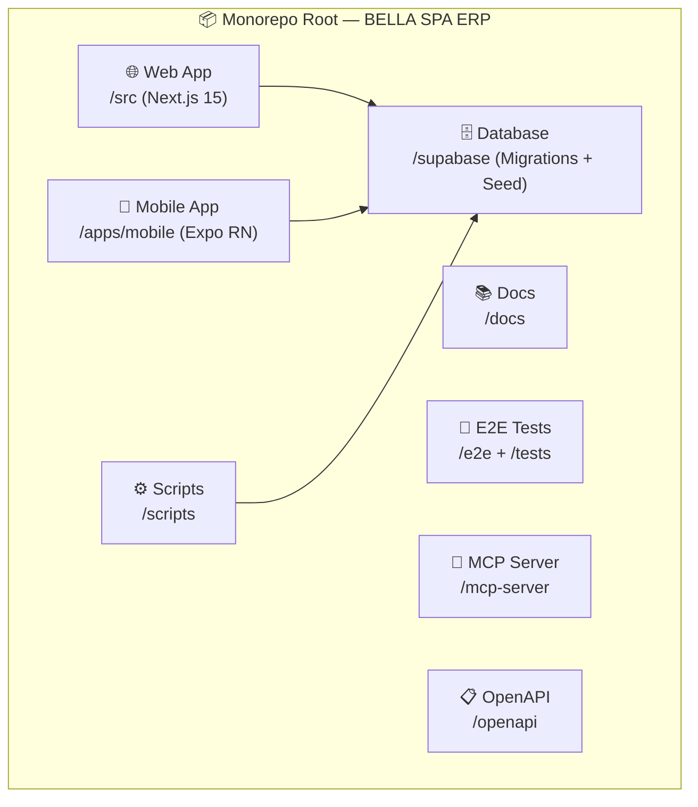

---

## 2. Kiến Trúc Web App (Next.js)

```mermaid
graph TD
    subgraph WEBAPP["🌐 src/ — Next.js 15 App Router"]

        subgraph ROUTES["app/ — Route Groups"]
            AUTH["(auth)/\n🔐 Login · Register · MFA"]
            DASH["dashboard/\n📊 Main ERP Dashboard"]
            HQ["hq/\n🏢 Headquarters Portal"]
            KTV["ktv/\n💆 KTV Mobile Web"]
            PORTAL["portal/\n👤 Customer Self-Service"]
            BOOK["book/\n📅 Public Booking Page"]
            STUDENT["student/\n🎓 Training Portal"]
            BSPA["beauty-spa/\n💅 Beauty Spa Module"]
            API_ROUTES["api/\n🔗 API Routes"]
        end

        subgraph COMPONENTS["components/"]
            COMP_FEATURES["features/\nDomain components"]
            COMP_UI["ui/\nBase UI kit (shadcn)"]
            COMP_LAYOUT["layout/\nShell · Sidebar · Nav"]
            COMP_COMMON["common/\nShared widgets"]
            COMP_PROVIDERS["providers/\nContext providers"]
            COMP_ACCOUNTING["accounting/\nAccounting UI"]
            COMP_ADMIN["admin/\nAdmin UI"]
        end

        subgraph SERVICES["services/ — Business Logic (Server Actions)"]
            SVC_BOOKING["booking-resource-actions\nattendance-actions\npackage-actions"]
            SVC_CUSTOMER["customer-actions\ncrm/\nmarketing/"]
            SVC_FINANCE["finance-actions\nrevenue-recognition\naccounting/\naccounting-engine"]
            SVC_SALARY["ktv-actions\nsalary-reconciliation-actions\nreconciliation-actions"]
            SVC_INVENTORY["inventory-actions\ninventory-transfer-actions\nclearing-actions"]
            SVC_AI["ai/orchestrator\nai/agents/(CFO·CHRO·CMO·CPO·Franchise)"]
            SVC_TENANT["tenant-actions\nonboarding-actions\nfranchise-actions"]
            SVC_SUBSCRIPTION["subscription-actions\nhq-subscription-actions"]
            SVC_TRAINING["training-actions"]
            SVC_NOTIFY["notification-actions\nchat-actions\nportal-chat-actions"]
            SVC_SYSTEM["system-monitor-actions"]
            SVC_APIGATEWAY["api-gateway/"]
        end

        subgraph LIB["lib/ — Utilities"]
            LIB_SUPA["supabase-server\nsupabase-client\nsupabase-admin"]
            LIB_BUSINESS["business-rules/"]
            LIB_ACCOUNTING["accounting-outbox\naccounting-outbox-monitoring"]
            LIB_SECURITY["rate-limit\ncrypto\nmfa\nlog-redactor"]
            LIB_CACHE["*-page-client-cache files"]
            LIB_API["api/ (API helpers)"]
            LIB_MIDDLEWARE["middleware/"]
            LIB_VALIDATION["validation/\nform-validators"]
        end

        subgraph TYPES["types/"]
            T_DB["database.types.ts\n(auto-generated)"]
            T_DOMAIN["domain.ts"]
            T_APIGATEWAY["api-gateway.ts"]
            T_TRAINING["training.ts"]
            T_RPC["rpc.ts"]
        end

        ROUTES --> SERVICES
        ROUTES --> COMPONENTS
        SERVICES --> LIB
        SERVICES --> TYPES
        COMPONENTS --> LIB
    end
```

---

## 3. Route Groups & Vai Trò Người Dùng

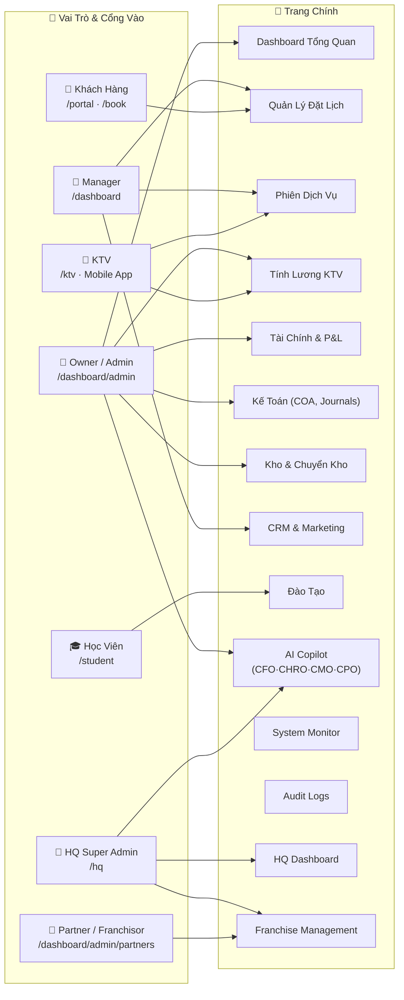

---

## 4. API Layer

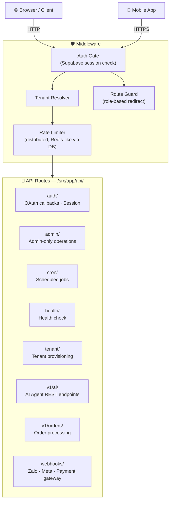

---

## 5. AI Copilot System

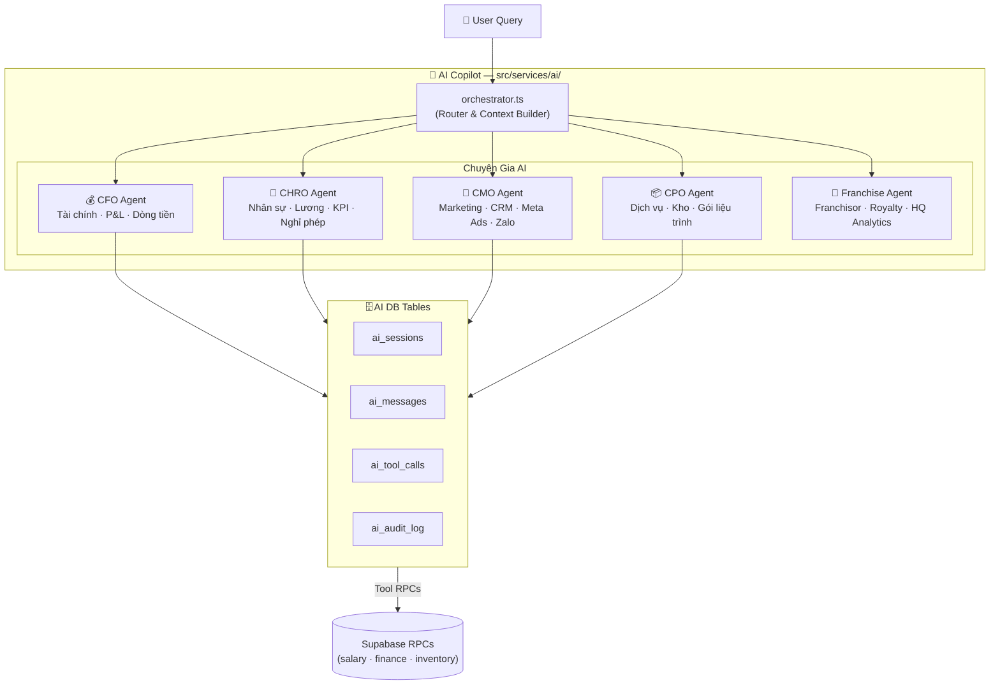

---

## 6. Database Architecture (Supabase / PostgreSQL)

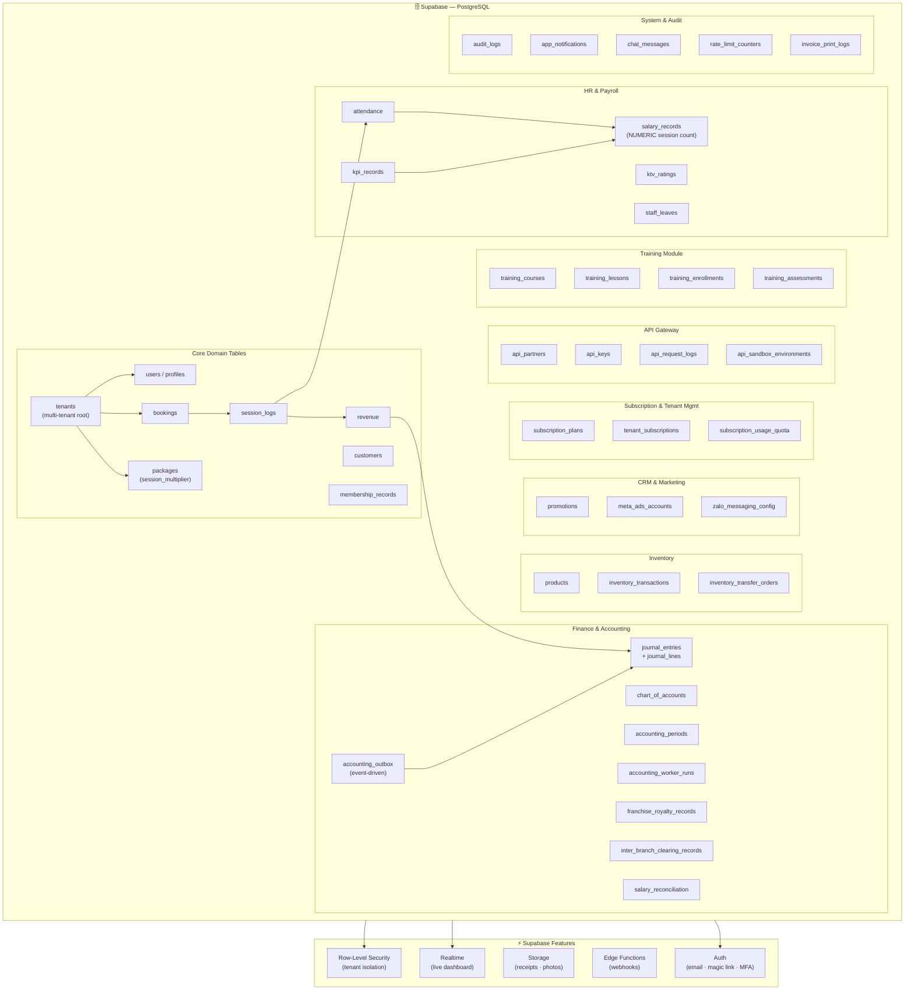

---

## 7. Mobile App (Expo React Native)

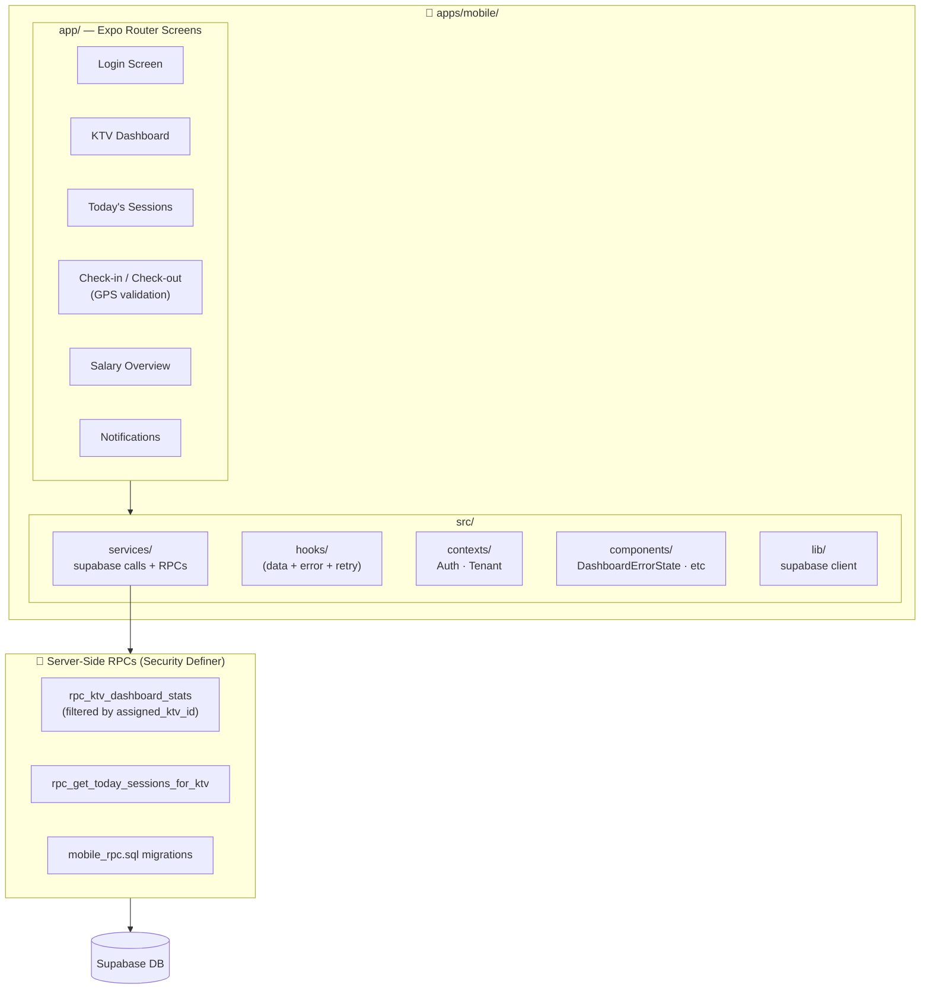

---

## 8. Accounting Engine (Double-Entry)

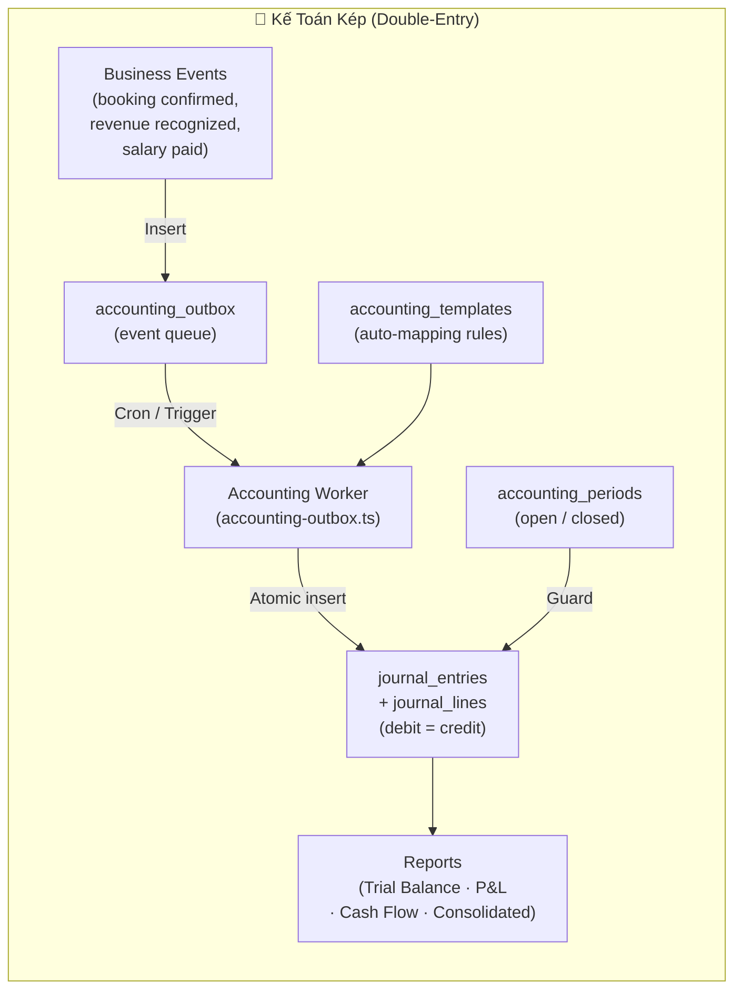

---

## 9. Multi-Tenant & Franchise Architecture

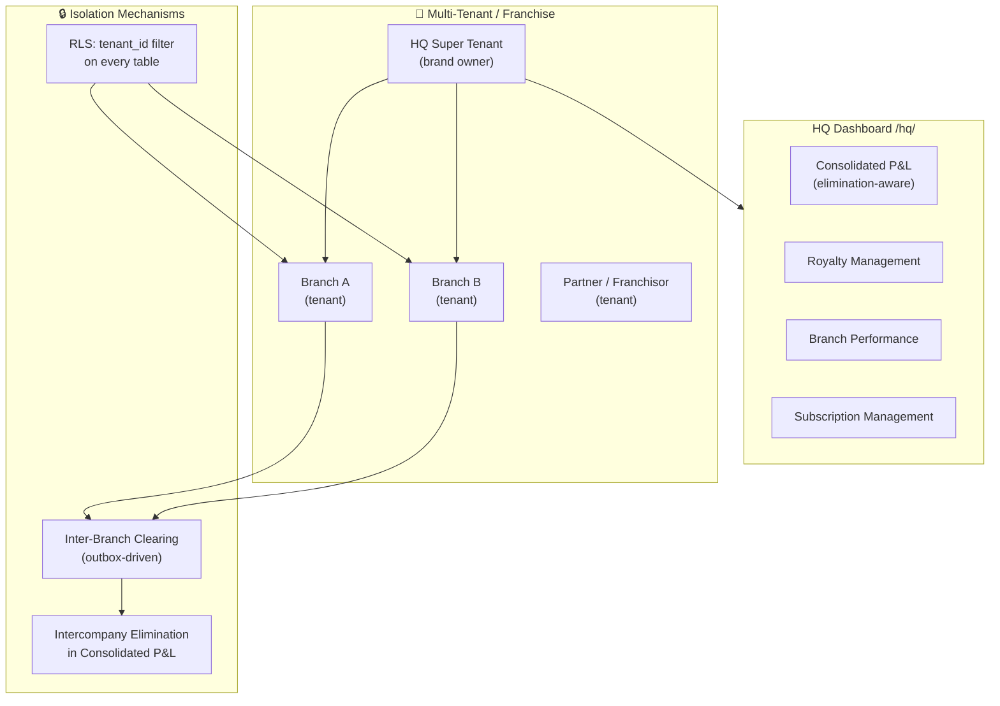

---

## 10. Tích Hợp Bên Ngoài (Third-Party)

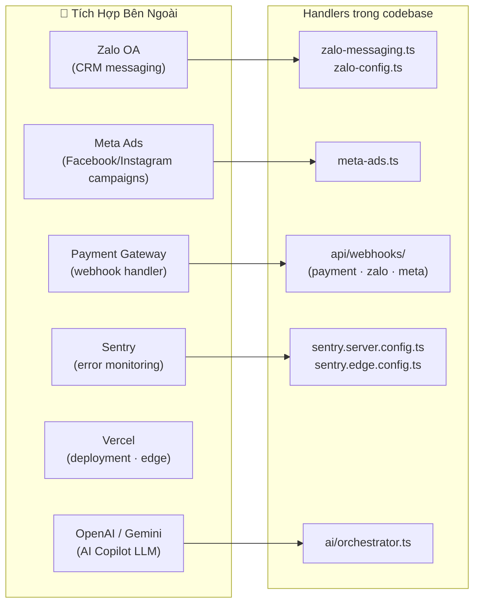

---

## 11. CI/CD & Security Pipeline

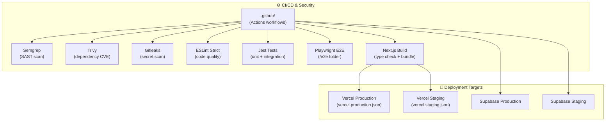

---

## 12. Luồng Dữ Liệu Chính — Booking → Revenue → Accounting

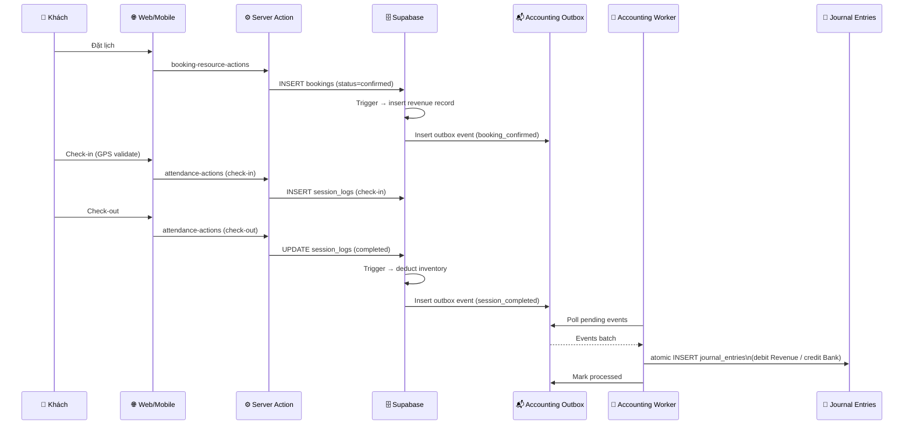

---

## 13. Tóm Tắt Công Nghệ

| Layer | Công Nghệ |
|---|---|
| **Frontend** | Next.js 15 (App Router), React 19, TypeScript, Tailwind CSS, shadcn/ui |
| **Mobile** | Expo 56 (React Native), Expo Router, bare workflow |
| **Backend / BFF** | Next.js Server Actions, API Routes (Edge-compatible) |
| **Database** | Supabase (PostgreSQL 16), Row-Level Security, RPCs, Realtime |
| **Auth** | Supabase Auth (email, magic link, MFA) |
| **AI** | Multi-agent orchestrator (CFO/CHRO/CMO/CPO/Franchise) via OpenAI/Gemini |
| **Accounting** | Double-entry engine, outbox pattern, period closing workflow |
| **CRM / Messaging** | Zalo OA API, Meta Ads API |
| **Observability** | Sentry (error), System Monitor dashboard, Audit Logs |
| **Security** | Semgrep, Trivy, Gitleaks, distributed rate limiting, RLS |
| **Deployment** | Vercel (web), EAS (mobile), Supabase hosted (DB) |
| **Testing** | Jest (unit/integration), Playwright (E2E), load tests |

