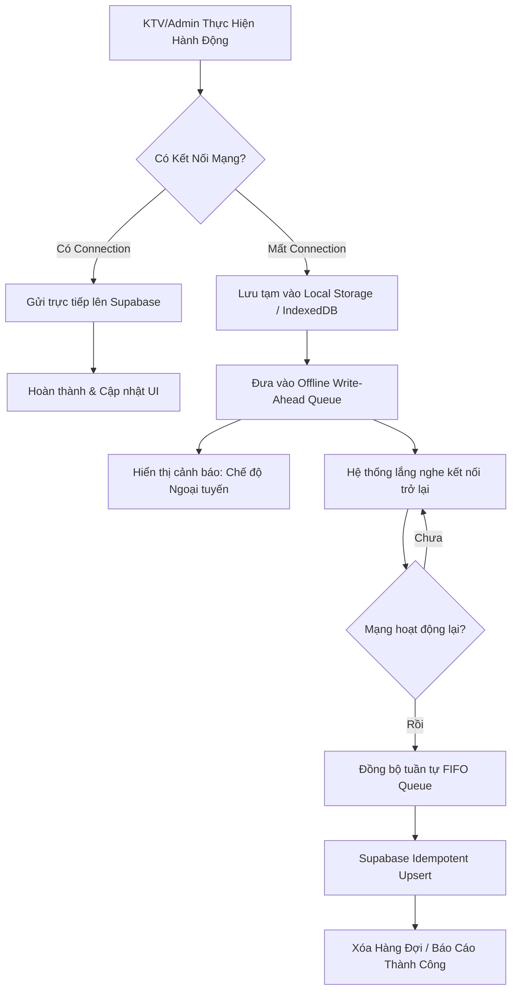

# Chiến Lược Ngoại Tuyến (Offline-First) & Đồng Bộ Hóa Dữ Liệu
## Bella Spa ERP - Đảm Bảo Tính Toàn Vẹn Dữ Liệu Khi Mất Kết Nối Mạng

Trong môi trường vận hành Spa thực tế, KTV thường làm việc tại các phòng dịch vụ có tường dày hoặc tầng hầm cách âm, nơi kết nối 4G/Wifi cực kỳ kém ổn định. Đồng thời, máy tính của Admin tại quầy lễ tân cũng có nguy cơ mất kết nối mạng Internet đột ngột. 

Để ngăn chặn việc **mất dữ liệu chấm công, ghi nhận ca làm việc sai lệch, thất thoát doanh thu** và đảm bảo trải nghiệm người dùng mượt mà, Bella Spa ERP áp dụng kiến trúc **Offline-First** kết hợp **Hàng đợi đồng bộ hóa thông minh (Sync Queue)**.

---

## 1. Mô Hình Kiến Trúc Đồng Bộ Tổng Quan



---

## 2. Giải Pháp Bảo Vệ Dữ Liệu Chi Tiết cho KTV Di Động (Mobile Portal)

### A. Ghi Nhận Hành Động Ngoại Tuyến với IndexedDB (Dexie.js)
Thay vì gọi API trực tiếp, mọi hành động tác động dữ liệu (Check-in, Ghi chú liệu trình, Checkout) đều đi qua một lớp trừu tượng (Data Access Layer). Nếu phát hiện mất mạng, dữ liệu sẽ được ghi thẳng vào **IndexedDB** của thiết bị (sử dụng thư viện tối ưu như `Dexie.js` hoặc `localForage` do có dung lượng lớn và không bị giới hạn 5MB như `localStorage`).

Cấu trúc một bản ghi Hàng đợi Ngoại tuyến (Offline Queue Schema):
```typescript
interface OfflineAction {
  id: string;            // UUID v4 sinh ngẫu nhiên ngay phía Client
  actionType: 'CHECKIN' | 'CHECKOUT' | 'SUBMIT_NOTE' | 'SUBMIT_RATING';
  payload: any;          // Dữ liệu chi tiết của hành động (KTV_ID, Session_ID,...)
  localTimestamp: number;// Thời gian chính xác lúc KTV click nút theo múi giờ Việt Nam
  retryCount: number;    // Số lần thử lại
  status: 'pending' | 'syncing' | 'failed';
}
```

### B. Sinh ID ngẫu nhiên phía Client (Client-Side UUID)
* **Nguyên tắc**: Tuyệt đối không phụ thuộc vào ID tự tăng (Sequential Auto-increment IDs) của Database khi hoạt động offline.
* **Giải pháp**: Tất cả các bản ghi mới (như logs chấm công, lịch trình) được gán sẵn một mã `UUID v4` sinh ngay từ trình duyệt bằng API `crypto.randomUUID()`. Khi mạng có lại và đẩy dữ liệu lên cơ sở dữ liệu, ID này sẽ được bảo toàn để tránh xung đột hoặc trùng lặp bản ghi do gửi lặp (idempotency).

---

## 3. Cơ Chế Chống Trùng Lặp & Xử Lý Xung Đột (Conflict Resolution)

Khi thiết bị khôi phục kết nối mạng, các hành động trong hàng đợi sẽ được gửi lên máy chủ. Lúc này, có khả năng xảy ra xung đột dữ liệu (ví dụ: Admin đã cập nhật ca trên Web trong lúc KTV đang làm việc offline trên điện thoại).

### A. Chiến lược "Người ghi cuối cùng thắng" (Last-Write-Wins - LWW) dựa trên GMT+7
Hệ thống sử dụng thuộc tính `localTimestamp` (lấy thời gian thực tế lúc KTV nhấn nút khi offline, đã chuẩn hóa theo giờ Việt Nam) thay vì sử dụng mốc thời gian máy chủ nhận được dữ liệu (`created_at` tự động). Điều này đảm bảo rằng thứ tự logic thực tế được tôn trọng tuyệt đối.

### B. Hàm Cập Nhật Trùng Lặp Idempotent (Idempotency API)
Tất cả các câu lệnh cập nhật lên cơ sở dữ liệu của Supabase đều phải dùng phương thức **`upsert()`** hoặc sử dụng cấu trúc SQL `INSERT ... ON CONFLICT DO UPDATE`.
```typescript
// Ví dụ về tính Idempotent trong Supabase
const { data, error } = await supabase
  .from('session_logs')
  .upsert({
    id: queuedAction.payload.id, // UUID sinh từ client lúc offline
    booking_id: queuedAction.payload.booking_id,
    status: 'completed',
    end_time: queuedAction.payload.end_time, // Thời gian checkout thực tế lúc offline
    completed_date: queuedAction.payload.completed_date
  }, { onConflict: 'id' });
```
> [!NOTE]
> Nếu hành động này bị gửi lặp 2 lần do mạng chập chờn khi đang đồng bộ, Database sẽ nhận diện trùng `id` (UUID) và chỉ ghi đè dữ liệu giống hệt thay vì tạo ra 2 ca trùng nhau.

### C. Quy Tắc Đồng Bộ Tuần Tự (FIFO Queue)
Hàng đợi đồng bộ bắt buộc phải xử lý theo cơ chế **FIFO (First In, First Out)**. 
- *Ví dụ*: KTV Check-in lúc offline, sau đó 90 phút Checkout lúc offline. Khi có mạng lại, hệ thống phải gửi hành động `CHECKIN` lên trước, chờ xử lý thành công rồi mới gửi `CHECKOUT`. Tuyệt đối không gửi song song để tránh lỗi logic nghiệp vụ trên Database (không thể checkout ca chưa checkin).

---

## 4. Giải Pháp Trực Quan Phía Admin (Front-end Feedback & UI)

Tránh việc Admin hoặc KTV hoang mang khi bấm nút nhưng không thấy phản hồi hoặc tưởng hệ thống bị treo.

### A. Chỉ Báo Trạng Thái Kết Nối (Connection Status Indicator)
* Hiển thị một chấm tròn nhỏ ở góc màn hình: 
  - 🟢 **Xanh**: Đã kết nối, dữ liệu đồng bộ thời gian thực.
  - 🟡 **Vàng/Cam**: Mất mạng. Hiển thị nhãn `"Đang chạy chế độ Ngoại tuyến (Đã lưu tạm X hành động)"`.
* Khi mất mạng, nút bấm (như nút "Hoàn thành ca") vẫn nhấn được, hệ thống hiển thị thông báo nhẹ: *"Đã lưu ca làm việc của bạn vào bộ nhớ đệm thiết bị. Hệ thống sẽ tự động đồng bộ khi có mạng."*

### B. Ngăn chặn các hành động Rủi Ro Cao khi Offline
Một số hành động nghiệp vụ cần độ chính xác cao về tài chính hoặc kho quỹ sẽ bị khóa nút bấm (Disable) khi không có mạng:
1. **Thanh toán hóa đơn / Trừ thẻ liệu trình**: Bắt buộc phải có mạng để kiểm tra số dư thực tế của thẻ VIP của khách hàng, tránh việc khách hàng chi tiêu vượt quá số tiền trong tài khoản ở chế độ offline.
2. **Xuất kho sản phẩm**: Cần kiểm kho thực tế để tránh trùng lặp số lượng xuất.

---

## 5. Kế Hoạch Triển Khai Kỹ Thuật (Các bước tích hợp)

> [!IMPORTANT]
> Đây là lộ trình kỹ thuật chi tiết để hiện thực hóa tính năng offline-first trên hệ thống hiện tại.

### Bước 1: Cài đặt Dexie.js & Khởi tạo Local DB
```bash
npm install dexie
```
Tạo file `src/lib/offline-db.ts` quản lý IndexedDB cục bộ của ứng dụng trình duyệt.

### Bước 2: Thiết lập Service Worker Lắng Nghe Sự Kiện `online`
Tích hợp Hook `useOfflineSync` trong layout tổng của React/Next.js:
```typescript
'use client';
import { useEffect } from 'react';
import { syncOfflineQueue } from '@/services/sync-actions';

export function useOfflineSync() {
  useEffect(() => {
    const handleOnline = () => {
      console.log('Đã có mạng trở lại. Bắt đầu đồng bộ...');
      syncOfflineQueue();
    };

    window.addEventListener('online', handleOnline);
    return () => window.removeEventListener('online', handleOnline);
  }, []);
}
```

### Bước 3: Kiểm soát Lỗi Đồng Bộ (Error Handling & Manual Reconciliation)
Nếu quá trình đồng bộ gặp lỗi logic nghiệp vụ nghiêm trọng (ví dụ: KTV chấm công offline nhưng Admin trên web đã hủy ca đó trước đó):
1. Không khóa hàng đợi đồng bộ.
2. Tách bản ghi lỗi ra một bảng tạm gọi là `sync_conflicts`.
3. Bắn thông báo Admin: *"Có 1 ca làm việc của KTV Lê Thu Hà bị xung đột dữ liệu do cập nhật offline. Vui lòng bấm vào đây để duyệt thủ công."*
4. Tiếp tục đồng bộ các ca làm việc hợp lệ tiếp theo trong hàng đợi.

---

## 6. Kết Luận
Việc áp dụng kiến trúc **Offline-First** giúp Bella Spa ERP hoạt động bền bỉ trong mọi điều kiện thực tế của spa. Sự kết hợp giữa **Client UUID**, **Hàng đợi IndexedDB**, và **Supabase Idempotent Upsert** loại bỏ hoàn toàn rủi ro mất dữ liệu, đồng thời ngăn chặn tuyệt đối các sai sót về trùng lặp hoặc đảo lộn thứ tự ca làm việc của KTV.
