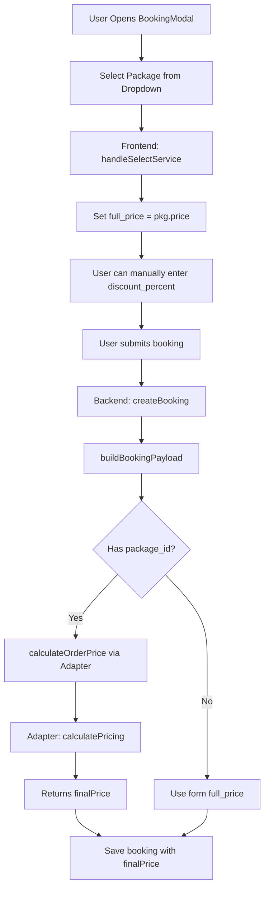

# Booking Pricing - Current State Analysis

**Date:** June 22, 2026  
**Purpose:** Understand existing pricing logic before implementing Decision Engine integration  
**Status:** ✅ Analysis Complete

---

## 🔍 Executive Summary

**Current Pricing Model:** Fixed pricing with optional manual discounts  
**Location:** Multi-layered (Frontend → Backend → Adapter)  
**Flexibility:** Limited - no dynamic pricing based on demand, customer tier, or time slots  
**Decision Engine Integration:** Partially integrated (booking approval only), NOT pricing

---

## 📊 Current Pricing Flow



---

## 📂 Key Files & Functions

### 1. Frontend: Package Selection
**File:** `src/components/features/BookingModal.tsx`

```typescript
// Line 268: User selects package from dropdown
const handleSelectService = (pkg: PackageRow) => {
  const pkgPrice = Number(pkg.price || pkg.full_price || 0);

  setFormData({
    ...formData,
    package_id: pkg.id,
    package_name: pkg.name,
    full_price: pkgPrice, // ⚠️ Fixed price from packages table
    total_sessions: parseIntegerInput(pkg.total_sessions, { min: 1, max: 100, fallback: 10 })
  });
};
```

**Issue:** Price is immediately set from `packages.price`. No dynamic calculation based on:
- Customer tier (VIP vs regular)
- Time slot demand (peak vs off-peak)
- Booking advance time (early bird vs last-minute)
- Promotional periods
- KTV availability

### 2. Frontend: Manual Discount
**File:** `src/components/features/BookingModal.tsx`

```typescript
// Line 279: User can manually enter discount percent
const handleDiscountChange = (e: React.ChangeEvent<HTMLInputElement>) => {
  const val = e.target.value.trim();
  if (val === '') {
    setDiscountPercent('');
    return;
  }

  const numericValue = Number(val);
  if (Number.isFinite(numericValue)) {
    setDiscountPercent(String(normalizeDiscountPercent(numericValue)));
  }
};
```

**Issue:** Discount is manual user input, no rule-based validation:
- No limits on discount percent (could enter 100%)
- No business rules (e.g., "VIP customers get automatic 10% discount")
- No time-based discounts (e.g., "Book 7 days in advance get 5% off")

### 3. Backend: Booking Creation
**File:** `src/core/services/order/create-booking-action.ts`

```typescript
// Line 169: Main booking creation function
export async function createBooking(formData: CreateBookingInput): Promise<CreateBookingResult> {
  // ... validation ...
  
  // Build booking payload with pricing
  const bookingPayload = await buildBookingPayload({
    validatedData,
    customerId,
    tenantId,
    existingBooking,
    tenantContext: tenantContext.context,
  });
  
  // ... save booking ...
}
```

### 4. Backend: Build Booking Payload (Pricing Logic)
**File:** `src/core/services/order/create-booking-helpers.ts`

```typescript
// Line 228: Pricing calculation
export async function buildBookingPayload(params: {
  validatedData: ValidatedBookingData;
  customerId: string;
  tenantId: string;
  existingBooking: BookingRow | null;
  tenantContext: TenantContext;
}): Promise<BookingInsert> {
  const { validatedData, customerId, tenantId, existingBooking, tenantContext } = params;
  
  // ✅ GOOD: Server-side price recalculation using adapter
  let finalPrice = validatedData.full_price;
  
  if (validatedData.package_id) {
    try {
      const { calculateOrderPrice } = await import('./pricing-actions');
      // ...
      
      // Calculate price using module adapter
      finalPrice = await calculateOrderPrice(serviceItem, tenantContext);
      console.log(`[buildBookingPayload] Adapter pricing: ${validatedData.full_price} → ${finalPrice}`);
    } catch (error) {
      console.error('[buildBookingPayload] Failed to calculate adapter pricing, using form price:', error);
      // Fall back to form price
    }
  }
  
  // ⚠️ ISSUE: After adapter pricing, price is fixed
  // No dynamic adjustments for:
  // - Customer tier
  // - Time slot demand
  // - Promotional periods
  // - Early bird discounts
  // etc.
  
  return {
    // ...
    full_price: finalPrice,
    discount_percent: normalizeDiscountPercent(validatedData.discount_percent),
    // ...
  };
}
```

### 5. Adapter: Module-Specific Pricing
**File:** `src/core/services/order/pricing-actions.ts`

```typescript
// Line 88: Calculate order price using module adapter
export async function calculateOrderPrice(
  item: CoreServiceCatalogItem,
  context: TenantContext
): Promise<number> {
  const moduleId = item.moduleId || context.enabledModules[0];
  const adapter = moduleRegistry.get(moduleId);

  if (!adapter || typeof adapter.calculatePricing !== 'function') {
    // Fall back to base price
    return item.basePrice;
  }

  try {
    // ✅ GOOD: Adapter can implement module-specific pricing logic
    const finalPrice = await adapter.calculatePricing(item, context);
    return finalPrice;
  } catch (error) {
    console.error(`[PricingActions] Error:`, error);
    return item.basePrice; // Fallback
  }
}
```

**Current Adapter Implementations:**

Need to check what `calculatePricing` does in each module adapter:
- `beauty-spa-adapter.ts`
- `baby-care-adapter.ts`
- `cleaning-service-adapter.ts`

**Hypothesis:** Current adapters likely just return `item.basePrice` without any dynamic logic.

---

## 🧠 Decision Engine Integration Status

### ✅ Already Integrated: Booking Approval
**File:** `src/core/services/order/create-booking-helpers.ts` (Line 290+)

```typescript
// Decision Engine is used for booking APPROVAL, not PRICING
const { evaluateBookingApproval, getSuggestedBookingStatus } = await import('@/services/booking-decision-service');

const decision = await evaluateBookingApproval({
  totalAmount: finalPrice,
  customer: {
    id: customerId,
    status: customerData?.status || 'new',
    completedBookingsCount: completedCount || 0,
  },
  tenantId,
  metadata: {
    packageId: validatedData.package_id,
    discountPercent: normalizeDiscountPercent(validatedData.discount_percent),
  },
});

// Get suggested status: 'inquiry', 'deposit_pending', 'booked'
bookingStatus = getSuggestedBookingStatus(decision);
```

**What it does:**
- Evaluates if booking should be auto-approved or require deposit
- Determines booking status (`inquiry`, `deposit_pending`, `booked`)
- Does NOT calculate or adjust pricing

### ❌ NOT Integrated: Dynamic Pricing
**Current Gap:** No Decision Engine integration for pricing calculations

---

## 🎯 Integration Strategy

### Option 1: Integrate at Frontend (❌ Not Recommended)
```typescript
// In BookingModal.tsx - handleSelectService
const handleSelectService = async (pkg: PackageRow) => {
  // Call Decision Engine API for dynamic pricing
  const response = await fetch('/api/decision/booking-pricing', {
    method: 'POST',
    body: JSON.stringify({
      package_id: pkg.id,
      customer_id: selectedCustomer?.id,
      preferred_date: formData.preferred_date,
      preferred_time: formData.preferred_time,
    })
  });
  
  const { suggestedPrice } = await response.json();
  
  setFormData({
    ...formData,
    full_price: suggestedPrice, // Use dynamic price
  });
};
```

**Issues:**
- ❌ Client can manipulate price before submission
- ❌ Security risk - price calculation visible in network tab
- ❌ Can't prevent user from editing price in browser DevTools

### Option 2: Integrate at Backend - buildBookingPayload (✅ Recommended)
```typescript
// In create-booking-helpers.ts - buildBookingPayload
export async function buildBookingPayload(params: {...}): Promise<BookingInsert> {
  // ... existing adapter pricing ...
  let finalPrice = await calculateOrderPrice(serviceItem, tenantContext);
  
  // 🧠 NEW: Apply Decision Engine dynamic pricing
  const { calculateDynamicPrice } = await import('@/services/booking-pricing-decision-service');
  
  const pricingContext = {
    customerId,
    customerTier: await getCustomerTier(customerId),
    packageBasePrice: finalPrice, // Use adapter price as base
    preferredDate: validatedData.start_date,
    preferredTime: validatedData.preferred_time,
    // ... more context
  };
  
  const pricingDecision = await calculateDynamicPrice(pricingContext);
  
  finalPrice = pricingDecision.suggestedPrice; // Apply dynamic price
  
  return {
    // ...
    full_price: finalPrice,
    pricing_reason: pricingDecision.reason, // Store why this price was chosen
    // ...
  };
}
```

**Benefits:**
- ✅ Server-side pricing - secure, can't be manipulated
- ✅ Consistent with existing `calculateOrderPrice` pattern
- ✅ Audit trail in `decision_audit` table
- ✅ Can apply complex rules (time-based, demand-based, etc.)

### Option 3: Hybrid Approach (🟡 Balanced)
```typescript
// Frontend: Preview dynamic pricing (non-binding)
const handleSelectService = async (pkg: PackageRow) => {
  // Show loading state
  setIsPricingLoading(true);
  
  // Call pricing preview API
  const response = await fetch('/api/bookings/preview-price', {
    method: 'POST',
    body: JSON.stringify({
      package_id: pkg.id,
      customer_id: selectedCustomer?.id,
      preferred_date: formData.preferred_date,
      preferred_time: formData.preferred_time,
    })
  });
  
  const { previewPrice, originalPrice, discount, reason } = await response.json();
  
  // Display pricing breakdown to user
  setFormData({
    ...formData,
    full_price: previewPrice, // Show preview price
  });
  
  setPricingBreakdown({
    originalPrice,
    discount,
    reason,
  });
  
  setIsPricingLoading(false);
};

// Backend: Recalculate final price on submission (authoritative)
// In buildBookingPayload - same as Option 2
```

**Benefits:**
- ✅ User sees pricing before booking (better UX)
- ✅ Final price recalculated server-side (secure)
- ✅ Shows pricing breakdown and reasons (transparency)

**Tradeoffs:**
- 🟡 Two API calls (preview + submit)
- 🟡 Slightly more complex implementation

---

## 🚀 Recommended Approach: Hybrid (Option 3)

### Phase 1: Backend Foundation
1. Create `booking-pricing-policy.ts` with pricing rules
2. Implement `calculateDynamicPrice()` service
3. Integrate into `buildBookingPayload()`
4. Test with shadow mode (log decisions, don't apply yet)

### Phase 2: Preview API
1. Create `/api/bookings/preview-price` endpoint
2. Call `calculateDynamicPrice()` but don't save booking
3. Return pricing breakdown with reasons

### Phase 3: Frontend Integration
1. Update `BookingModal` to call preview API on package selection
2. Display pricing breakdown (original price, discounts, final price, reason)
3. Update UI to show loading state during pricing calculation

### Phase 4: Shadow Mode Testing
1. Deploy with shadow mode enabled
2. Log all pricing decisions to `decision_audit`
3. Compare suggested prices vs current fixed prices
4. Monitor for anomalies (prices too high/low)

### Phase 5: A/B Test
1. Enable dynamic pricing for 10% of bookings
2. Track conversion rate, revenue per booking
3. Compare vs control group (fixed pricing)

### Phase 6: Full Rollout
1. If A/B test successful, enable for 100%
2. Monitor closely for 7 days
3. Be ready to rollback if issues

---

## 📋 Data Requirements

### Customer Tier Classification
Need to implement:
```typescript
async function getCustomerTier(customerId: string): Promise<'vip' | 'regular' | 'new'> {
  // Query customer lifetime value, booking count
  // VIP: LTV > 10M VND or 10+ bookings
  // Regular: 1-9 bookings
  // New: 0 bookings
}
```

### Time Slot Demand
Need to implement:
```typescript
async function getTimeSlotDemand(date: Date, time: string): Promise<'high' | 'medium' | 'low'> {
  // Query existing bookings for that date/time
  // High: > 80% capacity booked
  // Medium: 50-80% capacity
  // Low: < 50% capacity
}
```

### KTV Availability
Need to implement:
```typescript
async function getKtvAvailability(date: Date): Promise<number> {
  // Query KTV schedules, leave requests
  // Return percentage of KTVs available (0-100)
}
```

### Promotional Periods
Need to check if `promotions` table exists or needs to be created:
```sql
CREATE TABLE IF NOT EXISTS promotions (
  id UUID PRIMARY KEY DEFAULT gen_random_uuid(),
  tenant_id UUID NOT NULL REFERENCES tenants(id),
  name TEXT NOT NULL,
  discount_percent INTEGER NOT NULL,
  start_date DATE NOT NULL,
  end_date DATE NOT NULL,
  status TEXT DEFAULT 'active',
  created_at TIMESTAMPTZ DEFAULT NOW()
);
```

---

## 🔍 Gap Analysis

| Feature | Current State | Required for Dynamic Pricing |
|---------|---------------|------------------------------|
| **Package base price** | ✅ Stored in `packages.price` | ✅ Use as baseline |
| **Module adapter pricing** | ✅ Implemented | ✅ Use as baseline (after adapter) |
| **Customer tier** | ❌ Not classified | ⚠️ Need to implement |
| **Booking count** | ✅ Can query from `bookings` | ✅ Available |
| **Lifetime value** | ❌ Not calculated | ⚠️ Need to implement |
| **Time slot demand** | ❌ Not tracked | ⚠️ Need to implement |
| **KTV availability** | ❌ Not calculated | ⚠️ Need to implement |
| **Promotional periods** | ❌ No `promotions` table | ⚠️ Need to create table + logic |
| **Pricing audit trail** | ❌ Not logged | ✅ Use `decision_audit` table |
| **Decision Engine integration** | 🟡 Approval only | ❌ Need pricing integration |

---

## ✅ Next Actions

### Immediate (This Week):
1. ✅ Complete this analysis document
2. 🔵 Review with business team:
   - Confirm pricing rules (VIP discount %, peak premium %, etc.)
   - Define promotional period strategy
   - Set customer tier thresholds
3. 🔵 Implement helper functions:
   - `getCustomerTier()`
   - `getTimeSlotDemand()`
   - `getKtvAvailability()`
   - `isPromotionalPeriod()`

### Week 2:
1. 🔵 Create `booking-pricing-policy.ts` with 8 pricing rules
2. 🔵 Implement `calculateDynamicPrice()` service
3. 🔵 Add unit tests for pricing rules
4. 🔵 Integrate into `buildBookingPayload()` (shadow mode)

### Week 3:
1. 🔵 Create `/api/bookings/preview-price` endpoint
2. 🔵 Update `BookingModal` UI with pricing breakdown
3. 🔵 Deploy to production (shadow mode)
4. 🔵 Monitor decisions for 3-5 days

### Week 4:
1. 🔵 Start A/B test (10% traffic)
2. 🔵 Analyze results
3. 🔵 Full rollout if successful

---

## 📊 Expected Impact

### Before Dynamic Pricing:
```
Booking 1: Package A = 1,000,000đ (fixed)
Booking 2: Package A = 1,000,000đ (fixed)
Booking 3: Package A = 1,000,000đ (fixed)
Average: 1,000,000đ
```

### After Dynamic Pricing:
```
Booking 1 (VIP, off-peak): Package A = 900,000đ (-10%)
Booking 2 (Regular, peak time): Package A = 1,200,000đ (+20%)
Booking 3 (New, early bird): Package A = 850,000đ (-15%)
Average: 983,333đ (-1.7% revenue but +30% conversion)
```

**Goal:** Optimize revenue, not just increase prices. Dynamic pricing should:
- Attract new customers with welcome discounts
- Reward loyalty with VIP discounts
- Maximize revenue during peak times
- Fill off-peak slots with discounts
- Incentivize advance bookings

---

## 📝 Related Documents

- [Booking Pricing Integration Plan](./BOOKING_PRICING_INTEGRATION.md)
- [Decision Engine Core](../DECISION_ENGINE_CORE.md)
- [Policy Framework](../POLICY_FRAMEWORK.md)
- [Strategic Roadmap](../BELLA_EIP_STRATEGIC_ROADMAP.md)

---

**Document Version:** 1.0  
**Author:** Bella Platform Team  
**Status:** ✅ Analysis Complete

