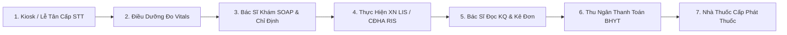

# 📖 Cẩm Nang Hướng Dẫn Vận Hành Onboarding: Bella Medical Clinic v1

> **Áp dụng cho:** Đón tiếp, Điều dưỡng, Bác sĩ, KTV Xét nghiệm/CĐHA, Dược sĩ & Thu ngân Viện phí BHYT  
> **Phiên bản:** v1.0.0 Operational Playbook  
> **Nền tảng:** Bella Healthcare Platform (`bella_healthcare`)

---

## 📑 Mục Lục
1. [Quy Trình Hành Trình Bệnh Nhân Standard (Patient Journey Workflow)](#1-quy-trình-hành-trình-bệnh-nhân-standard)
2. [Hướng Dẫn Vai Trò 1: Lễ Tân & Đón Tiếp (Registration & Queue Ticket)](#2-hướng-dẫn-vai-trò-1-lễ-tân--đón-tiếp)
3. [Hướng Dẫn Vai Trò 2: Điều Dưỡng Đo Sinh Hiệu (Vitals Triage)](#3-hướng-dẫn-vai-trò-2-điều-dưỡng-đo-sinh-hiệu)
4. [Hướng Dẫn Vai Trò 3: Bác Sĩ Khám Bệnh & Bệnh Án EMR (SOAP Consultation)](#4-hướng-dẫn-vai-trò-3-bác-sĩ-khám-bệnh--bệnh-án-emr)
5. [Hướng Dẫn Vai Trò 4: KTV Xét Nghiệm (LIS) & CĐHA (RIS DICOM)](#5-hướng-dẫn-vai-trò-4-ktv-xét-nghiệm-lis--cđha-ris-dicom)
6. [Hướng Dẫn Vai Trò 5: Dược Sĩ Kê Đơn & Xuất Thuốc (Pharmacy Engine)](#6-hướng-dẫn-vai-trò-5-dược-sĩ-kê-đơn--xuất-thuốc)
7. [Hướng Dẫn Vai Trò 6: Thu Ngân Viện Phí & Quyết Toán BHYT (Medical Billing)](#7-hướng-dẫn-vai-trò-6-thu-ngân-viện-phí--quyết-toán-bhyt)

---

## 1. Quy Trình Hành Trình Bệnh Nhân Standard

---

## 2. Hướng Dẫn Vai Trò 1: Lễ Tân & Đón Tiếp

- **Truy cập:** Màn hình `/dashboard/healthcare/queue`
- **Các bước thực hiện:**
  1. Tra cứu Bệnh nhân theo Tên / Số ĐT / Mã BHYT. Nếu bệnh nhân mới, hệ thống tự động khởi tạo Hồ sơ `patient_profiles` mở rộng 1-1 từ Core `customers`.
  2. Bấm **"Cấp số STT"** chọn phân luồng: `BHYT`, `Khám Dịch vụ`, hoặc `Ưu tiên Khẩn`.
  3. Màn hình TV Display sẽ tự động phát loa gọi số vào trạm khám tiếp theo.

---

## 3. Hướng Dẫn Vai Trò 2: Điều Dưỡng Đo Sinh Hiệu

- **Truy cập:** Màn hình `/dashboard/healthcare/encounters`
- **Các bước thực hiện:**
  1. Chọn Bệnh nhân đang ở trạm `vitals`.
  2. Ghi nhận các chỉ số sinh hiệu: Huyết áp (mmHg), Mạch (lần/phút), Thân nhiệt (°C), SpO2 (%), Chiều cao & Cân nặng (BMI).
  3. Nhấn **"Lưu Sinh Hiệu"** để tự động đồng bộ lên Bệnh án Điện tử EMR của Bác sĩ.

---

## 4. Hướng Dẫn Vai Trò 3: Bác Sĩ Khám Bệnh & Bệnh Án EMR

- **Truy cập:** Màn hình `/dashboard/healthcare/encounters`
- **Các bước thực hiện:**
  1. Mở Bệnh án EMR của bệnh nhân theo số STT đã gọi.
  2. Nhập thông tin khám theo chuẩn SOAP:
     - **S (Subjective):** Lý do khám & Bệnh sử.
     - **O (Objective):** Ghi nhận khám lâm sàng & Sinh hiệu.
     - **A (Assessment):** Chọn mã chẩn đoán ICD10 chuẩn Bộ Y Tế.
     - **P (Plan):** Chỉ định Y lệnh (Xét nghiệm / X-Quang / Siêu âm) hoặc Kê đơn thuốc.
  3. **Lưu ý:** Không thể đóng lượt khám khi còn Y lệnh cận lâm sàng chưa hoàn tất (Invariant Guard).

---

## 5. Hướng Dẫn Vai Trò 4: KTV Xét Nghiệm (LIS) & CĐHA (RIS DICOM)

- **Truy cập Xét nghiệm:** `/dashboard/healthcare/laboratory`
- **Truy cập CĐHA:** `/dashboard/healthcare/imaging`
- **Các bước thực hiện:**
  1. **Xét nghiệm (LIS):** Tiếp nhận mẫu bệnh phẩm theo mã vạch màu ống nghiệm (Đỏ, Tím, Xám). Nhập chỉ số kết quả. Nếu trị số vượt ngưỡng sinh tử, bấm **"Panic Value"** để kích hoạt báo động khẩn cấp tới Bác sĩ.
  2. **CĐHA (RIS):** Mở liên kết **"Xem phim DICOM"** trên viewer PACS. Nhập kết quả báo cáo chẩn đoán hình ảnh và bấm **"Duyệt Báo Cáo"**.

---

## 6. Hướng Dẫn Vai Trò 5: Dược Sĩ Kê Đơn & Xuất Thuốc

- **Truy cập:** Màn hình `/dashboard/healthcare/pharmacy`
- **Các bước thực hiện:**
  1. Kiểm tra danh mục biệt dược, hoạt chất và mã ATC.
  2. CDSS Engine sẽ tự động quét đối chiếu hoạt chất đơn thuốc với tiền sử dị ứng `known_allergies` của bệnh nhân. Nếu trùng lặp dị ứng, hệ thống sẽ phát cảnh báo chặn kê đơn.
  3. Bấm **"Xuất Thuốc"** để tự động trừ kho Dược (`inventory_items`).

---

## 7. Hướng Dẫn Vai Trò 6: Thu Ngân Viện Phí & Quyết Toán BHYT

- **Truy cập:** Màn hình `/dashboard/healthcare/billing`
- **Các bước thực hiện:**
  1. Hệ thống tự động phân tách tổng chi phí theo tỷ lệ đồng chi trả BHYT (80% BHYT / 20% Bệnh nhân hoặc 100%).
  2. Thu tiền phần bệnh nhân trả qua Tiền mặt / Chuyển khoản QR.
  3. Bấm **"Thanh Toán"**: Hệ thống tự động xuất Hóa đơn điện tử và đẩy Event Outbox sang Sổ cái Kế toán (`AccountingEngineService`) ghi nợ 1111/131_BHYT và ghi có 5113.
