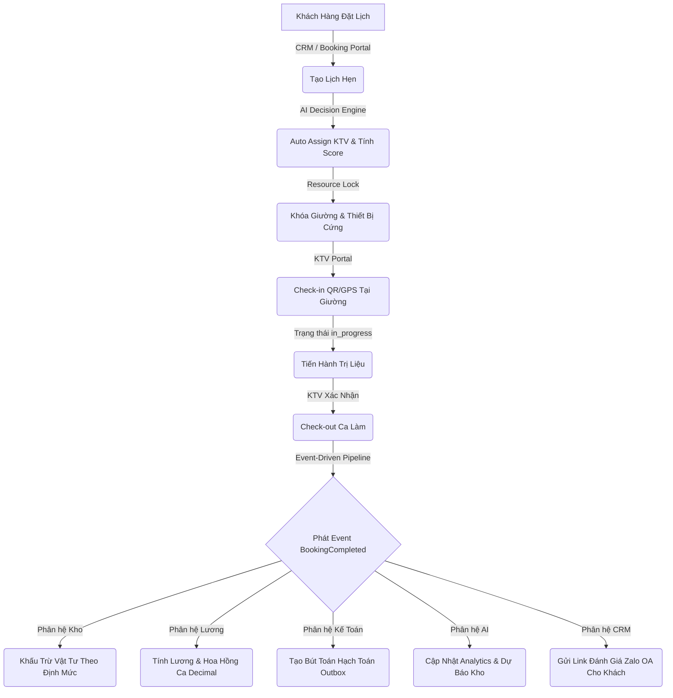

# 🏛️ CẨM NANG VẬN HÀNH BELLA ENTERPRISE INTELLIGENCE PLATFORM (BELLA EIP)
## Phân hệ: Beauty Spa Enterprise Module
**Phiên bản**: 3.0 — Hệ thống tự động hóa nghiệp vụ, động cơ quyết định AI và kiểm soát tài chính chuyên sâu  
**Preset thương hiệu**: Ngọc bích & Hoàng kim (Emerald `#074E44` & Gold `#C8A97A`)  
**Tài liệu kỹ thuật/Vận hành**: Hotline: 0865 679 054 | Email: tech@beautyspa.vn

---

## 📋 MỤC LỤC

1. [Giới thiệu định vị Bella EIP](#1-giới-thiệu-định-vị-bella-eip)
2. [Lớp 1: Business Workflows (Luồng Nghiệp Vụ Liên Thông)](#2-lớp-1-business-workflows-luồng-nghiệp-vụ-liên-thông)
   - 2.1 [Luồng dịch vụ xuyên suốt (End-to-End Operational Flow)](#21-luồng-dịch-vụ-xuyên-suốt-end-to-end-operational-flow)
   - 2.2 [Cơ chế Event-Driven Architecture (EDA) của BookingCompleted](#22-cơ-chế-event-driven-architecture-eda-của-bookingcompleted)
3. [Lớp 2: Business Rules & Decision Engine (Quy Tắc Nghiệp Vụ & Động Cơ Quyết Định)](#3-lớp-2-business-rules--decision-engine-quy-tắc-nghiệp-vụ--động-cơ-quyết-định)
   - 3.1 [AI Decision Engine - Tự động phân phối lịch (Auto-Assign)](#31-ai-decision-engine---tự-động-phân-phối-lịch-auto-assign)
   - 3.2 [Rule Engine - Tính toán hoa hồng chuyên viên (Service & Product Commission)](#32-rule-engine---tính-toán-hoa-hồng-chuyên-viên-service--product-commission)
   - 3.3 [Quy trình phê duyệt (Approval Workflows) đa lớp](#33-quy-trình-phê-duyệt-approval-workflows-đa-lớp)
   - 3.4 [Cơ chế Audit Trail - Giám sát lịch sử thay đổi](#34-cơ-chế-audit-trail---giám-sát-lịch-sử-thay-đổi)
   - 3.5 [Ràng buộc nghiệp vụ cứng (Hard Invariants & System Constraints)](#35-ràng-buộc-nghiệp-vụ-cứng-hard-invariants--system-constraints)
4. [Lớp 3: User Operations (Hướng Dẫn Thao Tác Màn Hình)](#4-lớp-3-user-operations-hướng-dẫn-thao-tác-màn-hình)
   - 4.1 [Dashboard Điều Hành Thời Gian Thực](#41-dashboard-điều-hành-thời-gian-thực)
   - 4.2 [Quản lý Khách Hàng & Bệnh Án Da Điện Tử](#42-quản-lý-khách-hàng--bệnh-án-da-điện-tử)
   - 4.3 [Quy trình Đặt Lịch & Ghi Nhận Doanh Thu](#43-quy-trình-đặt-lịch--ghi-nhận-doanh-thu)
   - 4.4 [Quản lý Phòng Giường & Thiết Bị (Booking Resources)](#44-quản-lý-phòng-giường--thiết-bị-booking-resources)
   - 4.5 [Đối Soát Tài Chính & Xử Lý Giao Dịch Âm (Refund)](#45-đối-soát-tài-chính--xử-lý-giao-dịch-âm-refund)
   - 4.6 [Quản lý Kho & Tự Động Trừ Nguyên Vật Liệu](#46-quản-lý-kho--tự-động-trừ-nguyên-vật-liệu)
   - 4.7 [HR, Chấm Công QR/GPS & Ghi Nhận Vi Phạm](#47-hr-chấm-công-qrgps--ghi-nhận-vi-phạm)
   - 4.8 [Đóng Sổ Bảng Lương & Recalculation Engine](#48-đóng-sổ-bảng-lương--recalculation-engine)
   - 4.9 [Cổng Thông Tin Khách Hàng (Customer Portal)](#49-cổng-thông-tin-khách-hàng-customer-portal)
5. [Câu Hỏi Thường Gặp (FAQ) & Xử Lý Sự Cố](#5-câu-hỏi-thường-gặp-faq--xử-lý-sự-cố)

---

## 1. Giới thiệu định vị Bella EIP

**Bella EIP (Enterprise Intelligence Platform)** không đơn thuần là một phần mềm ERP quản lý dữ liệu tĩnh với các module rời rạc. Bella hoạt động như một **Hệ điều hành Doanh nghiệp Thông minh**, nơi mọi hành động nghiệp vụ được liên thông tự động, các quyết định vận hành được hỗ trợ bằng AI Decision Engine, và tính toàn vẹn của dữ liệu tài chính - nhân sự được bảo vệ bằng các ràng buộc cơ sở dữ liệu cứng (Hard Constraints).

Đối với phân hệ **Beauty Spa**, Bella EIP mang lại sự đồng bộ tuyệt đối từ lúc khách hàng phát sinh nhu cầu đặt lịch đến khi hạch toán dòng tiền về sổ cái kế toán và tự động tính toán hoa hồng Kỹ thuật viên (KTV).

---

## 2. Lớp 1: Business Workflows (Luồng Nghiệp Vụ Liên Thông)

### 2.1 Luồng dịch vụ xuyên suốt (End-to-End Operational Flow)

Giá trị cốt lõi của Bella EIP nằm ở sự liên thông không gián đoạn giữa các bộ phận. Một nghiệp vụ duy nhất sẽ tự động kích hoạt các side effect xuyên suốt nhiều bảng và phân hệ khác nhau:



1. **Khách đặt lịch**: Lễ tân hoặc khách hàng nhập thông tin trên cổng đặt lịch.
2. **Auto Assign KTV**: Hệ thống tính toán và tự động đề xuất KTV tối ưu nhất thông qua thang điểm đa tiêu chí.
3. **Lock Resource**: Khóa cứng giường điều trị và thiết bị laser/facial tương ứng trên hệ thống, không cho phép trùng lịch.
4. **Check-in**: KTV đến giường trị liệu, quét mã QR hoặc đối soát định vị GPS để bắt đầu ca làm.
5. **Điều trị**: Trạng thái ca làm chuyển sang `in_progress` nhấp nháy đỏ trên màn hình điều hành của Admin.
6. **Check-out**: KTV kết thúc liệu trình, nhập nhật ký da và bấm kết thúc ca làm.
7. **Inventory**: Kho tự động trừ vật tư tiêu hao (ví dụ: serum, bông tẩy trang) theo định mức cài đặt sẵn của gói dịch vụ.
8. **Commission**: Hệ thống tự động cộng dồn hoa hồng dịch vụ (Service Commission) thập phân vào bảng lương nháp của KTV.
9. **Accounting**: Tạo yêu cầu hạch toán tự động (Accounting Outbox Event) để chuyển sang sổ cái kế toán theo thông tư TT133.
10. **AI Analysis**: AI Copilot cập nhật biểu đồ công suất giường, xếp hạng hiệu năng KTV, dự báo thời điểm cạn kho vật tư và hành vi tiêu dùng của khách hàng.

---

### 2.2 Cơ chế Event-Driven Architecture (EDA) của BookingCompleted

Khi trạng thái ca trị liệu chuyển sang `completed`, hệ thống không chỉ thay đổi một trường dữ liệu trong database mà sẽ phát đi sự kiện **`BookingCompleted`**, kích hoạt một chuỗi các worker xử lý nền tự động:

*   **Inventory Worker**: Quét định mức nguyên liệu của dịch vụ vừa thực hiện ➔ trừ số lượng thực tế trong bảng `inventory_items` ➔ kiểm tra ngưỡng tối thiểu ➔ phát cảnh báo nhập hàng nếu tồn kho xuống thấp.
*   **Commission Worker**: Đọc cấu hình hoa hồng của KTV được giao ca ➔ kiểm tra xem có thiết lập ghi đè (override) cụ thể nào không ➔ tính toán số tiền hoa hồng thực tế ➔ kích hoạt trung tâm tính lương `recalculateAndSaveSalaryRecordEngine` để cập nhật bảng lương của tháng.
*   **Accounting Worker**: Nhận tín hiệu tài chính ➔ ghi nhận bút toán Nợ/Có tự động vào hàng đợi `accounting_outbox` ➔ mapping mã tài khoản kế toán (ví dụ: Nợ TK 131 - Có TK 5111) để cập nhật Sổ Cái Ledger.
*   **Notification Worker**: Gửi tin nhắn cảm ơn tự động kèm đường link đánh giá chất lượng ca làm bảo mật thông qua Zalo OA của khách hàng. Gửi thông báo đẩy báo cáo thu nhập tức thì đến điện thoại của KTV.
*   **Audit Worker**: Ghi chép nhật ký hành động chi tiết bao gồm thời gian check-in/out, GPS, thông số thiết bị, và KTV thực hiện để phục vụ thanh tra nội bộ.

---

## 3. Lớp 2: Business Rules & Decision Engine (Quy Tắc Nghiệp Vụ & Động Cơ Quyết Định)

### 3.1 AI Decision Engine - Tự động phân phối lịch (Auto-Assign)

Hệ thống điều phối nhân sự của Bella EIP sử dụng **Decision Engine** để tự động gán KTV cho lịch hẹn thay vì để người dùng chọn ngẫu nhiên. Khi một lịch hẹn được tạo, Decision Engine sẽ đánh giá tất cả KTV đang trong ca làm việc và tính toán điểm số tổng hợp (Final Score) từ 0 đến 100 dựa trên các trọng số cấu hình:

$$\text{Final Score} = w_1 \cdot \text{Skill} + w_2 \cdot \text{Workload} + w_3 \cdot \text{Fairness} + w_4 \cdot \text{Experience} + w_5 \cdot \text{Preferred} + w_6 \cdot \text{History}$$

#### Các tiêu chí đánh giá cốt lõi:
*   **Skill Score (Điểm chuyên môn)**: Kiểm tra danh sách chứng chỉ và tay nghề của KTV có khớp với yêu cầu của gói liệu trình điều trị (ví dụ: laser trị nám cần chứng chỉ Laser công nghệ cao).
*   **Workload Score (Độ phủ ca làm)**: Ưu tiên KTV có mật độ ca làm trong ngày thấp hơn để đảm bảo sức khỏe và chất lượng dịch vụ.
*   **Fairness Score (Tính công bằng)**: So sánh tổng số ca làm quy đổi tích lũy trong tháng của KTV để cân bằng thu nhập cho toàn bộ đội ngũ.
*   **Experience Score (Kinh nghiệm thực chiến)**: Dựa trên số ca cùng loại gói dịch vụ KTV đã thực hiện thành công trong quá khứ.
*   **Preferred Staff (Nhân viên yêu thích)**: Điểm cộng tối đa (+100) nếu khách hàng chỉ định KTV này làm chuyên viên chính khi mua hợp đồng.
*   **Customer History (Lịch sử khách hàng)**: Đánh giá độ tương thích của KTV dựa trên lịch sử đánh giá sao từ những ca làm trước đó của chính khách hàng này.
*   **Resource availability (Phòng/Giường trị liệu)**: Kiểm tra xem giường trị liệu và thiết bị tương ứng có trống lịch tại thời điểm đó hay không.

#### Chế độ giải trình (Explain Mode) & Manager Review:
Bella EIP cung cấp tính năng minh bạch hóa quyết định của AI. Đối với mỗi đề xuất tự động gán ca, Quản lý chi nhánh có thể mở **Explain Mode** để xem chi tiết phân tích:

> [!NOTE]
> **Bảng phân tích điểm số AI (Explain Mode):**
> *   *Kỹ thuật viên đề xuất*: Nguyễn Thị A (Mã số: `KTV-082`)
> *   **Skill Score**: `95` (Đầy đủ chứng chỉ Laser & Thải độc da)
> *   **Experience Score**: `88` (Đã thực hiện 142 ca Glass Skin VIP)
> *   **Workload Score**: `72` (Hôm nay đã làm 2 ca, còn trống 2 slot)
> *   **Preferred Staff**: `100` (Khách hàng chỉ định trực tiếp trong hợp đồng)
> *   **Final Score**: **`90.6`**
> *   ➔ *Đề xuất*: Gán giường trị liệu số 3, KTV Nguyễn Thị A phụ trách.
> *   *Manager Review*: Quản lý có quyền phê duyệt đề xuất của AI hoặc ghi đè (override) chọn KTV khác kèm lý do giải trình bắt buộc để lưu vào Audit Trail.

---

### 3.2 Rule Engine - Tính toán hoa hồng chuyên viên (Service & Product Commission)

Hệ thống tính hoa hồng cho nhân sự không áp dụng một công thức cố định mà đi qua **Rule Engine** với cơ chế thừa kế và ưu tiên ghi đè (Override Pipeline) đa cấp:

```
[Mức hoa hồng cụ thể của sản phẩm/dịch vụ]
                 ↓ (nếu không cấu hình)
[Mức ghi đè KTV chuyên biệt (override_commission_value)]
                 ↓ (nếu không cấu hình)
[Cấu hình hoa hồng mặc định của chi nhánh (tenants.commission_config)]
                 ↓ (nếu không cấu hình)
[Cấu hình mặc định toàn hệ thống (System Default)]
```

#### Quy tắc vận hành của Rule Engine:
1.  **Chỉ nhận hoa hồng khi hoàn tất**: Hoa hồng chỉ được tính vào bảng lương khi và chỉ khi trạng thái ca làm hoặc giao dịch bán sản phẩm được chuyển sang **`completed`**. Mọi ca hẹn ở trạng thái `scheduled`, `in_progress` hoặc `cancelled` đều bị loại trừ khỏi các truy vấn lương.
2.  **Hoa hồng bán lẻ sản phẩm (Product Sales Commission)**: Được tính dựa trên giá trị sau chiết khấu của hóa đơn sản phẩm và chỉ được ghi nhận khi hóa đơn đã được xác nhận thanh toán thành công (`status = 'paid'`).
3.  **Tự động tái tính toán đồng bộ (Recalculation Atomicity)**: Khi có bất kỳ sự thay đổi nào về cấu hình hoa hồng, chi tiết buổi làm, hoặc trạng thái thanh toán, hệ thống sẽ tự động gọi trigger cập nhật bảng lương của nhân sự. Nếu quá trình ghi đè hoa hồng thành công nhưng việc tính lại bảng lương gặp lỗi, toàn bộ giao dịch sẽ bị rollback lập tức để tránh sai lệch số liệu.

---

### 3.3 Quy trình phê duyệt (Approval Workflows) đa lớp

Các nghiệp vụ nhạy cảm liên quan đến chi phí và tiền lương bắt buộc phải đi qua các trạng thái phê duyệt nghiêm ngặt trên hệ thống:

#### 1. Bảng lương chi nhánh (Payroll Lifecycle):
*   **`Draft`**: Hệ thống tự động tính toán số liệu lương cứng pro-rata, hoa hồng dịch vụ, hoa hồng sản phẩm, điểm KPI và khấu trừ phạt từ dữ liệu thời gian thực.
*   **`Pending Approval`**: KTV Trưởng rà soát chéo chất lượng ca làm và điểm đánh giá sao của đội ngũ, sau đó bấm phê duyệt bảng lương nhóm.
*   **`Approved`**: Chủ Spa hoặc Admin tổng công ty phê duyệt cuối cùng bảng lương của chi nhánh.
*   **`Published`**: Bảng lương được hiển thị công khai trên KTV Portal của từng nhân viên để kiểm tra và phản hồi.
*   **`Confirmed`**: KTV kiểm tra kỹ và bấm xác nhận đồng ý với số liệu lương.
*   **`Finalized` 🔒**: Kế toán thực hiện chi lương qua ngân hàng và cập nhật trạng thái bảng lương sang Finalized để khóa sổ vĩnh viễn.

#### 2. Phê duyệt chi phí vận hành (Expense Lifecycle):
Mọi khoản chi tại chi nhánh (ví dụ: mua nguyên liệu, sửa máy móc) đều phải tuân thủ quy trình:

```
[Draft] ➔ [Submitted] ➔ [Department Review] ➔ [Accounting Review] ➔ [Approved] ➔ [Paid] ➔ [Locked]
```

*   Nhân viên tạo đề xuất chi phí (`Draft` ➔ `Submitted`).
*   Quản lý bộ phận kiểm tra tính hợp lệ (`Department Review`).
*   Kế toán kiểm tra hóa đơn chứng từ và duyệt ngân sách (`Accounting Review` ➔ `Approved`).
*   Thực hiện chuyển khoản chi tiền (`Paid`).
*   Khóa kỳ kế toán kế toán để ngăn chặn sửa đổi (`Locked`).

---

### 3.4 Cơ chế Audit Trail - Giám sát lịch sử thay đổi

Bella EIP ghi nhận mọi hành động thay đổi dữ liệu của người dùng vào bảng nhật ký hệ thống bất biến (`system_audit_logs`). Bất kỳ hành vi điều chỉnh nào trên các thực thể quan trọng đều được lưu trữ phục vụ đối soát:

*   **Booking / Hợp đồng**: Ghi nhận chi tiết ai là người tạo, ai sửa giá gói, lý do sửa gói dịch vụ, giá trị thay đổi trước và sau khi lưu.
*   **Thay đổi trạng thái ca làm**: Lưu lịch sử chuyển trạng thái từ `scheduled` ➔ `in_progress` ➔ `completed`, bao gồm cả tọa độ GPS check-in và mã QR giường được quét.
*   **Khóa/Mở kỳ lương**: Ghi lại lịch sử ai là người thực hiện khóa bảng lương, thời điểm khóa, và các thao tác ghi đè thủ công của kế toán.
*   **Điều chỉnh kho**: Nhật ký nhập kho, xuất kho tự động và các phiếu điều chỉnh kho thủ công khi có lệch tồn kho thực tế.
*   **Bút toán sổ cái**: Mọi giao dịch tài chính ghi nhận trong sổ cái đều liên kết trực tiếp với mã định danh của nhân viên kế toán duyệt giao dịch đó.

---

### 3.5 Ràng buộc nghiệp vụ cứng (Hard Invariants & System Constraints)

Để đảm bảo tính ổn định và ngăn ngừa sai lệch dòng tiền, hệ thống Bella EIP thực thi các ràng buộc bất biến trên tầng Database Server. Không một người dùng nào (kể cả Admin) có thể vượt qua các quy tắc này:

1.  **Chặn sửa dữ liệu lương đã chốt/khóa**:
    *   Nếu bảng lương đã ở trạng thái **`Finalized`** hoặc kỳ lương đã bị khóa (**`is_locked = true`**), hệ thống sẽ chặn tất cả các hành vi tạo mới, chỉnh sửa hoặc xóa ca làm, hoa hồng dịch vụ, hoa hồng sản phẩm, thưởng KPI hay phạt vi phạm liên quan đến tháng đó.
    *   *Thông báo lỗi hệ thống*: `"Không thể điều chỉnh: Bảng lương đã hoàn tất (finalized) hoặc đã bị khóa kỳ lương (month-end close). Vui lòng liên hệ kế toán trưởng."`
2.  **Ngăn chặn trùng giường điều trị / Thiết bị điều trị**:
    *   Hệ thống kiểm tra chéo thời gian bắt đầu và kết thúc của các ca hẹn trên cùng một giường điều trị (`booking_resource_id`) trong cùng một chi nhánh.
    *   *Database rule*: Không cho phép hai booking hoạt động có thời gian chồng chéo lên nhau trên cùng một tài nguyên.
3.  **Ràng buộc Check-in & Check-out**:
    *   Không cho phép thực hiện Check-in đối với các ca hẹn chưa được xác nhận lịch (`status` khác `confirmed`).
    *   Không cho phép thực hiện Check-out hoàn thành ca làm nếu ca đó chưa được gán KTV chịu trách nhiệm thực hiện chính.
4.  **Bất biến hạch toán Tài chính & Doanh thu**:
    *   Doanh thu chỉ được phép trích xuất và hiển thị trên các báo cáo tài chính, báo cáo P&L khi giao dịch thanh toán đã chuyển sang trạng thái đã xác nhận thành công (**`status = 'confirmed'`**). Các giao dịch cọc tạm tính (`pending`) bị loại trừ hoàn toàn để tránh ghi nhận doanh thu khống.
    *   Chi phí vận hành chỉ được đưa vào báo cáo P&L khi đã được phê duyệt hoặc đã chi trả (**`status = 'approved' || status = 'paid'`**). Các chi phí nháp (`draft`, `submitted`) tuyệt đối không được tính vào chi phí kinh doanh.
5.  **Ngăn chặn sửa bút toán Ledger**:
    *   Khi kỳ kế toán đã chốt, mọi bút toán kế toán đã ghi nhận trong sổ cái đều trở thành bất biến. Nếu có sai sót, kế toán buộc phải tạo bút toán điều chỉnh hoặc bút toán đảo, không được sửa trực tiếp vào dòng dữ liệu cũ.

---

## 4. Lớp 3: User Operations (Hướng Dẫn Thao Tác Màn Hình)

### 4.1 Dashboard Điều Hành Thời Gian Thực

Dashboard là trung tâm chỉ huy dành cho Chủ Spa và Admin chi nhánh. Màn hình tự động cập nhật dữ liệu sau mỗi 30 giây mà không cần tải lại trang.

#### 1. Các chỉ số sức khỏe doanh nghiệp (KPI Cards):
*   **Doanh thu thực nhận (Confirmed Revenue)**: Tổng dòng tiền thực tế đã khớp ngân hàng trong tháng.
*   **Công suất sử dụng giường (Bed Occupancy Rate)**: Tỷ lệ giường đang phục vụ khách trên tổng số giường. Công suất tối ưu là 70% - 85%. Nếu vượt quá 90%, AI sẽ hiển thị cảnh báo quá tải để lễ tân chủ động giãn lịch hẹn.
*   **Leaderboard KTV**: Danh sách xếp hạng KTV xuất sắc dựa trên tổng số ca làm quy đổi hệ số decimal (ví dụ: `42.5` ca) và điểm đánh giá sao trung bình.

#### 2. Thao tác trên Dashboard:
*   **Lọc chi nhánh**: Dùng dropdown ở góc trên bên phải để lọc số liệu theo từng chi nhánh hoặc xem tổng hợp toàn chuỗi.
*   **Xem biểu đồ P&L nhanh**: Di chuột vào biểu đồ Lãi Lỗ để xem chi tiết doanh thu dồn tích trừ đi chi phí vận hành đã duyệt và quỹ lương KTV tạm tính theo ngày.

---

### 4.2 Quản lý Khách Hàng & Bệnh Án Da Điện Tử

**Đường dẫn**: Vào menu trái ➔ Chọn `Khách Hàng`.

#### 1. Tạo hồ sơ bệnh án da mới:
1.  Nhấp nút **"+ Thêm Khách Hàng"** ở góc phải.
2.  Nhập đầy đủ thông tin: Họ tên, Số điện thoại (bắt buộc để gửi Zalo OA), Ngày sinh.
3.  **Thông tin lâm sàng da**: Chọn loại da (Da khô, dầu mụn, hỗn hợp, da nhạy cảm sau laser...).
4.  **Lịch sử kích ứng/dị ứng**: Ghi rõ các thành phần mỹ phẩm chống chỉ định (ví dụ: *dị ứng Alcohol Denat, Hương liệu hoa hồng*).
5.  Nhấp **"Lưu hồ sơ"**.

#### 2. Xem tiến độ liệu trình:
1.  Click vào tên khách hàng để mở chi tiết bệnh án điện tử.
2.  **Tab Liệu Trình**: Hiển thị thanh tiến trình trực quan của gói dịch vụ khách hàng đang mua (ví dụ: Hoàn thành 4/12 buổi).
3.  **Nhật ký điều trị**: Xem chi tiết hình ảnh da trước/sau và ghi chú kỹ thuật của từng buổi trị liệu do KTV tải lên.

#### 3. Chỉnh sửa gói dịch vụ (Quyền Admin tối cao):
Khi nhân viên nhập sai giá trị hợp đồng hoặc số buổi của khách hàng:
1.  Tại màn hình chi tiết khách hàng ➔ Tìm thẻ liệu trình cần sửa ➔ Nhấp nút **"Sửa Gói Dịch Vụ"** (Màu Gold).
2.  Điều chỉnh thông tin: sửa số buổi, giá trị thực tế của gói, hoặc tỷ lệ giảm giá trực tiếp.
3.  Nhấp **"Lưu Thay Đổi"**. Hệ thống sẽ tự động tạo một bản ghi Audit Log ghi nhận lý do sửa đổi và giữ nguyên lịch sử ca làm của KTV để không ảnh hưởng đến bảng lương.

---

### 4.3 Quy trình Đặt Lịch & Ghi Nhận Doanh Thu

**Đường dẫn**: Vào menu trái ➔ Chọn `Đặt Lịch` ➔ Chọn `Tạo lịch hẹn`.

#### Quy trình 5 bước thực hiện trên giao diện:
1.  **Bước 1: Chọn Khách Hàng**: Tìm kiếm khách hàng theo Số điện thoại hoặc họ tên. Nếu là khách mới, nhấp nút tạo nhanh hồ sơ.
2.  **Bước 2: Chọn Gói Dịch Vụ**: Chọn liệu trình khách đặt. Hệ thống hỗ trợ 3 nhóm gói chính với hệ số ca làm khác nhau:
    *   *Combo Mẹ & Bé Tiết Kiệm*: Hệ số ca làm **1.0x**.
    *   *Combo Mẹ & Bé Hạnh Phúc*: Hệ số ca làm **1.5x**.
    *   *Combo Mẹ & Bé VIP Toàn Diện*: Hệ số ca làm **2.0x**.
3.  **Bước 3: Ghi Nhận Tiền Cọc**: Nhập số tiền khách cọc để giữ chỗ (ví dụ: `500,000`đ), chọn phương thức thanh toán là Tiền mặt hoặc Chuyển khoản ngân hàng.
4.  **Bước 4: Xếp Phòng & Giường Trống**: Giao diện hiển thị danh sách phòng và giường đang trống tương thích với liệu trình điều trị của khách. Nhấp chọn giường trống để hệ thống thực hiện khóa tài nguyên (Resource Lock).
5.  **Bước 5: Xác Nhận**: Kiểm tra lại thông tin, bấm **"Tạo Lịch Hẹn"**. Hệ thống tự động cấp mã booking `BK-YYMMDD-XXX` và đồng thời gửi thông tin ca làm việc chi tiết đến cổng thông tin KTV của chuyên viên được phân công.

---

### 4.4 Quản lý Phòng Giường & Thiết Bị (Booking Resources)

**Đường dẫn**: Vào menu trái ➔ Chọn `Sơ Đồ Phòng Giường`.

Giao diện sơ đồ phòng giường thể hiện trực quan trạng thái hoạt động của toàn bộ giường điều trị trong chi nhánh:

*   🟢 **Màu Xanh (Trống)**: Giường đang sẵn sàng đón khách. Lễ tân có thể nhấp trực tiếp vào giường để tạo lịch hẹn nhanh cho khách vãng lai.
*   🔴 **Màu Đỏ (Bận)**: Giường đang có khách thực hiện trị liệu. Hiển thị chi tiết: Tên khách hàng, gói dịch vụ đang làm, KTV phụ trách và đồng hồ đếm ngược thời gian trị liệu còn lại của ca.
*   🟡 **Màu Vàng (Chờ Dọn)**: Giường vừa check-out, đang chờ nhân viên dọn dẹp vệ sinh và sát khuẩn thiết bị. Lễ tân không thể xếp khách mới vào giường này cho đến khi trạng thái chuyển về Màu Xanh.
*   ⚪ **Màu Xám (Bảo Trì)**: Giường hoặc thiết bị công nghệ cao đi kèm (ví dụ: máy nâng cơ RF, máy laser CO2) đang tạm dừng hoạt động để bảo dưỡng định kỳ.

---

### 4.5 Đối Soát Tài Chính & Xử Lý Giao Dịch Âm (Refund)

**Đường dẫn**: Vào menu trái ➔ Chọn `Tài Chính` ➔ Chọn `Đối Soát Tài Chính`.

Màn hình đối soát giúp kế toán kiểm tra sự khớp số giữa số tiền thực tế khách hàng chuyển khoản/tiền mặt so với giá trị niêm yết trên hợp đồng mua gói dịch vụ.

#### Quy trình xử lý khi phát hiện cảnh báo lệch (Trạng thái ❌ Lệch màu đỏ):
1.  Nhấp chọn nút **"Điều Tra"** ngay dòng booking bị báo lệch đỏ. Giao diện tự động chuyển hướng đến thẻ thanh toán chi tiết trong hồ sơ khách hàng.
2.  Đối chiếu sao kê tài khoản ngân hàng để tìm nguyên nhân (ví dụ: khách chuyển khoản thiếu tiền còn nợ, hoặc khách được admin đồng ý giảm giá thêm nhưng chưa nhập chiết khấu trên hệ thống).
3.  **Xử lý chênh lệch bằng Giao dịch âm (Refund)**:
    *   Nhấp chọn nút **"Ghi Nhận Thanh Toán"**.
    *   Tại ô Số tiền, **nhập giá trị âm** tương ứng với số tiền cần hoàn trả hoặc chiết khấu giảm nợ (ví dụ nhập: `-200,000` VNĐ).
    *   Chọn phương thức hoàn tiền và ghi rõ lý do đối soát trong ô ghi chú.
    *   Nhấp **"Xác Nhận"**. Hệ thống tự động bù trừ số dư, chuyển trạng thái đối soát về ✅ **Khớp** và xóa cờ đỏ cảnh báo trên màn hình điều hành.

---

### 4.6 Quản lý Kho & Tự Động Trừ Nguyên Vật Liệu

**Đường dẫn**: Vào menu trái ➔ Chọn `Kho Vận` ➔ Chọn `Quản lý tồn kho`.

Bella EIP loại bỏ hoàn toàn việc thủ kho phải làm phiếu xuất kho nguyên liệu tiêu hao thủ công hàng ngày bằng cơ chế tự động khấu trừ theo ca làm (Auto-Inventory Deduction):

#### 1. Cơ chế hoạt động của Khấu trừ tự động:
*   Mỗi khi KTV thực hiện check-out hoàn thành một ca trị liệu, hệ thống sẽ tự động đọc bảng định mức hao phí nguyên liệu đã được cấu hình trước cho dịch vụ đó (ví dụ: 1 ca Glass Skin tự động xuất kho 5ml serum tái tạo, 1 cặp mặt nạ collagen, 2 miếng bông cotton).
*   Số lượng tồn kho của chi nhánh tương ứng sẽ tự động bị giảm trừ ngay trên database.

#### 2. Thao tác Nhập Kho vật tư mới:
1.  Nhấp nút **"+ Nhập Kho"**.
2.  Chọn danh mục nguyên liệu cần nhập, nhập số lượng thực tế và đơn giá nhập kho (phục vụ tính toán giá vốn hàng bán).
3.  Tải lên ảnh chụp hóa đơn VAT hoặc biên bản bàn giao kho.
4.  Nhấp **"Xác nhận nhập kho"**. Hệ thống cập nhật số dư kho tức thì.

#### 3. Xử lý Cảnh báo tồn kho thấp:
Khi số lượng tồn kho của bất kỳ nguyên liệu nào chạm xuống dưới ngưỡng an toàn cấu hình sẵn:
*   Hệ thống hiển thị chấm đỏ cảnh báo trên menu Kho Vận.
*   AI Copilot tự động tạo đề xuất đơn hàng thu mua nguyên vật liệu gửi đến tài khoản của Admin chi nhánh.

---

### 4.7 HR, Chấm Công QR/GPS & Ghi Nhận Vi Phạm

**Đường dẫn**: Vào menu trái ➔ Chọn `Nhân Sự` ➔ Chọn `Danh sách nhân viên`.

#### 1. Đăng ký nhân sự mới:
1.  Nhấp chọn **"+ Thêm Nhân Viên"**.
2.  Điền thông tin hồ sơ: Họ tên, Số điện thoại, Email đăng nhập, Chức vụ (Chuyên viên điều trị da/KTV cơ bản), Lương cứng cơ bản theo hợp đồng và Chi nhánh làm việc chính.
3.  Nhấp **"Tạo Tài Khoản"**. Hệ thống sẽ tự động gửi email chứa link kích hoạt và mật khẩu tạm thời đến tài khoản của nhân viên đó.

#### 2. Ghi nhận vi phạm quy chế vận hành:
Khi nhân viên vi phạm quy định (đi muộn, quên quét QR check-in tại giường, vi phạm định vị GPS khi làm ca ngoài...):
1.  Truy cập hồ sơ nhân viên vi phạm ➔ Chọn tab `Vi Phạm`.
2.  Nhấp nút **"+ Ghi Nhận Vi Phạm"**.
3.  Chọn loại lỗi vi phạm từ danh sách cấu hình sẵn để hệ thống tự động gắn mức phạt tương ứng (ví dụ: vi phạm GPS phạt 200,000đ; thái độ phục vụ kém phạt 500,000đ).
4.  Đính kèm ảnh chụp bằng chứng vi phạm hoặc biên bản sự việc.
5.  Nhấp lưu. Khoản phạt này sẽ được khóa và tự động đồng bộ sang mục khấu trừ vi phạm trong bảng lương cuối tháng của nhân viên.

---

### 4.8 Đóng Sổ Bảng Lương & Recalculation Engine

**Đường dẫn**: Vào menu trái ➔ Chọn `Bảng Lương` ➔ Chọn tháng lương cần xử lý.

#### 1. Tính lương tự động:
1.  Kế toán hoặc Admin nhấp nút **"Tính Lương Tự Động"**.
2.  Hệ thống kích hoạt central `recalculateAndSaveSalaryRecordEngine` quét toàn bộ cơ sở dữ liệu chấm công, số ca làm việc thực tế quy đổi thập phân, hoa hồng dịch vụ/sản phẩm đã hoàn thành, điểm KPI rating và các khoản phạt vi phạm để tổng hợp thành bảng lương trạng thái **Draft**.

#### 2. Điều chỉnh ghi đè (Override - Quyền Admin):
*   Tại bảng lương Draft, nếu kế toán cần điều chỉnh tăng/giảm lương hoặc trích trước tạm ứng, nhấp chọn tên nhân viên ➔ Nhập số tiền điều chỉnh và lý do chi tiết.
*   *Lưu ý*: Mọi điều chỉnh ghi đè này sẽ được hệ thống lưu vết audit ghi rõ người thực hiện điều chỉnh.

#### 3. Chốt lương & Khóa kỳ lương (Month-End Close):
1.  Sau khi KTV Trưởng duyệt lương nhóm và chuyên viên đã xác nhận bảng lương cá nhân qua điện thoại.
2.  Admin chi nhánh hoặc Kế toán trưởng thực hiện chi trả lương và nhấp nút **"Chốt Lương & Khóa Kỳ Lương"**.
3.  Hệ thống chuyển trạng thái bảng lương sang **`Finalized`** và set thuộc tính **`is_locked = true`** cho kỳ lương đó.
4.  **Kể từ thời điểm này, mọi dữ liệu liên quan đến ca làm, hoa hồng hay chấm công của tháng đã khóa đều không thể chỉnh sửa dưới bất kỳ hình thức nào.**

---

### 4.9 Cổng Thông Tin Khách Hàng (Customer Portal)

Khách hàng truy cập hệ thống thông qua liên kết 1-click được gửi tự động qua tin nhắn Zalo OA sau khi kết thúc ca điều trị mà không cần cài đặt ứng dụng.

#### 1. Xem tiến trình liệu trình cá nhân:
*   Khách hàng theo dõi trực quan số buổi điều trị đã thực hiện và số buổi còn lại trong gói dịch vụ.
*   Xem ghi chú chăm sóc da tại nhà và hình ảnh so sánh da qua các buổi điều trị do chuyên viên tải lên.

#### 2. Đánh giá chất lượng dịch vụ bảo mật (Customer Review):
*   Khách hàng chấm điểm từ 1 đến 5 sao và viết ý kiến phản hồi về chất lượng phục vụ của KTV.
*   **Quy tắc bảo mật tuyệt đối**: *Ý kiến phản hồi chi tiết của khách hàng được mã hóa và gửi thẳng đến tài khoản quản lý chi nhánh và chủ spa. KTV hoàn toàn không thể xem được nội dung phản hồi này trên portal cá nhân, giúp khách hàng thoải mái đánh giá trung thực nhất mà không sợ ảnh hưởng đến thái độ phục vụ của KTV ở các buổi làm sau.*
*   Khách hàng có thể nhấn nút **"Hotline kỹ thuật: 0865 679 054"** trực tiếp trên giao diện portal để phản ánh nhanh chất lượng hoặc yêu cầu hỗ trợ khẩn cấp.

---

## 5. Câu Hỏi Thường Gặp (FAQ) & Xử Lý Sự Cố

#### ❓ Tại sao tôi không thể chỉnh sửa hoặc tính lại lương cho KTV dù phát hiện có ca làm bị nhập thiếu?
*   *Nguyên nhân*: Bảng lương của tháng đó đã được kế toán chốt sang trạng thái **`Finalized`** hoặc kỳ lương đã bị khóa (**`is_locked = true`**). Theo nguyên tắc bất biến của Bella EIP, mọi dữ liệu ảnh hưởng đến lương đã chốt đều bị khóa cứng để tránh gian lận tài chính.
*   *Giải pháp*: Kế toán trưởng cần kiểm tra lại quy trình. Nếu bắt buộc phải điều chỉnh, kế toán trưởng phải sử dụng quyền Admin tối cao để mở khóa kỳ lương tạm thời, thực hiện tính toán lại, sau đó đóng khóa kỳ lương trở lại để bảo toàn dữ liệu.

#### ❓ Lễ tân xếp giường trị liệu cho khách nhưng hệ thống báo lỗi xung đột tài nguyên?
*   *Nguyên nhân*: Lịch hẹn đang bị xếp trùng khung giờ (bao gồm cả thời gian dọn dẹp đệm buffer) với một lịch hẹn khác đã được gán trên cùng giường điều trị đó, hoặc thiết bị công nghệ cao đi kèm đang được sử dụng ở một phòng khác cùng thời điểm.
*   *Giải pháp*: Lễ tân mở màn hình `Sơ Đồ Phòng Giường` để tìm giường khác đang trống (Màu Xanh), hoặc điều chỉnh lùi khung giờ của lịch hẹn sang thời điểm thiết bị điều trị đã được check-out hoàn toàn.

#### ❓ Doanh thu thực nhận hiển thị trên Dashboard không khớp với tổng tiền khách đặt cọc?
*   *Nguyên nhân*: Hệ thống Bella EIP áp dụng nguyên tắc ghi nhận doanh thu dồn tích an toàn. Chỉ những giao dịch đặt cọc hoặc thanh toán đã được kế toán xác nhận khớp sao kê ngân hàng (**`status = 'confirmed'`**) mới được ghi nhận vào doanh thu thực trên Dashboard. Các khoản cọc đang chờ duyệt (`pending`) sẽ bị loại bỏ để tránh số liệu ảo.
*   *Giải pháp*: Kế toán truy cập màn hình `Đối Soát Tài Chỉ`, kiểm tra các giao dịch đang chờ và bấm xác nhận giao dịch nếu tiền đã thực tế về tài khoản ngân hàng của chi nhánh.

#### ❓ KTV check-in tại giường báo lỗi "Không khớp mã QR hoặc Vị trí GPS bất thường"?
*   *Nguyên nhân*: KTV quét sai mã QR của giường khác không được gán trên lịch hẹn, hoặc KTV thực hiện check-in ngoài phạm vi GPS cho phép của spa/nhà khách hàng.
*   *Giải pháp*: KTV kiểm tra lại mã giường được phân công trên ứng dụng. Nếu do sự cố thiết bị định vị của điện thoại, KTV báo ngay cho Quản lý chi nhánh sử dụng quyền Admin vào chi tiết lịch hẹn để thực hiện "Kích hoạt ca thủ công" và nhập lý do giải trình để lưu vết audit hệ thống.

---
**Ban Dự Án Triển Khai Bella Enterprise Intelligence Platform (EIP)**  
*Mọi thắc mắc kỹ thuật hoặc yêu cầu đào tạo nhân sự vận hành chuỗi nhượng quyền, xin vui lòng gửi về hòm thư: tech@beautyspa.vn hoặc liên hệ hotline hỗ trợ kỹ thuật: 0865 679 054.*
