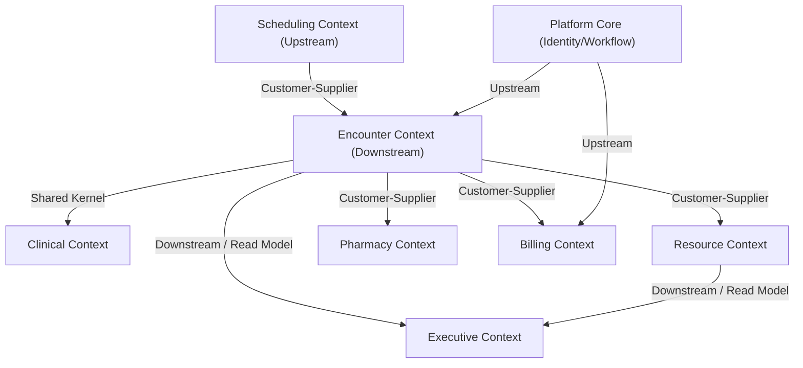

# Bounded Context Map — Bella Healthcare Platform

Tài liệu bản đồ tích hợp Bounded Contexts (Context Map) xác định các mối quan hệ tích hợp, ranh giới dữ liệu và mô hình giao tiếp giữa các phân hệ nghiệp vụ y tế.

---

## 📌 Context Relationship Diagram

---

## 🤝 Context Relations & Integration Patterns

### 1. Scheduling Context ➔ Encounter Context
- **Pattern**: Customer-Supplier.
- **Mô tả**: Khi một lịch hẹn được xác nhận (`Scheduling.Appointment.Created.v1`), Encounter Context lắng nghe để tạo một đợt khám nháp ở trạng thái `planned`.

### 2. Encounter Context ➔ Resource Context
- **Pattern**: Customer-Supplier.
- **Mô tả**: Khi bệnh nhân check-in đến phòng khám (`Encounter.Patient.Arrived.v1`), Encounter Context gửi tín hiệu để Resource Context thực hiện chiếm dụng ghế điều trị trống (`AssignChairCommand`).

### 3. Encounter Context ➔ Clinical Context
- **Pattern**: Shared Kernel.
- **Mô tả**: Đợt khám và Sơ đồ răng (Odontogram) chia sẻ chung một số thực thể cơ bản như mã răng (`ToothData`) và hồ sơ bệnh án cơ bản.

### 4. Pharmacy Context ➔ Encounter Context
- **Pattern**: Customer-Supplier / ACL.
- **Mô tả**: Đơn thuốc được tạo lập dựa trên đợt khám. Pharmacy Context phải kiểm tra thông tin dị ứng từ Patient Context thông qua lớp Anti-Corruption Layer (ACL) trước khi duyệt đơn.
