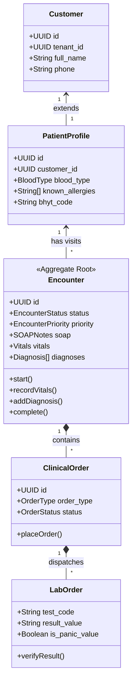

# 📋 Báo Cáo Đặc Tả Thực Thi: Bella Healthcare Executable Specification v1.0

> **Trạng thái:** 🔒 **FINAL ARCHITECTURE APPROVED, PIA PASSED & SPRINT 1 CODE GATE SIGNED-OFF**  
> **Tuân thủ:** Bella Healthcare Constitution v1.0, HL7 FHIR, ISO 27001 & ISO 13485  
> **Mục tiêu:** Cung cấp bộ đặc tả triển khai 100% chính xác & Tiêu chí nghiệm thu (Acceptance Criteria) cho từng Capability trước khi code Sprint 1.

---

## 📑 Mục Lục
1. [Capability Catalog](#1-capability-catalog)
2. [Database Schema DDL](#2-database-schema-ddl)
3. [Domain Models & Aggregates Specification](#3-domain-models--aggregates-specification)
4. [Event Catalog & JSON Schemas](#4-event-catalog--json-schemas)
5. [API Contracts (OpenAPI Specifications)](#5-api-contracts-openapi-specifications)
6. [Granular Permission Matrix (RBAC)](#6-granular-permission-matrix-rbac)
7. [Workflow Manifests (Patient Journey & Order Flows)](#7-workflow-manifests)
8. [Final Architecture Blindspot Review (7 Controls)](#8-final-architecture-blindspot-review)
9. [Capability Test Specifications & Acceptance Criteria](#9-capability-test-specifications--acceptance-criteria)
10. [Backward Compatibility & Zero Regression Policy](#10-backward-compatibility--zero-regression-policy)
11. [Extension Strategy (Additive Extension Only)](#11-extension-strategy-additive-extension-only)
12. [Platform Impact Assessment (PIA) & Architecture Code Gate](#12-platform-impact-assessment-pia--architecture-code-gate)

---

## 1. Capability Catalog

Danh mục 10 Capabilities cốt lõi thuộc tầng **Layer 2 (Healthcare Capabilities)** của Bella Healthcare Meta-Platform:

| ID Capability | Tên Capability | Trạng thái | Required Dependencies | Capabilities phụ thuộc tùy chọn | Chức năng cốt lõi |
| :--- | :--- | :--- | :--- | :--- | :--- |
| **`patient`** | Patient Identity Extension | `production` | `shared_kernel` | `crm`, `insurance` | Quản lý Hồ sơ y tế, Nhóm máu, Tiền sử dị ứng, BHYT mở rộng từ Core `customers`. |
| **`clinical`** | Clinical & EMR Engine | `production` | `patient`, `practitioner` | `clinical_orders`, `billing` | Quản lý Lượt khám `Encounter` (Aggregate Root), Ghi nhận Sinh hiệu (Vitals), SOAP Notes, Mã hóa bệnh tật ICD10. |
| **`clinical_orders`**| Clinical Order Engine | `production` | `clinical`, `encounter` | `laboratory`, `imaging`, `pharmacy` | Cổng Y lệnh trung tâm tự động phân phối đơn hàng tới LIS, RIS, Nhà thuốc, Thủ thuật. |
| **`laboratory`** | Laboratory LIS Engine | `production` | `clinical_orders` | `billing`, `insurance` | Danh mục XN, Mẫu bệnh phẩm (`lab_samples`), Mã vạch ống nghiệm (`lab_tubes`), Nhập/Duyệt kết quả XN, Panic Values. |
| **`imaging`** | Imaging RIS Engine | `production` | `clinical_orders` | `billing` | Quản lý Ca chụp X-Quang/CT/MRI/Siêu âm, Viewer link DICOM PACS, Báo cáo chẩn đoán hình ảnh. |
| **`pharmacy`** | Pharmacy & Drug Engine | `production` | `inventory_core` | `clinical_orders`, `billing` | Quản lý Dược y tế (Hoạt chất, ATC, Lô/Hạn dùng, Thuốc độc/Bảo quản lạnh), Đơn thuốc điện tử & Trừ kho. |
| **`billing`** | Medical Billing Engine | `production` | `clinical`, `orders` | `insurance`, `accounting_outbox` | Phân tách `charge_items`, Bảng giá BHYT/Dịch vụ/BH Tư nhân, Xuất Hóa đơn, Thu tiền, Hoàn tiền. |
| **`insurance`** | Standalone Insurance | `production` | `patient`, `billing` | `accounting_outbox` | Tra cứu thẻ BHYT (`eligibility`), Giấy xác nhận bảo lãnh viện phí, Hồ sơ quyết toán BHYT (`claims`). |
| **`workflow_queue`** | Patient Journey Queue | `production` | `clinical` | `laboratory`, `imaging`, `pharmacy` | Cấp số STT tự động, Màn hình TV Gọi số, Theo dõi hành trình bệnh nhân realtime qua các trạm. |
| **`admission`** | Inpatient & Hospital Core | `beta` | `clinical`, `resource` | `operating_room`, `icu` | Quản lý Nhập viện, Lưu bệnh, Quản lý Buồng/Giường bệnh (Tiền đề mở rộng cho Bella Hospital). |

---

## 2. Database Schema DDL

Chi tiết cấu trúc bảng cơ sở dữ liệu PostgreSQL cho phân hệ Healthcare (Cam kết Additive 100%, không phá vỡ Schema cũ):

```sql
-- 1. PATIENT PROFILES (Extension of `customers`)
CREATE TABLE IF NOT EXISTS public.patient_profiles (
    id UUID PRIMARY KEY DEFAULT gen_random_uuid(),
    tenant_id UUID NOT NULL REFERENCES public.tenants(id) ON DELETE CASCADE,
    customer_id UUID NOT NULL REFERENCES public.customers(id) ON DELETE CASCADE UNIQUE,
    blood_type TEXT DEFAULT 'UNKNOWN' CHECK (blood_type IN ('A+', 'A-', 'B+', 'B-', 'AB+', 'AB-', 'O+', 'O-', 'UNKNOWN')),
    rh_factor TEXT,
    known_allergies JSONB DEFAULT '[]'::jsonb,
    medical_history JSONB DEFAULT '[]'::jsonb,
    family_medical_history JSONB DEFAULT '[]'::jsonb,
    bhyt_code TEXT,
    bhyt_benefit_rate INTEGER DEFAULT 80,
    bhyt_initial_facility TEXT,
    bhyt_valid_from DATE,
    bhyt_valid_to DATE,
    emergency_contact_name TEXT,
    emergency_contact_phone TEXT,
    emergency_contact_relationship TEXT,
    created_at TIMESTAMPTZ DEFAULT now() NOT NULL,
    updated_at TIMESTAMPTZ DEFAULT now() NOT NULL
);

-- 2. HEALTHCARE ENCOUNTERS (EMR Aggregate Root)
CREATE TABLE IF NOT EXISTS public.hc_encounters (
    id UUID PRIMARY KEY DEFAULT gen_random_uuid(),
    tenant_id UUID NOT NULL REFERENCES public.tenants(id) ON DELETE CASCADE,
    patient_id UUID NOT NULL REFERENCES public.patient_profiles(id) ON DELETE CASCADE,
    customer_id UUID NOT NULL REFERENCES public.customers(id) ON DELETE CASCADE,
    practitioner_id UUID REFERENCES public.users(id) ON DELETE SET NULL,
    facility_id UUID REFERENCES public.branches(id) ON DELETE SET NULL,
    status TEXT NOT NULL DEFAULT 'planned' CHECK (status IN ('planned', 'arrived', 'in_triage', 'in_consultation', 'orders_pending', 'under_review', 'billing_pending', 'pharmacy_pending', 'completed', 'cancelled')),
    priority TEXT DEFAULT 'routine' CHECK (priority IN ('routine', 'urgent', 'emergency')),
    chief_complaint TEXT,
    subjective_notes TEXT,
    objective_notes TEXT,
    assessment_notes TEXT,
    plan_notes TEXT,
    vitals JSONB DEFAULT '{}'::jsonb,
    diagnoses JSONB DEFAULT '[]'::jsonb,
    timeline_events JSONB DEFAULT '[]'::jsonb,
    started_at TIMESTAMPTZ DEFAULT now() NOT NULL,
    completed_at TIMESTAMPTZ,
    created_at TIMESTAMPTZ DEFAULT now() NOT NULL,
    updated_at TIMESTAMPTZ DEFAULT now() NOT NULL
);

-- 3. CLINICAL ORDERS TABLE
CREATE TABLE IF NOT EXISTS public.hc_clinical_orders (
    id UUID PRIMARY KEY DEFAULT gen_random_uuid(),
    tenant_id UUID NOT NULL REFERENCES public.tenants(id) ON DELETE CASCADE,
    encounter_id UUID NOT NULL REFERENCES public.hc_encounters(id) ON DELETE CASCADE,
    patient_id UUID NOT NULL REFERENCES public.patient_profiles(id) ON DELETE CASCADE,
    ordering_practitioner_id UUID REFERENCES public.users(id) ON DELETE SET NULL,
    order_type TEXT NOT NULL CHECK (order_type IN ('laboratory', 'imaging', 'medication', 'procedure', 'diet', 'rehabilitation')),
    status TEXT NOT NULL DEFAULT 'placed' CHECK (status IN ('draft', 'placed', 'in_progress', 'completed', 'cancelled')),
    priority TEXT DEFAULT 'routine' CHECK (priority IN ('routine', 'urgent', 'emergency')),
    notes TEXT,
    ordered_at TIMESTAMPTZ DEFAULT now() NOT NULL,
    updated_at TIMESTAMPTZ DEFAULT now() NOT NULL
);

-- 4. LABORATORY ORDERS & ITEMS (LIS)
CREATE TABLE IF NOT EXISTS public.hc_lab_orders (
    id UUID PRIMARY KEY DEFAULT gen_random_uuid(),
    tenant_id UUID NOT NULL REFERENCES public.tenants(id) ON DELETE CASCADE,
    clinical_order_id UUID NOT NULL REFERENCES public.hc_clinical_orders(id) ON DELETE CASCADE,
    encounter_id UUID NOT NULL REFERENCES public.hc_encounters(id) ON DELETE CASCADE,
    test_code TEXT NOT NULL,
    test_name TEXT NOT NULL,
    sample_type TEXT,
    tube_color TEXT,
    result_value TEXT,
    result_unit TEXT,
    reference_range TEXT,
    is_abnormal BOOLEAN DEFAULT false,
    is_panic_value BOOLEAN DEFAULT false,
    verified_by UUID REFERENCES public.users(id) ON DELETE SET NULL,
    verified_at TIMESTAMPTZ,
    created_at TIMESTAMPTZ DEFAULT now() NOT NULL
);

-- 5. IMAGING ORDERS & DICOM LINKS (RIS)
CREATE TABLE IF NOT EXISTS public.hc_imaging_orders (
    id UUID PRIMARY KEY DEFAULT gen_random_uuid(),
    tenant_id UUID NOT NULL REFERENCES public.tenants(id) ON DELETE CASCADE,
    clinical_order_id UUID NOT NULL REFERENCES public.hc_clinical_orders(id) ON DELETE CASCADE,
    encounter_id UUID NOT NULL REFERENCES public.hc_encounters(id) ON DELETE CASCADE,
    modality TEXT NOT NULL CHECK (modality IN ('XRAY', 'CT', 'MRI', 'ULTRASOUND', 'ENDOSCOPY')),
    body_site TEXT NOT NULL,
    dcm_study_uid TEXT,
    viewer_link TEXT,
    radiologist_report TEXT,
    radiologist_id UUID REFERENCES public.users(id) ON DELETE SET NULL,
    verified_at TIMESTAMPTZ,
    created_at TIMESTAMPTZ DEFAULT now() NOT NULL
);

-- 6. DRUG PROFILES (Pharmacy Extension for `inventory_items`)
CREATE TABLE IF NOT EXISTS public.hc_drug_profiles (
    id UUID PRIMARY KEY DEFAULT gen_random_uuid(),
    tenant_id UUID NOT NULL REFERENCES public.tenants(id) ON DELETE CASCADE,
    inventory_item_id UUID NOT NULL REFERENCES public.inventory_items(id) ON DELETE CASCADE UNIQUE,
    drug_code TEXT NOT NULL,
    active_ingredient TEXT NOT NULL,
    atc_code TEXT,
    dosage_form TEXT,
    strength TEXT,
    route_of_administration TEXT,
    is_controlled_drug BOOLEAN DEFAULT false,
    is_cold_storage BOOLEAN DEFAULT false,
    created_at TIMESTAMPTZ DEFAULT now() NOT NULL
);

-- 7. PATIENT JOURNEY WORKFLOW QUEUE
CREATE TABLE IF NOT EXISTS public.hc_patient_queues (
    id UUID PRIMARY KEY DEFAULT gen_random_uuid(),
    tenant_id UUID NOT NULL REFERENCES public.tenants(id) ON DELETE CASCADE,
    encounter_id UUID NOT NULL REFERENCES public.hc_encounters(id) ON DELETE CASCADE,
    patient_name TEXT NOT NULL,
    ticket_number TEXT NOT NULL,
    queue_type TEXT DEFAULT 'service' CHECK (queue_type IN ('bhyt', 'service', 'followup', 'priority')),
    current_station TEXT DEFAULT 'registration' CHECK (current_station IN ('registration', 'vitals', 'consultation', 'lab', 'imaging', 'review', 'billing', 'pharmacy')),
    status TEXT DEFAULT 'waiting' CHECK (status IN ('waiting', 'called', 'in_service', 'completed', 'skipped')),
    called_at TIMESTAMPTZ,
    created_at TIMESTAMPTZ DEFAULT now() NOT NULL
);

-- 8. INDEXES & RLS ISOLATION POLICIES
CREATE INDEX IF NOT EXISTS idx_patient_profiles_tenant ON public.patient_profiles(tenant_id);
CREATE INDEX IF NOT EXISTS idx_patient_profiles_customer ON public.patient_profiles(customer_id);
CREATE INDEX IF NOT EXISTS idx_hc_encounters_tenant ON public.hc_encounters(tenant_id);
CREATE INDEX IF NOT EXISTS idx_hc_encounters_patient ON public.hc_encounters(patient_id);
CREATE INDEX IF NOT EXISTS idx_hc_clinical_orders_tenant ON public.hc_clinical_orders(tenant_id);
CREATE INDEX IF NOT EXISTS idx_hc_lab_orders_tenant ON public.hc_lab_orders(tenant_id);
CREATE INDEX IF NOT EXISTS idx_hc_imaging_orders_tenant ON public.hc_imaging_orders(tenant_id);
CREATE INDEX IF NOT EXISTS idx_hc_patient_queues_station ON public.hc_patient_queues(tenant_id, current_station, status);

ALTER TABLE public.patient_profiles ENABLE ROW LEVEL SECURITY;
ALTER TABLE public.hc_encounters ENABLE ROW LEVEL SECURITY;
ALTER TABLE public.hc_clinical_orders ENABLE ROW LEVEL SECURITY;
ALTER TABLE public.hc_lab_orders ENABLE ROW LEVEL SECURITY;
ALTER TABLE public.hc_imaging_orders ENABLE ROW LEVEL SECURITY;
ALTER TABLE public.hc_drug_profiles ENABLE ROW LEVEL SECURITY;
ALTER TABLE public.hc_patient_queues ENABLE ROW LEVEL SECURITY;

CREATE POLICY tenant_isolation_patient_profiles ON public.patient_profiles FOR ALL USING (tenant_id = public.get_auth_tenant_id());
CREATE POLICY tenant_isolation_hc_encounters ON public.hc_encounters FOR ALL USING (tenant_id = public.get_auth_tenant_id());
CREATE POLICY tenant_isolation_hc_clinical_orders ON public.hc_clinical_orders FOR ALL USING (tenant_id = public.get_auth_tenant_id());
CREATE POLICY tenant_isolation_hc_lab_orders ON public.hc_lab_orders FOR ALL USING (tenant_id = public.get_auth_tenant_id());
CREATE POLICY tenant_isolation_hc_imaging_orders ON public.hc_imaging_orders FOR ALL USING (tenant_id = public.get_auth_tenant_id());
CREATE POLICY tenant_isolation_hc_drug_profiles ON public.hc_drug_profiles FOR ALL USING (tenant_id = public.get_auth_tenant_id());
CREATE POLICY tenant_isolation_hc_patient_queues ON public.hc_patient_queues FOR ALL USING (tenant_id = public.get_auth_tenant_id());
```

---

## 3. Domain Models & Aggregates Specification



### Business Invariants (Quy Tắc Ràng Buộc Nghiệp Vụ Tối Thượng):
1. **Encounter Invariant:** Một `Encounter` không thể chuyển trạng thái thành `completed` khi còn bất kỳ `ClinicalOrder` nào ở trạng thái `placed` hoặc `in_progress`.
2. **Lab Panic Value Invariant:** Nếu chỉ số xét nghiệm đánh dấu `is_panic_value = true`, hệ thống phải tự động phát Event `LabPanicValueDetected.v1` thông báo khẩn cho Bác sĩ điều trị.
3. **Prescription Allergy Invariant:** Trước khi lưu đơn thuốc, CDSS Engine bắt buộc phải kiểm tra đối chiếu danh mục hoạt chất với `patient_profiles.known_allergies`.

---

## 4. Event Catalog & JSON Schemas

Tất cả các Domain Events được đăng ký tại **Centralized Event Contract Registry** (`ADR-008`):

### 1. `EncounterStarted.v1`
```json
{
  "$schema": "http://json-schema.org/draft-07/schema#",
  "title": "EncounterStartedPayload",
  "type": "object",
  "properties": {
    "encounterId": { "type": "string", "format": "uuid" },
    "patientId": { "type": "string", "format": "uuid" },
    "customerId": { "type": "string", "format": "uuid" },
    "practitionerId": { "type": "string", "format": "uuid" },
    "facilityId": { "type": "string", "format": "uuid" },
    "priority": { "type": "string", "enum": ["routine", "urgent", "emergency"] },
    "startedAt": { "type": "string", "format": "date-time" }
  },
  "required": ["encounterId", "patientId", "customerId", "practitionerId", "startedAt"]
}
```

### 2. `LabResultVerified.v1`
```json
{
  "$schema": "http://json-schema.org/draft-07/schema#",
  "title": "LabResultVerifiedPayload",
  "type": "object",
  "properties": {
    "orderId": { "type": "string", "format": "uuid" },
    "encounterId": { "type": "string", "format": "uuid" },
    "patientId": { "type": "string", "format": "uuid" },
    "verifiedBy": { "type": "string", "format": "uuid" },
    "hasPanicValue": { "type": "boolean" },
    "verifiedAt": { "type": "string", "format": "date-time" }
  },
  "required": ["orderId", "encounterId", "verifiedBy", "hasPanicValue", "verifiedAt"]
}
```

### 3. `PrescriptionIssued.v1`
```json
{
  "$schema": "http://json-schema.org/draft-07/schema#",
  "title": "PrescriptionIssuedPayload",
  "type": "object",
  "properties": {
    "prescriptionId": { "type": "string", "format": "uuid" },
    "encounterId": { "type": "string", "format": "uuid" },
    "patientId": { "type": "string", "format": "uuid" },
    "doctorPractitionerId": { "type": "string", "format": "uuid" },
    "itemCount": { "type": "integer" },
    "issuedAt": { "type": "string", "format": "date-time" }
  },
  "required": ["prescriptionId", "encounterId", "patientId", "itemCount", "issuedAt"]
}
```

---

## 5. API Contracts (OpenAPI Specifications)

Sơ lược Hợp đồng API chuẩn OpenAPI 3.0 cho các Endpoint thuộc `healthcare`:

### `POST /api/v1/healthcare/encounters`
- **Mục đích:** Tạo mới lượt khám y tế (`EncounterStarted`).
- **Headers:** `Authorization: Bearer <token>`, `x-tenant-id: <uuid>`
- **Request Body:**
```json
{
  "customerId": "3fa85f64-5717-4562-b3fc-2c963f66afa6",
  "practitionerId": "7c9e6679-7425-40de-944b-e07fc1f90ae7",
  "facilityId": "e12f4580-8910-11ec-b909-0242ac120002",
  "chiefComplaint": "Đau vùng thượng vị kéo dài 3 ngày",
  "priority": "routine"
}
```
- **Response (201 Created):**
```json
{
  "success": true,
  "data": {
    "id": "a9b8c7d6-e5f4-3a2b-1c0d-9e8f7a6b5c4d",
    "status": "in_progress",
    "startedAt": "2026-08-06T14:15:00Z"
  }
}
```

---

## 6. Granular Permission Matrix (RBAC)

Phân quyền chi tiết (RBAC) trên từng vai trò người dùng chuyên trách trong phân hệ y tế:

| Quyền hạn (Permission Code) | Bác sĩ (`Doctor`) | Điều dưỡng (`Nurse`) | KTV Lab (`LabTech`) | Bác sĩ CĐHA (`Radiologist`) | Dược sĩ (`Pharmacist`) | Thu ngân (`BillingCashier`) | Lễ tân (`Receptionist`) | Admin (`ClinicAdmin`) |
| :--- | :---: | :---: | :---: | :---: | :---: | :---: | :---: | :---: |
| `clinical.encounter.create` | ✅ | ❌ | ❌ | ❌ | ❌ | ❌ | ✅ | ✅ |
| `clinical.encounter.read` | ✅ | ✅ | ✅ | ✅ | ✅ | ✅ | ✅ | ✅ |
| `clinical.vitals.record` | ✅ | ✅ | ❌ | ❌ | ❌ | ❌ | ❌ | ✅ |
| `clinical.soap.update` | ✅ | ❌ | ❌ | ❌ | ❌ | ❌ | ❌ | ✅ |
| `clinical.order.create` | ✅ | ❌ | ❌ | ❌ | ❌ | ❌ | ❌ | ✅ |
| `lab.result.verify` | ❌ | ❌ | ✅ | ❌ | ❌ | ❌ | ❌ | ✅ |
| `imaging.report.verify` | ❌ | ❌ | ❌ | ✅ | ❌ | ❌ | ❌ | ✅ |
| `pharmacy.prescription.dispense`| ❌ | ❌ | ❌ | ❌ | ✅ | ❌ | ❌ | ✅ |
| `billing.invoice.create` | ❌ | ❌ | ❌ | ❌ | ❌ | ✅ | ❌ | ✅ |
| `insurance.claim.submit` | ❌ | ❌ | ❌ | ❌ | ❌ | ✅ | ❌ | ✅ |

---

## 7. Workflow Manifests

### 1. Medical Clinic Standard Patient Journey Workflow Manifest
```json
{
  "workflowId": "medical_clinic_standard_journey",
  "version": "1.0.0",
  "initialNode": "registration",
  "nodes": [
    { "id": "registration", "label": "Đón tiếp & Cấp số STT", "next": ["vitals"] },
    { "id": "vitals", "label": "Đo Sinh hiệu", "next": ["consultation"] },
    { "id": "consultation", "label": "Khám lâm sàng bác sĩ", "next": ["orders", "billing", "pharmacy"] },
    { "id": "orders", "label": "Thực hiện XN / CĐHA", "next": ["review"] },
    { "id": "review", "label": "Bác sĩ đọc kết quả & Kê đơn", "next": ["billing"] },
    { "id": "billing", "label": "Thanh toán & Xuất hóa đơn/BHYT", "next": ["pharmacy"] },
    { "id": "pharmacy", "label": "Xuất thuốc Nhà thuốc", "next": ["completed"] },
    { "id": "completed", "label": "Hoàn tất lượt khám", "next": [] }
  ]
}
```

---

## 8. Final Architecture Blindspot Review (7 Controls)

Đã rà soát và xác nhận 7 điểm mù kiến trúc (Blindspots Verification):

1. **Aggregate Boundary Isolation:** `Encounter` không vật lý nhúng (nest) các Aggregate `Prescription`, `LabOrder`, hay `Invoice`. `Encounter` chỉ lưu ID tham chiếu và phát ra các Domain Events (`ClinicalOrderCreated.v1`, `PrescriptionIssued.v1`).
2. **Unidirectional Event Storming:** Chuỗi sự kiện vận hành theo 1 chiều tuyến tính, không bị lặp vòng:  
   `RegistrationCompleted` $\rightarrow$ `EncounterStarted` $\rightarrow$ `ClinicalOrderCreated` $\rightarrow$ `LabOrderCreated` $\rightarrow$ `LabResultVerified` $\rightarrow$ `PrescriptionIssued` $\rightarrow$ `HealthcareInvoiceCreated` $\rightarrow$ `MedicationDispensed`.
3. **Pure Capability Dependency:** Phụ thuộc Capability hoàn toàn độc lập với UI (`laboratory` chỉ phụ thuộc `clinical_orders`, không phụ thuộc vào React Components).
4. **Database Additive Strategy (Zero Regression):** Không duplicate `customers`, `inventory`, `finance`. Các bảng y tế được tạo theo dạng Additive Extension (`patient_profiles`, `hc_drug_profiles`, `hc_encounters`).
5. **Event Payload Immutability:** Payload của `.v1` không bị sửa đổi sau khi công bố. Nếu có thay đổi cấu trúc sẽ phát hành phiên bản `.v2`.
6. **API DTO Separation:** API không lộ trực tiếp Entities Database. Mọi Endpoint đều đi qua lớp Data Transfer Object (DTO).
7. **Complete ADR Documentation:** 100% quyết định kiến trúc quan trọng được lưu giữ tại `docs/adr/ADR-001` đến `ADR-009`.

---

## 9. Capability Test Specifications & Business Acceptance Criteria

Mỗi Capability được nghiệm thu dựa trên kịch bản kiểm thử BDD (Given-When-Then) & Tiêu chí hoàn thành (Definition of Done):

### 1. `clinical` Capability Acceptance Criteria
- **Scenario 1: Bắt đầu Lượt khám thành công**
  - **Given:** Bệnh nhân có hồ sơ hợp lệ tại `customers` và `patient_profiles`. Bác sĩ có lịch trực active.
  - **When:** Bấm kích hoạt "Khám bệnh" với lý do khám "Sốt nhẹ".
  - **Then:** Tạo mới `hc_encounters` trạng thái `in_consultation`, phát event `EncounterStarted.v1`.
- **Scenario 2: Ngăn chặn đóng Lượt khám khi Y lệnh chưa xong (Invariant Guard)**
  - **Given:** `Encounter` có 1 `ClinicalOrder` xét nghiệm máu đang ở trạng thái `in_progress`.
  - **When:** Bác sĩ bấm "Hoàn tất lượt khám".
  - **Then:** Hệ thống từ chối đóng, trả về lỗi: `"Không thể hoàn tất: Còn Y lệnh cận lâm sàng chưa kết thúc"`.

### 2. `laboratory` Capability Acceptance Criteria
- **Scenario 1: Xử lý Panic Value khẩn cấp**
  - **Given:** KTV Xét nghiệm nhập chỉ số Kali máu = 6.8 mmol/L (Cảnh báo sinh tử).
  - **When:** KTV bấm "Duyệt kết quả".
  - **Then:** Đánh dấu `is_panic_value = true`, phát ra Event `LabPanicValueDetected.v1` gửi thông báo khẩn tới Bác sĩ chỉ định.

### 3. `billing` & `accounting_outbox` Acceptance Criteria
- **Scenario 1: Phân tách BHYT và đẩy Event Outbox Sổ cái**
  - **Given:** Lượt khám tổng chi phí 1.000.000 VNĐ. Thẻ BHYT có mức hưởng 80%.
  - **When:** Thu ngân bấm "Thanh toán hóa đơn".
  - **Then:** Hệ thống tự động tính BHYT chi trả 800.000 VNĐ, bệnh nhân đồng chi trả 200.000 VNĐ. Đẩy Event Outbox cho `AccountingEngineService` để ghi bút toán Nợ 1111/Co 5113 mà KHÔNG ghi trực tiếp sổ cái.

---

## 10. Backward Compatibility & Zero Regression Policy

- **Quy tắc cốt lõi:** `Healthcare Platform MUST NOT modify any existing Core Domain behavior.`
- **Cấm (Forbidden):** ❌ Sửa đổi APIs hiện có, ❌ Sửa đổi Business Logic cũ, ❌ Sửa đổi Schema bảng dữ liệu cũ, ❌ Phá vỡ vận hành của tenant hiện tại (`beauty_spa`, `babycare`, `real_estate`, `industrial_cleaning`, `bella_auto`).
- **Cho phép (Allowed):** ✅ Thêm bảng mới, ✅ Thêm Capabilities mới, ✅ Thêm Events mới, ✅ Thêm Manifests mới, ✅ Thêm Feature Flags & Adapters.

---

## 11. Extension Strategy (Additive Extension Only)

$$\text{Anti-Patterns: } \times \text{Rewrite} \quad \times \text{Replace} \quad \times \text{Fork} \quad \times \text{Duplicate}$$
$$\text{Design Patterns: } \checkmark \text{Extend} \quad \checkmark \text{Compose} \quad \checkmark \text{Plugin} \quad \checkmark \text{Decorator} \quad \checkmark \text{Adapter}$$

### Platform Extension Mapping:
- **CRM:** `customers` (1-1) $\rightarrow$ `patient_profiles`.
- **Inventory:** `inventory_items` (1-1) $\rightarrow$ `hc_drug_profiles`.
- **Accounting:** Billing Outbox $\rightarrow$ `AccountingEngineService` (Không ghi sổ cái trực tiếp).
- **Workflow:** Register `Medical Workflow Manifest` (Không sửa Workflow Engine).
- **Permissions:** Register `doctor.*`, `nurse.*`, `lab.*` (Không sửa Core RBAC).
- **AI:** Event Bus $\rightarrow$ Bella EOS (Không nhét AI trực tiếp vào module).

---

## 12. Platform Impact Assessment (PIA) & Architecture Code Gate

### 📋 Bảng Đánh Giá Tác Động Nền Tảng (PIA Checklist):
- [x] Có sửa đổi Core Platform không? $\rightarrow$ **NO** (Passed)
- [x] Có sửa đổi Database legacy không? $\rightarrow$ **NO** (Passed)
- [x] Có migration phá vỡ dữ liệu cũ không? $\rightarrow$ **NO** (Passed)
- [x] Có API Breaking Changes không? $\rightarrow$ **NO** (Passed)
- [x] Có ảnh hưởng đến các Tenant hiện tại không? $\rightarrow$ **NO** (Passed)
- [x] Có được bảo vệ bằng Feature Flag không? $\rightarrow$ **YES** (Passed)
- [x] Có khả năng Rollback an toàn không? $\rightarrow$ **YES** (Passed)

### 🏁 Architecture Code Gate Sign-Off (12/12 Approved):
- [x] ✅ **Gate 1:** Constitution Freeze
- [x] ✅ **Gate 2:** Executable Specification (`BELLA_HEALTHCARE_EXECUTABLE_SPECIFICATION.md`)
- [x] ✅ **Gate 3:** ADR Approved (`ADR-001` đến `ADR-009`)
- [x] ✅ **Gate 4:** Platform Impact Assessment (PIA) 100% Passed
- [x] ✅ **Gate 5:** Backward Compatibility Review Approved
- [x] ✅ **Gate 6:** Zero Regression Review Approved
- [x] ✅ **Gate 7:** Capability Dependency Review Approved
- [x] ✅ **Gate 8:** Security & HIPAA Privacy Review Approved
- [x] ✅ **Gate 9:** Database Additive Migration Review Approved
- [x] ✅ **Gate 10:** Safe Rollback Strategy Approved
- [x] ✅ **Gate 11:** Test & BDD Strategy Approved
- [x] ✅ **Gate 12:** Code Generation & Implementation Permission Granted
