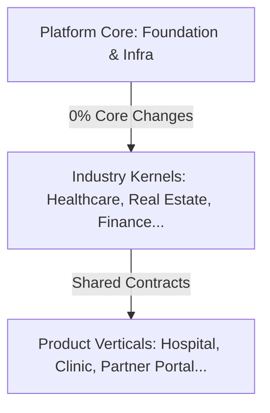

# BELLA AI PLATFORM — INVESTOR DECK
**Type:** Technical Pitch Deck (Slide-by-Slide Representation)  
**Target Audience:** Technology Investors, CTOs, VC Technical Partners  
**Read Time:** 10 Minutes  
**Language:** Tiếng Việt / English

---

## 🛝 SLIDE 1: Cover Slide
### Title: **Bella AI Platform: The Enterprise Multi-Industry OS Factory**
#### Subtitle: *Xây dựng & vận hành các hệ thống ERP chuyên ngành trên cùng một nền tảng công nghệ lõi ổn định và tự động hóa cao.*

* **Visual:** Sơ đồ dòng chảy tự quản lý từ Core Platform (trung tâm) lan tỏa ra các Industry OS Kernels (Vòng trong) và các Product Verticals (Vòng ngoài).

* **Key Stats:**
  - **Reusability Ratio:** 1:3 (Healthcare Kernel)
  - **Core Modification Rate:** 0 (ReadOnly Core)
  - **Failing Tests (CI Gate):** 0 P0 Violations

---

## 🛝 SLIDE 2: The Core Problem
### Title: **Nỗi đau ERP & SaaS của Doanh nghiệp SME tại Việt Nam**
#### Subtitle: *Thực trạng phân mảnh, chi phí cao và thiếu khả năng thích ứng thông minh.*

* **Key Points:**
  - **Phân mảnh sâu sắc:** Doanh nghiệp phải sử dụng 5-10 công cụ rời rạc (Excel, Chat, POS, HR) gây thất thoát dữ liệu và bất đồng bộ tài chính.
  - **SaaS "One-Size-Fits-All":** Các phần mềm toàn cầu (Salesforce, Odoo) quá đắt đỏ và không tối ưu cho nghiệp vụ bản địa (Luật kế toán Việt Nam TT133/2016, văn hóa bán hàng).
  - **Chi phí phát triển tuyến tính:** Khi xây dựng phần mềm cho ngành mới, các công ty công nghệ phải viết lại từ 70-80% code, tích lũy nợ kỹ thuật (Technical Debt) khổng lồ.
  - **AI chỉ là "Tính năng gắn thêm" (Bolt-on):** Hầu hết phần mềm chỉ tích hợp Chatbot hời hợt, không tham gia vào luồng vận hành và ra quyết định thực tế.

---

## 🛝 SLIDE 3: The Bella Vision
### Title: **Tầm nhìn Bella: Nền tảng "Platform of Platforms" đầu tiên tại SEA**
#### Subtitle: *Định nghĩa lại cách xây dựng phần mềm doanh nghiệp thông qua khả năng tái sử dụng tối đa.*

* **Core Message:**
  > **Bella không phải là một SaaS đơn lẻ. Bella là một Nền tảng AI Doanh nghiệp có khả năng tạo ra nhiều Industry OS với chi phí và thời gian giảm dần theo đường cong lũy thừa.**

* **Visual Concept:**
```
                     BELLA PLATFORM CORE
                              │
          ┌───────────────────┼───────────────────┐
          ▼                   ▼                   ▼
   Healthcare OS          Finance OS        Real Estate OS
   (EMR, Bed, CDS)     (Ledger, Cash)     (Inventory, Comm)
          │                   │                   │
   ┌──────┼──────┐            │                   │
   ▼      ▼      ▼            ▼                   ▼
Hospital Clinic Dental     Corporate          Partner Portal
```
* **Slogan:** *"Một nền tảng lõi. Mọi phân hệ chuyên ngành. Tăng trưởng phi tuyến tính."*

---

## 🛝 SLIDE 4: Architecture - 3-Layer Isolation
### Title: **Kiến trúc 3 Lớp: Tách biệt tuyệt đối Core – Kernel – Product**
#### Subtitle: *Khóa băng lõi hệ thống để đạt độ ổn định 99.9% và tối ưu hóa tốc độ ra mắt thị trường.*

* **Visual:** Sơ đồ phân lớp kiến trúc.
```mermaid
graph BT
    subgraph Product Layer [Product Verticals UI & Orchestration]
        Hospital[bella-hospital]
        Clinic[bella-medical]
        Portal[bella-land]
    end
    subgraph Kernel Layer [Industry Kernels Domain Logic]
        HC[Healthcare Kernel: 27 Engines]
        FI[Finance Kernel: Ledger, Cash]
        RE[Real Estate Kernel: Property]
    end
    subgraph Core Layer [Platform Core - FROZEN]
        Foundation[Org, People, Assignment]
        Infra[Event Bus, State Machine, Policy Engine, AI]
    end
    Product Layer --> Kernel Layer
    Kernel Layer --> Core Layer
```
* **Speaker Notes:**
  - **Core Layer (Đã khóa băng):** Cung cấp hạ tầng dùng chung (Event Bus, State Machine, Policy Engine).
  - **Kernel Layer (Chuyên ngành):** Chứa nghiệp vụ đặc thù (e.g. 27 Engines của Y tế, Kế toán kép).
  - **Product Layer (Giao diện & Cấu hình):** Tùy biến theo từng khách hàng/tenant mà không chạm vào lõi.

---

## 🛝 SLIDE 5: Platform Core - The Engine Room
### Title: **Platform Core: Bộ não công nghệ dùng chung**
#### Subtitle: *Tập hợp các Services và Engine thuần kỹ thuật, không phụ thuộc nghiệp vụ ngành.*

* **Key Capabilities:**
  - **Platform Foundation (`src/foundation/`):** Quản lý Tổ chức đa chi nhánh (`organization`), Nhân sự (`people`), Điều phối công việc (`assignment`).
  - **Event Bus (`core/events/`):** Tích hợp hướng sự kiện (Outbox Pattern), đảm bảo các phân hệ giao tiếp phi đồng bộ và không ràng buộc cứng (Loosely Coupled).
  - **Policy Engine (`core/policy-engine/`):** Chuyển đổi luật kinh doanh từ code cứng sang runtime configuration. Sửa quy trình duyệt mà không cần deploy lại.
  - **State Machine (`core/state-machine/`):** Vận hành tự động các luồng công việc phức tạp (Workflow Orchestration).

---

## 🛝 SLIDE 6: Industry Kernels - Specialized Powerhouses
### Title: **Industry Kernels: Sức mạnh chuyên biệt hóa**
#### Subtitle: *Nơi hội tụ tri thức nghiệp vụ của các ngành dọc cốt lõi.*

* **The Portfolio:**
  - **Healthcare Kernel (H1–H27):** 27 động cơ chuyên biệt (Admission, Bed Management, Clinical Decision Support - CDS, Pharmacy, Encounter).
  - **Finance Kernel (F1–F5):** Sổ cái kế toán kép (`ledger`), dòng tiền (`cash`), quản lý công nợ phải thu (`accounts-receivable`), kế toán bản địa (TT133/2016).
  - **Education Kernel:** Đăng ký học, thời khóa biểu, điểm danh, đánh giá năng lực học sinh.
  - **Real Estate Kernel:** Quản lý giỏ hàng (`property inventory`), giữ chỗ (`reservation`), hoa hồng (`commission`).

---

## 🛝 SLIDE 7: Tenant Isolation & Security
### Title: **Cách ly Tenant Tuyệt đối & RLS Database**
#### Subtitle: *Bảo mật dữ liệu cấp ngân hàng cho 10,000+ doanh nghiệp trên cùng một hạ tầng.*

* **Visual Concept:**
```
[ Tenant Request ] ──► [ Next.js Middleware ] ──► [ RLS Enforced at Postgres ]
                              │
                      [ JWT Verification ]
                              ▼
                 Access Isolated dynamically 
             (No Cross-Tenant Queries Allowed)
```
* **Key Features:**
  - **Row-Level Security (RLS):** Bắt buộc ở mức PostgreSQL Database. Mọi câu lệnh SQL tự động lọc theo `tenant_id`.
  - **Không rò rỉ dữ liệu (P0 Boundary):** 100% kiểm thử cách ly tenant hoạt động tự động trong CI.
  - **Opt-in Configuration:** Các Tenant tự do bật/tắt các module chuyên ngành thông qua cấu hình hệ thống mà không ảnh hưởng lẫn nhau.

---

## 🛝 SLIDE 8: Reusability - Healthcare 1:3 Proof
### Title: **Minh chứng tái sử dụng: Hệ sinh thái Healthcare 1:3**
#### Subtitle: *1 Kernel duy nhất vận hành đồng thời 3 hệ thống sản phẩm khác biệt.*

* **The Evidence:**
  - **1 Healthcare Kernel (27 engines)** → Cung cấp sức mạnh cho **3 sản phẩm độc lập** (Hospital, Medical Clinic, Dental Clinic).
  - **Trùng lặp code nghiệp vụ:** **0%** (Tất cả gọi chung qua Public Contracts).
  - **Sơ đồ phân bổ khả năng tái sử dụng:**
```
  [ Healthcare Kernel (27 Engines) ]
       ├── powers ──► Hospital Product  (EMR, Bed, Queue, CDS...)
       ├── powers ──► Clinic Product    (Encounter, Order, Lab...)
       └── powers ──► Dental Product    (Encounter, Audit, CDS...)
```
* **Technical Fact:** Mọi sản phẩm y tế thứ 4 (e.g. Veterinary, Home Care) chỉ cần kế thừa lại các engines hiện có thông qua Contract, giảm thời gian viết code mới xuống dưới 20%.

---

## 🛝 SLIDE 9: Platform Economics - Marginal Cost Curve
### Title: **Hiệu quả kinh tế: Đường cong chi phí biên giảm dần**
#### Subtitle: *Sức mạnh tài chính của mô hình nhà máy phần mềm (Software Factory).*

* **Visual:** Biểu đồ thể hiện chi phí biên qua từng sản phẩm.
```
  Nỗ lực phát triển (Effort)
  100% | █ (Sản phẩm #1: Hospital)
   30% | █ (Sản phẩm #2: Clinic - Giảm 70% nỗ lực)
   20% | █ (Sản phẩm #3: Dental - Giảm 80% nỗ lực)
   <5% | █ (Sản phẩm #10+ - Tái sử dụng tối đa)
       └───────────────────────────────────
```
* **The Business Logic:**
  - Sản phẩm đầu tiên trong ngành chịu 100% chi phí nghiên cứu và xây dựng Kernel.
  - Các sản phẩm tiếp theo thừa hưởng 80% nghiệp vụ chung, chỉ tập trung cấu hình UI/Orchestration.
  - **Biên lợi nhuận gộp (Gross Margin):** Tăng từ 40% ở sản phẩm đầu tiên lên **85%+** ở các sản phẩm tiếp theo.

---

## 🛝 SLIDE 10: Moat 1 - Architecture Guard
### Title: **Rào chắn Kiến trúc (Architecture Guard) tự động**
#### Subtitle: *Ngăn chặn nợ kỹ thuật và bảo vệ tính nguyên bản của Platform Core.*

* **Visual Concept:**
```
  Developer commits code ──► Static analysis check (No Core -> Kernel imports)
                                         │
        ┌────────────────────────────────┴────────────────────────────────┐
        ▼                                                                 ▼
[ Complies with Constitution ]                                 [ Violates Rules ]
        │                                                                 │
  Passes CI Gate ✅                                                 Blocked by CI ❌
```
* **Core Rules Enforced:**
  - **Cấm nhập ngược:** Core tuyệt đối không import từ Kernel hay Product.
  - **Khóa băng Kernels:** Các Kernel đã đóng băng (e.g. E7.1 Logistics) không thể bị thay đổi nếu không có đề xuất thay đổi kiến trúc (ACR) được ARB phê duyệt.
  - **100% Automated:** Hoạt động liên tục trong CI/CD, tự động từ chối các Pull Request vi phạm.

---

## 🛝 SLIDE 11: Moat 2 - BDGF (Bella Decentralized Governance Framework)
### Title: **BDGF: Quản trị phi tập trung và chống gian lận cấu hình**
#### Subtitle: *Quy trình khép kín bảo vệ các giao dịch cấu hình trong môi trường sản xuất.*

* **Key Governance Flow:**
  - **Quy trình 5 bước:** `Yêu cầu` ──► `Duyệt` ──► `Cấp mã khóa (Token)` ──► `Thực thi` ──► `Kiểm toán (Audit Trail)`.
  - **Tính bất biến:** Mọi thay đổi cấu hình tài chính/quy trình đều được mã hóa chữ ký số và lưu vết vĩnh viễn trong Audit Log, không thể bị xóa hoặc ghi đè (SOC 2 Ready).
  - **Tích hợp AWS Secrets Manager:** Quản lý và xoay vòng mã khóa (Key Rotation) tự động, bảo vệ hệ thống trước rủi ro rò rỉ quyền quản trị.

---

## 🛝 SLIDE 12: Moat 3 - AI Workforce & Intelligent Orchestration
### Title: **AI Workforce: Lớp nhân viên AI vận hành thực tế**
#### Subtitle: *AI không chỉ trò chuyện mà trực tiếp xử lý các quy trình nghiệp vụ.*

* **Operational Scenarios:**
  - **Đối soát lương tự động (AI Salary Reconciliation):** Tự động so sánh dữ liệu chấm công, hóa đơn spa và KPI để phát hiện sai lệch (Độ chính xác >95%, giảm 30% thời gian kiểm toán).
  - **Duyệt ứng viên/Đăng ký tự động:** AI đánh giá rủi ro, kiểm tra tính hợp lệ của hồ sơ đối tác (Real Estate), tự động cắm cờ các trường hợp nghi vấn cho con người xử lý.
  - **AI COO Copilot:** Giao diện ngôn ngữ tự nhiên truy vấn trực tiếp cơ sở dữ liệu phân tích đa chi nhánh của doanh nghiệp.

---

## 🛝 SLIDE 13: Performance - Production-Ready Evidence
### Title: **Minh chứng hiệu năng: Dữ liệu Benchmark Thực tế**
#### Subtitle: *Đảm bảo SLA phụ-giây (sub-second) dưới tải nặng.*

* **Key Performance Benchmarks (k6 Load Test):**
  - **Safe Capacity Limit:** Sustains **~70 VUs (~120 RPS)** with **sub-300ms** latency.
  - **SLA Compliance:** Latency for critical paths (e.g., `biz_customer_read`) stays below **500ms** under capacity.
  - **Decision Engine Throughput:** Over **65,000 decisions/second** (Commission Provider), with latencies ranging from **0.11ms to 1.50ms** (67x-909x faster than Drools/Camunda).
  - **Rate Limiting:** Active self-protection triggers `HTTP 429` when API concurrency thresholds are exceeded, ensuring core database stability.

---

## 🛝 SLIDE 14: Industry Expansion Plan (2026-2027)
### Title: **Kế hoạch mở rộng: 10 Industries đến năm 2027**
#### Subtitle: *Bản đồ mở rộng dựa trên mức độ sẵn sàng của hạ tầng lõi.*

* **Visual Expansion Roadmap:**
```
  2024 (Foundation)  ──► 2025 (Productization) ──► 2026 (Expansion)    ──► 2027 (Scale)
  • Beauty Spa            • Finance Core           • Real Estate (Land)     • Education
  • Baby Care             • Accounting             • Healthcare (Hospital)  • Retail & Logistics
```
* **Reusability Leverage Strategy:**
  - Mỗi khi một Industry OS mới được xây dựng (e.g. Retail), các capability mới (e.g. Inventory/POS) được đưa ngược về Core/Finance Platform.
  - Platform ngày càng mạnh hơn, thời gian xây dựng Industry OS tiếp theo ngắn lại (từ 6 tháng xuống 6 tuần).

---

## 🛝 SLIDE 15: Commercial Model & Economics
### Title: **Mô hình doanh thu & Kinh tế học SaaS**
#### Subtitle: *Tối ưu hóa chỉ số LTV/CAC nhờ chi phí vận hành cực thấp.*

* **Revenue Streams:**
  - **Subscription Fee (70%):** Thuê bao hàng tháng dựa trên quy mô chi nhánh và số lượng User.
  - **Usage Fee (15%):** Thu phí dựa trên lượng giao dịch, SMS gửi đi, hoặc lượt gọi AI.
  - **Marketplace (10%):** Thu hoa hồng từ các ứng dụng/tích hợp của bên thứ ba.
  - **Premium AI Services (5%):** Thu phí vận hành các nhân viên AI chuyên biệt.
* **Target Unit Economics:**
  - **CAC (Chi phí có khách hàng):** ~5M VND.
  - **LTV (Giá trị trọn đời):** ~50M VND (Tỷ lệ LTV/CAC = **10x**).
  - **Payback Period (Thời gian hoàn vốn):** <6 tháng.
  - **Gross Margin:** **80%+**.

---

## 🛝 SLIDE 16: Roadmap 2026 - 2027
### Title: **Lộ trình phát triển sản phẩm & Tài chính**
#### Subtitle: *Các cột mốc chiến lược để sẵn sàng bùng nổ trong năm 2027.*

* **Key Milestones:**
  - **Q1-Q2 2026:** Hoàn thiện hạ tầng Định danh (Identity Platform), ra mắt Beta Real Estate OS (100+ đối tác).
  - **Q3-Q4 2026 (Hiện tại):** Triển khai Event Bus phi đồng bộ, chạy thử nghiệm hệ thống Healthcare OS (3 phòng khám). Khóa băng hoàn toàn Platform Core.
  - **Q1-Q2 2027:** Tích hợp lớp nhân viên AI Workforce (AI Accountant, AI COO). Mở rộng thêm 3 ngành (Education, Retail, Logistics).
  - **Q3-Q4 2027:** Khởi chạy cổng Marketplace cho bên thứ 3 tự xây dựng module. Đạt mốc **10,000+ Tenants** hoạt động và **50B+ ARR**.

---

## 🛝 SLIDE 17: The Investment Thesis
### Title: **Tại sao Bella đáng đầu tư vào thời điểm này?**
#### Subtitle: *Cơ hội sở hữu cổ phần của một cơ sở sản xuất phần mềm doanh nghiệp tự động hóa.*

* **4 Cột trụ đầu tư:**
  1. **Công nghệ thực tế, đã chạy thực tế:** Kiến trúc đã được chứng minh qua 5 Industries với hàng chục ngàn dòng code sản xuất và bằng chứng kiểm thử rõ ràng.
  2. **Kinh tế học compounding cực mạnh:** Càng nhiều ngành tham gia, lõi càng mạnh và chi phí biên càng tiệm cận về 0.
  3. **Rào chắn bảo vệ vững chắc:** BDGF, Architecture Guard ngăn ngừa nợ kỹ thuật - lỗi chết người của các công ty outsource truyền thống.
  4. **Điểm rơi thị trường (Timing):** SME Việt Nam đang khát khao chuyển đổi số chi phí thấp kết hợp AI. Bella là giải pháp phù hợp nhất về cả giá cả và nghiệp vụ bản địa.

---

## 💡 HƯỚNG DẪN TRÌNH BÀY (Presenter Guidelines)
* **Tone of voice:** Tự tin, hướng vào bằng chứng (Evidence-based), khoa học và thực tế.
* **Quy tắc vàng:** *"Không đưa ra bất kỳ tuyên bố nào về tính năng mà không sẵn sàng dẫn chứng bằng mã nguồn, log kiểm thử hoặc kết quả benchmark thực tế."*
