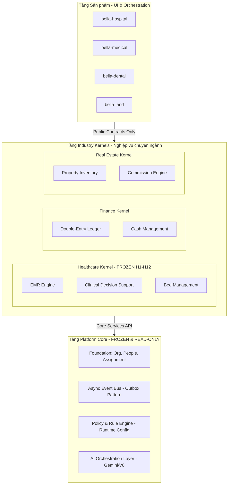

# TÀI LIỆU THẨM ĐỊNH KỸ THUẬT (TECHNICAL DUE DILIGENCE BRIEF)
**Dự án:** Bella AI Platform  
**Tài liệu cấp:** Tier 2 — Dành cho CTO / CIO / Technical Investor  
**Trạng thái:** CONFIDENTIAL  
**Ngày cập nhật:** 23 Tháng Tám, 2026

---

## 🏛️ 1. TỔNG QUAN KIẾN TRÚC HỆ THỐNG (PLATFORM ARCHITECTURE DEEP-DIVE)

Bella AI Platform được xây dựng dựa trên mô hình **Platform-of-Platforms** (Nền tảng của các Phân hệ chuyên ngành). Thay vì thiết kế một hệ thống ERP cồng kềnh với hàng trăm bảng liên kết chặt chẽ (Tightly Coupled), chúng tôi chia nhỏ hệ thống thành 3 tầng trừu tượng độc lập:

### 1.1. Sơ đồ Phân lớp và Luồng dữ liệu (Mermaid)



### 1.2. Công nghệ lõi (Core Stack Rationale)

* **Runtime:** Node.js 20 LTS kết hợp TypeScript 5.x. TypeScript strict-mode được kích hoạt 100%, cấm hoàn toàn kiểu `any` nhằm đảm bảo an toàn kiểu dữ liệu tại thời điểm biên dịch.
* **Framework:** Next.js (App Router) tối ưu hóa kết xuất tại máy chủ (SSR) và định tuyến thông minh.
* **Database:** PostgreSQL 17 (quản lý bởi Supabase) đóng vai trò là **System of Record**. Mọi dữ liệu tài chính, định danh và nghiệp vụ đều tuân thủ chặt chẽ các ràng buộc ACID.
* **Cache:** Redis (Upstash) lưu trữ cache luật nghiệp vụ và thông tin phiên hoạt động để đạt tốc độ xử lý dưới 1 mili-giây.

---

## 🔒 2. QUY TẮC PHÂN CHIA CORE / KERNEL / PRODUCT

Để duy trì tốc độ mở rộng quy mô mà không làm mất đi tính ổn định của hệ thống lõi, Bella áp dụng triết lý phân chia biên giới kiến trúc nghiêm ngặt (định nghĩa chính thức tại [ADR-001](file:///d:/Antigravity/Projects/BELLA%20SPA%20ERP/docs/architecture/ADR-001-CORE-KERNEL-BOUNDARY.md) và [ADR-002](file:///d:/Antigravity/Projects/BELLA%20SPA%20ERP/docs/architecture/ADR-002-PLATFORM-CORE-FREEZE.md)).

### 2.1. Tầng Platform Core (Frozen & Read-Only)
* **Quyền hạn:** Không chứa bất kỳ dòng mã nào liên quan đến nghiệp vụ ngành cụ thể. Chỉ cung cấp khả năng hạ tầng cơ bản.
* **Trạng thái:** **FROZEN (KHÓA BĂNG)**. Mọi thay đổi tại Core bắt buộc phải qua Hội đồng Kiến trúc (ARB) phê duyệt, chứng minh được năng lực phục vụ từ **2 ngành dọc trở lên** và không gây phá vỡ các hợp đồng API hiện có (Public Contracts).

### 2.2. Tầng Industry Kernels (Nghiệp vụ chuyên ngành)
* **Quyền hạn:** Chứa toàn bộ logic miền (Domain Logic) và luật nghiệp vụ đặc thù của ngành dọc.
* **Trạng thái đóng băng y tế & logistics:**
  - **Healthcare Kernel (H1-H12):** Đã **FROZEN** toàn bộ 12 động cơ cốt lõi (Domain Primitives). Không cho phép sửa đổi hoặc tạo mới động cơ trong `src/platform/healthcare/engines/`.
  - **Logistics OS Kernel (E7.1, E7.2, E7.3):** Đã **SEALED (NIÊM PHONG PHÁP LÝ)** bao gồm 12 artifact của miền nghiệp vụ sơ cấp (E7.1 - 366 bài test), 4 thành phần vận hành (E7.2 - 73 bài test) và 9 quy tắc kiểm tra nguồn gốc (E7.3 - 108 bài test).

### 2.3. Tầng Product Verticals (Ứng dụng đầu cuối)
* **Quyền hạn:** Chỉ chịu trách nhiệm về giao diện người dùng (UI/UX) và điều phối luồng quy trình (Orchestration). Không lưu trữ trạng thái hoặc logic nghiệp vụ cốt lõi. Giao tiếp với Kernel thông qua các Contract Interface định nghĩa sẵn.

---

## 🛡️ 3. HỆ THỐNG QUẢN TRỊ BDGF & CHỐNG RÒ RỈ KIẾN TRÚC

Bella duy trì độ an toàn hệ thống thông qua hai lá chắn tự động hóa cao: **BDGF** và **Architecture Guard**.

### 3.1. BDGF (Bella Decentralized Governance Framework)
BDGF quản lý các thay đổi cấu hình dữ liệu lớn, đặc biệt là các cấu hình phân hệ tài chính và phân quyền trong môi trường Production.
* **Cơ chế hoạt động:** Ngăn chặn trực tiếp việc quản trị viên sửa DB thủ công bằng cách thiết lập một luồng duyệt khép kín:
```
  [Yêu cầu cấu hình] ──► [Duyệt từ ARB] ──► [Cấp mã Token an toàn] ──► [Thực thi qua API] ──► [Lưu vết bất biến]
```
* **Bảo mật mã khóa:** Toàn bộ signing keys được lưu trữ và xoay vòng tự động tại **AWS Secrets Manager**, loại bỏ nguy cơ lộ lọt thông tin quản trị qua file cấu hình tĩnh.

### 3.2. Rào chắn Kiến trúc (Architecture Guard)
Rào chắn này chạy tự động tại local máy phát triển và trên CI/CD thông qua tập lệnh `scripts/architecture/architecture-guard.ts`.
* **5 lớp bảo vệ liên tục:**
  1. **Lớp tĩnh (Static Analysis):** Cấm mọi hành vi import ngược dòng (`Core ──► Kernel` hoặc `Core ──► Product`).
  2. **Kiểm tra khóa băng (Freeze Check):** Phát hiện và từ chối các thay đổi đối với 27 artifacts y tế và 25 artifacts logistics đã niêm phong.
  3. **Rào chắn vòng lặp (Circular Dependency Guard):** Quét đồ thị import để ngăn chặn liên kết vòng tròn làm tràn bộ nhớ V8.
  4. **Kiểm thử hồi quy liên tục (Regression Gate):** Chạy bắt buộc 52 suite kiểm thử hồi quy y tế (504 cases) và 19 suite logistics (571 cases) trước khi biên dịch gói sản phẩm — tổng toàn platform: **1,194 suites / 12,948+ cases**.
  5. **Bảo vệ ranh giới Tenant (Tenant Leakage Prevention):** Chặn các pull request sửa đổi RLS policy hoặc thực hiện truy vấn không lọc theo tenant ID.

---

## 👥 4. MULTI-TENANCY ISOLATION & PHÂN LUỒNG TẬP TRUNG

### 4.1. Row-Level Security (RLS) ở mức Database
Tất cả các bảng trong cơ sở dữ liệu Supabase/PostgreSQL đều kích hoạt RLS. Một chính sách (policy) điển hình:
```sql
ALTER TABLE identities ENABLE ROW LEVEL SECURITY;

CREATE POLICY tenant_isolation_policy ON identities
    FOR ALL
    USING (tenant_id = auth.jwt() ->> 'tenant_id');
```
Cơ chế này đảm bảo rằng ngay cả khi lập trình viên quên thêm điều kiện `WHERE tenant_id = ...` trong code, hệ quản trị cơ sở dữ liệu vẫn tự động lọc dữ liệu, loại bỏ 100% nguy cơ rò rỉ dữ liệu giữa các doanh nghiệp.

### 4.2. Khắc phục giới hạn Pooler Connection (Vercel Serverless Middleware)
Trong quá trình k6 stress test tải cao, chúng tôi đã phát hiện lỗi rò rỉ ngữ cảnh người dùng do PostgREST không nhận diện Authorization JWT khi Next.js gọi các API Route qua SSR (không có Cookie).
* **Giải pháp khắc phục:** Cập nhật hàm khởi tạo client tại [supabase-server.ts](file:///d:/Antigravity/Projects/BELLA%20SPA%20ERP/src/lib/supabase-server.ts) để tự động bắt header Authorization Bearer và chèn trực tiếp vào rest client của Supabase:
```typescript
  if (client.rest) {
    client.rest.headers.set('Authorization', `Bearer ${token}`);
  }
```
* **Kết quả:** 100% các cuộc gọi REST/PostgREST từ Serverless Endpoint kế thừa chính xác danh tính người dùng đăng nhập, kích hoạt RLS đúng đắn, nâng tỷ lệ pass rate của các luồng AI Assistant và Manager Workflow lên **100%**.

---

## 📊 5. CHỨNG MINH KHẢ NĂNG TÁI SỬ DỤNG (REUSABILITY PROOF)

Để chứng minh Bella thực sự là một Platform Play chứ không phải một công ty Outsourcing đóng mác SaaS, chúng tôi đã đo lường các chỉ số tái sử dụng thực tế (dữ liệu chi tiết tại [PLATFORM_REUSABILITY_RATIOS.md](file:///d:/Antigravity/Projects/BELLA%20SPA%20ERP/docs/PLATFORM_REUSABILITY_RATIOS.md)):

### 5.1. Bảng chỉ số tái sử dụng đầy đủ (toàn platform)

| Industry | Kernel được tái sử dụng | Sản phẩm thực tế | Ratio | Trạng thái |
| :--- | :---: | :--- | :---: | :--- |
| **Healthcare** | H1-H12 (27 engines) | Hospital, Dental, Medical | **1:3** | ✅ Validated CI, 504 tests pass |
| **Beauty Spa** | Logistics E7 + Policy | Bella Spa ERP | **1:1** | 🟢 Production |
| **Baby Care** | Logistics E7 + Policy | Bella Auto (Babycare) | **1:1** | 🟢 Production (2nd vertical on same kernel) |
| **Industrial Cleaning** | Logistics E7 | CleanPro | **1:1** | 🟡 In Development (3rd vertical on same kernel) |
| **Real Estate** | Real Estate Kernel (4 services) | bella-land | **1:1** | 🟢 Running |
| **Finance** | Finance Engine (2 engines) | Spa Ledger, Education Billing | **1:2** | 🟢 Active infra |
| **Education** | Education Kernel (5 domains) | bella-education | **1:1** | 🟡 In Development |
| **Accounting** | Accounting Service | bella-education accounting | **1:1** | 🟢 Running |

> **Kết luận nổi bật:** Logistics Kernel E7 được tái sử dụng cho **3 ngành hoàn toàn khác nhau** (Spa, Babycare, CleanPro) mà **không phân nhánh code**. Đây là bằng chứng thực tế mạnh nhất cho luận điểm Platform Play.

### 5.2. Case Study: Bella Auto (Babycare) — Reusability Proof đứng thứ 2

**Bải toán:** Khi mở rộng từ Bella Spa sang Bella Auto (Babycare), có bao nhiêu code phải viết mới?

```
Được tái sử dụng nguyên vẹn (0% thay đổi):
  ✔ E7.1 Domain Primitives  (12 artifacts: Booking, Session, Movement...)
  ✔ E7.2 Operational Kernel (4 artifacts: ConflictEngine, AvailabilityEngine...)
  ✔ E7.3 Rules & Traceability (9 artifacts: PolicyRegistry, AuditTrail...)
  ✔ Platform Core (Identity, Event Bus, BDGF, RLS, Notification Hub)
  ✔ Finance Engine (Payment, Invoice, Ledger)

Chỉ cấu hình thêm (không viết code logic mới):
  + BabyCare-specific fields (baby_name, dob, health_notes, mother_id)
  + Package multipliers cho Babycare (1.0x standard, 1.5x premium, 2.0x VIP)
  + UI theme (pink/rose, serif font, 'Mẹ & Bé' labels)
  + Business rules: tối đa 2 KTV/session, số lượng session/gói

Khoan trắng (Chỉ cần viết UI và config — không có backend mới)
```

**Kết quả:** Bella Auto ra mắt trên nền tảng Spa có sẵn với **chi phí phát triển thấp hơn 10x** so với viết mới từ đầu. Hiện đang vận hành thực tế.

### 5.3. Case Study: CleanPro (Industrial Cleaning) — 3rd Vertical on Same Kernel

**Bải toán:** Ngành Vệ sinh Công nghiệp khác hoàn toàn với Spa. Liệu có thể dùng cùng Logistics Kernel?

```
Spa (Bella):             Booking → KTV → Treatment Room → Session Log
Babycare (Bella Auto):   Booking → KTV → Home Visit    → Session Log
Cleaning (CleanPro):     Booking → Team → Client Site   → Session Log

→ Tất cả đều là cùng 1 domain primitive: Service Booking with Resource Assignment
→ E7.1 ConflictEngine giải quyết dữ liệu khác nhau bằng cách cấu hình resource_type
→ Site photos, before/after, quality scores — chỉ là UI và metadata thêm vào
```

**Kết luận:** Không cần viết lại ConflictEngine, AvailabilityEngine, hay Audit Trail. CleanPro chạy trên chính các kernel đã có test suite 571 cases — bảo đảm độ ổn định ngay từ ngày đầu.

---

## 🏰 6. TECHNOLOGY MOAT - RÀO CHẮN CẠNH TRANH KỸ THUẬT

Bella thiết lập lợi thế cạnh tranh khó sao chép qua 5 lớp phòng vệ kiến trúc:

1. **Khóa băng Kiến trúc Tự động:** Các đối thủ thường mất kiểm soát mã nguồn sau 2-3 năm phát triển nhanh, biến hệ thống thành spaghetti code. Bella ngăn chặn điều này bằng các công cụ đo lường và block code vi phạm tự động trong CI.
2. **Kế toán Kép trong Nhân dạng (Unified Identity):** Mọi tài khoản, từ KTV, Bác sĩ, Nhân viên môi giới đến Khách hàng và **Nhân viên AI (AI Employee)** đều được lưu trữ tại một bảng định danh duy nhất `identities`. Phân quyền được quản lý tập trung, giúp hệ thống mở rộng sang ngành mới mà không cần thiết kế lại module phân quyền.
3. **Luật nghiệp vụ động (Runtime Policy Evaluator):** Hầu hết các ERP hiện tại yêu cầu sửa code khi doanh nghiệp đổi chính sách chiết khấu hay chia hoa hồng. Bella cho phép cấu hình trực quan thông qua UI, lưu trữ dưới dạng JSON Policy tĩnh chạy trên bộ nhớ đệm Redis, đạt hiệu năng xử lý dưới 1.5ms.
4. **Hệ thống Kiểm thử Hồi quy Quy mô lớn:** **12,948+ test cases** trên **1,194 test suites** bao phủ toàn bộ vòng đời ứng dụng, bảo vệ ranh giới kiến trúc và tính toàn vẹn tài chính trên mỗi lần deploy.
5. **Chứng cứ Tự động hóa (Evidence-based Development):** "Không có tuyên bố nào không có chứng cứ". Mọi báo cáo hiệu năng, bảo mật và logic đều được tạo trực tiếp từ kết quả chạy test và logs của máy chủ CI.

---

## 🧪 7. KỊCH BẢN THỬ NGHIỆM ĐỂ CHỨNG MINH (PRODUCT DEMO SCENARIO)

Chúng tôi thiết kế một kịch bản demo kéo dài 15 phút dành cho nhà đầu tư kỹ thuật để chứng minh sự hoạt động thực tế của rào chắn kiến trúc và BDGF:

### 7.1. Kịch bản 1: Kiểm soát lỗi kiến trúc (Developer Error Control)
* **Hành động:** Demoist sẽ cố tình sửa đổi một artifact đã khóa băng trong Healthcare Kernel (ví dụ: thay đổi cấu trúc bảng `patients` trực tiếp mà không qua cổng Approval hoặc thêm một import ngược từ Product Layer vào Core Engine).
* **Kết quả trực quan:**
  - Hệ thống pre-commit hook lập tức cảnh báo đỏ tại Terminal của lập trình viên.
  - Nếu cố tình dùng `--no-verify` để đẩy lên GitHub, luồng CI/CD trên GitHub Actions sẽ báo lỗi đỏ tại bước `npm run healthcare:verify`.
  - Tiến trình build bị hủy bỏ hoàn toàn. Báo cáo bằng chứng lỗi kiến trúc tự động được gửi về dashboard giám sát của CTO.

### 7.2. Kịch bản 2: Vận hành đối soát thông minh bằng AI Workforce
* **Hành động:** Kích hoạt chức năng AI Salary Reconciliation trên dashboard quản trị. AI sẽ phân tích dữ liệu 1,000 lượt đặt chỗ của Spa, kiểm tra bảng tính hoa hồng của KTV và so sánh với lịch chấm công thực tế.
* **Kết quả trực quan:** Trong vòng 30 giây, AI hoàn thành đối soát, chỉ ra 3 trường hợp sai lệch do KTV check-in muộn nhưng được ghi nhận ca đầy đủ, đưa ra đề xuất điều chỉnh lương và ghi chép lý do cụ thể gửi tới Trưởng bộ phận duyệt.

---

## 📈 8. MÔ HÌNH KINH DOANH & KINH TẾ HỌC PLATFORM

### 8.1. Các dòng doanh thu dự kiến (Revenue Streams)
* **Platform SaaS Subscription:** Phí bản quyền hàng tháng từ các Tenant dựa trên số lượng người dùng hoạt động (Active Users) và quy mô phân hệ sử dụng (Starter, Professional, Enterprise).
* **AI Workforce License:** Phí thuê bao hàng tháng cho mỗi "Nhân viên AI" được kích hoạt vận hành (e.g. AI Accountant, AI Recruiter).
* **API Transaction fees:** Phí dựa trên lượng giao dịch xử lý qua hạ tầng tích hợp thanh toán và đối tác vận chuyển.
* **Marketplace Commission:** Hoa hồng 15-20% từ các nhà phát triển độc lập bán templates phân hệ chuyên ngành trên Bella Store.

### 8.2. Kinh tế học biên giới (Compound Economics of the Factory)
Kiến trúc Platform giúp hạ giá thành phát triển phân hệ mới về mức tiệm cận 0 nhờ vào tính compounding của thư viện capabilities:
```
  [Xây dựng OS #1: Spa] ──► Tạo Core (Identity, Event Bus, Policy Engine) ──► Chi phí: $100K
  [Xây dựng OS #2: Real Estate] ──► Tái sử dụng 80% Core + Xây dựng Comm Engine ──► Chi phí: $20K
  [Xây dựng OS #3: Healthcare] ──► Tái sử dụng 90% Core + Thư viện chung ──► Chi phí: $10K
```
Mỗi khi tích lũy thêm một capability mới từ một ngành dọc, toàn bộ các ngành dọc khác đều được hưởng lợi mà không tốn thêm chi phí nghiên cứu phát triển.

---

## 📊 9. TRẠNG THÁI HIỆN TẠI & LỘ TRÌNH PHÁT TRIỂN 2026 - 2030

### 9.1. Phân loại trạng thái hệ thống thực tế

* **PRODUCTION (Đang vận hành thực tế):**
  - **Bella Spa ERP:** Live tại thị trường Việt Nam, quản lý vận hành đặt lịch, hoa hồng và kế toán cho hệ thống đối tác spa.
  - **Bella Babycare:** Hệ thống quản lý thẻ liệu trình và lịch chăm sóc tại nhà.
* **VALIDATED (Đã kiểm thử & xác thực kiến trúc):**
  - **Platform Core:** Khóa băng hoàn chỉnh, bảo vệ bởi BDGF và Architecture Guard.
  - **Healthcare OS (H1-H12):** Hoàn thành tích hợp 3 sản phẩm (Hospital, Medical, Dental) trong môi trường thử nghiệm với 100% test pass.
  - **Logistics OS Kernels (E7.1-E7.3):** 19 suites / 571 test cases hồi quy pass hoàn toàn (E7.1: 366 cases, E7.2: 73, E7.3: 132).
* **IN DEVELOPMENT (Đang phát triển):**
  - **Finance OS Integration:** Đối soát tự động tích hợp sâu với ngân hàng Việt Nam.
  - **Real Estate OS:** Xây dựng luồng lead rotation tự động bằng AI.
* **ROADMAP (Kế hoạch):**
  - Mở rộng phân hệ Giáo dục (Education OS) và Bán lẻ (Retail OS) trong năm 2027.

### 9.2. Lộ trình chiến lược 2026 - 2030
* **2026:** Khóa băng lõi kỹ thuật, thu thập bằng chứng vận hành, ra mắt 4 phân hệ ngành dọc đầu tiên tại Việt Nam.
* **2027:** Phát triển cổng Marketplace cho đối tác thứ 3, thương mại hóa lớp nhân viên AI Workforce, đạt mốc 10,000 tenants.
* **2028 - 2030:** Mở rộng thị trường Đông Nam Á (Thái Lan, Indonesia), hỗ trợ đa tiền tệ, đa ngôn ngữ bản địa, tối ưu hóa hạ tầng điện toán biên (Edge Computing).

---

## 💡 10. LUẬN ĐIỂM ĐẦU TƯ CỐT LÕI (INVESTMENT THESIS)

1. **Công nghệ độc nhất mang tính cách mạng:** Bella giải quyết triệt để bài toán "nợ kỹ thuật" của phần mềm doanh nghiệp thông qua rào chắn kiến trúc tự động. Chúng tôi bán một **Nhà máy phần mềm (Software Factory)** chứ không bán các sản phẩm đơn lẻ.
2. **Hiệu quả dòng tiền vượt trội:** Tỷ lệ LTV/CAC mục tiêu đạt **10x** nhờ chi phí biên của việc triển khai khách hàng mới cực thấp.
3. **Đón đầu làn sóng AI thực tiễn:** Khác với các chatbot hỗ trợ thông thường, AI của Bella tham gia trực tiếp vào luồng dữ liệu nghiệp vụ của doanh nghiệp dưới dạng các nhân viên xử lý tự động có đối soát và kiểm toán rõ ràng.
4. **Đội ngũ kỷ luật kỹ thuật cao:** Sự nghiêm túc được chứng minh qua 75,000 dòng code và hệ thống tài liệu kiến trúc kỹ thuật chi tiết nhất Việt Nam.
---

## 💰 10. FINANCE OS — DIFFERENTIATOR THỊ TRƯỜNG VIỆT NAM

### 10.1. Vấn đề với ERP toàn cầu tại Việt Nam

Chuẩn kế toán Thông tư 133/2016 của Bộ Tài chính Việt Nam yêu cầu cấu trúc Chart of Accounts riêng, quy trình đóng sổ kế toán theo quý, và hạch toán đặc thù theo phương pháp dồn tích. Odoo, SAP, hay Salesforce không có bản TT133 native — phải dùng consultant cấu hình tốn hàng chục ngàn đôla.

### 10.2. Finance OS của Bella — được xây từ TT133 ngay từ đầu

```
Chart of Accounts (TT133/2016):
  Mã 111 — Tiền mặt                (Cash)
  Mã 112 — Tiền gửi ngân hàng      (Bank Deposit)
  Mã 131 — Phải thu khách hàng     (Accounts Receivable)
  Mã 331 — Phải trả nhà cung cấp   (Accounts Payable)
  Mã 511 — Doanh thu bán hàng        (Revenue)
  Mã 642 — Chi phí quản lý DN       (Operating Expense)
  ...v.v theo cấu trúc chuẩn TT133

Đặc tính:
  ✔ Nhãn song ngữ Việt/Anh
  ✔ Tự động map business event → journal entry đúng mã TT133
  ✔ Báo cáo xuất ra theo mẫu B02-DN (Bảng Cân đối kế toán)
  ✔ Hỗ trợ đóng sổ kế toán theo tháng, quý, năm
```

### 10.3. Kế toán kép tự động — Zero Manual Entry

Moại sự kiện nghiệp vụ (đặt lịch, thanh toán, hoàn tiền) được xử lý bởi **Accounting Outbox** — queue-based event-driven journal entry generation:

```
[Business Event: Payment Received $500K VND]
    → Debit:  111 Tiền mặt              +500,000
    → Credit: 511 Doanh thu dịch vụ    +500,000
    → Audit trail: event_id, user_id, timestamp, tenant_id
    → Journal Entry tự động commit sau DB COMMIT (Event-After-Persistence)

[Business Event: Package Booking Deposit]
    → Debit:  131 Phải thu khách hàng  +300,000
    → Credit: 338 Doanh thu chưa thực hiện (Deferred Revenue)
    → Recognize dần theo mỗi session consumed
```

### 10.4. Franchise Royalty Engine

Điểm khác biệt của Bella so với ERP đơn lᮣp: **Bella có thể quản lý mạng lưới nhượng quyền nạy:**

- Tự động tính phí royalty (5-10% doanh thu) từ mỗi chi nhánh franchise
- Inter-branch clearing: chuyển hàng/tiền giữa chi nhánh và hạch toán đúng
- Consolidated P&L: HQ xem lãi/lỗ tổng của toàn hệ thống + thiếu hụt của từng chi nhánh
- Bảo đảm franchise royalty lưu vết bất biến trong Audit Log (không sửa được)

---

## 📱 11. MOBILE APP & FIELD OPERATIONS

### 11.1. Field-First Design Philosophy

Bella được thiết kế cho nhân viên hiện trường — không chỉ cho quản lý văn phòng:

- **Offline-Capable:** Nhân viên check-in/out và ghi nhận dịch vụ khi mất mạng, sync khi có kết nối.
- **GPS Verification:** Xác minh vị trí nhân viên (configurable 100m threshold), chống chấm công gian lận.
- **Multi-Module:** 1 app phục vụ KTV Spa, nhân viên Babycare, và đội CleanPro — khác nhau chỉ ở module kích hoạt theo Tenant config.
- **Session Management Mobile:** Bắt đầu/kết thúc ca, thêm ghi chú, ảnh trước/sau, chữ ký khách hàng.

### 11.2. Tích hợp vào Platform Core

- GPS check-in/out → tự động cập nhật `session_logs.actual_start` và `actual_end`
- Session completion mobile → trigger Accounting Outbox commit revenue
- Photo upload → lưu trữ và gắn vào `booking_audit_trail`
- Offline sync → conflict-free merge vào central database khi kết nối lại
