# Bella SPA ERP — K6 Official Benchmark Report (v1)

> **Test Run Reference:** K6-3v2c (`21-k6-3v2-authenticated-business.js`)  
> **Commit Hash:** `d90f1fc9`  
> **Environment:** Vercel (Singapore) + Supabase (Singapore)  
> **Region Lock:** Singapore `sin1` (Vercel)  
> **Database Host:** Singapore `lvnvkpyxtuilhrabtlwv.supabase.co`  
> **Date:** 2026-08-14

---

## 1. Executive Summary

This benchmark records the official performance profile of Bella SPA ERP under a multi-tenant authenticated business workload. Unlike early synthetic runs, K6-3v2c uses direct REST requests with valid JWT and authentic RLS context on real customer tables, ensuring realistic execution paths (Supabase REST API -> PostgREST -> PostgreSQL -> RLS checks).

### High-level Metrics

- **Total Requests:** 110.7K
- **Successful Requests:** 110.7K
- **Error Rate (HTTP 5xx):** 0.00%
- **Authentication Rejections (HTTP 401/403):** 0 (Verification of valid JWT mapping)
- **Peak Throughput:** 121.08 RPS
- **Overall Latency (P95):** 206 ms

---

## 2. SLA Compliance Results

All 7/7 defined SLA thresholds successfully passed during the sustained phase:

| Metric | Target SLA | Observed P95 | Status |
|--------|------------|--------------|--------|
| `biz_customer_read` (SLA Baseline - 20 VU) | ≤ 500 ms | **48 ms** | ✅ PASS |
| `biz_booking_check` (SLA Baseline - 20 VU) | ≤ 500 ms | **192 ms** | ✅ PASS |
| `biz_customer_read` (Capacity - 50 VU) | ≤ 700 ms | **65 ms** | ✅ PASS |
| `biz_booking_check` (Capacity - 50 VU) | ≤ 700 ms | **245 ms** | ✅ PASS |
| `infra_health` (SLA Baseline - 20 VU) | ≤ 300 ms | **122 ms** | ✅ PASS |
| `business_server_errors` (Total Run) | < 1.0% | **0.00%** | ✅ PASS |
| `business_auth_rejections` (Total Run) | = 0 | **0** | ✅ PASS |

---

## 3. Tenant Isolation & Latency Decomposition

Each virtual user (VU) was deterministic-pinned to one of the 4 isolated tenants (`tenantIndex = (__VU - 1) % 4`). The breakdown shows tight variance across tenants, confirming RLS evaluation is balanced and well-indexed:

### Per-Tenant P95 Latency (`biz_customer_read`)

- **Healthcare OS** (Tenant `60135a61`): **44 ms**
- **Hospital** (Tenant `ef4c035e`): **49 ms**
- **Education** (Tenant `152ff24c`): **52 ms**
- **Real Estate** (Tenant `1a6643da`): **47 ms**

> **Analysis:** RLS filtering via `tenant_id` does not introduce skew. Indexes are correctly utilized on the query predicate.

---

## 4. Latency Breakdown (TTFB Decomposition)

Passive Server-Timing telemetry harvested from `/api/health` indicates the following breakdown of server-side response times:

```mermaid
gantt
    title TTFB Decomposition (P95 Overall ~120ms for health)
    dateFormat  X
    axisFormat %s
    
    section Next.js Server
    Next.js Handler Entry    :active, 0, 15
    Supabase Client Init     :active, 15, 25
    
    section DB & Network
    Supabase PostgREST & RLS :active, 25, 110
    
    section Serialization
    JSON Serialization       :active, 110, 120
```

- **Next.js Handler Overhead:** ~15ms
- **Supabase JS Client Initialization:** ~10ms
- **Database Query Execution (PostgreSQL + RLS):** ~85ms
- **Response Serialization:** ~10ms

---

## 5. Known Bottlenecks & Roadmap

1. **Vercel Cold Starts:** Initial request after scale-to-zero has a ~2.4s TTFB. Mitigated by setting warm-up runs in k6.
2. **Next.js Client Overhead:** Initializing the Supabase client wrapper on Vercel Edge adds ~10ms. Recommended to keep the client instances as global singletons.
3. **Database Roundtrips:** Multi-branch lookup or multi-join queries with complex RLS predicates are the primary scaling bottlenecks. To be explored in the upcoming stress testing phase (`22-capacity-progression.js`).
