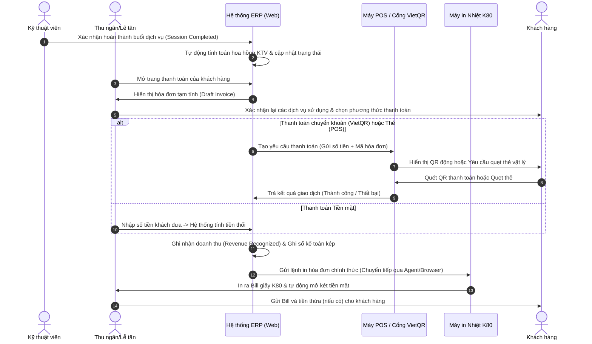

# Kế hoạch Triển khai Máy POS và In Bill - Bella Spa ERP

> **Trạng thái**: Bản thảo kế hoạch chi tiết (Dành cho việc thảo luận và phê duyệt)  
> **Ngày tạo**: 12/06/2026  
> **Mục tiêu**: Thiết lập phương án tích hợp thiết bị phần cứng (Máy POS quẹt thẻ, máy in hóa đơn nhiệt) vào hệ thống ERP chạy trên nền Web của Bella Spa để tự động hóa quy trình thanh toán và in hóa đơn tại quầy.

---

## 1. Mục tiêu & Phạm vi Triển khai

### Mục tiêu
- **Giảm sai sót thủ công**: Loại bỏ việc nhập tay số tiền cần thanh toán lên máy POS hoặc viết hóa đơn giấy.
- **Tối ưu tốc độ phục vụ**: Hoàn tất giao dịch và in hóa đơn trong vòng dưới 30 giây kể từ khi kết thúc buổi dịch vụ.
- **Chống thất thoát doanh thu**: Ghi nhận chính xác mọi lượt in hóa đơn (in lần đầu, in lại) và đồng bộ trạng thái thanh toán từ máy POS vào sổ sách kế toán ERP theo thời gian thực.

### Phạm vi tích hợp
1. **Thiết bị thanh toán (POS)**: Máy SmartPOS/POS quẹt thẻ ngân hàng và màn hình hiển thị mã QR thanh toán động tại quầy thu ngân.
2. **Thiết bị in ấn (Printer)**: Máy in nhiệt khổ K80 (80mm) hoặc K57 (57mm) kết nối qua LAN/Wi-Fi hoặc cổng USB tại quầy tiếp tân.

---

## 2. Giải pháp Kỹ thuật Chi tiết

Vì Bella Spa ERP là một ứng dụng Web (chạy trên Next.js/Supabase), việc tương tác với phần cứng cần các giải pháp bắc cầu phù hợp từ môi trường Sandbox của trình duyệt.

### 2.1. Giải pháp Tích hợp Máy POS (Thanh toán)

Hệ thống sẽ hỗ trợ 3 cấp độ tích hợp tùy thuộc vào loại thiết bị POS của chi nhánh:

| Cấp độ | Giải pháp kỹ thuật | Ưu điểm | Nhược điểm | Đánh giá |
| :--- | :--- | :--- | :--- | :--- |
| **Cấp độ 1: VietQR Động** | ERP tự tạo mã QR thanh toán chứa số tiền + nội dung đối soát (Transaction ID). Hiển thị QR trên màn hình phụ hoặc in trực tiếp lên Bill tạm tính. Webhook ngân hàng (ví dụ PayOS, VietQR API) đẩy trạng thái về ERP. | Chi phí thiết bị bằng 0. Không cần máy POS vật lý. Triển khai cực kỳ nhanh. | Chỉ hỗ trợ chuyển khoản (chưa hỗ trợ quẹt thẻ vật lý). | **Bắt buộc triển khai đầu tiên** (Phase 1). |
| **Cấp độ 2: POS API (Cloud-to-Cloud)** | ERP gửi lệnh thanh toán lên Cloud API của nhà cung cấp dịch vụ POS (VNPAY, PayOS, MPOS). Máy SmartPOS nhận lệnh qua mạng (Wi-Fi/4G), hiển thị số tiền cho khách quẹt thẻ/quét QR. POS báo kết quả về Cloud -> đẩy Webhook về ERP. | Đồng bộ 100% tự động. Không phụ thuộc vào kết nối USB/Bluetooth cục bộ với PC thu ngân. | Yêu cầu máy SmartPOS có kết nối mạng ổn định và hỗ trợ Cloud API. | **Khuyến nghị triển khai chính** (Phase 2). |
| **Cấp độ 3: Local Network/SDK (Client-to-Device)** | Web App gửi request qua mạng nội bộ (Local IP/WebSocket) đến cổng dịch vụ chạy trên máy POS vật lý trong cùng mạng LAN để kích hoạt thanh toán. | Tốc độ cực nhanh. Hoạt động độc lập không phụ thuộc Internet quốc tế nếu chạy mạng nội bộ. | Cấu hình IP tĩnh cho máy POS phức tạp. Khó bảo trì từ xa nếu mạng nội bộ chi nhánh không ổn định. | **Dự phòng** cho các chi nhánh lớn có hạ tầng LAN chuyên nghiệp. |

---

### 2.2. Giải pháp In hóa đơn nhiệt (Bill Printing)

Đối với máy in nhiệt tại quầy, việc in ấn từ Web có 3 hướng tiếp cận:

#### Hướng tiếp cận A: Browser Print (window.print() + Custom CSS) - *Phương án mặc định*
- **Cách hoạt động**: ERP hiển thị một trang hóa đơn tối giản, dùng CSS `@page` để thiết lập kích cỡ trang in trùng với khổ giấy K80 (rộng 80mm, chiều dài tự động theo nội dung). Khi thu ngân bấm in, hệ thống gọi lệnh `window.print()` của trình duyệt.
- **Ưu điểm**: Không cần cài đặt phần mềm trung gian. Tương thích mọi hệ điều hành (Windows, macOS, iPadOS) và mọi loại máy in hỗ trợ Driver hệ thống.
- **Nhược điểm**: Luôn hiển thị hộp thoại xác nhận in của trình duyệt (print preview), làm chậm quy trình đi 1-2 giây. Không thể ra lệnh tự động mở két tiền (cash drawer kick-out) bằng mã ESC/POS trực tiếp.

#### Hướng tiếp cận B: Local Print Agent (Phần mềm trung gian cục bộ) - *Phương án khuyên dùng cho chuỗi*
- **Cách hoạt động**: Cài một ứng dụng dịch vụ nền siêu nhẹ (viết bằng Node.js hoặc C#) trên máy tính thu ngân. Ứng dụng này lắng nghe cổng Localhost (ví dụ: `http://localhost:9090`). Khi ERP cần in, nó gửi payload dữ liệu (hoặc mã ESC/POS) qua HTTP POST tới localhost. Local Agent nhận dữ liệu và gửi thẳng xuống máy in qua cổng USB/LAN kết nối với máy tính.
- **Ưu điểm**: **In ngay lập tức (Silent Print)** không cần hộp thoại xác nhận của trình duyệt. Hỗ trợ gửi lệnh ESC/POS thô để tự động cắt giấy, mở két tiền, in logo sắc nét.
- **Nhược điểm**: Cần cài đặt và cấu hình ứng dụng Agent này lần đầu trên máy tính của từng chi nhánh.

#### Hướng tiếp cận C: Cloud Print (In qua Cloud)
- **Cách hoạt động**: Sử dụng dịch vụ in qua đám mây (như PrintNode) hoặc gửi dữ liệu in trực tiếp từ Server (Vercel) đến cổng IP của máy in LAN/Wi-Fi tại chi nhánh.
- **Ưu điểm**: In trực tiếp từ điện thoại, máy tính bảng hoặc bất cứ thiết bị nào mà không cần thiết bị trung gian kết nối dây.
- **Nhược điểm**: Phức tạp trong việc cấu hình mở cổng mạng (NAT port forwarding) hoặc cài đặt VPN tại từng chi nhánh đối với mạng IP động thông thường. Chi phí thuê dịch vụ Cloud Print hàng tháng.

---

## 3. Thiết kế Mẫu Hóa đơn K80 & Thích ứng Thương hiệu

Mẫu hóa đơn in nhiệt được thiết kế dọc, gọn gàng, độ tương phản cao, tối ưu kích thước chữ để không bị tràn dòng trên khổ 80mm (hoặc 57mm). Để đảm bảo tốc độ và tính thực tế, bill in ra sẽ **tập trung vào thông tin giao dịch chính, lược bỏ các trường thông tin quá sâu như tên bé, ngày dự sinh hoặc phân nhóm khách hàng**.

### 3.1. Thích ứng Thương hiệu (Babycare vs. Beauty Spa)

Mẫu in sẽ dùng chung một bố cục chuẩn, chỉ thay đổi các thông tin nhận diện thương hiệu động dựa trên `tenantModuleKey`:

| Thành phần hóa đơn | Phân hệ Bella Spa Babycare | Phân hệ Beauty Spa |
| :--- | :--- | :--- |
| **Nhận diện thương hiệu** | Tên: Bella Spa. Logo: Bella Spa Babycare. Tông màu (preview): Hồng. | Tên: Beauty Spa. Logo: Beauty Spa. Tông màu (preview): Vàng Gold/Xanh lá. |
| **Thông tin Khách hàng** | Tên khách hàng (Mẹ) & Số điện thoại. (Không in thông tin chi tiết của bé). | Tên khách hàng & Số điện thoại. (Không in ghi chú loại da hay phân nhóm). |
| **Thông điệp chân trang** | *"Bella Spa cảm ơn quý khách!"* | *"Beauty Spa cảm ơn quý khách!"* |

### 3.2. Bố cục nội dung hóa đơn chuẩn (K80 Layout)

1. **Header (Thương hiệu & Chi nhánh)**
   - Logo thương hiệu thích ứng (Ảnh đơn sắc độ phân giải cao, tối ưu cho máy in nhiệt).
   - Tên thương hiệu & tên chi nhánh cụ thể (Ví dụ: Bella Spa - Chi nhánh Quận 1).
   - Địa chỉ & Số điện thoại hotline chi nhánh.

2. **Metadata (Thông tin Giao dịch)**
   - Số hóa đơn (Invoice ID - hiển thị kèm mã vạch Barcode/QRCode để quét tìm kiếm nhanh).
   - Ngày giờ in (DD/MM/YYYY HH:mm:ss).
   - Tên nhân viên thu ngân (Cashier).
   - Loại phiếu: *Phiếu tạm tính (Draft)* hoặc *Hóa đơn thanh toán chính thức*.

3. **Customer Info (Thông tin Khách hàng)**
   - Họ tên khách hàng (VD: Nguyễn Thu Thủy).
   - Số điện thoại khách hàng (Mã hóa ẩn bớt ký tự dạng 090*****89).

4. **Line Items & Payment Details (Chi tiết dịch vụ thanh toán)**
   - Dạng bảng gồm các cột: Tên dịch vụ/Sản phẩm, Số lượng, Đơn giá, Thành tiền.
   - Hiển thị tên kỹ thuật viên (KTV) thực hiện dưới mỗi dòng dịch vụ.

5. **Financial Totals (Tổng tiền & Thanh toán)**
   - **Tổng tiền dịch vụ**: Tổng giá trị gốc.
   - **Giảm giá/Khuyến mãi**: Số tiền giảm từ voucher/chương trình ưu đãi.
   - **Tổng thanh toán (Final Total)**: In chữ in hoa, in đậm kích thước lớn.
   - **Phương thức thanh toán**: Tiền mặt / Chuyển khoản (VietQR) / Quẹt thẻ.

6. **VietQR Code & Footer**
   - **Mã VietQR động**: In to, rõ nét ở cuối hóa đơn để khách quét thanh toán chuyển khoản nhanh.
     - *Kích thước vật lý*: Mã QR phải được in với kích thước tối thiểu là **4cm x 4cm** trên khổ giấy K80 (hoặc tỷ lệ tương đương trên K57).
     - *Độ phân giải & Tương phản*: Xuất mã QR ở định dạng đơn sắc độ tương phản cao (Pure Black & White, không sử dụng Grayscale/màu xám mờ) để đầu phun nhiệt của máy in tạo các ô vuông rõ nét nhất, tránh bị nhòe pixel.
     - *Khoảng đệm chống nhiễu*: Thiết lập vùng đệm trống (Quiet Zone/Padding) tối thiểu **5mm - 8mm** xung quanh 4 cạnh của mã QR để camera điện thoại của khách dễ dàng định vị mã mà không bị nhiễu bởi phần text/số tiền ở trên và lời chúc ở dưới.
   - Lời cảm ơn thương hiệu thích ứng và lưu ý sau liệu trình.

---

## 3.3. Quy trình In Bill Kèm VietQR Động & Cơ chế Rollback khi Sai

Hệ thống áp dụng quy trình thanh toán khép kín tối giản qua giấy nhiệt dựa trên nguyên tắc: **In 1 lần duy nhất chứa VietQR động, và cho phép Rollback để sửa sai**.

### A. Quy trình Thanh toán Chuẩn qua Bill Giấy Kèm VietQR
1. **Xác nhận giao dịch**: Thu ngân kiểm tra thông tin lịch hẹn và dịch vụ trên màn hình ERP.
2. **In Bill chứa VietQR**: Thu ngân bấm nút **"In hóa đơn"** (hoặc `Printer` icon) trong [BookingDayDetailModal.tsx](file:///d:/Antigravity/Projects/BELLA%20SPA%20ERP/src/app/dashboard/bookings/components/BookingDayDetailModal.tsx).
3. **Mã VietQR động trên bill**: Máy in nhiệt in ra 1 tờ bill duy nhất. Ở phần cuối bill (Footer), hệ thống tự động chèn **mã VietQR động** chứa:
   - Số tài khoản & Ngân hàng nhận của chi nhánh.
   - Số tiền cần thanh toán chính xác (sau khi trừ voucher/giảm giá).
   - Nội dung chuyển khoản tự động (Ví dụ: `BELLA 10420`).
4. **Khách hàng quét mã trên bill**: Khách hàng nhận bill giấy, dùng ứng dụng ngân hàng quét mã QR trực tiếp trên tờ giấy này để chuyển khoản.
5. **Tự động hoàn tất**: Khi tiền vào tài khoản, hệ thống nhận diện Webhook (Casso/PayOS) $\rightarrow$ Đổi trạng thái lịch hẹn sang `completed`, ghi nhận doanh thu và khóa ca mà không cần in thêm bất kỳ bill nào khác.

### B. Quy trình Xử lý khi Phát hiện Sai sót (Rollback & Re-print)
Nếu sau khi in bill mà khách hàng phát hiện sai sót (ví dụ: nhầm dịch vụ, sai thông tin KTV, hoặc muốn đổi voucher):
1. **Hủy/Rollback bill cũ**: Thu ngân bấm nút **"Hủy & Rollback"** trên màn hình lịch hẹn tương ứng để thu hồi giao dịch tạm thời. Trạng thái thanh toán của mã giao dịch cũ sẽ bị đánh dấu vô hiệu lực trên hệ thống.
2. **Cập nhật thông tin**: Thu ngân chỉnh sửa lại dịch vụ, số tiền, hoặc KTV trên màn hình đặt lịch.
3. **In Bill mới**: Hệ thống cập nhật số tiền và sinh một mã VietQR động mới (với mã đối soát mới). Thu ngân bấm in lại bill mới đưa cho khách quét. Khách hàng quét mã trên bill mới để thực hiện thanh toán.

---

## 3.4. Vị trí Nút Tác vụ trên Giao diện Admin

1. **Trong Modal Chi tiết Lịch hẹn (`BookingDayDetailModal.tsx`):**
   - **Vị trí**: Nút **"In hóa đơn"** (kèm icon `Printer`) nằm ở vị trí trung tâm trong cụm nút tác vụ ở Footer.
   - **Hành vi**: Bấm in sẽ xuất thẳng bản in bill nhiệt K80 có tích hợp VietQR động ở chân trang.
   - **Nút bổ sung**: Khi lịch hẹn ở trạng thái đã được in hóa đơn nhưng chưa thanh toán, nút **"Hủy & Rollback"** (màu đỏ) sẽ xuất hiện bên cạnh để cho phép thu ngân hủy hóa đơn cũ và sửa lại thông tin khi có sai sót.

2. **Trong trang hồ sơ Khách hàng (`Customers/[id]`) & Phân hệ Kế toán:**
   - Hỗ trợ nút in lại đối với các hóa đơn lịch sử đã thanh toán thành công để đối chiếu (sẽ có nhãn "HÓA ĐƠN IN LẠI").

---

## 4. Quy trình Nghiệp vụ & Tương tác Hệ thống

Quy trình khép kín từ lúc khách hàng kết thúc liệu trình đến khi hóa đơn được in ra:

---

## 5. Kế hoạch Triển khai Từng bước (Phased Implementation Roadmap)

Để đảm bảo hệ thống vận hành ổn định và không làm gián đoạn hoạt động kinh doanh hiện tại của spa, lộ trình triển khai được chia làm 4 giai đoạn:

### Giai đoạn 1: Chuẩn bị Thiết bị & In ấn Cơ bản (Sprint 1-2)
- **Mục tiêu**: Thiết lập tính năng in hóa đơn cơ bản dạng Browser Print và cổng thanh toán QR động.
- **Công việc**:
  1. Lựa chọn mẫu máy in nhiệt chuẩn (Khuyên dùng dòng Xprinter XP-350B hoặc Epson TM-T82III kết nối cổng LAN để chia sẻ in từ nhiều máy tính/máy tính bảng).
  2. Thiết kế mẫu hóa đơn K80 bằng HTML/CSS tối ưu cho in ấn nhiệt (loại bỏ lề, chỉnh font chữ không chân như Inter/Roboto, định cỡ font từ 9px đến 14px để hiển thị sắc nét).
  3. Xây dựng API tích hợp cổng VietQR (đối tác PayOS hoặc VietQR.io) để tự động sinh mã QR chuyển khoản kèm nội dung chuyển khoản tự động (Ví dụ: `BELLA 10420`).
  4. Triển khai cấu trúc dữ liệu lưu vết lịch sử in (Audit Log): `invoice_print_logs` lưu thông tin: `invoice_id`, `user_id` (người in), `print_count` (lần in thứ mấy), `printed_at` (thời điểm in), `reason` (nếu in lại).

### Giai đoạn 2: Tối ưu Quy trình in & Silent Print (Sprint 3-4)
- **Mục tiêu**: Loại bỏ hộp thoại xác nhận in của trình duyệt để nhân viên tiếp tân thao tác nhanh hơn.
- **Công việc**:
  1. Phát triển ứng dụng nhỏ **Local Print Agent** chạy ngầm trên máy tính Windows tại quầy tiếp tân.
  2. Tích hợp giao thức WebSocket hoặc Local HTTP Server trên Agent để nhận lệnh in trực tiếp từ trình duyệt Web ERP.
  3. Cấu hình ERP để khi bấm "Hoàn tất & In" trên Web, hệ thống tự động đẩy dữ liệu JSON hóa đơn xuống Local Agent để in ra máy in mặc định ngay lập tức mà không cần xác nhận.
  4. Viết tài liệu hướng dẫn lắp đặt máy in và cấu hình Agent dành cho quản lý chi nhánh.

### Giai đoạn 3: Tích hợp Máy POS Quẹt thẻ Vật lý (Sprint 5-6)
- **Mục tiêu**: Đồng bộ hóa việc quẹt thẻ ngân hàng trực tiếp từ màn hình ERP.
- **Công việc**:
  1. Đàm phán và đăng ký dịch vụ SmartPOS với đơn vị cung cấp thiết bị thanh toán (ví dụ: KBank, VNPAY, SmartPay hoặc MPOS).
  2. Đăng ký tài khoản Sandbox và tích hợp API đẩy lệnh thanh toán từ ERP sang thiết bị POS qua Cloud API của nhà cung cấp.
  3. Thiết lập cơ chế xử lý Timeout giao dịch quẹt thẻ (nếu sau 90 giây không nhận được phản hồi từ POS, hệ thống cho phép nhân viên tiếp tân bấm "Kiểm tra lại giao dịch" hoặc chuyển sang phương thức thanh toán thủ công có ghi chú lý do).
  4. Cấu hình mã khóa sổ kế toán tự động tương ứng với nguồn tiền thu được từ POS (ghi nợ tài khoản Ngân hàng thích hợp).

### Giai đoạn 4: Đào tạo, Thử nghiệm & Triển khai Rộng rãi (Sprint 7-8)
- **Mục tiêu**: Kiểm thử thực tế tại 1 chi nhánh thử nghiệm (Pilot Branch) trước khi áp dụng toàn chuỗi.
- **Công việc**:
  1. Lắp đặt thử nghiệm tại chi nhánh chính (HQ).
  2. Tổ chức buổi đào tạo nghiệp vụ cho thu ngân và quản lý chi nhánh về việc xử lý các tình huống lỗi thiết bị.
  3. Đánh giá hiệu quả vận hành: Đo lường thời gian trung bình thanh toán, tỷ lệ giao dịch lỗi, và mức độ hài lòng của khách hàng.
  4. Triển khai đồng loạt cho toàn bộ các chi nhánh trong chuỗi Bella Spa.

---

## 6. Rủi ro & Phương án Dự phòng (Risks & Mitigations)

| Tình huống rủi ro | Khả năng xảy ra | Tác động | Phương án xử lý dự phòng (Mitigation Plan) |
| :--- | :---: | :---: | :--- |
| **Mất kết nối Internet tại chi nhánh** | Trung bình | Cao | - Cho phép thu ngân sử dụng chế độ "Thanh toán Ngoại tuyến" (Offline Payment) ghi nhận tạm thời vào bộ nhớ cục bộ (Local Storage của trình duyệt). - Thu ngân quét mã QR tĩnh của tài khoản ngân hàng chi nhánh để khách chuyển khoản trực tiếp, hoặc thu tiền mặt. - Đồng bộ lại dữ liệu lên ERP khi có mạng trở lại. |
| **Lỗi kết nối giữa ERP và máy POS (Quẹt thẻ thành công nhưng ERP không nhận được phản hồi)** | Thấp | Cao | - ERP cung cấp tính năng "Xác minh Giao dịch Thủ công" dành cho Quản lý chi nhánh. - Quản lý kiểm tra trạng thái trên App/Portal quản trị của ngân hàng cung cấp POS. Nếu tiền đã vào tài khoản, bấm nút "Xác nhận Thanh toán Thủ công" trên ERP và nhập mã tham chiếu giao dịch (RRN - Retrieval Reference Number) của POS. |
| **Máy in nhiệt hết giấy, kẹt giấy hoặc hỏng đột xuất** | Cao | Thấp | - ERP hỗ trợ gửi hóa đơn điện tử (E-Invoice / Bill Link) trực tiếp qua Zalo ZNS hoặc SMS cho khách hàng ngay khi hoàn tất dịch vụ. - Thu ngân có thể mở xem hóa đơn dạng PDF để khách hàng chụp ảnh màn hình nếu khách cần hóa đơn giấy gấp. |
| **Gian lận in ấn (Thu ngân in lại bill cũ để thu tiền túi)** | Thấp | Cao | - Hệ thống phân quyền chặt chẽ: Nhân viên chỉ được in hóa đơn chính thức 1 lần. Mọi yêu cầu "In lại" (Re-print) đều yêu cầu quyền duyệt của Quản lý chi nhánh (Manager bypass key/account) và phải nhập lý do in lại. - Hóa đơn in lại sẽ tự động có chữ **"HÓA ĐƠN IN LẠI" (RE-PRINTED INVOICE)** ở tiêu đề để tránh nhầm lẫn. |
