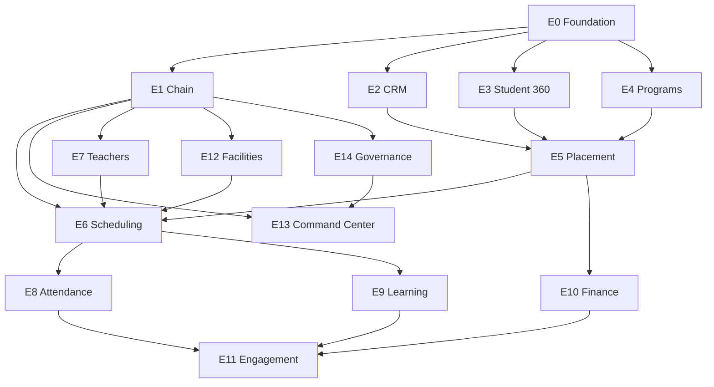

# BELLA ENGLISH CENTER — MASTER PLAN

> **Product Vision:** Hệ điều hành quản lý toàn diện chuỗi trung tâm ngoại ngữ từ Lead → Enrollment → Learning → Finance → Chain Command Center.

---

## 🚨 ARCHITECTURAL STATUS

```text
BELLA ENGLISH CENTER

Master Plan                    ✅ DRAFTED
Product Scope                  ✅ DEFINED
Architecture Direction         ✅ DEFINED

E0 Foundation Discovery        ✅ COMPLETE
├─ E0.1   Reuse Inventory      ✅ COMPLETE
├─ E0.1A  Semantic Ownership   ✅ COMPLETE (E0.1A-R Identity GAP OPEN)
├─ E0.1B  Finance Reuse        ✅ COMPLETE (E0.1B-R Contract GAP OPEN)
├─ E0.1C  Course/Class Owner   🔒 SEALED (0 new gaps)
├─ E0.2   Chain Authorization  🔒 SEALED (0 new gaps)
├─ E0.3   English Capabilities 🔒 SEALED (0 new gaps, 22/22 classified)
├─ E0.4   Business Invariants  🔒 SEALED (44 rules, 0 unknowns)
└─ E0.5   Product Manifest     🔒 SEALED (machine-readable YAML)

Confirmed Architectural Gaps   🔴 2 OPEN
├─ E0.1A-R Identity Migration  🔴 BLOCKS E1 (Platform Core)
└─ E0.1B-R Finance AR Contract 🔴 BLOCKS E1 (Platform Finance)

ARCHITECTURE STATUS            🔒 FROZEN (design complete)
IMPLEMENTATION STATUS          🔴 BLOCKED (dependencies missing)
NEXT PHASE                     ⏸️ E1 Implementation (after gaps resolved)
```

**⚠️ ARCHITECTURE FROZEN ≠ IMPLEMENTATION READY**

**Architecture Frozen:** Design complete, no more discovery
**Implementation Blocked:** E0.1A-R + E0.1B-R must be resolved first

---

## I. STRATEGIC POSITIONING

### Product Identity

```text
BELLA PLATFORM
      │
      └── EDUCATION OS
             │
             ├── Bella Preschool       🏆 RC (Reference Product #1)
             │
             └── Bella English Center  🆕 (Reference Product #2)
                    │
                    ├── Single Center Mode
                    └── Multi-Branch Chain Mode
```

### Core Differentiation

| Aspect | Bella Preschool | Bella English Center |
|--------|----------------|---------------------|
| **Core Entity** | Child (trẻ em) | Lead/Student (học viên) |
| **Primary Flow** | Enrollment → Care → Development → Parent Communication | Lead → Placement → Course → Class → Learning → Renewal |
| **Academic Model** | Age-based classes, developmental milestones | Level-based programs (IELTS/TOEIC/Cambridge/Kids) |
| **Financial Model** | Monthly tuition, meal plans | Course fees, installments, package discounts |
| **Organization** | Single campus | Chain management (HQ → Region → Branch) |
| **Sales Funnel** | Simple enrollment | CRM funnel (Lead → Consultation → Test → Trial → Conversion) |

### Strategic Value

**Bella English Center is NOT just another education product.**

This is the **SECOND REFERENCE PRODUCT** to validate Education OS reusability across different education verticals. Success criteria:

1. ✅ **Reuse proven Education OS capabilities** (Student, Enrollment, Attendance, Learning, Finance)
2. ✅ **Prove Product Vertical boundaries** work correctly
3. ✅ **Validate Contract-based integration** (`Product → Contract → Kernel`)
4. ✅ **Test multi-branch architecture** at scale
5. ✅ **Demonstrate additive extension model** (no Kernel modification needed)

---

## II. ARCHITECTURAL GOVERNANCE

### Education OS Constitution Compliance

**STATUS: MANDATORY ADHERENCE**

Before ANY code is written, this project MUST comply with:

📜 **Education OS Constitution:** `docs/architecture/EDUCATION_VERTICAL_CODING_CONSTITUTION.md`

### Non-Negotiable Rules

```text
🔴 EDUCATION OS KERNEL IS FROZEN

You MUST NOT:
1. Create new Education Kernel engines beyond defined 5 bounded contexts
2. Modify existing Kernel responsibilities (Course/Enrollment/Student/Attendance/Assessment)
3. Duplicate Kernel entities semantically (NO `english_center_enrollments` if Kernel owns enrollment)
4. Create parallel engines (NO second enrollment/attendance/assessment source of truth)
5. Bypass public contracts (direct DB access to kernel tables)
6. Violate tenant isolation (Gate 0/P0)
7. Introduce `any` types anywhere

You MUST:
1. Build strictly inside Product Vertical Layer (`src/products/bella-english-center/`)
2. Consume Kernel through public contracts (`Product → Contract → Kernel`)
3. Reuse 100% of semantically reusable capabilities (not arbitrary 60% target)
4. Create product tables ONLY for English-specific extensions/context (not duplicates)
5. Report Architectural Gaps when generic capability belongs in Kernel
6. Add only additive database migrations (CREATE new product tables)
7. Pass all 11 Automated Verification Gates
8. Maintain Education OS regression tests GREEN
```

### Kernel Modification Policy

**Target:** Zero unnecessary Kernel modifications.

**Allowed:** Kernel extension ONLY through approved Architectural Gap Review when:
- Capability is proven generic and reusable across multiple education products
- Capability semantically belongs to Education OS Kernel
- No reasonable product-level workaround exists
- Human Architect approves promotion to Kernel

**This policy prevents:**
- Arbitrary product-specific hacks in Kernel
- Premature Kernel expansion

**This policy allows:**
- Legitimate platform evolution
- Discovery-driven architecture refinement

### Architectural Firewall

```text
USER REQUEST
       │
       ▼
ARCHITECTURE CONTROL GATE
       │
       ├── FAIL ──► ARCHITECTURAL GAP DETECTED ──► HUMAN ARCHITECT REVIEW
       │
       └── PASS
             │
             ▼
      PRODUCT MANIFEST
             │
             ▼
       OWNERSHIP MAP
             │
             ▼
   CONTRACT DEPENDENCY MAP
             │
             ▼
   ADDITIVE DB MIGRATIONS
             │
             ▼
    PRODUCT VERTICAL CODE
             │
             ▼
     11 VERIFICATION GATES
             │
             ▼
  EDUCATION OS REGRESSION (GREEN)
             │
             ▼
       PRODUCT RELEASE
```

---

## III. PRODUCT CAPABILITY MAP (15 PHASES)

### Phase E0: Product Boundary & Foundation

**Goal:** Define organizational hierarchy, ownership boundaries, and reusability analysis.

**Deliverables:**
- [x] E0.1 — Preschool → English Center Reuse Inventory ✅
- [x] E0.1A — Semantic Ownership Matrix ✅
- [x] E0.1A-1 — Person/Party Reconciliation ✅
- [x] E0.1B — Finance Reuse Reconciliation ✅
- [x] E0.1C — Course/Class/Session Ownership ✅
- [x] E0.2 — Chain Authorization Model ✅
- [x] E0.3 — English-specific Capability Discovery ✅
- [x] E0.4 — Business Invariants Definition ✅
- [x] E0.4R — Rule Reconciliation Quality Gate ✅
- [x] E0.5 — Product Manifest Lock (machine-readable YAML) ✅

**E0 Foundation:** 🔒 **SEALED** (2026-09-12)

**Critical Questions:**
- Which Preschool capabilities can be reused as-is?
- Which capabilities need English-specific extensions?
- What new capabilities are English Center-only?
- How does multi-branch ownership affect data isolation?

---

### Phase E1: Chain Management

**Goal:** Multi-level organizational hierarchy với data ownership boundaries.

```text
Company (Tenant)
       │
       ├── Region North
       │     ├── Branch Hanoi Central
       │     ├── Branch Hanoi West
       │     └── Branch Hai Phong
       │
       └── Region South
             ├── Branch HCMC District 1
             └── Branch HCMC District 7
```

**Capabilities:**
- E1.1 — Organization Hierarchy (`Company → Region → Branch`)
- E1.2 — Branch Management (location, capacity, operational hours)
- E1.3 — Data Ownership Rules (HQ sees all, Regional Manager sees region, Branch Manager sees branch)
- E1.4 — Branch Configuration (programs offered, teacher capacity, facilities)

**Database Tables (Additive):**
```sql
-- Product Vertical Tables
english_center_branches (branch_id, tenant_id, region_id, name, location, status)
english_center_regions (region_id, tenant_id, name, manager_id)
english_center_branch_configs (branch_id, config_key, config_value)
```

**Kernel Reuse:**
- ✅ Tenant isolation (from Platform Core)
- ✅ Party/User management (from Platform Core)

---

### Phase E2: CRM & Admissions

**Goal:** Lead-to-enrollment funnel management.

```text
Facebook / Website / Referral
              ↓
           📝 LEAD
              ↓
        👤 CONSULTATION
              ↓
        📊 PLACEMENT TEST
              ↓
        🎓 TRIAL CLASS
              ↓
        ✅ ENROLLMENT
              ↓
        💰 PAYMENT
              ↓
        📚 ACTIVE STUDENT
```

**Capabilities:**
- E2.1 — Lead Capture (source tracking, contact info, interest program)
- E2.2 — Consultation Management (advisor assignment, meeting scheduling)
- E2.3 — Placement Test (test scheduling, scoring, level recommendation)
- E2.4 — Trial Class (booking, attendance, feedback)
- E2.5 — Conversion Tracking (funnel analytics, conversion rates)

**Database Tables (Additive):**
```sql
-- ⚠️ PENDING E0.1 RECONCILIATION
-- These tables are PROPOSALS only. Final schema depends on:
-- 1. Platform Core CRM capabilities (if any)
-- 2. Preschool admission funnel patterns
-- 3. Semantic ownership decisions

english_center_leads (lead_id, tenant_id, branch_id, source, status, assigned_to)
english_center_consultations (consultation_id, lead_id, advisor_id, scheduled_at, notes)
english_center_placement_tests (test_id, lead_id, test_date, score, recommended_level)
english_center_trial_classes (trial_id, lead_id, class_id, attended, feedback)
```

**Kernel Reuse:**
- ✅ Student Engine (create student after enrollment)
- ❌ CRM Lead management (English Center-specific, unless Platform has generic CRM)

---

### Phase E3: Student 360

**Goal:** Comprehensive student profile với learning history.

**Capabilities:**
- E3.1 — Student Profile (extends Kernel Student with English-specific attributes)
- E3.2 — Guardian/Payer Management (billing contact, emergency contact)
- E3.3 — Learning History (all courses taken, levels achieved)
- E3.4 — Communication Preferences (notification channels, language)

**Database Tables (Additive):**
```sql
-- ⚠️ PENDING E0.1A SEMANTIC OWNERSHIP RECONCILIATION

-- Student identity: OWNED BY KERNEL (education_students or platform party)
-- Product extension: ONLY if English-specific attributes exist
english_center_student_contexts (
    student_id UUID REFERENCES <kernel_student_table>,
    tenant_id UUID NOT NULL,
    branch_id UUID NOT NULL,
    preferred_schedule JSONB,
    learning_goals TEXT,
    english_proficiency_context JSONB
);

-- Guardian/Payer: CHECK IF PLATFORM CORE HAS PARTY RELATIONSHIP MODEL
-- If Platform has party_relationships (guardian_of, payer_for):
--   → Reuse Platform Core
-- If not:
--   → Create english_center_guardians with clear semantics
```

**Kernel Reuse:**
- ✅ Student Engine (core student identity — MUST NOT DUPLICATE)
- ⚠️ Party linkage (student → guardian relationship — PENDING RECONCILIATION)

---

### Phase E4: Courses & Programs

**Goal:** Flexible academic model supporting multiple program types.

```text
Program (IELTS)
  ↓
Level (Foundation / 4.0-5.0 / 5.0-6.0 / 6.0-7.0+)
  ↓
Course Offering (IELTS 5.0-6.0 — Fall 2026)
  ↓
Curriculum (12 weeks, 36 lessons, 4 skills)
```

**Capabilities:**
- E4.1 — Program Definition (IELTS, TOEIC, Cambridge, Kids, Communication)
- E4.2 — Level System (Foundation → Intermediate → Advanced → Mastery)
- E4.3 — Course Catalog (course templates, duration, objectives)
- E4.4 — Curriculum Design (lesson plans, learning outcomes, materials)

**Database Tables (Additive):**
```sql
-- ⚠️ CRITICAL: E0.1C COURSE/CLASS/SESSION OWNERSHIP RECONCILIATION REQUIRED

-- Must determine semantic ownership for:
-- - Program (IELTS, TOEIC, Cambridge) — Kernel or Product?
-- - Level (Foundation, Intermediate, Advanced) — Kernel or Product?
-- - Course Template — Kernel or Product?
-- - Course Offering — Kernel or Product?
-- - Class — Kernel or Product?
-- - Session — Kernel or Product?

-- PROPOSALS (NOT FINAL):
english_center_programs (program_id, tenant_id, name, type, description)
english_center_levels (level_id, program_id, level_name, order, entry_requirements)
-- english_center_course_templates (PENDING: may duplicate Kernel Course)
-- english_center_curriculums (PENDING: ownership TBD)
```

**Kernel Reuse:**
- ✅ Course Engine (core course metadata — IF semantically same)
- ⚠️ Extension needed: Program/Level hierarchy (PENDING: may belong in Kernel if generic)

**E0.1C BLOCKER:**
- Analyze Preschool course/class model
- Map: Program → Level → Course → Offering → Class → Session
- Determine what Kernel owns vs. what Product extends
- Prevent semantic overlap between Kernel Course and Product Course

---

### Phase E5: Placement & Enrollment

**Goal:** Match student to appropriate course based on assessment.

**Capabilities:**
- E5.1 — Placement Algorithm (test score → level recommendation)
- E5.2 — Course Recommendation (level + goals + schedule → course options)
- E5.3 — Enrollment Workflow (course selection → payment → confirmation)
- E5.4 — Prerequisite Validation (ensure proper level progression)

**Database Tables (Additive):**
```sql
-- ⚠️ CRITICAL RECONCILIATION REQUIRED

-- Placement: English Center-specific (OK to own)
english_center_placements (placement_id, student_id, test_score, recommended_level, approved_by)

-- Enrollment: OWNED BY KERNEL
-- DO NOT CREATE english_center_enrollments as a second enrollment source of truth
-- Instead, create CONTEXT/EXTENSION table:
english_center_enrollment_contexts (
    kernel_enrollment_id UUID REFERENCES education_enrollments(id),
    tenant_id UUID NOT NULL,
    branch_id UUID NOT NULL,
    placement_id UUID REFERENCES english_center_placements(placement_id),
    sales_source TEXT,
    commercial_package_id UUID,
    discount_applied NUMERIC,
    english_specific_metadata JSONB
);
```

**Kernel Reuse:**
- ✅ Enrollment Engine (core enrollment logic — SOURCE OF TRUTH)
- ✅ Prerequisite validation (from Course Engine)

**Semantic Boundary:**
- Kernel: enrollment state, student-course registration, prerequisites
- Product: placement context, commercial terms, branch context, sales tracking

---

### Phase E6: Class & Scheduling

**Goal:** Class formation, room assignment, teacher allocation, schedule management.

**Capabilities:**
- E6.1 — Class Creation (course offering → class → students)
- E6.2 — Room Allocation (classroom capacity, facilities, availability)
- E6.3 — Schedule Design (weekly timetable, session timing)
- E6.4 — Class Modifications (transfer student, makeup class, postponement)

**Database Tables (Additive):**
```sql
english_center_classes (class_id, course_offering_id, branch_id, room_id, teacher_id, schedule)
english_center_class_sessions (session_id, class_id, session_date, start_time, end_time, status)
english_center_class_students (class_student_id, class_id, student_id, joined_at, status)
```

**Kernel Reuse:**
- ✅ Attendance Engine (session-level roll call)
- ⚠️ Scheduling logic (English Center-specific)

---

### Phase E7: Teacher & Workforce

**Goal:** Teacher management với availability, workload, và substitution.

**Capabilities:**
- E7.1 — Teacher Profiles (qualifications, specializations, certifications)
- E7.2 — Availability Management (weekly schedule, time-off requests)
- E7.3 — Workload Tracking (assigned classes, teaching hours, compensation)
- E7.4 — Substitution Management (absent teacher → replacement)

**Database Tables (Additive):**
```sql
-- ⚠️ PENDING E0.1A RECONCILIATION

-- Teacher identity: DO NOT CREATE SECOND PERSON/STAFF TABLE
-- Teacher should extend Platform Core Party/Staff identity

-- Teacher professional profile (English Center-specific attributes):
english_center_teacher_profiles (
    staff_id UUID REFERENCES <platform_staff_or_party>, -- NOT a separate identity
    tenant_id UUID NOT NULL,
    branch_id UUID NOT NULL,
    qualification TEXT, -- TESOL, CELTA, DELTA, etc.
    specialization TEXT[], -- IELTS, TOEIC, Kids, Business English
    certification_expiry DATE,
    native_speaker BOOLEAN,
    english_teaching_context JSONB
);

-- Operational context (English Center-specific):
english_center_teacher_availability (availability_id, staff_id, day_of_week, time_slot)
english_center_teacher_assignments (assignment_id, staff_id, class_id, from_date, to_date)
english_center_substitutions (substitution_id, original_staff_id, substitute_id, session_id)
```

**Kernel Reuse:**
- ✅ Party/Staff management (from Platform Core — MUST NOT DUPLICATE identity)
- ❌ Teacher professional profile (English Center-specific extension)

**Semantic Boundary:**
- Platform Core: person identity, staff record, user account
- Product: teaching qualifications, English specialization, availability, assignments

---

### Phase E8: Attendance

**Goal:** Student + Teacher attendance tracking với makeup/absence handling.

**Capabilities:**
- E8.1 — Student Roll Call (present/absent/late/excused)
- E8.2 — Teacher Attendance (verify teacher presence)
- E8.3 — Absence Management (notify parents, track consecutive absences)
- E8.4 — Makeup Class Scheduling (allow absent students to attend different session)

**Database Tables (Additive):**
```sql
-- ⚠️ CRITICAL: DO NOT DUPLICATE ATTENDANCE SOURCE OF TRUTH

-- Attendance checkpoint: OWNED BY KERNEL
-- Product should use Kernel attendance records via contract

-- English-specific extensions (if truly needed):
english_center_attendance_contexts (
    kernel_attendance_id UUID REFERENCES education_attendance(id),
    tenant_id UUID NOT NULL,
    makeup_eligibility BOOLEAN,
    intervention_state TEXT, -- '3_consecutive_absences', 'parent_notified', etc.
    parent_notification_sent_at TIMESTAMPTZ,
    english_specific_notes TEXT
);

-- Makeup scheduling: English Center-specific workflow (OK to own)
english_center_makeup_sessions (
    makeup_id UUID PRIMARY KEY,
    student_id UUID NOT NULL,
    original_session_id UUID NOT NULL,
    makeup_session_id UUID NOT NULL,
    requested_at TIMESTAMPTZ,
    approved_by UUID,
    status TEXT
);
```

**Kernel Reuse:**
- ✅ Attendance Engine (core attendance checkpoint logic — SOURCE OF TRUTH)

**Semantic Boundary:**
- Kernel: roll call, attendance status (present/absent/late/excused), timestamps
- Product: makeup workflow, intervention triggers, parent notification scheduling

---

### Phase E9: Learning & Assessment

**Goal:** Track learning progress, conduct assessments, report outcomes.

**Capabilities:**
- E9.1 — Learning Activities (homework, in-class exercises, projects)
- E9.2 — Skill Assessment (listening, speaking, reading, writing scores)
- E9.3 — Progress Tracking (compare entry vs. current level)
- E9.4 — Learning Outcomes (certification eligibility, level advancement)

**Database Tables (Additive):**
```sql
-- ⚠️ CRITICAL: DO NOT DUPLICATE ASSESSMENT SOURCE OF TRUTH

-- Assessment/Grade: OWNED BY KERNEL
-- Product should use Kernel assessment records via contract

-- English-specific extensions:
english_center_assessment_contexts (
    kernel_assessment_id UUID REFERENCES education_assessments(id),
    tenant_id UUID NOT NULL,
    skill_breakdown JSONB, -- {listening: 7.5, speaking: 6.5, reading: 7.0, writing: 6.0}
    ielts_band_score NUMERIC,
    certification_eligible BOOLEAN,
    english_specific_rubric JSONB
);

-- Learning progress tracking: MAY be English-specific
english_center_learning_progress (
    progress_id UUID PRIMARY KEY,
    student_id UUID NOT NULL,
    course_id UUID NOT NULL,
    entry_level TEXT,
    current_level TEXT,
    level_advancement_date TIMESTAMPTZ,
    next_recommended_level TEXT
);
```

**Kernel Reuse:**
- ✅ Assessment Engine (core grading logic — SOURCE OF TRUTH)
- ✅ Learning outcome tracking (if Kernel has generic progress model)

**Semantic Boundary:**
- Kernel: grades, scores, GPA, exam records
- Product: IELTS/TOEIC-specific scoring, 4-skill breakdown, level progression model

---

### Phase E10: Finance

**Goal:** Học phí, discounts, installments, debt tracking, refunds.

**Capabilities:**
- E10.1 — Fee Structure (course fees, registration fees, material fees)
- E10.2 — Discount Management (early bird, referral, package discounts)
- E10.3 — Installment Plans (split payment over time)
- E10.4 — Debt Tracking (overdue payments, payment reminders)
- E10.5 — Refund Processing (withdrawal refund policy, calculation)

**Database Tables (Additive):**
```sql
-- ⚠️ CRITICAL: E0.1B FINANCE REUSE RECONCILIATION REQUIRED
-- DO NOT CREATE THESE TABLES UNTIL:
-- 1. Preschool P7 finance model analyzed
-- 2. Platform Core finance primitives discovered
-- 3. Semantic ownership locked

-- IF Platform/Preschool has invoice/payment source of truth:
--   → Reuse + extend with english_center_invoice_contexts
-- IF NOT:
--   → Create english_center_invoices BUT document as potential Kernel candidate

-- PROPOSALS (NOT FINAL):
english_center_fee_structures (fee_id, course_template_id, base_fee, material_fee)
-- english_center_invoices (PENDING RECONCILIATION)
-- english_center_payments (PENDING RECONCILIATION)
english_center_installment_plans (plan_id, enrollment_id, total_amount, num_installments)
english_center_refunds (refund_id, enrollment_id, amount, reason, processed_at)
```

**Kernel Reuse:**
- ⚠️ Finance logic (MUST reconcile with Preschool P7 + Platform Core before creating tables)

**E0.1B BLOCKER:**
- Analyze Preschool billing/invoice/payment model
- Identify Platform Core finance primitives
- Determine: reuse vs. extend vs. build-new
- Lock semantic ownership before ANY finance code

---

### Phase E11: Parent/Student Engagement

**Goal:** Communication, notifications, parent portal.

**Capabilities:**
- E11.1 — Notifications (schedule changes, payment reminders, progress reports)
- E11.2 — Parent Portal (view schedule, grades, attendance, invoices)
- E11.3 — Messaging (teacher ↔ parent communication)
- E11.4 — Progress Reports (periodic learning summary)

**Database Tables (Additive):**
```sql
english_center_notifications (notification_id, recipient_id, type, content, sent_at)
english_center_messages (message_id, from_id, to_id, subject, body, sent_at)
```

**Kernel Reuse:**
- ✅ Notification system (from Platform Core)
- ✅ Messaging (from Platform Core)

---

### Phase E12: Facilities

**Goal:** Classroom, equipment, maintenance management.

**Capabilities:**
- E12.1 — Room Management (classroom capacity, equipment, availability)
- E12.2 — Equipment Tracking (projectors, computers, furniture)
- E12.3 — Maintenance Scheduling (repairs, cleaning, inspections)

**Database Tables (Additive):**
```sql
english_center_rooms (room_id, branch_id, room_name, capacity, equipment)
english_center_equipment (equipment_id, room_id, type, status, last_maintenance)
english_center_maintenance_logs (log_id, room_id, issue, resolved_at)
```

**Kernel Reuse:**
- ⚠️ Facilities management (may extend Platform Core if exists)

---

### Phase E13: Chain Command Center

**Goal:** HQ dashboard to monitor all branches, compare performance, track KPIs.

```text
                    TOÀN CHUỖI
                        │
          ┌─────────────┼─────────────┐
          ▼             ▼             ▼
       Cơ sở A        Cơ sở B       Cơ sở C
       320 leads      280 leads     410 leads
          ↓              ↓             ↓
        28% CVR         34% CVR       21% CVR
          ↓              ↓             ↓
      $45K MRR        $52K MRR       $38K MRR
```

**Capabilities:**
- E13.1 — Multi-Branch Dashboard (aggregate metrics across chain)
- E13.2 — Branch Comparison (enrollment, revenue, utilization, teacher efficiency)
- E13.3 — KPI Tracking (conversion rate, retention rate, ARPU, teacher-student ratio)
- E13.4 — Regional Analytics (regional trends, best practices identification)

**Database Tables (Additive):**
```sql
english_center_kpis (kpi_id, branch_id, period, metric_name, value, target)
english_center_branch_snapshots (snapshot_id, branch_id, date, total_students, revenue)
```

**Kernel Reuse:**
- ⚠️ Analytics/Reporting (may use Platform Core analytics engine)

---

### Phase E14: Governance & Permissions

**Goal:** Role-based access control for multi-level organization.

**Roles:**
- HQ Admin (sees all branches, global settings)
- Regional Manager (sees region branches, regional reports)
- Branch Manager (sees own branch, operational management)
- Academic Coordinator (curriculum, teacher assignments)
- Sales Manager (leads, consultations, conversions)
- Teacher (assigned classes, student grades)
- Reception (enrollment, scheduling)

**Capabilities:**
- E14.1 — Role Definition (permissions matrix)
- E14.2 — Data Visibility Rules (RLS based on role + branch)
- E14.3 — Operation Authorization (who can approve discounts, refunds, transfers)

**Kernel Reuse:**
- ✅ Platform Core RBAC
- ✅ RLS enforcement (Gate 0/P0)

---

### Phase E15: Reconciliation & RC

**Goal:** End-to-end testing, regression validation, RC readiness.

**Capabilities:**
- E15.1 — UI → Service → DB reconciliation
- E15.2 — RLS verification (all data properly isolated)
- E15.3 — Concurrency testing (race conditions, deadlocks)
- E15.4 — E2E testing (full user journeys)
- E15.5 — Regression suite (Education OS remains GREEN)

**11 Verification Gates:**
1. ✅ Architecture Compliance Test
2. ✅ Contract Boundary Test
3. ✅ Tenant Isolation Test (P0)
4. ✅ RLS & Authorization Test
5. ✅ Database Migration Safety Test
6. ✅ Event-After-Persistence Test
7. ✅ Academic Safety Routing Test
8. ✅ Temporal Provenance Test
9. ✅ Rule Governance Test
10. ✅ Audit Evidence Integrity Test
11. ✅ Platform Regression Test

---

## IV. E0.1 PRESCHOOL → ENGLISH CENTER REUSE INVENTORY

### Critical Reuse Analysis (PENDING COMPLETION)

**⚠️ THIS SECTION IS INCOMPLETE. E0.1 MUST COMPLETE BEFORE CODING.**

| Preschool Capability | Semantic Match? | Kernel Location? | Reuse Strategy | E0.1 Status |
|---------------------|----------------|-----------------|----------------|------------|
| **Student Management** | ✅ YES (both track individuals) | Education Kernel | ✅ Reuse (no duplication) | ⚠️ VERIFY |
| **Enrollment** | ✅ YES (admission to program) | Education Kernel | ✅ Reuse source of truth + product context | ⚠️ VERIFY |
| **Attendance** | ✅ YES (session roll call) | Education Kernel | ✅ Reuse source of truth + product context | ⚠️ VERIFY |
| **Learning/Assessment** | ⚠️ PARTIAL (different metrics) | Education Kernel | ✅ Reuse source of truth + English skill extensions | ⚠️ VERIFY |
| **Finance (Invoice/Payment)** | ⚠️ PARTIAL | TBD | 🔴 E0.1B BLOCKER — analyze Preschool P7 first | 🔴 BLOCKED |
| **Course/Class Model** | ⚠️ PARTIAL | TBD | 🔴 E0.1C BLOCKER — semantic ownership unclear | 🔴 BLOCKED |
| **Teacher vs. Caregiver** | ⚠️ PARTIAL | Platform Core? | ⚠️ Both extend Party/Staff, check semantic overlap | ⚠️ VERIFY |
| **Guardian/Payer** | ⚠️ PARTIAL | Platform Core? | ⚠️ Check if Party Relationship model exists | ⚠️ VERIFY |
| **Parent Engagement** | ✅ YES (communication) | Platform Core? | ✅ Reuse if Platform has notification/messaging | ⚠️ VERIFY |
| **Facilities** | ✅ YES (room/equipment) | Platform Core? | ✅ Reuse if exists, extend if needed | ⚠️ VERIFY |
| **Staff Scheduling** | ⚠️ PARTIAL | Product-level? | ⚠️ Analyze Preschool scheduling, abstract if generic | ⚠️ VERIFY |
| **CRM/Lead Management** | ❌ NO (Preschool doesn't have) | N/A | ❌ Build new (English-specific) | ✅ CLEAR |
| **Chain Management** | ❌ NO (single campus) | N/A | ❌ Build new (English-specific) | ✅ CLEAR |
| **Placement Testing** | ❌ NO (not in Preschool) | N/A | ❌ Build new (English-specific) | ✅ CLEAR |
| **Program/Level System** | ❌ NO (different model) | TBD | 🔴 E0.1C BLOCKER — may be generic enough for Kernel | 🔴 BLOCKED |

### E0.1A: Semantic Entity Ownership Matrix (NEW REQUIREMENT)

**MUST COMPLETE BEFORE ANY TABLE CREATION**

| Concept | Owner | Source of Truth | Product Extension Allowed? | Current Status |
|---------|-------|----------------|---------------------------|----------------|
| **Student** | Kernel | `education_students` | Yes (context only) | ⚠️ Verify table name |
| **Enrollment** | Kernel | `education_enrollments` | Yes (context only) | ⚠️ Verify table name |
| **Attendance** | Kernel | `education_attendance` | Yes (context only) | ⚠️ Verify table name |
| **Assessment** | Kernel | `education_assessments` | Yes (context only) | ⚠️ Verify table name |
| **Course** | TBD | TBD | TBD | 🔴 BLOCKER |
| **Program** | TBD | TBD | TBD | 🔴 BLOCKER |
| **Level** | TBD | TBD | TBD | 🔴 BLOCKER |
| **Class** | TBD | TBD | TBD | 🔴 BLOCKER |
| **Session** | TBD | TBD | TBD | 🔴 BLOCKER |
| **Invoice** | TBD | TBD | TBD | 🔴 BLOCKER |
| **Payment** | TBD | TBD | TBD | 🔴 BLOCKER |
| **Teacher** | Platform Core | `parties` or `staff` | Yes (professional profile) | ⚠️ Verify table name |
| **Guardian** | TBD | TBD | TBD | ⚠️ Check Party Relationship |
| **Lead** | Product | `english_center_leads` | N/A | ✅ Clear |
| **Placement Test** | Product | `english_center_placement_tests` | N/A | ✅ Clear |
| **Branch** | Product | `english_center_branches` | N/A | ✅ Clear |

**Legend:**
- ✅ Clear: Ownership confirmed, no conflict risk
- ⚠️ Verify: Likely correct, needs E0.1 verification
- 🔴 BLOCKER: Cannot proceed until ownership locked

### Reuse Decision Framework

```text
Preschool Capability
          ↓
   SAME SEMANTICS?
      ↙          ↘
    YES           NO
     ↓             ↓
  In Kernel?    Architectural
     ↓           Gap?
   YES  NO        ↓
    ↓    ↓      YES  NO
 Reuse  Promote  ↓    ↓
 As-Is  to      Report Build
        Kernel?  Gap   New
          ↓
        YES NO
         ↓   ↓
      Report  Build
       Gap    New
```

---

## V. DATA OWNERSHIP MAP

### WHO OWNS THIS DATA?

| Entity/Data | Owner | Source of Truth | Product Extension Allowed? | E0.1 Status |
|-------------|-------|----------------|---------------------------|------------|
| **Student Identity** | Education Kernel (Student Engine) | Kernel | Yes (context only) | ⚠️ PENDING |
| **Enrollment Record** | Education Kernel (Enrollment Engine) | Kernel | Yes (context only) | ⚠️ PENDING |
| **Attendance Checkpoint** | Education Kernel (Attendance Engine) | Kernel | Yes (context only) | ⚠️ PENDING |
| **Assessment Score** | Education Kernel (Assessment Engine) | Kernel | Yes (context only) | ⚠️ PENDING |
| **Course Metadata** | TBD (Kernel or Product?) | TBD | TBD | 🔴 BLOCKER |
| **Program/Level Hierarchy** | TBD (Kernel or Product?) | TBD | TBD | 🔴 BLOCKER |
| **Class/Session** | TBD (Kernel or Product?) | TBD | TBD | 🔴 BLOCKER |
| **Invoice/Payment** | TBD (Platform/Preschool or Product?) | TBD | TBD | 🔴 BLOCKER |
| **Teacher Identity** | Platform Core (Party/Staff) | Platform | Yes (profile extension) | ⚠️ PENDING |
| **Guardian/Payer** | TBD (Platform Party Relationship?) | TBD | TBD | ⚠️ PENDING |
| **Lead Information** | English Center Product | Product | N/A | ✅ CLEAR |
| **Consultation Record** | English Center Product | Product | N/A | ✅ CLEAR |
| **Placement Test Result** | English Center Product | Product | N/A | ✅ CLEAR |
| **Branch Hierarchy** | English Center Product | Product | N/A | ✅ CLEAR |
| **Fee Structure** | English Center Product | Product | N/A | ⚠️ PENDING (may reuse) |

**⚠️ CRITICAL: All TBD rows are E0.1 blockers. Cannot proceed to implementation until ownership locked.**

---

## VI. CONTRACT DEPENDENCY MAP

### Product → Contract → Kernel Flow

```text
BELLA ENGLISH CENTER (Product Vertical)
              │
              ▼
    ┌─────────────────────┐
    │ PUBLIC CONTRACTS    │
    │ (Interfaces)        │
    └──────────┬──────────┘
               │
     ┌─────────┼─────────┐
     ▼         ▼         ▼
  Student  Enrollment  Attendance
  Contract  Contract   Contract
     │         │         │
     ▼         ▼         ▼
┌────────────────────────────┐
│   EDUCATION OS KERNEL      │
│   (5 Bounded Contexts)     │
│   🔒 FROZEN                │
└────────────────────────────┘
```

### Required Contracts

**From Education Kernel:**
- `IStudentEngine` (student CRUD, student search)
- `IEnrollmentEngine` (enrollment workflow, prerequisite check)
- `IAttendanceEngine` (mark attendance, get attendance records)
- `IAssessmentEngine` (record grades, calculate GPA)
- `ICourseEngine` (course catalog, course prerequisites)

**From Platform Core:**
- `IPartyEngine` (person/organization identity)
- `ITenantEngine` (tenant isolation)
- `IAuthorizationEngine` (RBAC, RLS)
- `INotificationEngine` (send notifications)
- `IEventBus` (publish/subscribe domain events)

---

## VII. ADDITIVE DATABASE MIGRATION PLAN

### Migration Principles

```text
✅ ALLOWED:
- CREATE TABLE english_center_*
- CREATE INDEX ON english_center_*
- ALTER TABLE english_center_* ADD COLUMN
- INSERT seed data into english_center_*

❌ FORBIDDEN:
- ALTER TABLE education_* (Kernel tables)
- DROP TABLE education_*
- ALTER TABLE education_* DROP COLUMN
- Direct FK to internal Kernel tables (hc_*, edu_*)
```

### Schema Namespace

```text
english_center_*
    ├── Organizational
    │   ├── english_center_branches
    │   ├── english_center_regions
    │   └── english_center_branch_configs
    │
    ├── CRM & Admissions
    │   ├── english_center_leads
    │   ├── english_center_consultations
    │   ├── english_center_placement_tests
    │   └── english_center_trial_classes
    │
    ├── Academic
    │   ├── english_center_programs
    │   ├── english_center_levels
    │   ├── english_center_course_templates
    │   ├── english_center_curriculums
    │   ├── english_center_classes
    │   └── english_center_class_sessions
    │
    ├── People
    │   ├── english_center_student_profiles (extends Kernel student)
    │   ├── english_center_guardians
    │   └── english_center_teachers
    │
    ├── Operations
    │   ├── english_center_enrollments (extends Kernel enrollment)
    │   ├── english_center_attendance (extends Kernel attendance)
    │   ├── english_center_assessments (extends Kernel assessment)
    │   └── english_center_learning_progress
    │
    ├── Finance
    │   ├── english_center_fee_structures
    │   ├── english_center_invoices
    │   ├── english_center_payments
    │   ├── english_center_installment_plans
    │   └── english_center_refunds
    │
    ├── Facilities
    │   ├── english_center_rooms
    │   ├── english_center_equipment
    │   └── english_center_maintenance_logs
    │
    └── Analytics
        ├── english_center_kpis
        └── english_center_branch_snapshots
```

### Multi-Level Isolation Strategy

**CRITICAL: Tenant isolation ≠ Organizational scope authorization**

```text
ISOLATION MODEL:

Layer 1: Tenant Boundary (P0 Security Invariant)
  → Tenant A NEVER sees Tenant B data
  → RLS enforces: tenant_id = current_tenant_id

Layer 2: Organizational Scope (Authorization)
  → HQ sees all branches within tenant
  → Regional Manager sees assigned region branches
  → Branch Manager sees assigned branch
  → Teacher sees assigned classes/students

Layer 3: Role Permission (RBAC)
  → Admin can modify settings
  → Teacher can mark attendance
  → Reception can enroll students

Layer 4: Resource Ownership (Fine-grained)
  → User can only edit their own records
  → Class owner can manage class roster
```

**Every table MUST have:**
```sql
-- ⚠️ NOTE: RLS pattern is ILLUSTRATIVE
-- Actual implementation depends on Platform Core current pattern
-- DO NOT lock to session setting approach until E0 verification

CREATE TABLE english_center_* (
    id UUID PRIMARY KEY DEFAULT gen_random_uuid(),
    tenant_id UUID NOT NULL, -- REFERENCES tenants(id) or platform equivalent
    branch_id UUID, -- For branch-scoped resources
    -- other columns
    created_at TIMESTAMPTZ DEFAULT NOW(),
    updated_at TIMESTAMPTZ DEFAULT NOW()
);

-- RLS Policy (example pattern, not locked implementation)
ALTER TABLE english_center_* ENABLE ROW LEVEL SECURITY;

-- Tenant isolation (Layer 1)
CREATE POLICY tenant_isolation ON english_center_*
    USING (tenant_id = <current_tenant_check>);

-- Organizational scope (Layer 2) — example for branch-scoped data
CREATE POLICY branch_scope ON english_center_*
    USING (
        branch_id IN (
            SELECT branch_id FROM user_branch_access
            WHERE user_id = auth.uid()
        )
    );
```

**E0.2 BLOCKER:**
- Discover Platform Core current tenant isolation mechanism
- Design chain authorization model (HQ → Region → Branch visibility)
- Implement organizational scope RLS policies
- Test: HQ sees all, Regional Manager sees region, Branch Manager sees branch

---

## VIII. INVARIANTS & BUSINESS RULES

### Enrollment Invariants

1. **Lead must complete placement test before enrollment**
   - Placement test score → recommended level
   - Cannot enroll without approved placement result

2. **Student cannot enroll in course above their current level**
   - Level progression: Foundation → Beginner → Intermediate → Advanced
   - Exception requires Academic Coordinator approval (Governed Override)

3. **Class capacity must not exceed room capacity**
   - Hard limit: class size ≤ room capacity
   - Waitlist created when class full

4. **Student cannot have schedule conflicts**
   - Check: new class time doesn't overlap with existing enrolled classes

### Financial Invariants

1. **Enrollment requires payment confirmation**
   - Full payment OR first installment must be paid
   - Status: `pending_payment` → `active` only after payment

2. **Refund calculation follows policy**
   - Before course starts: 90% refund
   - Within first week: 50% refund
   - After first week: no refund

3. **Discount rules cannot stack beyond 30%**
   - Maximum total discount: 30% of course fee
   - Requires Manager approval if > 20%

### Operational Invariants

1. **Teacher cannot be assigned to overlapping classes**
   - Check: new assignment doesn't conflict with existing schedule

2. **Absence threshold triggers intervention**
   - 3 consecutive absences → automatic parent notification
   - 5 total absences → Academic Coordinator review

3. **Class requires minimum enrollment to run**
   - Minimum: 5 students
   - If below minimum 2 weeks before start → class cancelled, students transferred

### Chain Management Invariants

1. **Branch data isolation**
   - Branch A staff cannot see Branch B student data
   - Exception: HQ Admin, Regional Manager (for their region)

2. **Regional capacity limits**
   - Each region has max branch capacity
   - New branch creation requires HQ approval

---

## IX. ARCHITECTURAL GAP PROTOCOL

### When to Report Gap

If during any phase, the required capability appears to need:
- Modification to Education Kernel (5 bounded contexts)
- New Kernel engine beyond Course/Enrollment/Student/Attendance/Assessment
- Changes to Platform Core

Then:
```text
STATUS: BLOCKED
ACTION: Output ARCHITECTURAL GAP DETECTED
NEXT: Human Architect Review
```

### Gap Report Template

```markdown
## ARCHITECTURAL GAP DETECTED

**Phase:** [E1/E2/E3...]
**Capability:** [Name of capability]
**Gap Type:** [Missing Kernel capability / Needs Kernel modification / Platform Core gap]

**Description:**
[What feature is blocked and why]

**Current Kernel State:**
[What Kernel currently provides]

**Required Capability:**
[What is actually needed]

**Proposed Solution:**
1. Option A: [e.g., Promote to Kernel]
2. Option B: [e.g., Build product-specific workaround]
3. Option C: [e.g., Extend Platform Core]

**Impact Analysis:**
- Blocks: [Which phases/features]
- Affects: [Other products]
- Urgency: [Critical / High / Medium]

**Recommendation:**
[Architect's recommended path forward]
```

---

## X. VERIFICATION STRATEGY

### 11 Automated Verification Gates

Each phase must implement tests for applicable gates:

| Gate | Test Focus | Applicable Phases |
|------|-----------|-------------------|
| **Gate 1** | Architecture Compliance | All phases |
| **Gate 2** | Contract Boundary | E3-E11 (all Kernel interactions) |
| **Gate 3** | Tenant Isolation (P0) | All phases |
| **Gate 4** | RLS & Authorization | All phases + E14 |
| **Gate 5** | Migration Safety | All phases (DB changes) |
| **Gate 6** | Event-After-Persistence | E5, E6, E8, E9, E10 |
| **Gate 7** | Academic Safety Routing | E5, E9 |
| **Gate 8** | Temporal Provenance | E9, E10 |
| **Gate 9** | Rule Governance | E5, E9, E10 |
| **Gate 10** | Audit Evidence Integrity | E5, E9, E10 |
| **Gate 11** | Platform Regression | All phases (continuous) |

### RC Readiness Criteria

**Bella English Center achieves RC status when:**

1. ✅ All 15 phases implemented and tested
2. ✅ 11 Verification Gates pass for all applicable features
3. ✅ Education OS regression tests remain GREEN
4. ✅ Multi-tenant isolation verified (Gate 0/P0)
5. ✅ End-to-end user journeys validated
6. ✅ Chain management (HQ → Region → Branch) functional
7. ✅ CRM funnel (Lead → Enrollment → Active Student) works
8. ✅ Financial flows (Enrollment → Invoice → Payment → Refund) reconciled
9. ✅ Performance benchmarks met (response time, query performance)
10. ✅ Security audit passed (RLS, authorization, data encryption)

---

## XI. IMPLEMENTATION ROADMAP

### Critical Path (REVISED)

```text
E0 (Foundation)
  ↓
E0.1 Preschool Capability Inventory
  ↓
E0.1A Semantic Entity Ownership Matrix ⚠️ NEW BLOCKER
  ↓
E0.1B Finance Reuse Reconciliation (Preschool P7 + Platform) ⚠️ NEW BLOCKER
  ↓
E0.1C Course/Class/Session Ownership Reconciliation ⚠️ NEW BLOCKER
  ↓
E0.2 Chain Authorization Model (multi-level isolation design)
  ↓
E0.3 English-specific Capability Discovery
  ↓
E0.4 Invariants & Business Rules
  ↓
Contract Dependency Verification (confirm Education Kernel contracts exist)
  ↓
Migration Ownership Review (prevent semantic duplication)
  ↓
E0.5 Product Manifest Lock (ARCHITECTURE_GATE_RESULT.md)
  ↓
┌─────────────────────────────────┐
│ ARCHITECTURE FREEZE CHECKPOINT  │
│ Human Architect Approval        │
└─────────────────────────────────┘
  ↓
E1 Chain Management (Foundation for multi-branch)
  ↓
E2 CRM & Admissions (Foundation for sales funnel)
  ↓
E4 Programs & Courses (Foundation for academic model)
  ↓
E5 Placement & Enrollment
  ↓
E6 Class & Scheduling
  ↓
E8 Attendance
  ↓
E9 Learning & Assessment
  ↓
E10 Finance
  ↓
(Other phases can be parallel/incremental after architecture lock)
```

**CRITICAL SEQUENCE CHANGES:**
1. **E0.1A added** — Semantic Entity Ownership Matrix is now mandatory
2. **E0.1B added** — Finance reuse analysis must happen in E0, not deferred to E10
3. **E0.1C added** — Course/Class/Session ownership must be locked in E0
4. **E0.2 expanded** — Multi-level isolation (tenant + organizational scope) must be designed upfront
5. **Contract verification** — Ensure Education Kernel contracts actually exist before assuming reuse

### Phase Dependencies



### Milestone Targets

| Milestone | Target | Deliverable |
|-----------|--------|-------------|
| **M0: Foundation Complete** | Week 1 | Architecture Gate Result approved, reuse inventory locked |
| **M1: Chain Setup** | Week 3 | Multi-branch organization working, data isolation verified |
| **M2: CRM Funnel** | Week 5 | Lead → Consultation → Placement → Trial → Enrollment |
| **M3: Academic Core** | Week 8 | Programs, Levels, Courses, Curriculum defined |
| **M4: Operations Live** | Week 12 | Enrollment, Classes, Attendance, Learning working |
| **M5: Finance Complete** | Week 14 | Invoicing, Payment, Installment, Refund functional |
| **M6: Full Feature Set** | Week 18 | All 15 phases implemented |
| **M7: RC Candidate** | Week 20 | All 11 Gates pass, regression GREEN, ready for pilot |

---

## XII. SUCCESS CRITERIA

### Product Success

**Bella English Center is considered successful if:**

1. ✅ **Functional Completeness**
   - All 15 phases implemented
   - Core user journeys work end-to-end
   - Multi-branch chain management operational

2. ✅ **Education OS Validation**
   - **100% of semantically reusable capabilities are reused** (not arbitrary 60% target)
   - **Zero duplicated Kernel responsibilities**
   - **Zero avoidable parallel engines**
   - Zero unnecessary Kernel modifications
   - Contract-based integration works
   - Proves vertical scalability model

3. ✅ **Architecture Compliance**
   - All 11 Verification Gates pass
   - Zero `any` types
   - Full tenant isolation (Gate 0/P0)
   - RLS active on all tables
   - Additive migrations only

4. ✅ **Business Value**
   - Chain management delivers HQ visibility
   - CRM funnel improves conversion tracking
   - Financial flows are reconcilable
   - Branch comparison enables best practice identification

5. ✅ **Quality Standards**
   - Education OS regression tests GREEN
   - Performance benchmarks met
   - Security audit passed
   - Documentation complete

### Platform Success

**Education OS is proven successful if:**

1. ✅ **Reusability Validated**
   - Second product (English Center) successfully built on Education OS
   - Minimal custom code needed for core operations
   - Clear boundary between Kernel and Product

2. ✅ **Kernel Stability**
   - No breaking changes required for English Center
   - 5 bounded contexts remain sufficient
   - Contract interface remains stable

3. ✅ **Scalability Model Proven**
   - Third education product (e.g., Bella Training Center) can follow same pattern
   - Product development velocity improves over time
   - Architecture Guard successfully blocks violations

---

## XIII. RISK REGISTER

### High Risks

| Risk | Impact | Mitigation |
|------|--------|-----------|
| **Preschool capabilities insufficient** | Kernel modification needed → Architecture Gap | E0.1 Reuse Inventory early, flag gaps immediately |
| **Chain management not in Platform Core** | Build from scratch → extended timeline | Check Platform Core capabilities first, consider promoting if generic |
| **Finance model too different** | Cannot reuse, duplicate logic | Analyze Preschool finance deeply, abstract common patterns |
| **CRM integration complexity** | External CRM needed → scope creep | Phase 1: Internal CRM only, external integration Phase 2 |

### Medium Risks

| Risk | Impact | Mitigation |
|------|--------|-----------|
| **Performance at scale** | Slow queries with many branches | Optimize queries, add indexes, implement caching |
| **Placement algorithm accuracy** | Poor recommendations → customer dissatisfaction | Pilot with manual override, tune algorithm iteratively |
| **Teacher scheduling conflicts** | Double-booking issues | Strict validation, real-time conflict detection |

### Low Risks

| Risk | Impact | Mitigation |
|------|--------|-----------|
| **UI/UX complexity** | Poor user experience | Incremental UI development, user testing |
| **Notification overload** | Users ignore notifications | Configurable preferences, smart batching |

---

## XIV. NEXT STEPS

### Immediate Actions (This Week)

1. **Delegate E0.1 Reuse Inventory to context-gatherer agent**
   - Analyze all Preschool capabilities
   - Map to English Center requirements
   - Identify reuse vs. build-new decisions

2. **Review Preschool finance model**
   - Understand tuition structure
   - Compare to course fee model
   - Decide reuse strategy

3. **Design Chain Ownership Model**
   - Define Company → Region → Branch hierarchy
   - Specify data ownership rules
   - Design RLS policies for multi-level access

4. **Create ARCHITECTURE_GATE_RESULT.md**
   - Product Manifest
   - Ownership Map
   - Contract Dependency Map
   - Migration Plan
   - Verification Gates Plan

### Human Architect Review Required

Before proceeding to implementation:

- ✅ Approve Product Manifest
- ✅ Approve Ownership Map
- ✅ Approve Contract dependencies
- ✅ Confirm no Architectural Gaps
- ✅ Green-light E1 implementation

---

## XV. CONCLUSION

**Bella English Center is more than a product.**

It is the **second validation** of Education OS architecture. Success means:

1. Education OS is a **true platform** (not just Preschool-specific)
2. Product Vertical model **scales** to different education domains
3. Contract-based integration **works in practice**
4. Multi-product development **accelerates over time**

By building English Center **correctly** (zero Kernel modifications, full compliance, additive extensions only), we prove that Education OS can support:

- Bella Training Center
- Bella University
- Bella Online Courses
- Bella Corporate Training

**This is the foundation of a multi-product education empire.**

Let's build it right.

---

## 🚨 ARCHITECTURAL STATUS SUMMARY

**Master Plan:** ✅ DRAFTED (v1.0.0)

**Critical Blockers (MUST resolve before coding):**
1. 🔴 **E0.1A** — Semantic Entity Ownership Matrix (prevents duplication)
2. 🔴 **E0.1B** — Finance Reuse Reconciliation (Preschool P7 + Platform Core)
3. 🔴 **E0.1C** — Course/Class/Session Ownership (Kernel vs. Product boundary)
4. ⚠️ **E0.1** — Preschool Capability Inventory (reuse analysis)
5. ⚠️ **E0.2** — Chain Authorization Model (multi-level isolation design)
6. ⚠️ **Contract Verification** — Confirm Education Kernel contracts exist

**Current Status:** 🟡 E0 IN PROGRESS

**Architecture Freeze:** ❌ NOT YET

**Implementation:** 🚫 BLOCKED UNTIL E0.5 APPROVED

**Next Milestone:** M0 Foundation Complete — E0.5 Product Manifest Lock + Human Architect Approval

**Key Corrections Applied:**
- ✅ Removed arbitrary 60% reuse target → 100% semantic reuse requirement
- ✅ Added E0.1A Semantic Entity Ownership Matrix (prevents `english_center_enrollments` duplication)
- ✅ Moved Finance reuse analysis from E10 → E0.1B (upfront reconciliation)
- ✅ Clarified Kernel modification policy (allowed only via Architectural Gap Review)
- ✅ Separated tenant isolation from organizational scope authorization
- ✅ Changed all product tables to extension/context pattern (no source-of-truth duplication)
- ✅ Marked RLS implementation as illustrative (not locked until Platform pattern verified)
- ✅ Elevated Teacher/Guardian/Invoice ownership questions to E0 blockers

**Approval Required:** Human Architect review after E0.1A/B/C completion
