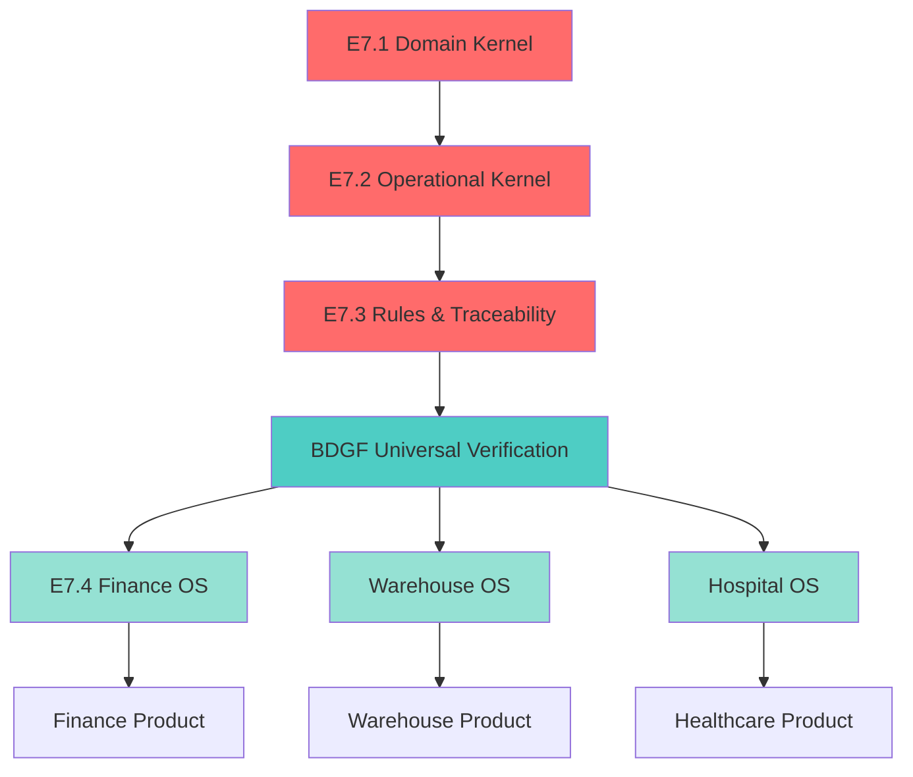

# BELLA KERNEL FOUNDATION — ROADMAP

**Version:** 1.0.0  
**Date:** 2026-08-22  
**Status:** ACTIVE

---

## Executive Summary

**Current State:**
- ✅ E7.1/E7.2/E7.3 frozen (547 tests, 22 artifacts)
- ✅ BDGF P0 complete (11 gates operational)
- ✅ Architecture Guard partial (3/5 layers)

**Next Phase:**
- **DO NOT** jump to E7.4 Finance implementation
- **DO** complete governance foundation first

**Philosophy:**

> "Don't expand Bella before the mechanism protecting Bella's expansion is complete."

---

## 🎯 Strategic Goal

Prove that Bella has a **governed execution foundation** that allows:

1. Multiple teams/AI building on the same kernel
2. No accidental kernel modifications
3. Universal verification layer (BDGF)
4. Repository-level architecture enforcement

**Then** prove Finance can be built on this foundation.

---

## 📋 Milestone Sequence

```
Current
   ↓
Milestone 1: Complete Architecture Guard (1 week)
   ↓
Milestone 2: BDGF P1 Universal Verification (2 weeks)
   ↓
Milestone 3: Kernel Capability Map (1 week)
   ↓
Milestone 4: E7.4 Finance Design (2 weeks)
   ↓
Milestone 5: E7.4 Finance Implementation (3-4 weeks)
```

---

## 🔒 MILESTONE 1: Complete Architecture Guard

**Duration:** 1 week  
**Priority:** 🔴 CRITICAL  
**Blockers:** E7.4 cannot start until complete

### Goal

Transform architecture protection from **developer-enforced** to **repository-enforced**.

### Current State

```
✅ Layer 1: Architecture Guard Script
✅ Layer 2: PreToolUse Hook
❌ Layer 3: Git Pre-Commit Hook
❌ Layer 4: CI Architecture Gate
✅ Layer 5: Regression Tests
```

**Protection gaps:**
- Direct git operations NOT protected
- PR merges NOT protected
- Can bypass with `git commit --no-verify`

### Target State

```
✅ Layer 1: Architecture Guard Script
✅ Layer 2: PreToolUse Hook
✅ Layer 3: Git Pre-Commit Hook
✅ Layer 4: CI Architecture Gate
✅ Layer 5: Regression Tests

= 5/5 layers ACTIVE
= Repository-level enforcement
= Cannot be bypassed
```

### Implementation Plan

#### Task 1.1: Git Pre-Commit Hook

**File:** `.husky/pre-commit`

**Steps:**
1. Install husky: `npm install --save-dev husky`
2. Initialize: `npx husky install`
3. Create hook script: `scripts/architecture/git-pre-commit-guard.js`
4. Add hook: `npx husky add .husky/pre-commit "node scripts/architecture/git-pre-commit-guard.js"`
5. Test with frozen file modification

**Script Logic:**
```javascript
// Read staged files
const staged = execSync('git diff --cached --name-only').toString();

// Check against frozen artifact list
const frozenFiles = [/* E7.1/E7.2/E7.3 paths */];

// If match found → exit 1 (block commit)
// If no match → exit 0 (allow commit)
```

**Expected Behavior:**
```bash
$ vim src/platform/logistics/domain/inventory.types.ts
$ git add .
$ git commit -m "modify frozen file"

❌ FROZEN BOUNDARY VIOLATION

Layer: E7.1 Domain Kernel
File:  src/platform/logistics/domain/inventory.types.ts
Status: BLOCKED

Frozen files cannot be committed without ACR.
Create Architecture Change Request: docs/architecture/templates/ACR_TEMPLATE.md

Commit blocked.
```

**Testing:**
- ✅ Attempt to commit frozen file → blocked
- ✅ Attempt to commit non-frozen file → allowed
- ✅ Verify `--no-verify` bypass documented
- ✅ Error message clear and actionable

#### Task 1.2: CI Architecture Gate

**File:** `.github/workflows/architecture-gate.yml`

**Jobs:**

**Job 1: Frozen File Check**
```yaml
frozen-check:
  runs-on: ubuntu-latest
  steps:
    - uses: actions/checkout@v3
      with:
        fetch-depth: 0  # Need history for diff
    - uses: actions/setup-node@v3
    - run: npm ci
    - name: Check for frozen file modifications
      run: |
        # Compare against base branch
        git diff origin/main --name-only > changed-files.txt
        node scripts/architecture/ci-frozen-check.js
```

**Job 2: Architecture Guard**
```yaml
architecture-guard:
  runs-on: ubuntu-latest
  steps:
    - uses: actions/checkout@v3
    - uses: actions/setup-node@v3
    - run: npm ci
    - name: Run architecture guard
      run: npm run arch:guard:hashes
```

**Job 3: Regression Tests**
```yaml
regression:
  runs-on: ubuntu-latest
  steps:
    - uses: actions/checkout@v3
    - uses: actions/setup-node@v3
    - run: npm ci
    - name: Run full regression
      run: npm run logistics:verify
```

**Job 4: Dependency Check**
```yaml
dependency-check:
  runs-on: ubuntu-latest
  steps:
    - uses: actions/checkout@v3
    - uses: actions/setup-node@v3
    - run: npm ci
    - name: Check forbidden imports
      run: node scripts/architecture/ci-dependency-check.js
```

**Required Status Checks:**
- All 4 jobs must pass for PR merge
- No bypass mechanism
- Clear error messages on failure

**Testing:**
- ✅ Create PR with frozen file change → blocked
- ✅ Create PR with non-frozen change → allowed
- ✅ All 547 tests must pass
- ✅ No forbidden imports detected

#### Task 1.3: Documentation

**Update files:**
- `docs/architecture/FREEZE_POLICY.md` — Add git + CI sections
- `docs/implementation/ARCHITECTURE_GUARD_IMPLEMENTATION.md` — Update status
- `AGENTS.md` — Update enforcement description
- `README.md` — Add CI badge

### Success Criteria

- [ ] 5/5 architecture guard layers active
- [ ] Git pre-commit blocks frozen modifications
- [ ] CI blocks PRs with frozen changes
- [ ] Cannot bypass with `--no-verify` + PR
- [ ] All documentation updated
- [ ] Team trained on new workflow

### Deliverables

1. `.husky/pre-commit` — Git hook
2. `scripts/architecture/git-pre-commit-guard.js` — Hook script
3. `.github/workflows/architecture-gate.yml` — CI workflow
4. `scripts/architecture/ci-frozen-check.js` — CI frozen check
5. `scripts/architecture/ci-dependency-check.js` — CI dependency check
6. Updated documentation

---

## 🔐 MILESTONE 2: BDGF P1 Universal Verification

**Duration:** 2 weeks  
**Priority:** 🔴 HIGH  
**Dependencies:** None (can run parallel with Milestone 1)

### Goal

Transform BDGF from "Logistics execution gate" to "Universal verification layer" for all Bella verticals.

### Current State (P0)

**BDGF P0 capabilities:**
- ✅ 11 operational gates
- ✅ Tenant isolation (Gate 0)
- ✅ Evidence capture
- ✅ Failure classification
- ✅ 154/154 tests PASS

**Limitations:**
- Logistics-specific implementation
- No universal verification schema
- No gate registry/composition
- No cross-vertical evidence format
- No machine-readable verification results

### Target State (P1)

**BDGF P1 capabilities:**
- ✅ Universal gate lifecycle
- ✅ Evidence schema standard
- ✅ Gate registry + composition
- ✅ Failure classification taxonomy
- ✅ Retry/idempotency patterns
- ✅ Evidence persistence layer
- ✅ Machine-readable results
- ✅ Cross-vertical compatibility

**Vision:**

```
Finance Operation
      ↓
    BDGF
      ├── Gate 0: Tenant isolation
      ├── Gate F1: Cost validation
      ├── Gate F2: Valuation method
      └── Evidence + Result
            ↓
       PASS / BLOCK

Warehouse Operation
      ↓
    BDGF
      ├── Gate 0: Tenant isolation
      ├── Gate W1: Location validation
      ├── Gate W2: Capacity check
      └── Evidence + Result
            ↓
       PASS / BLOCK
```

**Goal:** Finance, Warehouse, Hospital, Education... all use **same BDGF**, not custom verification engines.

### Implementation Plan

#### Task 2.1: Universal Gate Lifecycle

**Document:** `docs/architecture/BDGF_UNIVERSAL_LIFECYCLE.md`

**Define:**

```typescript
// Universal gate interface
interface Gate<TContext, TEvidence = any> {
  id: string;
  name: string;
  description: string;
  category: GateCategory;
  
  check(context: TContext): Promise<GateResult<TEvidence>>;
}

type GateCategory = 
  | 'SECURITY'        // Gate 0
  | 'BUSINESS_RULE'   // Domain-specific
  | 'COMPLIANCE'      // Regulatory
  | 'TECHNICAL'       // System constraints
  | 'INTEGRATION';    // External dependencies

type GateResult<TEvidence> = {
  status: 'PASS' | 'BLOCK' | 'WARN';
  evidence: TEvidence;
  timestamp: Date;
  executionTimeMs: number;
};
```

**Lifecycle states:**
```
REGISTERED → ENABLED → EXECUTING → COMPLETED
                ↓
            DISABLED
```

#### Task 2.2: Evidence Schema Standard

**Document:** `docs/architecture/BDGF_EVIDENCE_SCHEMA.md`

**Define universal evidence format:**

```typescript
interface Evidence {
  gateId: string;
  timestamp: Date;
  tenantId: string;
  operationId: string;
  
  // Evidence payload (gate-specific)
  data: Record<string, unknown>;
  
  // Metadata
  version: string;
  schema: string;
  
  // Traceability
  correlationId?: string;
  causationId?: string;
}
```

**Example evidence:**
```json
{
  "gateId": "gate-1-inventory-exists",
  "timestamp": "2026-08-22T10:00:00Z",
  "tenantId": "tenant-123",
  "operationId": "op-abc",
  "data": {
    "inventoryId": "inv-456",
    "exists": true,
    "state": "ACTIVE"
  },
  "version": "1.0.0",
  "schema": "bdgf://evidence/inventory-exists/v1"
}
```

#### Task 2.3: Gate Registry + Composition

**File:** `src/platform/bdgf/gate-registry.ts`

**Features:**
- Register gates by category
- Enable/disable gates dynamically
- Compose gate sequences
- Gate dependencies
- Gate versioning

**Example API:**
```typescript
const registry = new GateRegistry();

// Register
registry.register({
  id: 'gate-0',
  category: 'SECURITY',
  gate: tenantIsolationGate
});

// Compose
const logisticsGates = registry.compose([
  'gate-0',
  'gate-1',
  'gate-2',
  // ...
]);

// Execute
const results = await executeGates(logisticsGates, context);
```

#### Task 2.4: Failure Classification Taxonomy

**Document:** `docs/architecture/BDGF_FAILURE_TAXONOMY.md`

**Define standard failure types:**

```typescript
type FailureCategory = 
  | 'SECURITY_VIOLATION'      // Gate 0
  | 'BUSINESS_RULE_VIOLATION' // Domain logic
  | 'DATA_INTEGRITY'          // Invalid state
  | 'RESOURCE_CONSTRAINT'     // Capacity, limits
  | 'COMPLIANCE_VIOLATION'    // Regulatory
  | 'INTEGRATION_FAILURE'     // External system
  | 'TECHNICAL_ERROR';        // System error

type FailureSeverity = 'CRITICAL' | 'HIGH' | 'MEDIUM' | 'LOW';

type FailureAction = 
  | 'BLOCK'      // Stop execution
  | 'WARN'       // Log and continue
  | 'QUARANTINE' // Isolate entity
  | 'RETRY';     // Attempt again
```

#### Task 2.5: Retry/Idempotency Patterns

**Document:** `docs/architecture/BDGF_RETRY_PATTERNS.md`

**Define:**
- Which gates are idempotent
- Retry strategies per gate category
- Backoff algorithms
- Failure thresholds

**Example:**
```typescript
interface RetryConfig {
  maxAttempts: number;
  backoffMs: number;
  backoffMultiplier: number;
  idempotent: boolean;
}

const gateWithRetry = withRetry(
  myGate,
  {
    maxAttempts: 3,
    backoffMs: 100,
    backoffMultiplier: 2,
    idempotent: true
  }
);
```

#### Task 2.6: Evidence Persistence Layer

**File:** `src/platform/bdgf/evidence-store.ts`

**Features:**
- Persist evidence for audit
- Query evidence by gate/operation/tenant
- Retention policies
- Evidence replay

**Schema:**
```sql
CREATE TABLE bdgf_evidence (
  id UUID PRIMARY KEY,
  gate_id TEXT NOT NULL,
  operation_id TEXT NOT NULL,
  tenant_id TEXT NOT NULL,
  timestamp TIMESTAMPTZ NOT NULL,
  status TEXT NOT NULL,
  evidence_data JSONB NOT NULL,
  
  INDEX idx_gate_id (gate_id),
  INDEX idx_operation_id (operation_id),
  INDEX idx_tenant_id (tenant_id)
);
```

#### Task 2.7: Machine-Readable Results

**File:** `src/platform/bdgf/result-formatter.ts`

**Output format:**
```typescript
interface BDGFExecutionResult {
  operationId: string;
  tenantId: string;
  timestamp: Date;
  
  status: 'PASS' | 'BLOCK' | 'WARN';
  
  gates: {
    id: string;
    status: 'PASS' | 'BLOCK' | 'WARN';
    executionTimeMs: number;
    evidence: Evidence;
  }[];
  
  totalGates: number;
  passedGates: number;
  blockedGates: number;
  warnedGates: number;
  
  totalTimeMs: number;
  
  // Machine-readable
  machineReadable: {
    version: '1.0.0';
    format: 'bdgf-result';
    result: 'PASS' | 'BLOCK' | 'WARN';
    blockingGates: string[];
  };
}
```

### Success Criteria

- [ ] Universal gate lifecycle documented
- [ ] Evidence schema standardized
- [ ] Gate registry implemented + tested
- [ ] Failure taxonomy documented
- [ ] Retry patterns implemented
- [ ] Evidence persistence working
- [ ] Machine-readable results available
- [ ] Finance can consume BDGF
- [ ] Warehouse can consume BDGF
- [ ] Documentation complete

### Deliverables

1. `docs/architecture/BDGF_UNIVERSAL_LIFECYCLE.md`
2. `docs/architecture/BDGF_EVIDENCE_SCHEMA.md`
3. `docs/architecture/BDGF_FAILURE_TAXONOMY.md`
4. `docs/architecture/BDGF_RETRY_PATTERNS.md`
5. `src/platform/bdgf/gate-registry.ts`
6. `src/platform/bdgf/evidence-store.ts`
7. `src/platform/bdgf/result-formatter.ts`
8. `src/platform/bdgf/__tests__/` — P1 tests (>50 tests)

---

## 🗺️ MILESTONE 3: Kernel Capability Map

**Duration:** 1 week  
**Priority:** 🟡 MEDIUM  
**Dependencies:** Milestone 1 + 2 complete

### Goal

Create a **comprehensive map** of what the kernel provides, so E7.4 Finance knows exactly what to consume vs what to build.

### Deliverables

#### Document 1: Kernel Capability Inventory

**File:** `docs/architecture/KERNEL_CAPABILITY_INVENTORY.md`

**Content:**
```markdown
# BELLA KERNEL CAPABILITY INVENTORY

## E7.1 Domain Kernel

### Entities
- InventoryItem (state, quantity, location, tenant)
- Movement (type, source, destination, traceability)
- TraceabilityMetadata (batch, lot, serial, expiry)
- Location (hierarchy, type, tenant)
- Item (SKU, name, category)
- UnitOfMeasure (conversion, precision)

### Operations
- Create inventory item
- Validate inventory state
- Validate movement
- Generate movement ID
- Enforce tenant isolation

### NOT Provided
- ❌ Cost/valuation
- ❌ Financial events
- ❌ Accounting integration
- ❌ FIFO/LIFO logic

## E7.2 Operational Kernel

### Operations
- Reserve inventory
- Release reservation
- Confirm reception
- Confirm adjustment
- Confirm transfer

### NOT Provided
- ❌ Cost calculation
- ❌ Valuation methods
- ❌ Financial posting

## E7.3 Rules & Traceability

### Rules
- Expiry detection
- Quantity validation
- Traceability validation

### Operations
- Query upstream lineage
- Query downstream lineage
- Validate chain integrity
- Detect broken chains
- Generate custody events

### Compliance
- Aggregate evidence
- Evaluate compliance
- Compose rules

### NOT Provided
- ❌ Cost-related rules
- ❌ Financial compliance
- ❌ Accounting rules

## BDGF (P1)

### Capabilities
- Universal gate execution
- Evidence capture + persistence
- Failure classification
- Retry/idempotency
- Machine-readable results

### NOT Provided
- ❌ Domain-specific gates (Finance must implement)
- ❌ Financial verification logic
```

#### Document 2: Consumption Matrix

**File:** `docs/architecture/KERNEL_CONSUMPTION_MATRIX.md`

**Format:**
```
Capability                 | E7.1 | E7.2 | E7.3 | BDGF | Finance Must Build
---------------------------|------|------|------|------|-------------------
Inventory state            |  ✅  |      |      |      |
Movement tracking          |  ✅  |      |      |      |
Traceability               |  ✅  |      |  ✅  |      |
Reserve inventory          |      |  ✅  |      |      |
Compliance evaluation      |      |      |  ✅  |      |
Execution gates            |      |      |      |  ✅  |
Cost tracking              |      |      |      |      |  ✅
FIFO valuation             |      |      |      |      |  ✅
Financial rules            |      |      |      |      |  ✅
Accounting events          |      |      |      |      |  ✅
```

#### Document 3: Architecture Diagram

**File:** `docs/architecture/BELLA_KERNEL_ARCHITECTURE.mmd`

**Mermaid diagram:**


### Success Criteria

- [ ] Complete capability inventory documented
- [ ] Consumption matrix created
- [ ] Architecture diagram clear
- [ ] E7.4 team understands what to consume
- [ ] E7.4 team understands what to build
- [ ] No ambiguity about boundaries

---

## 🎨 MILESTONE 4: E7.4 Finance Design Lock

**Duration:** 2 weeks  
**Priority:** 🔴 HIGH  
**Dependencies:** Milestone 1 + 2 + 3 complete

**DO NOT START UNTIL:** All 3 previous milestones complete

### Goal

Design E7.4 Finance completely before writing any implementation code.

### Phase Structure

#### Phase 4.1: Capability Inventory (2 days)

**Document:** `docs/design/E7_4_1_CAPABILITY_INVENTORY.md`

**Questions:**
- What capabilities does Finance need?
- What does kernel already provide?
- What gaps exist?
- Can gaps be filled WITHOUT modifying kernel?

#### Phase 4.2: Boundary Definition (2 days)

**Document:** `docs/design/E7_4_2_BOUNDARY_DEFINITION.md`

**Define:**
- What Finance CAN add
- What Finance CANNOT do
- Import boundaries
- Forbidden dependencies

#### Phase 4.3: Finance Domain Model (3 days)

**Document:** `docs/design/E7_4_3_DOMAIN_MODEL.md`

**Define entities:**
- CostLayer
- ValuationMethod
- InventoryCost
- FinanceEvent
- CostAdjustment

#### Phase 4.4: Finance Rules (3 days)

**Document:** `docs/design/E7_4_4_FINANCE_RULES.md`

**Define rules:**
- FIFO cost calculation
- LIFO cost calculation
- Weighted Average Cost
- Cost integrity
- Negative cost detection

#### Phase 4.5: Integration Architecture (2 days)

**Document:** `docs/design/E7_4_5_INTEGRATION_ARCHITECTURE.md`

**Define:**
- How Finance consumes kernel
- Event flows
- Data flows
- BDGF gates for Finance

#### Phase 4.6: ADRs + Design Lock (2 days)

**Documents:** Multiple ADRs

**Required ADRs:**
- Why FIFO/LIFO in Finance, not kernel
- Cost layer design rationale
- Valuation method selection
- Finance event schema
- BDGF gate design for Finance

**Design Lock:** Architecture team approval required

### Success Criteria

- [ ] All 6 design documents complete
- [ ] Architecture team reviewed
- [ ] No kernel modifications required
- [ ] ADRs documented
- [ ] Design locked
- [ ] Implementation can begin

---

## 🚀 MILESTONE 5: E7.4 Finance Implementation

**Duration:** 3-4 weeks  
**Priority:** 🔴 HIGH  
**Dependencies:** Milestone 4 design locked

### Success Criteria

**6 KPIs for E7.4 Success:**

```
KPI 1: Kernel Integrity
  ✅ E7.1 modifications: 0
  ✅ E7.2 modifications: 0
  ✅ E7.3 modifications: 0
  ✅ Frozen file hashes: unchanged

KPI 2: Regression Safety
  ✅ E7.1/E7.2/E7.3 tests: 547/547 PASS

KPI 3: E7.4 Quality
  ✅ E7.4 tests: >100 PASS
  ✅ Test coverage: >80%

KPI 4: Architecture Compliance
  ✅ Architecture guard: 5/5 layers PASS
  ✅ No forbidden imports detected
  ✅ Dependency direction valid

KPI 5: BDGF Integration
  ✅ BDGF modifications: Additive only (new gates)
  ✅ Finance uses BDGF P1 (not custom verification)

KPI 6: Kernel Reuse Ratio ⭐ NEW
  ✅ Finance consumes kernel capabilities (not duplicates)
  ✅ No reimplementation of:
      - Inventory logic
      - Movement logic
      - Rules framework
      - Traceability operations
      - Evidence capture
      - State validation
  ✅ Finance only adds Finance-specific capabilities:
      - Cost tracking
      - Valuation methods (FIFO/LIFO/WAC)
      - Financial events
      - Accounting integration
```

**Kernel Reuse Ratio Calculation:**

```
Reused Capabilities / Total Capabilities = Reuse Ratio

Example:
  Inventory state: Reused from E7.1 ✅
  Movement tracking: Reused from E7.1 ✅
  Traceability: Reused from E7.3 ✅
  Rules framework: Reused from E7.3 ✅
  BDGF gates: Reused + Extended ✅
  Cost tracking: New in E7.4 ⚠️
  FIFO valuation: New in E7.4 ⚠️
  
  Reuse Ratio = 5/7 = 71% ✅ Good
  
  If Finance reimplemented inventory: 3/7 = 43% ❌ Bad
```

**Target Reuse Ratio:** ≥60% (majority capabilities from kernel)

**If all 6 KPIs pass:** Proves Finance can be built on frozen kernel without duplication

---

## 📊 Overall Timeline

```
Week 1:     Milestone 1 (Architecture Guard completion)
Week 2-3:   Milestone 2 (BDGF P1) [parallel with Week 1]
Week 4:     Milestone 3 (Kernel Capability Map)
Week 5-6:   Milestone 4 (E7.4 Finance Design)
Week 7-10:  Milestone 5 (E7.4 Finance Implementation)

Total: ~10 weeks
```

**Important clarification:**

This is **NOT** "10 weeks to build Finance features."

This is **10 weeks to transform Bella into a platform where Finance expansion is machine-verified and machine-protected.**

**What we're proving:**

> "Bella can build a second product without breaking the first product."

Not: "Bella can build many products quickly."

**Investor narrative:**

- ❌ "We can add Finance in 10 weeks"
- ✅ "We can prove platform architecture in 10 weeks, then scale verticals safely"

---

## 🎯 Key Principles

### 1. Don't Expand Before Protection Is Complete

> "Không mở rộng Bella trước khi cơ chế bảo vệ việc mở rộng Bella đã hoàn chỉnh."

**Why:** Architecture guard must be repository-enforced, not developer-enforced.

### 2. Universal Foundation Before Vertical Features

> "BDGF P1 before Finance implementation."

**Why:** Finance, Warehouse, Hospital... should all use same verification layer, not build custom engines.

### 3. Design Lock Before Implementation

> "E7.4 design must be locked before coding begins."

**Why:** Design-first prevents rework and ensures kernel boundaries are respected.

### 4. Evidence Over Claims

> "E7.4 success is measured by: 0 kernel modifications + 547/547 tests still pass."

**Why:** This proves Finance can be built on frozen kernel, validating kernel design.

---

## 🏆 What Success Looks Like

### After Milestone 1

✅ **Repository-level enforcement active**
- Cannot commit frozen files
- Cannot merge PRs with frozen changes
- Cannot bypass with `--no-verify` + PR
- Architecture is executable contract

**Transformation:**
```
Before: "Developer, please don't modify this file"
After:  "Git + CI automatically blocks modifications"
```

### After Milestone 2

✅ **Universal verification layer ready**
- BDGF can serve Finance, Warehouse, Hospital
- No custom verification engines needed
- Evidence format standardized
- Machine-readable results

**Transformation:**
```
Before: Each vertical builds own verification
After:  All verticals use shared BDGF P1
```

### After Milestone 3

✅ **Clear kernel boundaries documented**
- E7.4 team knows what to consume
- E7.4 team knows what to build
- No ambiguity about capabilities

**Transformation:**
```
Before: "What does kernel provide?" → Unclear
After:  "Kernel capability map" → Crystal clear
```

### After Milestone 4 + 5

✅ **Finance built on frozen kernel**
- 0 kernel modifications
- 547/547 tests still pass
- Finance has >100 tests
- All 6 KPIs pass (including Kernel Reuse Ratio ≥60%)

**This proves:**

```
                 Shared Kernel
                 (E7.1+E7.2+E7.3)
                      │
        ┌─────────────┼─────────────┐
        ▼             ▼             ▼
     Finance       Warehouse        QA
        │             │             │
        ▼             ▼             ▼
     Product       Product        Product
```

**One kernel → Multiple products → No kernel forking**

**Most important proof:**

> "Bella can build a second product (Finance) without breaking the first product (Logistics)."

Not: "Bella can build many products."

But: "Bella has proven platform architecture for safe vertical scaling."

---

## 📋 Dependency Chain

```
Milestone 1 (Architecture Guard)
      ↓
      ├─→ Milestone 2 (BDGF P1) [parallel OK]
      ↓
Milestone 3 (Kernel Map)
      ↓
Milestone 4 (E7.4 Design)
      ↓
Milestone 5 (E7.4 Implementation)
```

**Critical path:** Milestones 1, 3, 4, 5 must be sequential  
**Parallelizable:** Milestone 2 can run parallel with 1

---

## 🎓 Learning Objectives

### For Bella Team

1. Architecture can be machine-enforced (not just documented)
2. Universal verification layer enables vertical scaling
3. Design-first prevents kernel pollution
4. Frozen kernel can serve multiple domains
5. **Kernel Reuse Ratio** measures true platform value

### For AI Development

1. Governance must precede expansion
2. Multi-layer defense prevents accidents
3. Executable architecture > documented architecture
4. Evidence-based success metrics
5. **Platform proof ≠ Feature velocity**

### For Investors

This roadmap proves:

❌ **Not proving:** "We can build Finance features in 10 weeks"

✅ **Actually proving:** "We have platform architecture that enables safe, verified vertical expansion"

**Key metrics investors care about:**
- **Kernel Reuse Ratio:** ≥60% means real platform, not monolith
- **0 kernel modifications:** Proves abstraction quality
- **5/5 architecture layers:** Proves governance maturity
- **547/547 regression:** Proves backward compatibility

**Investor narrative:**

> "After E7.4, Bella has architectural evidence that one kernel can serve multiple verticals without kernel forking. This proves platform economics, not just feature velocity."

---

**Status:** 🎯 **ROADMAP ACTIVE**  
**Current Milestone:** Milestone 1 (Architecture Guard)  
**Next Review:** After Milestone 1 complete  
**Success Metric:** 0 kernel modifications for all future verticals


---

## 📈 Platform Maturity Model

### Current State: Foundation Protected

```
                    BELLA AI PLATFORM
                           │
                           ▼
             ┌─────────────────────────┐
             │   PROTECTED FOUNDATION  │
             └────────────┬────────────┘
                          │
          ┌───────────────┼────────────────┐
          ▼               ▼                ▼
       E7.1 🔒         E7.2 🔒          E7.3 🔒
       Domain        Operational       Rules &
       Kernel          Kernel        Traceability
       366 tests       73 tests       108 tests
          │               │                │
          └───────────────┼────────────────┘
                          ▼
                       BDGF P0
                   Gate + Evidence
                          │
                          ▼
                Architecture Guard (3/5)
```

**Status:** Foundation exists, protection partial

### After Milestone 1: Repository-Enforced

```
                Architecture Guard (5/5)
                          │
                   Git + CI 🔒
                          │
                          ▼
                    Protected Kernel
                   E7.1 + E7.2 + E7.3
```

**Status:** Cannot accidentally break kernel

### After Milestone 2: Universal Verification

```
                       BDGF P1
                  Universal Layer
                          │
         ┌────────────────┼────────────────┐
         ▼                ▼                ▼
      Finance         Warehouse         Hospital
    (can use)        (can use)         (can use)
```

**Status:** Shared verification infrastructure

### After Milestone 3: Clear Boundaries

```
         Kernel Capability Map
                  │
      ┌───────────┼───────────┐
      ▼           ▼           ▼
   Consume    Extend     Don't Duplicate
```

**Status:** Finance knows exactly what to build

### After Milestone 5: Platform Proof

```
                 Shared Kernel 🔒
                      │
        ┌─────────────┼─────────────┐
        ▼             ▼             ▼
     Finance       Warehouse      Future
   (proven)      (next target)  (scalable)
        │
        ├─ 0 kernel mods ✅
        ├─ 547/547 PASS ✅
        ├─ Reuse ≥60% ✅
        └─ 5/5 gates ✅
```

**Status:** Platform architecture proven

---

## 🎯 The Real Goal

### Not This:

❌ "Build Finance features quickly"  
❌ "Add many products"  
❌ "Prove Bella can do everything"

### But This:

✅ **"Prove Bella can build a second product without breaking the first product"**

### Why This Matters:

**For architecture:**
- Validates frozen kernel design
- Proves abstraction quality
- Demonstrates platform economics

**For business:**
- De-risks vertical expansion
- Enables parallel team scaling
- Protects existing customers

**For investors:**
- Platform > Monolith
- Architecture evidence > Roadmap promises
- Kernel reuse ratio = Platform economics proof

---

## 💎 Key Insight

> "Đừng vội chứng minh Bella có thể xây thật nhiều sản phẩm.  
> Hãy chứng minh Bella có thể xây sản phẩm thứ hai mà không phá sản phẩm thứ nhất."

**If E7.4 succeeds with all 6 KPIs:**

This will be **one of the most valuable architectural proofs** of the current platform.

**Because it proves:**
1. Kernel abstraction is correct
2. Platform architecture is real (not claimed)
3. Vertical scaling is safe (not risky)
4. Team/AI can expand without breaking foundation

**This enables:**
- E7.5 Warehouse (with confidence)
- E7.6 Hospital (with confidence)
- E7.N Future verticals (with confidence)

---

## 📊 Success Summary

### Milestone 1: Architecture Guard Complete

**Proof:** Repository-level enforcement active

### Milestone 2: BDGF P1 Universal

**Proof:** Finance/Warehouse/Hospital can use shared verification

### Milestone 3: Capability Map

**Proof:** Clear boundaries between kernel and verticals

### Milestone 4: E7.4 Design Lock

**Proof:** Finance designed without kernel modifications needed

### Milestone 5: E7.4 Implementation

**Proof:** 6 KPIs all pass

**Final proof:**

```
Foundation:    E7.1 🔒 + E7.2 🔒 + E7.3 🔒
Protection:    Architecture Guard (5/5) + BDGF P1
Abstraction:   Kernel Capability Map
Extension:     E7.4 Finance
Proof:         0 kernel mods + 547/547 PASS + Reuse ≥60% + 5/5 gates
```

**Conclusion:**

> "Bella is a platform, not a monolith. Architectural evidence provided."

---

**Document Status:** ✅ COMPLETE  
**Roadmap Status:** 🎯 ACTIVE  
**Current Focus:** Milestone 1 (Architecture Guard completion)  
**Timeline:** ~10 weeks to platform proof  
**Goal:** Second product without breaking first product
