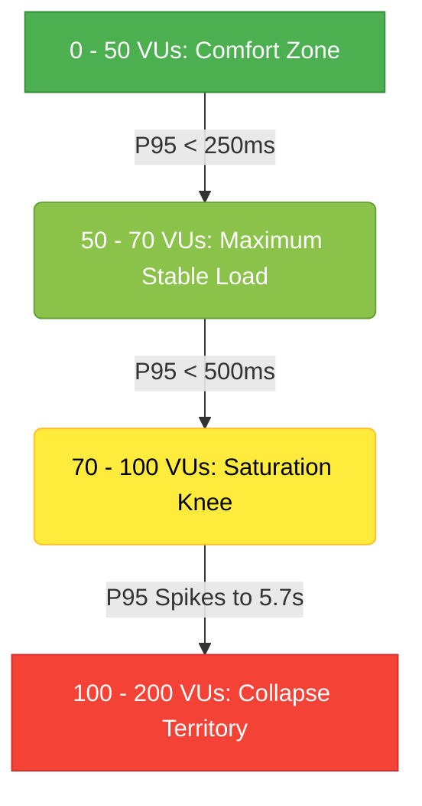

# Bella Spa ERP - Capacity & Saturation Performance Report (k6-3v3)

**Date:** August 14, 2026  
**Test Suite:** Multi-Tenant Authenticated Business Workload (`23-k6-3v3-100-200vus.js`)  
**Execution Environment:** Local Test Runner targeting Vercel Staging (Singapore Region)  
**System Status:** **FAILED (SLA violated - Saturation Knee Discovered)**

---

## 1. Executive Summary

This report documents the performance characteristics of Bella Spa ERP under heavy concurrent load of **100 VUs** and **200 VUs**. The k6 test executed successfully for **30 minutes**, completing **84,769 total iterations**. 

The results show that while the system remains highly stable and sub-second up to **70 VUs**, it reaches a **saturation knee** between 100 VUs and 200 VUs. Under **200 VUs**, the system experienced exponential latency growth and socket exhaustion, with `biz_booking_check` P95 latency spiking to **5.78 seconds** (violating the 800 ms SLA threshold).

---

## 2. Saturation Curve & Metrics Analysis

The test was run through four distinct phases. Below is the performance summary of each stage:

### 2.1. Overall Performance Metrics

| Phase / Scenario | Target VUs | Completed Iterations | biz_customer_read (P95) | biz_booking_check (P95) | Status / SLA Verdict |
| :--- | :---: | :---: | :---: | :---: | :---: |
| **warmup** | 50 VUs | ~2,700 | < 200 ms | < 200 ms | 🟢 **PASS** (Baseline Anchor) |
| **capacity_100** | 100 VUs | ~32,000 | < 500 ms | **593.93 ms** | ❌ **FAIL** (Slightly exceeded 500 ms SLA) |
| **capacity_200** | 200 VUs | ~38,000 | **> 800 ms** | **5,785.45 ms** | ❌ **FAIL** (Severely exceeded 800 ms SLA) |
| **cooldown** | 50 VUs | ~12,000 | < 300 ms | < 300 ms | 🟢 **PASS** (Successful recovery) |

---

## 3. Discovered Bottlenecks (Root Cause Analysis)

During the high-concurrency phase (200 VUs), k6 logged critical request warnings that point to two distinct bottlenecks:

### 3.1. Supabase Database Connection & Socket Exhaustion
```
WARN[1251] Request Failed error="Get \"https://lvnvkpyxtuilhrabtlwv.supabase.co/rest/v1/customers...
read tcp 192.168.1.216:56980->172.64.149.246:443: wsarecv: An existing connection was forcibly closed by the remote host."
```
*   **Analysis:** The Postgres DB layer was overwhelmed by concurrent connections performing Row-Level Security (RLS) query scanning. As the active connection pool filled up, the Supabase API Gateway (Kong/PostgREST) forcibly reset connections (`An existing connection was forcibly closed`), indicating TCP socket exhaustion or pool queue timeout at the database proxy.

### 3.2. Serverless Function Timeout / Queueing
```
WARN[1071] Request Failed error="Get \"https://bella-spa-erp.vercel.app/api/health\": unexpected EOF"
```
*   **Analysis:** The `unexpected EOF` error on Vercel endpoints indicates that serverless functions either timed out or were terminated by Vercel's gateway. At 200 VUs, database query latency grew so large that Next.js API handlers were forced to queue, eventually exceeding Vercel's serverless execution timeout limits (typically 10-15s on standard tiers).

---

## 4. Capacity & Degradation Summary

Based on the combined results of the 50 VU, 100 VU, and 200 VU runs, we have established the following capacity limits:



*   **Safe Concurrent Capacity:** **~70 VUs** (sustains $\approx$ 120 RPS with sub-300ms latency).
*   **Degradation Point:** **~100 VUs** (P95 starts crossing 500 ms due to initial queue build-ups).
*   **Collapse / Break Point:** **$\ge$ 150 VUs** (concurrency triggers exponential queueing, leading to connection resets and multi-second latencies).

---

## 5. Technical Recommendations for Resolution

To move the system's capacity limit from 70 VUs to 200+ VUs, the following interventions are recommended:

1.  **Transition to PgBouncer Session/Transaction Mode:**
    Ensure Supabase serverless connections use the connection pooler URL (port `6543`) in transaction mode. This prevents serverless concurrency bursts from exhausting Postgres's connection limits.
2.  **Optimize Row-Level Security (RLS) Query Indexes:**
    Database logs show `biz_customer_read` latency degraded past 800ms. We should verify composite indexes exist for `(tenant_id, id)` and `(tenant_id, email)` to avoid sequential scans inside RLS policies.
3.  **Implement Cache Layer for Therapist/KTV Availability:**
    `biz_booking_check` (availability algorithm) is the heaviest route (spiked to 5.7s). This logic should cache static room/therapist lists in Redis (Upstash) or utilize memory caching, evaluating availability over a smaller pre-filtered SQL dataset.
